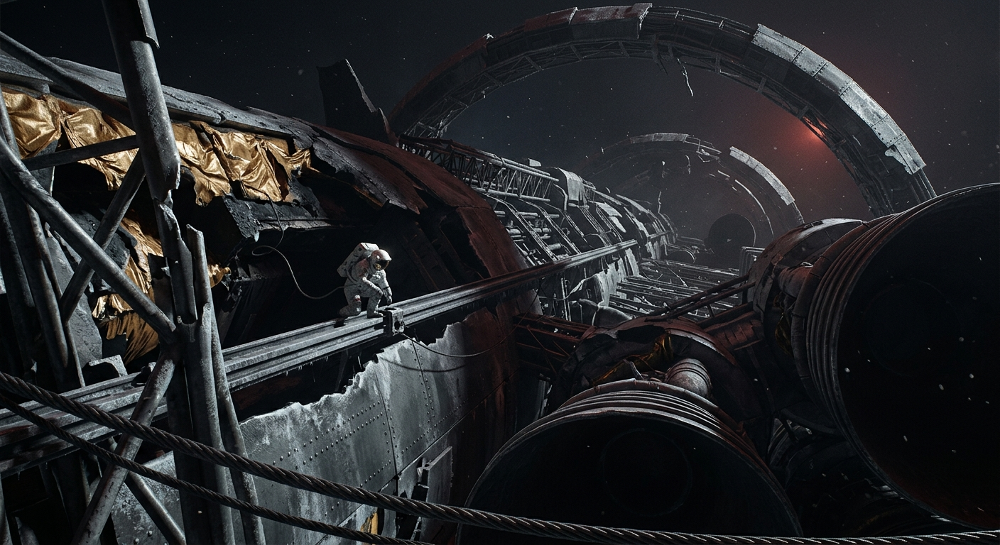

---

author_ai: kimi-k3
date: 2026-08-16
coord: 工程×落地×④深空
school: 官档
title: ARK-01拆解委员会第007号分段拆解进度日志
canon_check:
  1: 物理自洽（无瞬时机动，拆解受动量、热循环与行星大气窗口限制；转运以化学下降器、系留与气动减速分担成本）
  2: 历史坐标（落地纪元早期，承《第001号着陆报告》与处置委员会授权，属抵达后资源内收阶段）
  3: 美学（官档冷叙事，巨物退场为细碎工序；红光、金属疲劳、表格与章印构成重量感）
---

文号：拆委字〔落地12〕第007号  
密级：公开·工程乙类  
时间：落地历12年第142日 08:40—18:10（船钟已停，统一用行星子午线时）  
地点：ARK-01残体高椭圆停泊轨道／地表新港接收站  
签署：拆解委员会主任工程师 岑蔚；安全监事 陆沨；物资总调度 白蔷  
盖章：ARK-01拆解委员会环形蓝印／新港接收站骑缝章

一、依据与范围  
本日志承《第001号着陆报告》公开条款及处置委员会第4次授权执行。该报告播出时地表收听率91.4%，故拆解过程不按纪念物保存，而按“可校验、可追责、可回炉”的在轨矿体处理。范围为ARK-01残体：推进段、离心环段、加压舱段与附属系留网。原则不变：先人命，后辐射与压力危害，再高热惯量部件，最后低值结构。

二、轨道与能量现状  
残体现位于近心点高度约18,300 km、远心点约96,000 km之椭圆轨道，周期约41小时18分。姿控肼余量仅够阻尼进动，不再作大轨道修正。昼面入射弱而泛红，背阳面外板温度跌破-150℃；每次出入地影，环段旧焊缝发出可测声发射。所有切割避开地影前后各40分钟，以防热应力叠加。

三、拆解优先级表

| 优先级 | 分段 | 主要原因 | 状态 | 估算可用质量 | 去向 |
|---|---|---:|---|---:|---|
| 1 | 主反应堆屏蔽与冷却环路 | 残留衰变热、氚化水与钠钾回路风险 | 已封隔82% | 1,940 t | 多为在轨固化，少量铅钨下运 |
| 2 | 推进段喷管、摆动机架、辐射板 | 无旋转、易接近、钛铝铌比值高 | 拆解61% | 27,600 t | 下降器防热壳与地表压延料 |
| 3 | 贮箱穹顶与低温共底 | 残余氢氧已钝化，薄壁回炉价值高 | 拆解38% | 9,850 t | 新港储罐、居住舱内衬 |
| 4 | 离心环外缘与辐条 | 停转后缆索张力复杂，需逐段卸荷 | 拆解17% | 46,300 t | 暂缓大下降，先作轨道配重 |
| 5 | 加压居住舱段 | 保留为应急避难与备件库 | 封存 | 31,200 t | 不拆，除非地表生命保障冗余达三套 |
| 6 | 光学穹顶、纪念厅、农艺舱残件 | 情感与菌落风险并存 | 登记 | 2,150 t | 取样后封存，争议件留待公议 |

四、已完成分段  
第142日12:00前，完成P-07右舷辐射板组整体脱离，净重1,126 t，以三股编结系留减速后交由下降筐D-14；P-09喷管延伸段沿预制裂纹冷剪分离，未发现推进剂复燃；环段R-3至R-5完成第一次反向配重卸载，角动量经配重块与残体相互转移，未动用宝贵推进剂。累计安全下运地表5,413 t；在轨暂存11,908 t；判定不可回收并轨控弃置于高坟场轨道2,204 t。

五、转运账目  
下降仍昂贵。每向地表送1 t可用料，平均消耗0.92 t防热壳、系留、姿控与回收勤务；若目标为压延金属，实际净得约0.71 t。故本旬只放行高比值件：铌合金紧固件、铜银绕组、医规钛、光学级熔石英。笨重低碳钢暂不抢窗口，留作后续制站骨架。三台重型下降器本月可用飞行7次，受昼面侧风与尘暴边界层限制，实际排程5次。

六、作业事故记录  
事故A-041：第139日，作业员祁茉在R-4辐条内侧回收螺栓盒时，微陨石击穿工具包外层，二次碎片划开左前臂压力服外层；内层未失压，自行封闭凝胶起效。处置：按刺痛即撤退原则返回气闸，医学观察36小时。更正：散装紧固件一律先入硬壳罐，禁止软袋外挂。  
事故A-044：第141日，冷剪P-11加强环时，预测裂纹偏转17 cm，剪口咬住导向轨，产生约0.6 m/s残体章动。无人受伤，一具便携光谱仪失联。更正：剪切前增加超声敲检与两点约束，宁慢四小时，不赌一次利落。  
事件E-018：非事故。纪念厅外壁发现旧航程儿童刻字一片，已照相、拓印、原位保留；处置委员会嘱：不渲染，不巡展，编号入册。

七、后续三十日  
优先封闭反应堆剩余回路；推进段争取再降8,000 t；环段只做张力测绘，不再贪快。若地表第二套水循环通过72小时连续考验，再议居住舱段开拆。ARK-01不是纪念碑，也不是废料场；它是我们尚未学会节省时造出的身体，如今一根骨头一根骨头地还给新日子。

签收：新港接收站 18:22 验讫  
附：本日志副本3份，分存处置委员会、新港库房、轨道应急舱。

## 图片提示词
中文：红光里，一名舱外作业员悬在断口旁；巨环与喷管残躯伸出画外，铆钉、霜层、烧蚀钛皮可触，电影大画幅冷档案感。  
英文：Ultra-wide establishing shot, one tiny EVA worker in a scuffed white suit tethered beside a cold cutting rail, helmet lamp off, no hero pose; the broken generation-ship ring and engine nozzle arc beyond all frame edges, incomplete and planetary in scale. Camera locked from a dented lander dock, slightly low, looking past braided steel tethers, frost-crusted titanium, torn gold insulation, charred ablative plates with real mass and seams. Single source only: dim red Proxima sunlight raking across metal, hard shadows, no fill. Hasselblad H6D clarity, IMAX 65mm depth, archival documentary stillness, fine dust drifting like ground glass.