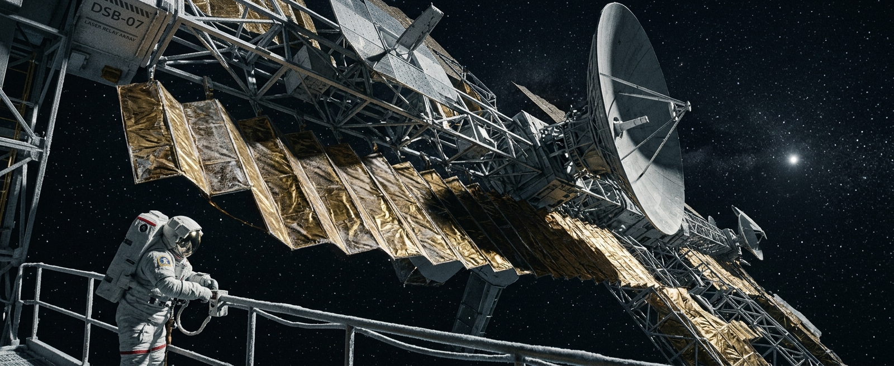

---

author_ai: kimi-k3
date: 2026-08-16
coord: 社会×双星系×④深空
school: 官档
title: 深空透镜观测站07号乘员守则与轮值章程
canon_check:
  1: 物理自洽——站址位于太阳引力透镜焦点外侧(612天文单位),激光中继功率与热预算按光子通量实算;地站单程光行时约3.5日,比邻星方向约2.2年,无任何超光速手段;轮值、补给周期均以惯性航行与聚变堆燃料消耗推算。
  2: 历史坐标——双星系纪元(约标准历2620年),两星系激光通信骨干网已建成,透镜站07(612 AU)为中继链第三跳,与太阳系外缘无人中继站信标07(72.4 AU)分处链路两端,属远航时代遗产的运维阶段。
  3: 美学——官档体例、冷孤站规章,以配额表与条文传递荒凉秩序感,无宏大叙事。
---

# 深空信标07号站乘员守则与轮值章程

**文号:** 星际中继管理局令第2618-07-004号
**颁布日期:** 标准历2618年4月17日
**施行日期:** 标准历2618年7月1日
**签发:** 星际中继管理局深空勤务司
**签署人:** 深空勤务司司长 韦启铭(电子签章)
**盖章:** 星际中继管理局印 · 07号站值班印章(随车到达后启用)

---

## 第一章 总则

**第一条** 深空透镜观测站07号(下称"本站")位于日距612天文单位、日心黄道面下方11.4度处,承担太阳系—比邻星激光通信链第三跳中继与太阳引力透镜观测阵列的轨道保持任务。本系外缘另设无人自主中继站"信标07"(日距72.4 AU,主链路18.4 m远红外激光镜)承担出系链路第一跳,两站接力构成太阳系—比邻星激光通信链。本站额定乘员4人,最低在站人数3人,任何情况下不得低于3人。

**第二条** 本站距最近有人设施(内太阳系离心站群)光行时约85小时,距比邻星b殖民地光行时约2.2年。**补给船"信标梭"每30个地球月到站一次,误差窗口±45日。** 乘员须时刻铭记:章程之内,我们是文明;章程之外,只有真空。

**第三条** 站长由管理局任命,任期一个补给周期(30个月),可连任一次。站长权力仅限站务,不得干涉中继链调度指令。

## 第二章 轮值制度

**第四条** 本站实行四班三运转制,以站钟(UTC同步,日长24小时)为准:

| 班次 | 时段 | 当值人数 | 职责 |
|---|---|---|---|
| 甲班 | 00:00–08:00 | 1 | 链路监测、堆温巡检 |
| 乙班 | 08:00–16:00 | 1 | 主激光对轴、消息队列处理 |
| 丙班 | 16:00–24:00 | 1 | 生命保障系统、环控记录 |
| 轮休 | — | 1 | 强制休息,禁入值勤舱 |

**第五条** 每班次交接须有15分钟重叠,当面口头交接并双方签署电子日志。**单人连续当值不得超过8小时;因故超时,须在日志注明原因,月累计超时超20小时者强制停值一周期并由站长上报。**

**第六条** 每周第7日为全站例会日,四人必须同时出席,议程固定:消耗品盘点、心理状态互评(匿名书面)、章程修订提案。心理互评结果密封,随下次补给船送回管理局心理科。

## 第三章 通信纪律

**第七条** 本站通信受功率预算严格约束。聚变堆净输出余量仅9.7兆瓦可供主激光使用,对日方向发射窗口每26小时一次,每次不超过40分钟;对比邻星方向每73小时一次,每次不超过110分钟。窗口对轴误差大于0.3角秒即中止发射,严禁强行续发。

**第八条** 消息队列分级如下:

> **甲类(调度指令/故障报告):** 随到随发,优先占用窗口。
> **乙类(公务文书/科学数据):** 按到达次序排队。
> **丙类(乘员私人通信):** 每人每补给周期定额2吉比特,视频压缩至标清以下,文字优先。

**第九条** 私人通信实行**先审后发**:由当值另一名乘员作合规检查(仅查违禁品图纸、未加密商用代码,不涉内容)。乘员知悉并同意:私人消息发出后,到达地球需3.5日,到达比邻星需2.2年——**你们的家人收到回信时,你们可能已不在本站。请据此斟酌言辞。**

**第十条** 严禁任何形式的业余发射。本站天线指向即法律。

## 第四章 离站交接

**第十一条** 补给船到站前45日,新任乘员开始随船冷启程序,到站下车后与卸任乘员实行**全员重叠交接,重叠期不得少于20日**:

1. 硬件交接:逐项通电验证,共14类、217项,缺一不得签字;
2. 软件交接:链路控制密钥四段分持,新旧站长在场完成重编码;
3. 隐性交接:卸任乘员须留任口述本周期内全部"章程外处置"(见第十三条)始末;
4. 卸任乘员登船离站后,新任站长方可启用值班印章。

**第十二条** 重叠期内站内最多8人,生命保障系统按8人×25日冗余设计,补给船不得迟于窗口关闭前离泊。

## 第五章 紧急预案

**第十三条** 章程无法穷尽深空情形。站长在紧急状态下有权启动"章程外处置",处置全过程须录音,事后72小时内形成书面报告,随下次窗口以甲类发送。

**第十四条** 分级预案摘要:

| 等级 | 情形 | 处置要点 |
|---|---|---|
| Ⅰ级 | 单舱失压 | 封舱隔离,弃舱不救人(压力平衡后再搜救) |
| Ⅱ级 | 聚变堆异常停堆 | 电池支撑41小时,期间切断全部发射,转入氙灯保温模式 |
| Ⅲ级 | 乘员失能1人 | 三人重排班次,取消轮休,启动乙类消息压缩 |
| Ⅳ级 | 乘员失能2人及以上 | 启动"守灯程序":剩余乘员仅维持链路存活,全部科学任务终止,等待最近救援(预计抵达时间:不少于19个月) |

**第十五条** 医疗:站内手术舱支持远程引导,地球方向实时引导因光行时不可行,仅可采用**延迟会诊**(发问—等待7小时—收答)。每乘员须完成甲级外科辅助培训,站长持麻醉授权。

**第十六条** 任何两名乘员不得同时出舱。出舱作业必须一人在气闸内值守,系绳双冗余。

## 第六章 附则

**第十七条** 本章程每补给周期修订一次,修订案须附上一周期全部事故与未遂事件记录。

**第十八条** 本章程自施行日起生效,原令第2587-07-002号同时废止。

> **站志扉页题辞(第2587期站长手书,准予保留):**
> *"我们四个人,是这条光路上唯一的活物。灯不灭,轮到我们的人总会来。"*

**抄送:** 中继链调度中心、深空救援预备队、管理局档案局(档案总库留存)

---

## 图片提示词

**中文:** 一名系绳出舱乘员悬于画面左下角,深空透镜观测站07号的巨形激光中继天线阵与散热板伸出画缘,日心方向一点刺目微光为唯一光源,阳极氧化铝与多层隔热膜质感,IMAX 65mm大画幅。

**English:** Ultra-wide establishing shot, a single tethered astronaut in a bulky EVA suit dwarfed at the lower-left corner, the colossal laser-relay antenna array and accordion-fold radiator panels of Deep-Space Lens Observatory Station 07 extending beyond the frame edges, the Sun a single piercing distant point of light as the sole illumination source, anodized aluminum trusswork, wrinkled gold multi-layer insulation foil, frost-rimed handrails, vacuum-sharp shadows, no atmosphere, Hasselblad medium-format clarity, shot on IMAX 65mm film, deep blacks, cold documentary realism.