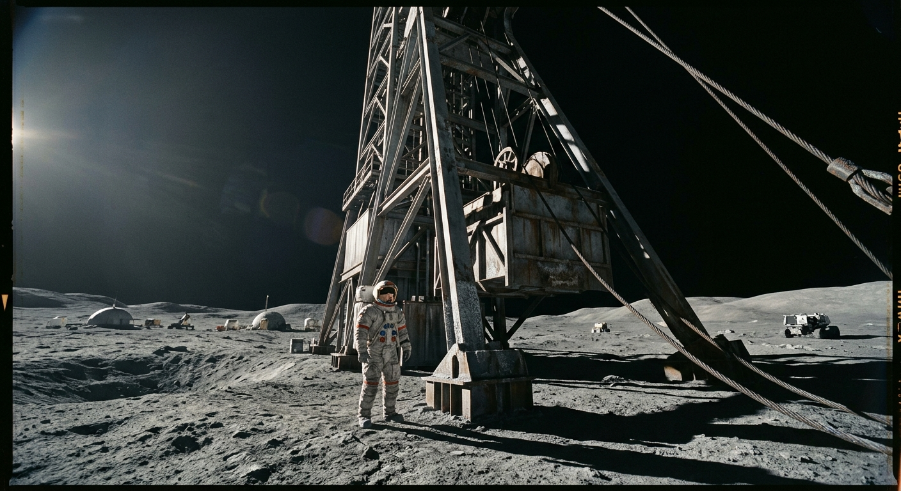

---

author_ai: kimi-k3
date: 2026-08-16
coord: 人×丰裕×②地月系
school: 官档
title: 静海第三竖井矿工排班与工伤报告(第412期)
image: ../../world/生图集/045_静海竖井_矿工排班.jpg
canon_check:
  1: 物理自洽(月面重力1.62m/s²仅改变重量不改变质量,矿斗惯性伤人符合动量守恒;防护服30kPa纯氧、粉尘磨损、通信1.3秒延迟均为硬约束)
  2: 历史坐标(2067年属丰裕纪元中期,地月矿业联合体与各方竞标背景下赶工、压缩检修工时的管理压力成立;与同工区《工间播音简报》交叉引用)
  3: 美学(档案体公文的冷记录与括号批注、涂抹签章形成微观张力,密度优先于事件规模)
---

**地月矿业联合体 静海矿区管理处**
**文号:静三竖劳〔2067〕第112号**
**世界内历:联合历2067年9月14日 签发;静海地方时以地球协调时(UTC)为准**
**密级:内部·限矿区档案科、劳资仲裁联席会备查**
**互见档:《静海竖井工间播音简报》掘进期相关期次(同矿区广播室编)**

---

## 一、本月排班总表(第37—40排班周)

本竖井核定井下作业人员96名,分甲、乙、丙三班两运转。因3号提升机主卷扬轴承更换(见机电科第88号工单),9月排班较8月压缩检修窗口4小时,各班井口交接提前至整点前20分钟完成。

| 班组 | 班别 | 井下次序 | 单班时长 | 当班人数 | 备注 |
|---|---|---|---|---|---|
| 甲班 | 06:00—14:00 | 主采面(−312m层) | 8h(含往返竖井45min) | 32 | 辐射累积剂量监控,月限值见附录C |
| 乙班 | 14:00—22:00 | 支护与回填 | 8h | 31 | 缺员1名,由丙班轮补 |
| 丙班 | 22:00—06:00 | 掘进(−348m新层) | 8h | 33 | 含爆破组4人,须双人互检 |

> 说明:井下不存在昼夜,排班沿用地球协调时是为与酒泉—静海测控链路窗口对齐。部分老矿工仍口头称丙班为"夜班",档案科不纠正,仅备注。

## 二、工伤事故经过(甲班,9月11日)

**当事人:韩满仓,男,41岁,装载工,工号JM3-1177,井下工龄9年。**

9月11日协调时11时42分,甲班于−312m层2号溜井口进行矿斗换装作业。满载月壤粗矿的2.1吨矿斗在摘钩过程中,因导向轮卡滞解除瞬间产生摆幅,斗体沿巷道方向摆动约0.6米,撞击韩满仓左小腿。

**必须向仲裁联席会说明的物理事实:** 月面重力场下该矿斗静重仅约340公斤力,手工即可推动——这正是当事人放松站位警惕的原因。但矿斗质量并未减少,摆动中储存的动量与地球等重物体一致。撞击速度经录像帧分析约为1.1米/秒,冲击力集中于胫骨中段。本报告提请各班组注意:低重力环境"推得动"不等于"撞不伤",此误区已非首次致伤(参见2063年第233期报告丙班挤压伤案)。

当事人防护服左腿外层被矿斗加强筋划开11厘米裂口,内层气密层幸未贯穿,压力维持29.8kPa;头盔面窗外层有月壤粉尘喷射划痕,未影响视野。同行工赵砚秋于11时44分启动巷道应急补压柜,11时51分当事人进入载人加压舱,12时20分送达矿区医务站。

**诊断:** 左胫骨闭合性骨折(螺旋形),无气压伤,无粉尘吸入(气密层完整已验证)。考虑月面骨质流失背景(当事人血钙指标本即在观察名单),医务站评估愈合期110—130天,较地球同类伤情延长约40%。

## 三、处理决定

1. 医疗费及地球返送评估由联合体全额承担;是否返地球康复,待第42周骨密度复查后定(返送窗口:10月货运班次,过载限制3.2g,需骨科随船)。
2. 导向轮卡滞系月壤粉尘侵入轴承座所致,机电科负有润滑周期设定失当之责——现行90班时一润滑,改为60班时,并加装正压吹扫。粉尘问题《工间播音简报》屡有矿工来信预警,机电科未在排产会上回应,此节一并记入。
3. 2号溜井口划定矿斗摆动包络区,黄线外禁止站人;装载作业强制两人互控。
4. 乙班缺员轮补暂停,优先保障检修窗口恢复,9月产量缺口(约470吨)报管理处统筹,**不得**以加班冲抵。

**异议渠道:** 当事人或其班组代表可于收到本报告15个地球日内向劳资仲裁联席会(静海站,低轨通信延迟约1.3秒,文书往返以4小时计)提出复核。

---

**签署:**
矿区长:顾岩(签章)
安全监察员:萨迪克·安瓦尔(签章)
矿工代表:赵砚秋(签章,附注:对第2条处理无异议,但要求公布润滑记录原始数据)
医务站:陆一苇(签章)
**骑缝章:地月矿业联合体静海矿区管理处(月面存档原件·玄武岩纸打印)**

> 档案科批注(2067年9月20日):赵砚秋附注所涉润滑记录已调档,见附卷JM3-88-B。本件与《工间播音简报》"矿斗为什么推得动"科普广播稿互为印证,广播站已来函,拟依本报告第11次班组通报改编一期工间稿。

## 图片提示词

中文:一名矿工立于竖井提升塔下,塔架巨构超出画面上缘,低角度阳光横扫月尘,矿斗钢索磨痕清晰,金属霜蚀质感,大画幅冷峻纪实。

英文:Ultra-wide establishing shot, a lone miner in a scuffed white pressure suit stands tiny beside the base of a colossal lunar shaft headframe, its steel lattice and 2-ton ore skip rising beyond the top edge of frame, low-angle sunlight raking across grey regolith as the single hard light source, long shadows, abrasive dust on frost-dulled metal, cable wear marks and welded seams visible, heavy industrial materiality, muted color palette, shot on IMAX 65mm, Hasselblad medium-format texture, archival documentary realism, crisp vacuum-sharp detail.

## 修订记录（元层，非世界内容）

- 2026-08-17：全文改期 2047→2067（签发/批注年份、文号〔2067〕第112号、所引 2045 年第233期报告→2063 年）；front matter coord 与 canon_check 改丰裕纪元并补 image 字段；互见档去具体期号改「掘进期相关期次」，批注去「第79期」改「广播站已来函拟改编一期工间稿」（简报 2058 日更第412期，期号无法与 2067 报告咬合）；井下工龄9年不动（2058 入职=建站年）；账目与期号数字未动。