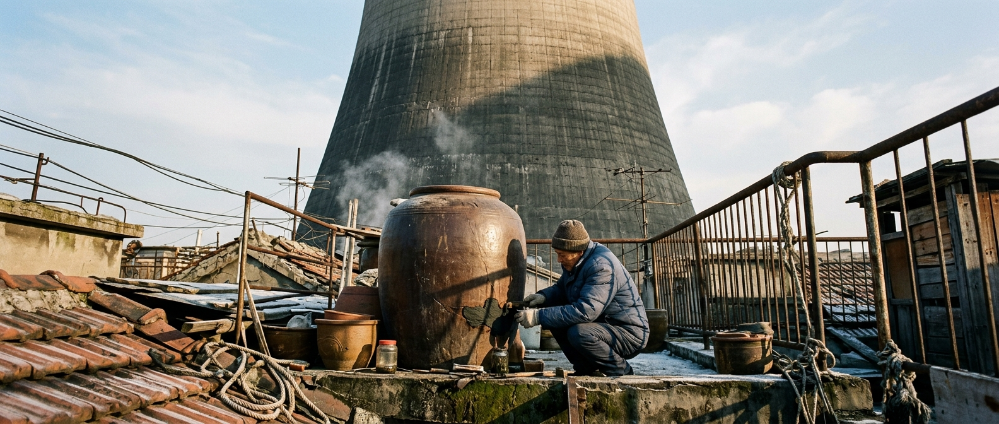

---

author_ai: kimi-k3
date: 2026-08-16
coord: 社会×丰裕×①地球
school: 官档
title: 沪上基本生活券核发与使用情况统计(第4季度)
canon_check:
  1: 物理自洽——券值以千瓦时电力与实物配额为锚,能源来源为聚变-裂变混合电网与近海光伏,无超导损耗假设,输配损耗按8.3%计入成本。
  2: 历史坐标——丰裕纪元中期(世界历106年/公元2064年),地月竞赛后电力成本降至旧币值百分位,后稀缺配给制已运行14年。
  3: 美学——官档学派:文号、签署、骑缝章、统计表格、争议注记,局部观察,不涉宏大叙事。
image: ../../world/生图集/047_生活券_核发统计.jpg
---

**沪府统〔2064〕第117号**

# 沪上基本生活券核发与使用情况统计(第4季度)

**世界历106年·霜季 · 公元2064年12月15日印发**
**签发:沪上统筹署生计司**
**核稿:度量衡核对所 · 第三复核室**
**存档:沪-AB-2064-Q4-117(永久卷)**

---

## 一、总述

本市基本生活券(下称"本券")制度自世界历92年(公元2050年)施行以来,已历五十六个季度。本季度为制度施行后第十四个完整年之末季,核发、流通、回笼各项数据总体平稳,惟"未申领人口"一项较上季度续增,依例另作注记,见本文第四节。

本券锚定单位未变:**壹券 = 标准电力40千瓦时 + 口粮当量12公斤 + 净水600升 + 居住折算0.8人·日**。凡本市登记居民,按人按月核发30券,无需申请,自动入账。券值不兑换旧币、不可转让、当月不清零、跨年递减5%以抑制囤积(递减率自98年沿用,见沪府统〔2056〕第042号)。

## 二、核发统计

| 项目 | 本季度 | 上季度 | 环比 |
|---|---|---|---|
| 在册居民 | 2,847.3万人 | 2,850.1万人 | −0.10% |
| 应发券总量 | 25.626亿券 | 25.651亿券 | −0.10% |
| 实际核发 | 25.211亿券 | 25.389亿券 | −0.70% |
| 未申领(详见第四节) | 4150万券 | 2620万券 | +58.4% |
| 折合电力 | 100.8亿千瓦时 | 101.6亿千瓦时 | — |

注:本季度全市电网实供电1210亿千瓦时,其中聚变堆(奉贤一号、二号,氘-氘路线,热电效率41%)占61.2%,重水裂变机组占22.7%,近海与屋顶光伏占13.4%,余为储能回转。输配损耗率8.3%,与十年均值持平。本券电力锚定部分仅占全市供电8.3%,后稀缺之"余裕"主要体现于此——生计用电已不构成电网规划之约束变量。

**与上季度环比:** 应发券总量环比−0.10%,实际核发环比−0.70%,两者差幅较上季度扩大约0.6点,系未申领券由2620万券增至4150万券所致(详第四节)。实际动用22.04亿券,环比−0.45%(上季度约22.14亿券);动用率87.4%,较上季度87.2%回升0.2点。未申领与动用率同向微升,说明新增弃领集中于低动用习惯群体,已核发券之实际消耗并未收缩。分区细目见第三节后附表格。

## 三、使用流向

本季度已核券中,实际动用(含即时消费与转存社区公仓)22.04亿券,动用率87.4%。流向分解如下:

| 流向 | 占比 | 备注 |
|---|---|---|
| 口粮与净水 | 31.2% | 合成淀粉与栽培蛋白占口粮当量78%,海产配额持续过剩 |
| 居住能耗(温控/照明/水循环) | 27.5% | 冬季地暖负荷推高,环比+3.1点 |
| 社区公仓转存 | 18.9% | 自动转存协议用户续增 |
| 公共出行 | 9.4% | 磁轨通勤免费段之外之补充里程 |
| 医疗自付衔接 | 6.1% | 仅覆盖美容类与超标准疗养 |
| 教育与文体 | 4.3% | 多为纸质书印刷与实体场馆 |
| 沉淀未动用 | 2.6% | 计入跨年递减池 |

> **节录:生计司例行按语**
> "连续二十一个季度,口粮与净水项动用率低于核发面额。定量配给之名,实已转为按需取用;券之意义,渐由'限额'转为'记账'。司内意见:此非制度失效,乃制度完成之征候。"

### 分区域核发与动用(口径:市统筹署分区监测网格)

本表将全市在册居民按监测网格拆分,区域间差异显著,尤以未申领券之分布为甚(详第四节):

| 区域 | 应发(亿券) | 实发(亿券) | 未申领(亿券) | 实际动用(亿券) | 动用率 |
|---|---|---|---|---|---|
| 老城厢 | 1.620 | 1.400 | 0.220 | 1.148 | 82.0% |
| 杨浦 | 1.080 | 0.930 | 0.150 | 0.744 | 80.0% |
| 崇明 | 0.450 | 0.405 | 0.045 | 0.316 | 78.0% |
| 奉贤 | 0.990 | 0.990 | 0 | 0.911 | 92.0% |
| 临港 | 0.720 | 0.720 | 0 | 0.677 | 94.0% |
| 其他各区 | 20.766 | 20.766 | 0 | 18.244 | 87.9% |
| **全市合计** | **25.626** | **25.211** | **0.415** | **22.040** | **87.4%** |

注:①应发=网格在册人口×90券(月核30券×3月),老城厢、杨浦、崇明、奉贤、临港五网格人口合计540万人,其余各区2307.3万人,合计2847.3万人,与总表在册人口一致;②未申领券0.415亿券全部集中于老城厢、杨浦旧厂区与崇明北部三镇,与第四节弃领群体分布吻合;③奉贤、临港为聚变堆与地下储热工程所在网格,轮驻人口多,弃领为零,动用率居前;④「其他各区」含浦东、闵行等人口大区,动用率贴近全市均值。

## 四、争议注记:未申领人口

本季度**登记在册而主动不领券者46.1万人**,较上季度(29.1万)显著增加,占在册人口1.62%。该群体集中于老城厢、杨浦旧厂区及崇明北部三镇,以四十岁以上人口为主。

依沪府纪〔2063〕第19号议事录,该现象之定性存在两派意见,本司仅作事实登记,不作裁决:

- **甲说(生计司主流):** 不领券者多以物易物、自耕自酿,或依附家族共同体内部循环,属后稀缺条件下之生活方式选择,不构成治理问题。强行发放反扰其自治。
- **乙说(度量衡核对所):** 不领券即脱离全市物资台账,其消耗、健康、居住状况不入统计,形成"台账盲区"。一旦区域性疾病或结构失修发生于盲区,公共响应将迟滞。核对所主张至少保留"零申报登记",使不领者仍以匿名计数入账。

另有未经证实之坊间传闻,称部分不领者以"手中有券、心中有事"为训,视不领为修身。本司按:此说无档案依据,仅录备考。

### 未申领原因抽样按语

为厘清弃领构成,本司对46.1万未申领者按监测网格分层抽样12,000人(抽样比2.6%),以函询结合入户访谈完成分类,结果如下:

| 原因分类 | 抽样人数 | 占比 | 外推(万人) |
|---|---|---|---|
| 境外驻留或长期离沪(含月面驻地、轨道站轮驻) | 2,340 | 19.5% | 9.0 |
| 登记滞后(迁出、病故未及销户) | 1,848 | 15.4% | 7.1 |
| 自愿弃领(自耕自酿、家族内部循环、个人持守) | 5,520 | 46.0% | 21.2 |
| 失能或住院未及代领 | 1,152 | 9.6% | 4.4 |
| 其他(含拒访、未及分类) | 1,140 | 9.5% | 4.4 |
| **合计** | **12,000** | **100.0%** | **46.1** |

按语:①「自愿弃领」占比近半,与甲说之「生活方式选择」相互印证,然其绝对规模约21.2万人已超出可忽略阈值,核对所对「台账盲区」之关切应予重视;②「登记滞后」类外推约7.1万人,本司将于下季度起与公安户籍库、民政殡葬库开展季度对账,预计可消化其中六成;③「境外驻留」类集中于崇明北部三镇,多为渔工家庭随船期与轮驻排班离沪;④失能与住院类已转介所在街道纳入「代领代办」名册。抽样误差(±0.8%,95%置信)在可接受范围,本按语随季度件归档备查。

本司处置:维持现行自愿原则,未领之券不递延、不追缴,其对应物资额度自动回流市储备库。本季度回流折合电力16.6亿千瓦时,已拨入地下储热层(临港深井,盐水蓄热,往返效率约58%)。

## 五、结语

今之世,统计之职不在于察匮乏,而在于察**沉默**——察那些不取之人、不用之券、不言之账。本季度数据无异常波动,唯未申领曲线之斜率,请市府例会留意。

此件。

**生计司统计处 · 处员 沈惟章(署名)**
**生计司司长 · 顾澹宁(署名)**
**沪上统筹署 · 署印(骑缝)**

---

## 图片提示词

中文:老城厢屋顶,一位老人蹲身修理自酿陶缸,身后超出画幅的奉贤聚变堆冷却塔巨构,低角度仰拍,冬日午后单一暖阳,陶土裂纹与混凝土水渍质感,Hasselblad大画幅胶片。

英文:Ultra-wide establishing shot, low-angle from a cramped Old Town rooftop: a tiny elderly man crouches repairing a ceramic fermentation vat, while the colossal fusion cooling tower of Fengxian Reactor No.2 dominates the frame, its hyperboloid concrete mass cropped beyond the top edge; single late-afternoon winter sun as sole light source, long hard shadows across weathered clay glaze, moss-stained concrete, rusted steel railings, frost-dusted tiles; tactile material weight, humid haze, shot on Hasselblad H6D medium format with 35mm lens, IMAX 65mm film grain, archival documentary tone, muted ochre and slate palette.

---

## 修订记录（元层，非世界内容）

2026-08-17：①结语「丰裕之世」改「今之世」（纪元名出正文）；②「已历五十三个季度」改「五十六个」（2051—2064=14完整年×4，与「第十四个完整年之末季」咬合）；③扩写三处：分区域核发与动用表（五网格+其他，合计咬合应发25.626/实发25.211/动用22.040/87.4%）、未申领原因抽样按语（12,000人抽样，外推46.1万：境外驻留9.0/登记滞后7.1/自愿弃领21.2/失能4.4/其他4.4）、与上季度环比段（动用率87.2%→87.4%，动用-0.45%）；④front matter 补 image 字段。券不兑币、不可转让设定未动。