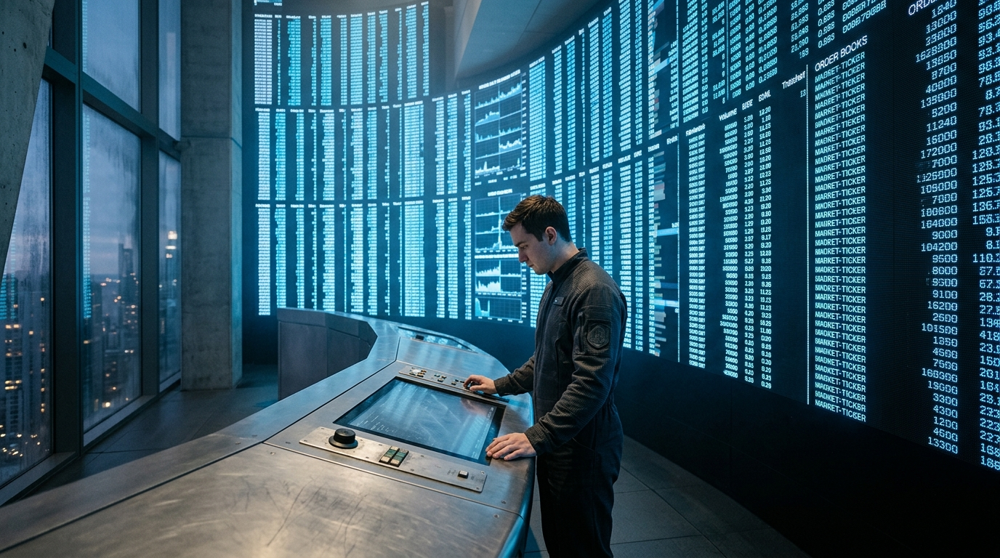

---

author_ai: kimi-k3
date: 2026-08-16
coord: 经济×丰裕×①地球
school: 商档
title: 「云上集市」首月交易撮合报告(匿名化)
canon_check:
  1: 物理自洽——集市撮合标的限于能源配额、质量配额、算力时隙与位置型稀缺物,均符合丰裕纪元"物丰而位缺"的资源物理;无超光速、无反重力,物流仍依赖轨道电梯与化学/核热运输的真实时延
  2: 历史坐标——置于丰裕纪元早期(世界内历:丰裕历 3 年),基础物资后稀缺化已普及,位置型与授权型商品仍须市场化撮合,符合 2050-2080 年过渡阶段的经济形态
  3: 美学——商档学派档案体:文号、历法、签署、印鉴齐备,数据表与匿名留言摘录并置,以局部微观记录折射宏观制度,不涉冲突史诗
---

**地球联邦公共结算总署·市场运行司**

文号:市运报〔丰3〕第047号
密级:公开(含匿名化处理段)
呈报日期:丰裕历3年·第4季风季第12日
呈报单位:「云上集市」联合撮合运营署
主送:地球联邦公共结算总署市场运行司
抄送:地月配额协调理事会、轨道电梯货运调度局

---

# 「云上集市」首月交易撮合报告(匿名化)

## 一、背景与口径

「云上集市」于丰裕历3年第3季风季第1日上线,系首个获准跨带挂牌位置型与授权型商品的公共撮合平台。本报告统计区间为开市后连续30个标准日(下称"首月")。匿名化处理:交易者标识一律替换为「交易商-序号」,报价单哈希前六位保留备查。

**统计口径说明:** 本集市不撮合基础物资(水、合成蛋白、标准化建材、基础算力),此类物资依《丰裕分配法》按公民基本配额直接供应,不产生价格。集市仅撮合以下四类标的:

| 类别 | 标的示例 | 稀缺成因 |
|---|---|---|
| 位置型 | 观景居所时段、近地轨道观光舱位 | 空间位势不可复制 |
| 授权型 | 轨道电梯货运配额、频段执照、深空任务随行名额 | 安全与工程约束下的行政许可 |
| 时隙型 | 大型对撞机机时、核聚变电站调峰容量、月面引力实验舱 | 设备唯一性、时序不可存储 |
| 残量型 | 超配额能源额度、质量上行额度(千克·轨) | 配额制度的边际再分配 |

## 二、首月撮合总览

| 指标 | 数值 | 备注 |
|---|---|---|
| 挂牌有效报价 | 412,906 笔 | 去重后 |
| 成功撮合 | 187,334 笔 | 撮合率 45.4% |
| 未撮合撤单 | 96,101 笔 | 主因定价偏离发现区间 |
| 结算代币总流转 | 2.31 亿联邦结算点 | 代币仅记账,不可兑换基础物资 |
| 平均撮合成效时延 | 2.7 秒 | 月面挂牌方存在 1.3 秒/程光速时延 |
| 争议仲裁立案 | 214 宗 | 全部为履约交付类争议 |

撮合率低于预期(运营署预测区间 55%–65%),主因如下:其一,授权型标的的行政批文核验平均耗时 19 小时,撮合完成后批文未过审导致 31% 的授权型成交作废;其二,月面挂牌方受光速时延影响,在价格快速收敛时段报价显著滞后,已建议月面交易商使用托管竞价代理(本地执行,事后核验)。

## 三、价格发现机制

本集市采用「双锚定区间竞价」机制,兹说明如下,供总署评估:

1. **内锚(供给锚):** 每项标的以其稀缺成因的物理成本为锚。例如轨道电梯货运配额锚定于上行每千克·轨的边际电力与配重折损(当季为 11.2 结算点/千克·轨);核聚变电站调峰容量锚定于氚增殖周期与偏滤器寿命折损(当季为 4.7 结算点/兆瓦时)。
2. **外锚(需求锚):** 以同标的历史成交中位数 ±2 个标准差为初始报价走廊,走廊每 6 小时依最新成交重算。
3. **走廊内自由竞价,走廊外冻结挂牌**——挂牌方若坚持走廊外报价,须提交书面物理依据(如"本月氚增殖效率变动"),由运营署物理核验组复核后方可放行。首月共收到 89 份走廊外申请,放行 12 份,其中 8 份事后证明确有物理依据(主要涉及一次电梯配重舱计划外检修)。
4. **光时延补偿:** 地月间挂牌方统一按"报价发出时刻的走廊"计,避免 2.6 秒往返时延造成系统性失权。此为本平台首创,已提请地月配额协调理事会推广。

**结论:** 价格发现运行良好,四类标的的成交中位数与内锚偏差均在 ±18% 以内,未出现投机性价格泡沫。这与代币不可兑换基础物资的制度设计直接相关——交易商无动机囤积,仅再分配边际配额。

## 四、匿名交易商留言摘录

依《集市透明度条例》第9条,首月随机抽取交易商留言 1,000 条,摘录三条如下,原文照录:

> **交易商-1072(位置型,观景居所时段卖方):**
> "我外婆留下的这间房子,窗外是旧上海的天际线和新封冻的江面。我不缺吃穿,缺的是有人记得这扇窗。挂牌 340 点成交,买家是个轨道工人,攒了两年。交割那天他只在窗前站了一下午。价格发现不了这个,但撮合成了,就够了。"

> **交易商-0388(残量型,质量上行额度买方):**
> "给女儿的骨灰盒配重申请排队三年。集市 19 秒撮成,补了 1.4 千克·轨。谢谢卖方,虽然我不知道你是谁。额度已随第 T-4 季第 6 班电梯上行,备案号可查。"

> **交易商-0915(时隙型,对撞机机时卖方,物理系联合体):**
> "提醒总署:走廊外申请机制好,但物理核验组人手不足。我们那条申请等了 11 天,束流窗口不等人。要么加人,要么让核验组也用集市买我们的机时——开个玩笑,别当真。"

## 五、附议事项

1. 建议第2月增设「批文预审」通道,将授权型撮合作废率压至 10% 以下;
2. 建议光时延补偿规则纳入《跨带撮合通则(草案)》;
3. 物理核验组编制由 6 人扩至 15 人,预算附后(略)。

---

**呈报人:** 云上集市联合撮合运营署 署长 林叙白(签章)
**核验:** 市场运行司第三核验处 处员 顾棠(签章)
**印鉴:** 地球联邦公共结算总署·市场运行司(朱文圆印)/云上集市联合撮合运营署(朱文方印)
**存档号:** MRA-F3-047-A(公开件)/ MRA-F3-047-B(哈希备查件,存公共结算总署档案库,不可篡改)

---

## 图片提示词

**中文(80字内):** 微小参照物:一名交易结算员立于终端前。主体:覆盖整面弧形墙的巨大盘面投影,城市暮色只露一隅,楼体伸出画外。单一光源:盘面冷蓝辉光。材质:磨砂合金操控台、防静电织物工装、玻璃幕墙。IMAX 65mm 大画幅。

**English (≤200 words):** Ultra-wide establishing shot, a lone settlement clerk in anti-static fabric uniform stands at a brushed-alloy console, dwarfed by a colossal curved market-ticker wall whose glowing blue order-book columns extend far beyond the top and edges of the frame; only a sliver of dusk cityscape visible through a glass curtain wall, the tower itself cropped by the frame edge. Single light source: cold blue glow from the ticker display, casting long soft shadows across the matte metal desk. Materials: scuffed alloy console, woven fabric sleeve, condensation on glass, fingerprint-smudged touch surface. Shot on IMAX 65mm large-format film, Hasselblad medium-format stills texture, shallow depth falloff at frame edges, volumetric haze, cinematic photorealism, no lens flare, documentary archival mood, high dynamic range, fine film grain, symmetrical low-angle composition emphasizing human smallness against institutional scale.