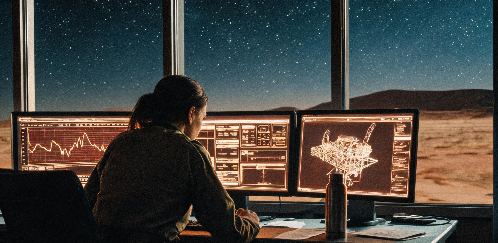

# 101955号小行星先导采选平台地面遥操作机组值班日志与神经负荷监测台账

**文号：** 喀测先导字〔2048〕第 104 号  
**记录周期：** 公元 2048 年 10 月 15 日 00:00 至 11 月 10 日 24:00（共 27 个地球标准日）  
**测控驻地：** 中国喀什深空测控总站 · 地下深部恒温测控大厅 · 04 号遥操作主控舱（代号：“望舒-4”）  
**遥控靶标：** 主带 101955 号小行星（工程靶段代号：标靶-RQ36）· “燧石-1”无人先导试验平台（ISRU-P1-Pre01）  
**任务阶段：** 主带交会前导段 · 微重力抓斗空载自律动力学校准与 20 分钟单向光延时宏指令闭环测试  
**主报机构：** 深空资源勘查与利用先导工程测控指挥部、喀什深空测控总站运行保障部  
**抄送机构：** 国家航天局深空探测总体室、静海第一竖井先遣工程指挥部测控联络处、文昌地面测控中枢  
**密级：** 内部受控（工程乙级）｜ **状态：** 阶段归档（第四季度综合考评件）

---

### 〇、 测控天线链路、时延常数与值班环境概况

公元 2048 年第 4 季度，101955 号小行星（B 型碳质小行星，等效直径约 492 米，自转周期 4.2974 小时）运行于主带内缘日心距 2.382 AU 轨道。受地-主带相对几何运动影响，本周期内下行射电信号单向光行时（One-Way Light Time, OWLT）自 19 分 32 秒递增至 20 分 06 秒，往返指令时延（Round-Trip Time, RTT）维持在 **39 分 04 秒至 40 分 12 秒** 区间。

```
========================================================================================
                      【地-主带大延迟遥操作指令与遥测时序链路简图】
========================================================================================
 [ 地面操作台 (喀什) ] 
       │ 1. 预测数字孪生仿真 (离线规划 30 min)
       │ 2. 编译为带时戳宏指令包 (ISRU-CMD-Block)
       ▼
 [ 喀什 66m / 35m 深空天线阵 ] ──(上行 S/X 频段 20kW 载波)──┐
                                                             │
                                                     单向光行时 19m48s
                                                     (距离 3.56 亿千米)
                                                             │
 [ 101955号小行星 · 燧石-1 平台 ] ◀─────────────────────────┘
       │ 3. 机载自律工控固件 (V1.03-Beta) 离线自主闭环执行
       │ 4. 传感器阵列采集多点遥测与慢扫描激光雷达点云 (128 kbps)
       ▼
 [ 平台 4.2m 高增益抛物面天线 ] ──(下行 Ka 频段数据包)──────┐
                                                             │
                                                     单向光行时 19m48s
                                                     (距离 3.56 亿千米)
                                                             │
 [ 地面测控大厅 · 04主控舱 ] ◀──────────────────────────────┘
       │ 5. 地面解译、状态重建与神经负荷评估 (时延总延迟: 39分36秒)
========================================================================================
```

为对抗戈壁严寒（地表实测 -18℃ 至 -24℃）与强电磁辐射干扰，04 号遥操作主控舱设于地下 18 米基岩层内，配备双联防尘空气过滤增压系统（室内维持 101.3 kPa，温度 21.5±0.5℃，湿度 45%）。舱内照明采用仿自然节律的动态色温调光系统（06:00-18:00 采用 4000K 柔白光，夜班段切换为 2700K 暖黄漫射光，避免直射操作屏）。

---

### 一、 遥操作机组人员编制与双轨四班交错倒班排期

由于 101955 号小行星本星自转周期极短（4.2974 小时），平台破岩抓斗与对日聚光镜的采掘作业窗口严格受制于小行星赤道背风侧的受光/背光更迭；而地面操作员生活在地球 24 小时昼夜节律下。机组推行**“四班三倒·六小时交错重叠轮值制”**，每班 4 人，重叠交接 45 分钟，确保在 40 分钟光延时下指令流与安全监控零断点。

| 机组岗位 | 姓名 / 工号 | 年龄 / 籍贯 | 专业背景与主要操作职责 | 个人生理基线与工位偏好 |
| :--- | :--- | :--- | :--- | :--- |
| **值班长兼总体监控** | 周克勤<br>`DS-CTRL-0419` | 40 岁<br>甘肃酒泉 | 20 年深空测控经验，负责测控大厅指令总签发与下行遥测安全包校验 | 基础心率 62 bpm；习惯自带紫砂保温杯冲泡大枣枸杞红茶；对低频载波蜂鸣极敏感 |
| **破岩动力遥操作员** | 陆小曼<br>`DS-OP-1102` | 26 岁<br>黑龙江哈尔滨 | 哈工大地外机器人专业，负责双颚抓斗轨迹预测规划与锚桩动力学建模 | 动态视力 1.5；每发出一组宏指令后习惯做 15 分钟手风琴拉伸与握力球练习 |
| **射频与热控解译员** | 巴图尔·买买提<br>`DS-OP-0834` | 31 岁<br>新疆喀什 | 兰州大学无线电物理，负责 66 米天线信噪比跟踪与平台钠钾回路热平衡分析 | 本地常驻工程师；每逢大夜班必为机组带刚烤出的皮芽子馕与巴旦木坚果仁 |
| **随班医监与心理员** | 方晓雯<br>`MED-DSN-0215` | 29 岁<br>江苏苏州 | 航天医学与认知神经科学硕士，负责操作员脑电监测、眼动疲劳干预与声光疗愈 | 随身携带冷杉精油喷雾与经颅微电流刺激仪（tCES）；工位常备薄荷润喉糖 |
| **见习遥操作员** | 陈立<br>`DS-OP-1406` | 23 岁<br>四川成都 | 西北工大自控系应届派驻，跟班学习微重力姿态超前补偿与宏指令打包 | 初始静息心率 78 bpm；初次接触 20 分钟大延迟时易出现焦虑性下意识掰杆动作 |

```
┌────────────────────────────────────────────────────────────────────────────────────────┐
│              喀什地面遥操作 04 机组 · 四班三倒 24 小时运转与自转重叠交接图             │
├────────────────────────────────────────────────────────────────────────────────────────┤
│ 甲班（朝阳班 06:00 - 12:45）: 覆盖小行星第 1 采掘窗口 (自转 0.0 - 1.4 圈) · 光照充沛   │
│ 乙班（白昼班 12:00 - 18:45）: 覆盖小行星第 2 采掘窗口 (自转 1.4 - 2.8 圈) · 聚光预热   │
│ 丙班（傍晚班 18:00 - 00:45）: 覆盖小行星第 3 采掘窗口 (自转 2.8 - 4.2 圈) · 姿态微调   │
│ 丁班（深宵班 00:00 - 06:45）: 覆盖小行星背阳深冷窗口 (自转 4.2 - 5.6 圈) · 数据冷存储   │
│ ────────────────────────────────────────────────────────────────────────────────────── │
│ ★ 每班重叠 45 分钟：前 20 分钟用于在轨未决指令跟踪，后 25 分钟进行脑电与生理数据交接 │
└────────────────────────────────────────────────────────────────────────────────────────┘
```

---

### 二、 典型值班日志切片：20分钟大延迟下的孤独与专注

#### 日志切片 A：公元 2048 年 10 月 18 日（白昼班·第 082 采选演练日）
* **值班人员：** 陆小曼（主操）、周克勤（值班长）、方晓雯（医监）、陈立（见习）
* **测控参数：** 地-星距 2.378 AU，单向光行时 19 分 44 秒，往返时延 39 分 28 秒。
* **作业内容：** 4.2 米双颚破岩抓斗对风化层松散玄武岩碎屑实施第 07 次空载抓掘仿真宏指令上行。

```
[ 遥操作值班流水日志记录 · 04主控舱终端 ]

13:10:00 UTC 【地面离线预演】
陆小曼在图形工作站完成三维数字孪生建模。由于 101955 引力极微弱 (1.2×10⁻⁵ g)，抓斗下压速度必须严格限制在 4.5 mm/s 以内，否则将引发平台机身反冲脱锚。陆小曼通过力反馈手柄完成 12 组虚拟示教，生成 2,400 步带边界约束的自律宏指令包（文件哈希：SHA-ISRU-481018-07）。
周克勤值班长复核安全边界阈值：主桁架应变限额 ≤2.5 mm，反推力 ≤40 N。签字批准上行。

13:25:12 UTC 【指令上行发射】
喀什 66 米天线启动 X 频段 20 kW 功放，指令包完成调制上行。主控大厅中央投影屏自动亮起琥珀色「单向时延等待倒计时」时钟：19分44秒。
大厅内进入绝对静默期。操作台前只有冷却风扇低沉的呜呜声和周克勤保温杯盖拧开的轻微咔哒声。

13:30:00 - 13:40:00 UTC 【悬置的 20 分钟】
陈立坐在副操位，手指频繁在空载手柄上虚点，呼吸加速（医监屏实测心率升至 96 bpm）。
方晓雯轻声提醒：“陈立，做两次深呼吸。指令已经在路上了，现在飞过了火星轨道外侧，你手里的杆对那台机器没有任何即时作用。学会把信任交给自律固件。”
陆小曼摘下轻量化耳机，端起白瓷杯喝了一口热红茶，起身在工位后方的减压地垫上做肩颈抗阻拉伸，神色平静如常。

13:44:56 UTC 【指令抵达靶标】（地面推算时戳）
大厅时钟跳过 19 分 44 秒。此时平台机载系统在 3.5 亿千米外开始解析指令并执行抓斗开合。但地面操作员还要再等 19 分 44 秒才能知道结果。

14:04:40 UTC 【下行遥测捕获与解译】
喀什总站高频前端捕获 Ka 频段载波同步锁相信号！
数据流解调完成：抓斗闭合到位率 100%，最大接触反力 28.4 N，机身振动加速度 0.002 m/s²，实测抓取松散碎石碎屑 1.12 吨。机载激光点云成像完整回传，三维重建图像与陆小曼 40 分钟前的数字孪生预测模型重合度达 98.4%。
陆小曼在控制台日志栏键入确认码：`EXEC-SUCCESS-LOT07`，心率平稳维持在 64 bpm。
```

```
+---------------------------------------------------------------------------------------+
|                 【主带遥操作员陆小曼的操作台侧壁便签（手写原件影印抄录）】           |
|                                                                                       |
|  1. 发出指令前，把最坏的物理结果想三遍；                                              |
|  2. 按下发射键后，你的手就该离开摇杆——别做多余的动作，电磁波不会因为你用力而跑得更快；|
|  3. 20 分钟不是虚度，是宇宙给人类留出的思考时间；                                     |
|  4. 记得给后山雷达站的流浪狸花猫留半根香肠（巴图尔值班时会喂，别喂重了）。            |
+---------------------------------------------------------------------------------------+
```

---

#### 日志切片 B：公元 2048 年 11 月 02 日（深宵班·第 097 采选演练日）
* **值班人员：** 巴图尔·买买提（主操）、周克勤（值班长）、方晓雯（医监）、陆小曼（轮值支援）
* **测控参数：** 地-星距 2.395 AU，单向光行时 19 分 55 秒，往返时延 39 分 50 秒。
* **事件性质：** 平台 02 号冷气姿控喷嘴微量气阀关断延迟故障（自律系统安全降级处置）。

```
[ 遥控异常与自律接管日志 ]

02:14:10 UTC (地面上行指令)：下达 101955 背光面红外热像巡检位姿微调指令。
02:54:00 UTC (地面接收遥测)：遥测数据显示，02 号微重力冷气喷嘴在喷射 0.5 秒后因微小冰晶卡滞，关断延迟 1.8 秒，导致平台偏航角漂移 0.42°。
02:54:02 UTC (机载自主处置核实)：机载 V1.03 固件在故障发生 0.05 秒内自动切断 02 支路电磁阀，并启用对称 04 号喷嘴实施反向微脉冲补平，姿态角在 12 秒内收敛至 0.03° 标称范围，未发生拉拔脱锚。
03:00:15 UTC (地面研判与闭环)：周克勤与巴图尔比对压力曲线，确认系气化室内残余微量冷凝水在背光深冷（98 K）下结晶所致。巴图尔编制气化室电伴热加温宏指令（加温至 280 K 维持 10 分钟），于 03:15:00 上行。
03:54:50 UTC (故障排除确认)：下行数据确认电伴热回路工作正常，冰晶完全升华排净，支路气密性恢复为 100%。全过程无一人慌乱，处置耗时符合大延迟深空操作标准规程。
```

---

### 三、 操作员神经负荷、生理指标监测与医监干预台账

在长达数周的大时延操作中，操作员大脑长期处于“超前预测模拟”与“超长等待静默”的交替振荡中，极易诱发**“时延性知觉解离（Latency-Induced Cognitive Dissociation）”**与**“幽灵肢体操作冲动”**。随班医监系统通过操作椅内置多导生理传感器与柔性脑电头带实施全时无感监测。

```
┌────────────────────────────────────────────────────────────────────────────────────────┐
│              深空遥操作员神经负荷评估三维指标雷达图（2048 年第 4 季度均值）             │
├────────────────────────────────────────────────────────────────────────────────────────┤
│                           【专注度 (EEG β/α 功率比)】                                   │
│                                      1.00                                              │
│                                    /      \                                            │
│                                  0.85      0.80                                        │
│                                /              \                                        │
│     【预测认知负荷 (P300波幅)】 ─────────────── 【自主神经平衡 (HRV-LF/HF)】             │
│                 0.78                              0.65                                 │
│                                \              /                                        │
│                                  0.55      0.60                                        │
│                                    \      /                                            │
│                          【眼动微扫视疲劳度 (Micro-saccade)】                          │
│                                                                                        │
│  - 陆小曼（资深操纵）：专注度高 (0.88)，认知负荷稳定 (0.72)，自主神经平衡极佳 (0.62)    │
│  - 陈立（初任见习）：专注度波动大 (0.55-0.95)，指令等待期间自主神经交感过载 (0.89)     │
└────────────────────────────────────────────────────────────────────────────────────────┘
```

#### 3.1 关键生理监测参数统计表（机组 4 人 27 天跟踪）

| 监测科目与物理指标 | 标称基线范围 | 机组实测均值（白天班） | 机组实测均值（深宵班） | 异常峰值记录与诱因说明 | 医监干预措施与效果验证 |
| :--- | :--- | :--- | :--- | :--- | :--- |
| **脑电 α/β 功率比**<br>(8-13Hz / 14-30Hz) | 1.8 — 3.5<br>(越低代表越紧张) | 2.45±0.3 | 1.92±0.2 | 10月24日见习员陈立降至 1.25（连续等待 3 组指令下行） | 启动工位 460nm 蓝光微脉冲照射 5 分钟，辅以薄荷脑雾化吸入，比值回升至 2.1 |
| **心率变异性 (HRV)**<br>LF/HF 功率比值 | 0.8 — 1.5<br>(>2.0 提示交感应激) | 1.15 | 1.68 | 11月02日突发气阀异常时，全员瞬间升至 2.45 | 医监引导全员实施 4-7-8 节律腹式呼吸法，2 分钟内心率平稳回落至 68 bpm |
| **眼动微扫视频率**<br>(Micro-saccades/min) | 45 — 70 次/分<br>(<30 提示视知觉疲劳) | 58 次/分 | 36 次/分 | 深宵班凌晨 03:30 至 05:00 普遍出现微扫视下降至 28 次/分 | 强制启动每小时 10 分钟远视护眼机制（工位投影切换为天山雪峰高反差实景图像） |
| **唾液皮质醇浓度**<br>(Stress Hormone, nmol/L) | 晨起 10—20<br>夜间 2—5 | 12.4 (08:00)<br>4.2 (20:00) | 8.6 (02:00)<br>14.1 (06:00) | 倒班初期出现皮质醇昼夜节律倒错（深宵班清晨分泌过旺） | 实行下班前 30 分钟佩戴 580nm 琥珀色阻蓝光护目镜，配合 3mg 外源性褪黑素调理 |
| **手部静态微颤幅度**<br>(Tremor Amplitude, μm) | ≤ 15 μm<br>(>30 μm 影响精密示教) | 8.5 μm | 14.2 μm | 陆小曼连续示教 4 小时后，右手食指肌电颤幅达 22 μm | 工位加装气动自适应手腕柔性托架，辅以 42℃ 热敷凝胶手套放松 15 分钟 |

```
[ 典型干预个案分析报告 · 医监方晓雯记录 ]

个案编号：MED-CASE-481022-CL
对象：见习遥操作员 陈立（工号：DS-OP-1406）
症状表现：
在 10 月 22 日执行第 11 组微重力抛渣仿真指令上行后，陈立出现典型的「时延性知觉悬垂反应」。表现为双眼紧盯无刷新的静态遥测屏，右手机械臂操纵摇杆握紧力度超出标称值 300%（压力传感读数 45 N），并下意识多次试图按压急停钮（被系统物理互锁阻断）。自述“脑子里总觉得抓斗马上要撞上岩壁，明知发信号要 20 分钟，但身体控制不住想去拽它”。
干预方案：
1. 立即实施物理脱离：指令发送后由主控系统强制锁定副操位输入设备 25 分钟；
2. 认知重构训练：在等待期引入离线小行星三维动力学演算手算推演，将焦虑转化为计算专注；
3. 神经放松：佩戴经颅微电流刺激仪（tCES，电流 150 μA，频率 0.5 Hz）刺激 20 分钟，配合方医生冲调的热牛奶与核桃酥。
干预成效：
至 11 月 5 日，陈立在等待期的平均心率从 92 bpm 稳步降至 71 bpm，未再出现过度抓握与无意识按键行为，顺利通过深空独立值班资格考核。
```

---

### 四、 后勤保障、戈壁微观日常与生活制度

深空测控绝非冰冷的代码与天线，在喀什荒凉辽阔的黑戈壁滩下，严谨的制度与温暖的烟火气构成了支撑开拓者精神韧性的基石。

```
┌────────────────────────────────────────────────────────────────────────────────────────┐
│                   喀什深空总站 · 04 机组后勤保障与工间生活微生态                        │
├────────────────────────────────────────────────────────────────────────────────────────┤
│ 【后勤给养车（每日 05:30 自喀什市区抵达）】                                            │
│   ├── 新鲜羊肉、鹰嘴豆、皮芽子（洋葱）、恰玛古、喀什本地土蜂蜜                          │
│   └── 站内地下恒温烘烤房每日 06:00 出炉芝麻窝窝馕与核桃肉馕（热值保障）                 │
│                                                                                        │
│ 【地下生活区与文娱设施】                                                                │
│   ├── 02 号心理减压室（配备天山松林全景声环境音、雪松香氛加湿器、重力按摩椅）          │
│   ├── 地热恒温淋浴室（每日供水 24 小时，采用深层地下打井淡化水，硬度 ≤1.2 mmol/L）     │
│   └── 站区微型温室大棚（利用发射机水冷散热余热，种植小油菜、草莓与薄荷）                │
│                                                                                        │
│ 【亲情与通信关怀制度】                                                                  │
│   └── 设立家庭离线信箱：每周一、四由光纤专线批量转接家属视频邮件，严禁带入测控大厅    │
└────────────────────────────────────────────────────────────────────────────────────────┘
```

#### 4.1 典型工间饮食与作息物资消耗清册（2048年10月）

| 物资品类与名称 | 月度核拨定额 | 实际消耗量 | 用途与生活场景说明 | 职工满意度评价 |
| :--- | :--- | :--- | :--- | :--- |
| **喀什传统烤馕（芝麻/辣皮子）** | 360 个 | 342 个 | 夜班值班期间主食与热量补充；巴图尔习惯切块后用微波炉加热配热茶 | 99.2%（夜班必备） |
| **滇红大叶种特级红茶包** | 120 盒 | 115 盒 | 舱内抗疲劳首选饮品；茶多酚温和提神，减少胃肠刺激（优于过量黑咖啡） | 98.5% |
| **本地巴旦木与红枣果仁包** | 60 kg | 58.5 kg | 高糖高蛋白健康加餐，供操作员在上行指令等待期咀嚼以缓解紧张神经 | 97.8% |
| **特制草本护眼润眼滴剂** | 80 支 | 76 支 | 缓解长时间注视高对比度矢量屏引起的角膜干燥与视疲劳 | 96.0% |
| **天山雪松冷杉复合精油** | 12 瓶 | 10 瓶 | 空气加湿雾化注入，消除地下密闭环境机柜焦糊味与沉闷感 | 98.0% |

```
[ 戈壁生活随笔 · 摘自值班长周克勤的交接班工作笔记 ]

“10 月 28 日，戈壁滩刮了一整天的八级白风。
从地下测控舱走出来交班的时候是早上七点半，风停了，天刚蒙蒙亮，远处的公格尔九别峰在晨光里露出一抹冷峻的粉金。
雷达阵地上那台 66 米主天线还保持着 42 度的仰角，金属反射面在朝阳下泛着白霜。
小曼和陈立裹着军大衣站在站区围栏边上，俩人手里各捧着一杯冒热气的红枣茶。陈立手里拿着个小小的双筒望远镜，仰着头往东南方向看。
我知道他在找什么——肉眼怎么可能看得到 101955 呢？隔着三个多亿公里，比一粒沙子落在塔克拉玛干沙漠里还要微小。
但小曼跟他说：‘别看了，它就在那儿。刚才 06:14 上行的数据包，现在正好打在它的太阳翼反射膜上。咱们给它编的代码，它正一秒不差地执行着呢。’
小伙子笑了，把茶一口喝完，白汽喷在军大衣的毛领子上。
这就是我们的日子。在这个地球上最深、最安静的角落，守着那几十个字符在黑暗里走上二十分钟。
只要那串电波还在走，人就不觉得冷，也不觉得孤单。”
```

---

### 五、 阶段考核评估与交接会签

经深空资源勘查与利用先导工程测控指挥部综合考评，第四遥操作机组（“天风”班组）在 2048 年第 4 季度累计完成 **186 组预测宏指令上行与闭环校验**，自律指令执行成功率达 **99.64%**，未发生一起因人为失误导致的指令冲突或平台防撞保护触发。全员生理指标在科学医监干预下均保持在稳态安全域，全面验证了“大延迟数字孪生离线规划 + 离线自律固件执行”操作体系的工程可行性与人员适岗性，为 2049 年度“燧石-1”平台实施主带原位微波感应点炉奠定了可靠的操作与人员保障基础。

```
┌────────────────────────────────────────────────────────────────────────────────────────┐
│                        喀什深空总站遥操作机组交接与归档会签记录                        │
├────────────────────────────────────────────────────────────────────────────────────────┤
│ 遥操作主值班长：               机组随班主任医监：               主操控制度核验员：      │
│   周克勤（签字确认）             方晓雯（签字确认）               陆小曼（签字确认）    │
│                                                                                        │
│ 喀什深空测控总站值班站长：     深空资源先导工程测控总师：                               │
│   买买提明·托合提（签章）        徐振华（审定签章）                                     │
│                                                                                        │
│ 签署日期：公元 2048 年 11 月 10 日 23:45                                               │
│ 签署地点：喀什深空测控总站 04 号主控舱（地下 18 米）                                   │
│                                                                                        │
│ 存档印鉴：                                                                             │
│ ［喀什深空测控总站运行保障专用章］    ［深空资源勘查先导工程测控指挥部业务章］         │
│ ［国家航天局深空遥操作人因工程认证戳］                                                 │
└────────────────────────────────────────────────────────────────────────────────────────┘
```

---

## 图片提示词

三十五毫米胶片质感，中国西北戈壁荒漠地下深空测控大厅内景，冷色调荧光屏微光与暖色工作台灯交织。前景为一名二十余岁身穿深蓝色厚质工装夹克的女性遥操作员，正神情专注地凝视着多联显示器上复杂的小行星微重力抓斗三维运动轨迹与光谱数据，手边放着冒着淡淡热气的白瓷茶杯与手写记录便签。中景处另一名中年男工程师在安静地核对纸质报表，工位旁挂着轻量化降噪耳机与脑电监测头带。背景是巨大的深空天线指向矢量投影与红绿状态指示灯，工业控制台表面带有真实的金属磨损与细微划痕，空气中透出戈壁冬夜地下值班室特有的静谧、专注与烟火温情。无文字水印，无国旗标识，自然逼真的人因工程工业纪实美学。

35mm cinematic film still, documentary photography, interior of an underground deep space control room situated beneath a vast desolate rocky desert in Northwest China during winter. Cool ambient glow from multiple industrial CRT and high-resolution flat displays contrasts with warm amber desk lamps. In the foreground, a 26-year-old female remote-operations engineer in a durable dark navy insulated fleece-lined work jacket intensely studies complex 3D orbital trajectory simulations and multi-spectral telemetry on multi-screen workstations; beside her keyboard sits a steaming ceramic mug of hot tea and a notebook with handwritten physical equations. In the midground, a 40-year-old male shift supervisor quietly reviews printed telemetry logs with a pair of reading glasses, flexible EEG monitoring sensor straps hanging neatly from the side of the console. Industrial gray consoles with realistic paint wear and tactile metal knobs, status indicator LED arrays in green and amber glow softly in the background. The atmosphere conveys deep solitude, supreme professional focus, scientific curiosity, and quiet human warmth. Cinematic lighting, authentic industrial textures, zero visible text or flags, shot on Kodak Vision3 500T, tactile realism, 8k resolution.
