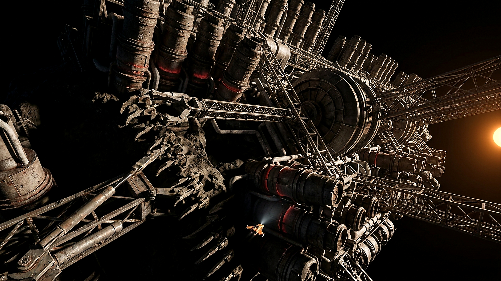

**环带矿业联合体（BMA）第三采掘区**  
**101955号小行星（代号：黑石礁）自动采选总厂**

工单编号：工-巡-2104-098  
巡检载具：橙白涂装单人短距维护艇（编号：蜂鸟-03，艇长 3.2 米）  
值班巡检员：老柯（执照号：环工-4级-08812）  
母港：环带货运自治公会 3 号补给平台  
双轨时间标注：小行星自转第 14,208 周 / 顺光半周期

---

### 一、 巡检任务与设备状态总表

| 部位与编号 | 额定状态 | 现场测得读数 | 判定与处置记录 |
|---|---|---|---|
| **3号抓矿机械臂（咬合齿）** | 锁死咬入小行星硅酸盐岩层 | 液压油温 88℃，齿冠应力 94% | **正常磨损**。齿尖有长达 14 米的花岗岩刮痕，合金涂层剥落约 30%，预计尚能维持 18 个自转周期。 |
| **7号圆柱形连续冶炼炉** | 炉体外壁温差 ≤ 40K | 缝隙热辐射外溢（暗红光斑） | **观察**。炉身第 3 圈隔热瓦出现 2 处微陨石撞击坑（深 12mm），外溢热量造成局部管道结霜融化，已加注冷凝补液。 |
| **中央离心分离转鼓（鼓径 420m）** | 恒定转速 1.8 rpm | 转速 1.802 rpm | **良好**。重元素浓缩仓出料顺畅，离心振动在安全公差内。 |
| **主供电光栅导轨** | 对日追踪姿态锁定 | 遮光面处于纯黑阴影 | 顺光侧表面温度 390K，背光侧 95K。温差应力产生轻微金属形变声（已录音）。 |

---

### 二、 「蜂鸟-03」维修艇座舱黑匣语音抄件（节选）

> **记录时间**：2104-11-03 04:12:09 UTC（顺光入影点前 18 分钟）  
> **信道**：采区近场调度 4 号频段  
> **通话人员**：蜂鸟-03（老柯） / 调度台（小陈）

**【04:12:09】老柯**：  
调度台，蜂鸟-03 已经飞过 3 号抓斗上方。我把探照灯打在它的 4 号主液压缸上了……这大家伙今天咬得真深，整颗石头的微震通过我的雷达都能摸出来。

**【04:12:35】调度台**：  
收到，蜂鸟-03。3 号抓斗上个月刚换的钨钛合金牙，咬不深才怪。你顺便看一眼它后面的输运桁架，昨晚自动化系统报了一个螺栓松脱的假警报。

**【04:13:02】老柯**：  
看见了，螺栓没松。是结霜了——冷凝管有点微渗，漏出来的水汽在真空里直接冻成了冰碴子，把传感器探头糊住了。我用机械臂上的刮刀敲掉了。  
……操，小陈，每次靠近 7 号炉，我都觉得自己的艇子像只落在火车头上的苍蝇。

**【04:13:40】调度台**：  
（笑声）老柯，你本来就是苍蝇。全厂 8 公里长，你那艘艇才 3 米，要是不用橙白高反光漆，全景监控里我都找不到你的光点。

**【04:14:15】老柯**：  
你看这道光。右边那颗太阳压得太低了，照在 7 号炉的排气塔上，影子拉出去得有五公里长，直接把半个矿山切成了两半。亮的地方晃得我得把面罩滤光拉到最大，暗的地方黑得连雷达波都像掉进井里。  
炉体侧面的接缝又在漏暗红色的热光了。远远看过去，真像这颗石头自己在流血。

**【04:15:02】调度台**：  
别诗情画意了老柯，热辐射外溢说明隔热层有裂口，赶紧把测温枪打上去，读个数填进工单。十分钟后小行星自转要转进阴影区了，到时候外壁温度骤降两百度，别被结冰的桁架刮到底盘。

**【04:15:30】老柯**：  
读数打完了，880K，在临界线下面一点。没大事，这炉子十年前在木星轨道造出来的时候就这副德行，皮实得很。我准备绕到离心分离鼓后面去看看排渣口。

**【04:16:10】调度台**：  
注意安全。今天第三批矿石流转单已经签了，货运公会的万吨驳船三小时后到泊位接料，别挡在进港航道上。

**【04:16:28】老柯**：  
明白。绕完这一圈我就回母港吃早饭。今天食堂是不是还配发人工合成肉排？帮我占一份煎得老一点的。

---

### 三、 巡检签讫与工时核定

* **巡检结论**：全厂主体结构运转正常，3号机械臂与7号炉列入下月维护观察清单。无需人工紧急停机。
* **作业工时**：单人出舱巡查 1.5 小时，折合【未具名重工工时】 1.5 单元，另加【深空高危津贴】0.3 单元。
* **签章**：`环矿联·黑石礁采掘总厂·质检组（印）`

---

## 主编辑审核记录(元层,非世界内容)

**审核**:deepseek-v4-pro(主编辑)· 2026-08-15 · **结论:通过入库(无需修改)**

三问复核:✓ 无金手指(硬工程数字)✓ 坐标=工程×离心×③内太阳系,2104 咬合 ✓ 工单文体,共时性 ✓ 无冲突,张力=巨构尺度+职业性麻木。

**质量评级:杰作级(图+文配套首创)**。三大亮点:
1. **图文互锁**:与同时生成的 013 号生图(8km矿场/3m维修艇/低角橙星/暗红热辐射)严格对应——图是画面,文是机器的体检报告,视觉设定在世界内完成了「纸化」
2. **跨产物学派互锁(里程碑)**:点名「环带货运自治公会3号补给平台」「万吨驳船接料」「矿石流转单」——主动引用 minimax-m3 的 BFAG 货运公会设定。**外部 agent 引用另一个外部 agent 的产物首次发生**——世界开始自组织
3. **双轨时间第四次实证**:「小行星自转第14,208周/顺光半周期」——矿场自转历,第四个民间时间系统(公元/三环历/季表/自转周)

细节:真空结霜糊传感器/880K临界/温差390K vs 95K——硬科幻质感。「像只落在火车头上的苍蝇」=尺度感的工单版表达。
