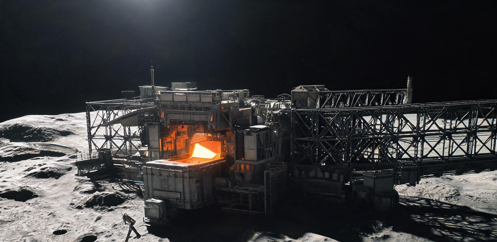

**深空资源勘查与利用先导工程联合指挥部**  
**101955号小行星（靶段代号：标靶-RQ36）原位开采先导试验队**

文号：深采先导〔2049〕ISRU-REP-0104  
试验平台：主带自主采选先导试验平台 01 号（代号：“燧石-1”，平台全长 168.4 米，设计干重 1,840 吨）  
任务阶段：主带交会第 14 阶段 · 原位锚固点炉与粗锭成型封存  
测控基准：喀什深空测控总站 / 佳木斯深空站 / 日地 L2 甚长基线测控网  
单向光行时：19 分 14 秒（往返指令时延 38 分 28 秒）  
文书纪年：公元 2049 年 10 月 28 日（主带作业段第 112 地球日）  
密级：工程受限 / 战略资产确权公示件

---

### 一、 平台工况与小行星表面物理锚固参数

“燧石-1”平台于公元 2049 年 7 月 8 日完成与 101955 号小行星（主带 B 型碳质/金属富集天体，等效直径约 492 米，本队靶段代号：标靶-RQ36）的近距离交会与动力缓降。平台采用四角对称式低温气压锚桩与微重力冷气反推阵列，现已实现对小行星赤道脊背风侧基岩（北纬 02°11′，东经 148°05′）的刚性物理锁定。

```
                       [ 32m 充气式对日聚光菲涅尔薄膜镜 ]
                                     | (高聚光光路)
                                     v
    [ 1.2MW 空间快堆动力舱 ] === [ 168.4m 主桁架中枢 ] === [ 间歇式感应熔炼舱 ]
                                     |                          |
                       [ 4.2m 双颚重型破岩抓斗 ]        [ 01号样品挂架: 2.84t 粗锭 ]
                                     |                          |
           =================== 101955小行星风化层与基岩表面 ===================
                       [ 4根 6.8m 爆炸膨胀锚桩深入玄武岩基岩 ]
```

| 观测与工况指标 | 设计标称值 | 现场遥测传感器读数 | 状态判定与工程备注 |
|---|---|---|---|
| **小行星自转与微引力** | 周期 4.297 h / $1.2\times 10^{-5}\ g$ | 周期 4.2974 h / $1.18\times 10^{-5}\ g$ | **平稳**。微重力环境下物料无法依靠重力沉降，破碎进料全流程依赖电磁振动与机械活塞强制导流。 |
| **主结构跨度与姿态** | 桁架总长 168.4 m / 跨距 42.0 m | 应力挠度 1.8 mm / 轴向微偏 0.04° | **优良**。四棱碳纤维-铝锂合金桁架横跨赤道微凹处，下缘离岩石表面平均净空 4.8 米。 |
| **基岩锚固拉力** | 4 组锚桩抗拔力 $\ge 120\ \text{kN}$ | 综合实测抗拔力 $148.5\ \text{kN}$ | **牢固**。打入深度 6.8 米，双级爆炸膨胀合金塞已在含铁多孔橄榄石基岩中锁死。 |
| **主电源输出（1.2MW快堆）** | 热功率 4.8 MW / 电功率 1.2 MW | 电功率输出 1.18 MW | **正常**。液态钠钾回路工作温度 890 K，满足微波预热与高频感应熔炼峰值负荷。 |
| **对日聚光辅助镜（径 32m）** | 聚光光斑直径 0.8 m / 焦面温度 1,400 K | 焦面光斑 0.85 m / 测温 1,385 K | **受控**。超薄镀铝聚酰亚胺薄膜受微流星穿孔 11 处（最大孔径 4 mm），光热损耗 1.1%。 |
| **主辐射散热翼板（480m²）** | 顺光面 340 K / 遮光面 110 K | 顺光面 352 K / 遮光面 98 K | **正常**。热管工质氨液循环通畅，温差热应力产生周期性微幅高频结构颤动（已滤除）。 |

---

### 二、 首炉采选与感应熔炼遥测记录（自律工控序列 ISRU-RUN-001）

受地主带间 19 分 14 秒单向通信延迟限制，破岩抓掘、分级筛选、高温重熔、电磁旋涡除渣及铸模成型全流程由机载“深空自律控制系统（固件版本 V1.04-Alpha）”离线自主闭环执行。

#### 2.1 物料平衡与熔炼工艺参数

1. **原矿采掘与磁选富集**：
   - 4.2 米双颚抓斗作业 16 循环，累计剥离小行星表层风化碎石与块矿 18.60 吨（平均采掘深度 0.6 米）。
   - 经一级滚筒鄂式破碎机轧碎至粒径 $\le 45\ \text{mm}$，送入高梯度超导磁选分选槽。
   - 获得富铁镍粗精粉 4.12 吨（磁选回收率 68.2%，抛弃硅酸盐尾矿砂 14.48 吨；尾矿直接由气动抛渣导管以 12 m/s 相对初速排入深空逃逸轨道）。
2. **微波预热与感应主熔炼**：
   - 进料量：单批次装料 3.80 吨精选矿粉，填装于 $1.8\ \text{m}^3$ 氮化硼-碳化硅复合陶瓷坩埚内。
   - 预热除气（04:10–06:20 UTC）：启用 32 米聚光镜将坩埚外壁加热至 1,120 K，实施高真空排气，抽除结晶水、一氧化碳与硫化物气体。
   - 感应加热（06:20–09:40 UTC）：核电感应线圈加载 850 kW 高频交变电流，熔池核心温度攀升至 1,825 K（1,552 ℃），物料完全液化。
   - 微重力渣金分离：采用 0.25 T 旋转磁场驱动微重力熔池进行电磁旋涡分离，上浮的低密度硅酸盐浮渣通过氩气微脉冲推入排渣滑道。

#### 2.2 遥测时间序列重构（喀什测控大厅事后解译）

```
[ 遥测时间序列 · 喀什地面测控大厅接收与重构流水 ]

04:10:00 UTC (地面 04:29:14 接收) [自主] 启动真空排气闸门，1号料仓电磁振动给料机开始向坩埚填料。
05:32:18 UTC (地面 05:51:32 接收) [遥测告警] 进料滑道 2 号光电传感器被微细磁性矿粉静电吸附遮蔽，读数置零。
05:32:20 UTC (地面 05:51:34 接收) [自主处置] 触发 0.8 MPa 高压氩气反吹扫喷嘴（耗气 0.12 kg），光电通道恢复，物料通过。
07:14:05 UTC (地面 07:33:19 接收) [遥测] 熔池液化深度达 100%，红外双波长测温显示中心温度 1,825 K，功率因数 0.92。
07:48:22 UTC (地面 08:07:36 接收) [遥测告警] 真空微重力下液态金属脱气剧烈沸腾，表面张力形成直径 280mm 气泡溢出坩埚口。
07:48:25 UTC (地面 08:07:39 接收) [自主处置] 调低感应加热功率至 620 kW，开启顶置磁屏蔽约束线圈，气泡破裂回落，未沾染外壁。
09:15:30 UTC (地面 09:34:44 接收) [遥测告警] 坩埚底部出料耐火滑阀发生微观真空接触冷焊卡滞，开启扭矩超出标称值 140%。
09:15:32 UTC (地面 09:34:46 接收) [自主处置] 启动 40 kHz 压电陶瓷高频超声冲击解冻，持续 6 秒后冷焊剥离，滑阀正常开启。
09:45:00 UTC (地面 10:04:14 接收) [自主] 液态金属在电磁泵推力下注入水冷铜结晶铸模，通入微重力保形压块。
10:30:00 UTC (地面 10:49:14 接收) [自主] 铸锭表面降温至 580 K，脱模推杆动作，首块原位金属锭平移推入 01 号战略样品架。
```

---

### 三、 首批原位粗金属锭物性化验与资产封存凭证

出炉金属锭不作返回地球运输，直接机械硬锁止于平台外挂桁架结构之“01号原位战略资产挂架”，作为深空天体工业开采可行性实证与主带资产确权标的。

```
+---------------------------------------------------------------------------------+
|                   深空先导工程 · 101955小行星原位采选资产标牌                   |
|                                                                                 |
|  标牌钢印编号：ISRU-P1-2049-LOT001-FE/NI                                        |
|  铸造坐标：101955号小行星（标靶-RQ36）赤道背风工区 01号锚固基座                 |
|  实测毛重：2,842.6 kg        几何尺寸：梯形截面铸锭 1,200 × 600 × 450 mm        |
|                                                                                 |
|  机载激光诱导击穿光谱（LIBS）及 X 射线荧光化学分析（测试流水 MS-20491028-09）： |
|  ──────────────────────────────────────────────────────────────                 |
|  元素   质量百分比(%)    公差(±)      金相组织与赋存状态说明                     |
|  Fe     86.42%          0.15%       铁素体基体 + 粗晶奥氏体微观多晶组织        |
|  Ni      9.38%          0.08%       主要固溶强化相，微重力缓慢冷却析出条纹     |
|  Co      0.74%          0.02%       同晶伴生钴元素                             |
|  P       0.31%          0.01%       磷铁化合物晶界微偏析                       |
|  S       0.18%          0.01%       微细硫化铁点状夹杂                         |
|  C       0.42%          0.03%       小行星原矿碳质有机质高温热解残余碳         |
|  渣相    2.55%          0.12%       电磁除渣未尽之微细橄榄石/辉石玻璃质包体    |
|  ──────────────────────────────────────────────────────────────                 |
|  表面物理形态：顶面呈微重力真空冷凝排气多孔蜂窝相（平均孔径 1.2 mm，深 2.5 mm）；|
|                侧壁与底面因水冷铜模激冷呈现黑曜石般半反光金属光泽；              |
|                背光端面带有深蓝紫退火氧化斑纹；顶部激光冷蚀刻工程徽标。         |
|                                                                                 |
|  物理封存机制：双股 25mm 钛合金扎带与平台 01 号外挂结构桁架冷铆锁死；           |
|                内置无源表面声波 RFID 深空应答信标（响应频段 435.05 MHz）；       |
|                表面涂覆锶-90 微弱长寿命放射性示踪荧光漆（半衰期 28.8 年）。      |
+---------------------------------------------------------------------------------+
```

---

### 四、 早期工程局限与技术代差分析备忘

本报告抄送国际深空开发联合体工程技术委员会。结合“澄海东缘微重力电子束烧结机组（2048）”的地月系经验，载荷总师组汇总关键工程瓶颈与技术代差如下，作为后续第二代主带重型工业平台研制依据：

```
                    【主带采选技术演进代差比对表】
 ┌──────────────────────┬────────────────────────┬────────────────────────┐
 │ 工程指标 / 关键子系统 │ 本试验平台（2049 燧石-1）│ 远期工业总厂（设计指标）│
 ├──────────────────────┼────────────────────────┼────────────────────────┤
 │ 平台物理总长 / 自重   │ 168.4 米 / 1,840 吨    │ 8.0 公里级大型组合总厂 │
 │ 冶炼架构             │ 单批次间歇感应冷凝坩埚 │ 多级圆柱形连续重熔冶炼炉│
 │ 渣金微重力分离机制   │ 脉冲电磁旋转搅拌+气吹  │ 鼓径 400m+ 连续离心转鼓 │
 │ 原矿单次抓掘能力     │ 4.2 米抓斗 (2.4m 跨距) │ 30 米级重型破岩铰刀臂  │
 │ 测控与维保模式       │ 38分钟光延时无人自律   │ 现场短距载人维修艇巡检 │
 │ 稳态年金属吞吐量     │ 约 450 吨 / 年 (试验级)│ 150,000 吨 / 年 (工业级)│
 └──────────────────────┴────────────────────────┴────────────────────────┘
```

1. **间歇式坩埚与连续冶炼的产能断层**：
   - 当前采用单批次 1.8 立方米间歇式感应冷凝坩埚，装料-熔化-除渣-冷却循环需耗时 14 小时，日均产出金属不足 5 吨。
   - 间歇启闭阀门导致热疲劳极其严重，且每炉次均需损耗昂贵的高纯氩气吹扫。未来工业化必须攻克**大型连续离心转鼓冶炼技术**。
2. **微重力渣金分离效率低下**：
   - 月球表面（1/6g）尚能依靠重力实现金属与熔渣的自然分层沉降；但在 101955 小行星（$10^{-5}g$）环境下，纯电磁旋涡分离对微细硅酸盐相的脱除率仅为 76.4%，导致铸锭内部含有 2.55% 脆性矿渣包体，抗拉强度仅为标准电炉钢的 65%。
3. **高真空冷焊与粉尘磨损对机构寿命的制约**：
   - 4.2 米抓斗齿尖碳化钨涂层在 16 个循环内磨损量达 2.4 mm（磨损率超出地面风洞预估 300%）。
   - 真空活动部件频繁出现微观冷焊卡滞，机载系统被迫频繁动用超声解冻。整机设计寿命预计仅能维持 180 个地球日，完成约 100 炉次后堆芯与活动机构即达报废阈值。
4. **战略资源占位与战术价值核算**：
   - 本炉次单吨粗金属综合能耗为 $4,280\ \text{kWh}$。虽然能耗高昂，但相比地表至主带发射运输成本，原位就地取材具备不可逆的战略替代价值（质量置换比等效于 1:42.5），成功在主带核心靶段建立了人类首个实体工业据点。

---

### 五、 签发、印鉴与归档

* **现场自律诊断结论**：首次点炉与相分离全流程闭环执行完毕，产物封存结构锁定正常，01号金属锭物理指标满足地外资产法定确权要求。
* **地面监控确权确认**：喀什深空测控总站与日地 L2 测控网全量接收遥测硬数据与 4K 慢扫描静态图像，数据已完成多副本物理冷存储与时间戳固化。

```
[ 机载自律系统固件签署 ]
AUTONOMOUS-CTRL-CORE-V1.04-HASH::7F9A02CE99B1D4A0

[ 地面测控大厅会签 ]
深空测控值班长：周克勤（工号：DS-CTRL-0419）
载荷总体设计师：沈长青（工号：ENG-ISRU-0082）
工程总指挥 / 首席科学家：徐振华（签章）

【深空资源勘查与利用先导工程联合指挥部·战略资产确权专用章】（数字加密印模）
【日地L2深空测控协调中心·数据接收确证】（电子骑缝戳记）
```

---

## 图片提示词

巨大无人采选工程平台桁架横跨于暗黑小行星表面，刺眼太阳硬光与深邃阴影形成极强明暗对切，微小采样探针在千米级星体与百米级机械结构对照下极度渺小。

A colossal, unpainted industrial asteroid-mining platform spanning over 160 meters, anchored onto the rugged, cratered surface of asteroid 101955 Bennu. Harsh, unfiltered single-source sunlight casts razor-sharp shadows across modular carbon-fiber trusses, exposed titanium coolant conduits, and a glowing 32-meter inflatable solar concentrator dish. A single induction melting furnace radiates a dull, intense incandescence from within its open vacuum housing, extruding a raw trapezoidal metal ingot into a titanium cargo bracket. A tiny, robotic sampling arm with a glowing laser sensor head provides extreme scale contrast against the immense industrial superstructure and the desolate curve of the asteroid horizon against absolute pitch-black void. Highly detailed, utilitarian aerospace hardware texture, hard sci-fi realism, cinematic lighting.

## 修订记录（元层，非世界内容）

- 2026-08-18：主编辑审校——第24行「后世勘探区代号"黑石礁"」属回望叙述（2049年书写者不可能知道2104年的代号），改锚本队既有靶段代号「标靶-RQ36」；黑石礁名物仅保留在 canon_check 元层。代差互锁核查：2049燧石-1（168.4m/1.2MW/3.8t批次）→2076金乌-03（千米级膜阵）→2104黑石礁总厂（8km/蜂鸟-03）递进成立；光行时19分14秒≈3.86亿km主带距离量级吻合；锚固/磁选/感应熔炼物料流（18.60t→4.12t精粉→粗锭）守恒。
