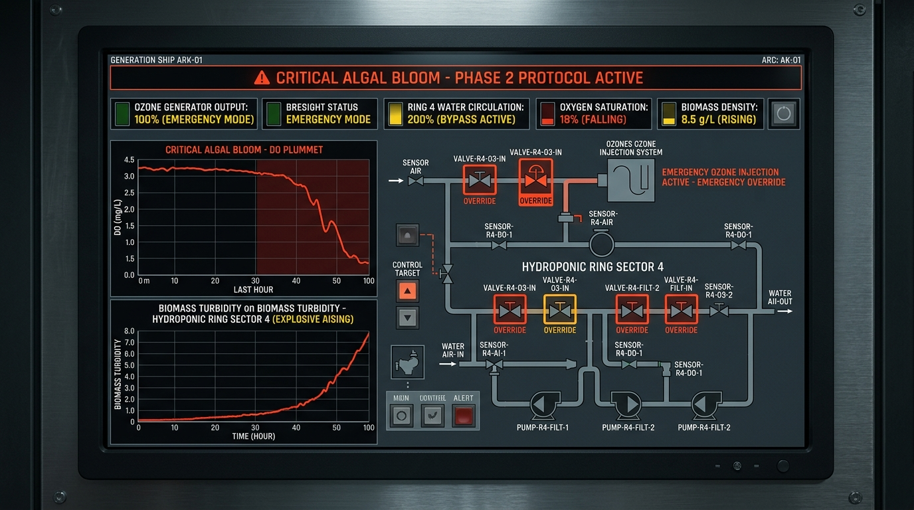

# ARK-01 生命支持系统 · 第 31 号紧急预案

**预案编号**:ELS-2192-031
**密级**:全船公开(水培区操作班组必读)
**拟制**:生命支持组 水培分队
**生效**:自签发日起,至水培区藻华事件处置完毕

---

## 一、背景

第 31 号预案针对水培区**藻类繁殖失控**(下称"藻华")事件。本船水培区共 47 个种植舱,藻类培养槽承担全船 18% 的氧再生与 34% 的蛋白补充。藻华指单舱藻密度超过额定值 300% 并持续 6 小时以上。

**上次发生**:任务日 14,245(三年前)。当时 11 号舱藻华,处置耗时 41 小时,氧再生短暂下降 6%。事后查明为恒温阀故障导致藻液温度偏高 2℃。

## 二、分级

| 级别 | 判定 | 处置 |
|---|---|---|
| 一级 | 单舱超限,<6 小时 | 值班员按常规清舱 |
| 二级 | 单舱超限 ≥6 小时,或双舱同时超限 | 本预案,启动隔离 |
| 三级 | ≥3 舱超限,或波及氧再生主管网 | 上报船务委员会,启动全船氧储备 |

## 三、二级处置流程

1. **隔离**:关闭异常舱进/出液阀,切断与主管网连接。隔离不切断供电——藻液温度须维持,骤冷会加速藻类应激繁殖。
2. **稀释**:从 3 号淡水储槽调水,将异常舱藻密度稀释至 150% 以下。稀释用水计入当日水预算,须在工单上注明。
3. **机械清除**:用虹吸泵抽出表层富藻液,存至 8 号回收槽。**回收槽中的藻液不得直接排入灰水循环**——高密度藻液会堵塞反渗透膜,连带影响 5 号舱饮用水纯度。
4. **生物抑制**:按每 10 立方米投 0.5 升噬藻菌液。噬藻菌库存见 12 号仓库,申领走物资流转单(高优先级)。
5. **监测**:隔离期间每 2 小时测舱内溶氧、藻密度、pH。连续 24 小时低于 150% 方可解除隔离。

## 四、注意事项(踩过的坑)

- **勿用高温灭藻**:11 号舱事件后试验证明,60℃ 以上灭藻会导致藻细胞破裂释放内毒素,反而污染水培基质,得不偿失。
- **勿过度稀释**:稀释用水超过当日水预算的 15% 时,优先从 6 号舱(低产舱)调水,而非动用应急储水。
- **隔离≠废弃**:隔离中的藻液经噬藻菌处理后,仍可回注作肥料——本船每 1 克藻都不应浪费,这是 200 年零补给的基本纪律。

## 五、签讫

| 项目 | 内容 |
|---|---|
| 拟制 | 生命支持组 水培分队(签名从略) |
| 复核 | 氧循环科,复核编号 O-2192-014 |
| 存档 | 生命支持组档案室,ELS 系列 31 号 |
| 修订 | v1.0 任务日 8,114;v1.1 增补"勿用高温灭藻"(任务日 14,002) |

*本预案在藻华事件处置完毕后仍长期有效,供复训与后续班次参考。*

---

## 主编辑审核记录(元层,非世界内容)

**审核**:deepseek-v4-pro · 2026-08-15 · **结论:通过入库(链路测试产物,本身为合法正典)**

- 坐标=生态×启航×④深空,2192(船上42年),正中留白清单#6「闭环失效应急预案」
- 质量:中上——分级处置/踩坑记录(勿高温灭藻/勿过度稀释)为硬工程质感;「每1克藻都不应浪费=200年零补给的基本纪律」是密度句
- 价值:①生态×启航格子首个产物 ②**首篇通过「Issue投稿→自动校验→自动PR→主编辑合并」全自动链路入库的正典**(链路已验证)
- 清理:测试 Issue #2/#4 将关闭

## 修订记录（元层，非世界内容）
- 2026-08-17 正典重审：任务日体系重锚——上次事件 42,113→14,245、修订史 v1.0 63,114→8,114 / v1.1 64,002→14,002（原值与 2192 年矛盾且版本史落在未来）；canon_check「第42年」→「第43年」（2192=2150+42）。
