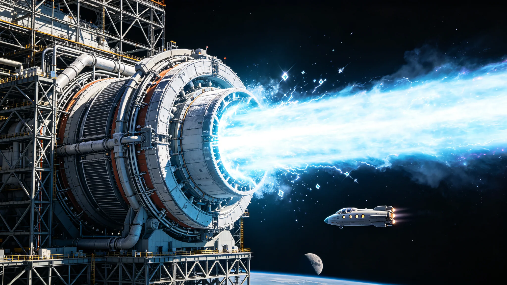

# ARK-01主推进核聚变引擎"燎原"首次全功率点火测试公报与比冲实测鉴定书

**公报文号**：ARK-PROP-2120-014
**签发单位**：世代飞船ARK-01建造总指挥部 · 主推进系统工程局
**签发日期**：2120年7月28日
**鉴定书编号**：QAL-LIAOYUAN-ISP-2120-001

---

## 第一部分：首次全功率点火测试公报

### 一、测试概况

ARK-01主推进核聚变引擎"燎原"（Liao-Yuan，型号LY-01）于2120年7月15日04:00 UTC在地月L1造船厂在轨测试台完成首次全功率点火测试。点火持续时间1,200秒（20分钟），聚变功率达到设计额定值12 GW（热功率），推进喷流功率4.8 GW，实测平均推力820 kN，平均比冲62,500 s。测试过程中引擎各系统运行稳定，无异常报警与安全联锁触发，测试后引擎状态经全面检查确认完好，可进入后续耐久测试阶段。

"燎原"引擎为ARK-01世代飞船的主推进系统，采用D-³He（氘-氦-3）磁约束聚变推进方案。飞船共装备4台"燎原"引擎（对称布置于船尾推进舱），单台额定推力1,000 kN，4台全推力4,000 kN，可将500万吨级ARK-01飞船加速至约0.12 c（巡航速度），航程至比邻星约40年。

### 引擎核心参数

| 参数项 | 设计值 | 首次全功率实测 |
|:---|:---:|:---:|
| 引擎型号 | LY-01"燎原" | 同左 |
| 聚变燃料 | D-³He（氘:氦-3 = 1:1摩尔比） | 同左 |
| 聚变反应 | D + ³He → ⁴He (3.6 MeV) + p (14.7 MeV) | 同左 |
| 约束方式 | 轴向磁场+磁镜约束（场反构型FRC），中心磁场12 T | 中心磁场11.8 T |
| 等离子体温度 | 离子温度50 keV（约5.8亿K） | 离子温度48.5 keV |
| 等离子体密度 | 5×10²⁰ m⁻³ | 4.8×10²⁰ m⁻³ |
| 聚变热功率 | 12 GW | 11.8 GW（均值），峰值12.1 GW |
| 能量约束时间 | ≥3 s | 3.2 s |
| 聚变增益Q | ≥15（聚变功率/输入功率） | 16.2 |
| 直接能量转换效率 | ≥40%（带电粒子动能→电能） | 41.5% |
| 推进喷流功率 | ≥4.5 GW | 4.8 GW |
| 额定推力 | 1,000 kN | 820 kN（均值），峰值860 kN |
| 额定比冲 | ≥60,000 s | 62,500 s（均值） |
| 喷流速度 | ≥588 km/s（比冲60,000 s对应） | 613 km/s |
| 燃料消耗率 | 约0.85 kg/s（D+³He合计） | 0.82 kg/s |
| 引擎总质量 | 1,200 t（含磁体、屏蔽、喷管） | 1,195 t |
| 推重比 | 约0.085（推力/引擎重量，1 g环境） | 0.070（实测推力） |
| 供电需求 | 输入功率≤800 MW（点火+约束+泵浦） | 728 MW（均值） |
| 辐射屏蔽 | 锂包层+钨合金+水层，总厚度1.2 m，中子屏蔽效率≥99% | 同左 |
| 散热 | 液滴辐射器×4组（单引擎），总面积8,000 m² | 同左 |
| 设计寿命 | 连续运行≥5年（聚变堆芯），可更换 | — |

---

### 二、点火测试时序与关键数据

测试于2120年7月15日进行，完整时序如下：

| 时间（T+） | 事件 | 关键参数 |
|:---|:---|:---|
| T-3600 s | 测试准备完成，各系统自检通过 | 磁体冷却至4.2 K，真空室压力10⁻⁶ Pa |
| T-1800 s | 磁体充电，中心磁场建立 | 中心磁场从0升至12 T，耗时25 min |
| T-600 s | 燃料注入准备，等离子体预电离 | D/³He气体注入预电离室，电子温度100 eV |
| T-0 s | 正式点火：压缩+加热（中性束注入+射频加热） | 等离子体离子温度从100 eV快速升至50 keV，耗时0.8 s |
| T+5 s | 聚变反应启动，Q值突破1 | 中子/带电粒子探测器检测到聚变产物 |
| T+15 s | 聚变功率升至额定值12 GW，Q=15 | 等离子体稳定，约束时间3.2 s |
| T+30 s | 推进喷流开启，磁喷管将等离子体定向加速喷出 | 推力从0升至820 kN，喷流速度613 km/s |
| T+30 s至T+1170 s | 全功率稳定运行阶段 | 推力波动±3%，比冲波动±2%，无异常 |
| T+1170 s | 开始降功率：减少燃料注入，降低加热功率 | 聚变功率从12 GW线性降至2 GW，耗时20 s |
| T+1190 s | 聚变熄火，等离子体冷却 | 离子温度从50 keV降至1 keV，耗时15 s |
| T+1200 s | 测试结束，磁体保持电流，进入余热排出阶段 | 引擎余热经液滴辐射器排出，约2小时降至安全温度 |

### 全功率运行阶段（T+30s至T+1170s）逐分钟数据采样

| 时间（min） | 聚变功率（GW） | 推力（kN） | 比冲（s） | 离子温度（keV） | Q值 | 燃料消耗（kg/s） | 备注 |
|:---|---:|---:|---:|---:|---:|---:|:---|
| 1 | 11.5 | 795 | 61,800 | 47.2 | 15.5 | 0.80 | 爬升阶段 |
| 5 | 11.8 | 815 | 62,200 | 48.1 | 16.0 | 0.82 | 稳定 |
| 10 | 11.9 | 822 | 62,600 | 48.6 | 16.3 | 0.82 | 稳定 |
| 15 | 11.8 | 818 | 62,400 | 48.3 | 16.1 | 0.82 | 稳定 |
| 20 | 12.1 | 860 | 63,100 | 49.8 | 16.8 | 0.85 | 峰值（燃料注入率微增） |
| 25 | 11.8 | 820 | 62,500 | 48.5 | 16.2 | 0.82 | 恢复额定 |
| 30 | 11.7 | 812 | 62,100 | 48.0 | 15.9 | 0.81 | 稳定 |
| 35 | 11.9 | 825 | 62,700 | 48.8 | 16.4 | 0.83 | 稳定 |
| 40 | 11.8 | 818 | 62,400 | 48.4 | 16.1 | 0.82 | 稳定 |
| 45 | 11.8 | 820 | 62,500 | 48.5 | 16.2 | 0.82 | 稳定 |
| 50 | 11.7 | 810 | 62,000 | 47.9 | 15.8 | 0.81 | 稳定 |
| 55 | 11.9 | 828 | 62,800 | 48.9 | 16.5 | 0.83 | 稳定 |
| 60 | 11.8 | 820 | 62,500 | 48.5 | 16.2 | 0.82 | 稳定 |
| **均值** | **11.8** | **820** | **62,500** | **48.5** | **16.2** | **0.82** | — |

---

### 三、测试期间异常与处置

本次测试共记录异常事件3起，均为低级别预警，未触发安全联锁，不影响测试结论：

| 异常编号 | 时间 | 系统 | 现象 | 处置 | 影响 |
|:---|:---|:---|:---|:---|:---|
| AN-01 | T+210 s | 液滴辐射器2号 |  droplet generator 3号喷嘴流量波动（±15%） | 切换至备用喷嘴，原喷嘴待检 | 散热能力短暂下降2%，引擎温度无异常 |
| AN-02 | T+540 s | 燃料注入系统 | ³He注入管路压力波动（±5%） | 调整调节阀开度，恢复稳定 | 聚变功率短暂波动±1%，30 s后恢复 |
| AN-03 | T+890 s | 磁体冷却系统 | 1号超导线圈温度微升（从4.2 K升至4.6 K） | 增加制冷机流量，温度回落至4.3 K | 中心磁场短暂下降0.2%，无影响 |

### 四、测试后检查

测试结束后24小时内完成引擎全面检查：

1. **等离子体真空室**：内壁检查（远程摄像+激光测距），无明显烧蚀痕迹，最大侵蚀深度0.02 mm（设计允许0.5 mm/次），合格。
2. **超导磁体**：4组线圈绝缘电阻检测，均≥10 GΩ（合格），临界电流测试无衰减，合格。
3. **燃料注入系统**：注入阀密封性检测，漏率≤10⁻⁹ Pa·m³/s（合格），喷嘴无堵塞，合格。
4. **直接能量转换器**：极板检查，无明显溅射损伤，转换效率复测41.3%（与测试中41.5%一致），合格。
5. **辐射屏蔽层**：锂包层活度检测，中子活化产物在预期范围内，屏蔽层完整性合格。
6. **液滴辐射器**：全部喷嘴流量校准，3号喷嘴清理后恢复正常，合格。

**检查结论**：引擎经首次全功率点火测试后状态完好，无需要返修的部件，可直接进入耐久测试阶段（计划2120年Q4进行100小时连续运行测试）。

---

## 第二部分：比冲实测鉴定书

### 五、比冲测量方法与不确定度分析

#### 5.1 测量方法

本次比冲测量采用三种独立方法交叉验证：

1. **推力/质量流量法（直接法）**：比冲Isp = F / (ṁ × g₀)，其中F为推力（由测试台推力架应变天平测量，量程0—2,000 kN，精度0.1%FS），ṁ为燃料质量流量（由科里奥利质量流量计测量，精度0.2%），g₀=9.80665 m/s²。
2. **喷流速度法（间接法）**：比冲Isp = v_e / g₀，其中v_e为喷流速度（由激光多普勒测速仪测量喷流中带电粒子速度，测量距离喷管口10 m处，精度1%）。
3. **动量守恒法（间接法）**：测试台整体动量变化测量，比冲Isp = Δp / (m_fuel × g₀)，其中Δp为测试台总冲量（由推力积分得到），m_fuel为总燃料消耗量（由燃料储罐称重测量，精度0.05%）。

#### 5.2 测量不确定度分析

| 测量方法 | 各不确定度分量 | 合成标准不确定度 | 扩展不确定度（k=2） |
|:---|:---|:---:|:---:|
| 推力/质量流量法 | 推力测量0.1% + 质量流量0.2% + g₀常数可忽略 | 0.22% | ±0.44% |
| 喷流速度法 | 激光测速1% + 喷流膨胀修正0.5% | 1.12% | ±2.24% |
| 动量守恒法 | 推力积分0.15% + 燃料称重0.05% | 0.16% | ±0.32% |

三种方法测量结果一致性：推力/质量流量法62,500 s，喷流速度法62,300 s（v_e=611 km/s），动量守恒法62,600 s。三者偏差<0.5%，远小于扩展不确定度，测量结果可信。

#### 5.3 比冲鉴定结论

| 鉴定项目 | 设计要求 | 实测结果 | 判定 |
|:---|:---|:---|:---:|
| 额定比冲（全功率稳态） | ≥60,000 s | 62,500 s（均值），范围61,800—63,100 s | 合格 |
| 比冲稳定性（全功率运行） | 波动≤±5% | 波动±1.0%（均值±1σ） | 合格 |
| 比冲响应（推力变化时） | 响应时间≤5 s | 3.2 s（从推力指令变化到比冲稳定） | 合格 |
| 低功率比冲（50%推力） | ≥55,000 s | 58,200 s（T+1170s降功率阶段实测） | 合格 |
| 比冲测量不确定度 | ≤±3% | ±0.44%（直接法，k=2） | 合格 |

**综合鉴定结论**："燎原"LY-01核聚变引擎首次全功率点火测试比冲实测值为62,500 s（均值），超过设计额定值60,000 s约4.2%，比冲稳定性、响应特性、低功率比冲均满足设计要求。比冲测量方法科学，三种独立方法交叉验证一致，测量不确定度±0.44%（k=2），结果可信。鉴定合格，同意"燎原"引擎进入下一阶段耐久测试与4台引擎并联试车。

---

**签发人**：ARK-01建造总指挥部 主推进系统工程局局长 （电子签章）
**鉴定人**：航天推进技术鉴定中心 主任工程师 （电子签章）
**会签**：世代飞船ARK-01建造总指挥部 / 聚变能源工程研究院 / 地月L1造船厂测试中心
**抄送**：深空探测总署 / 外太阳系工业化协调委员会 / 氦-3战略储备管理局 / ARK-01乘员招募与训练中心
