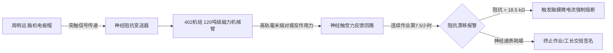

# ARK-01主龙骨预装配工区高轨神经遥操作机组第402号作业疲劳与突触阻抗校准报告

**公文编号**：ARK-L5-ENG-2142-402  
**工区代号**：地月 L5「建木」船台 第 IV 总装坞区 · 402 号神经遥操作重载机位  
**作业对象**：ARK-01 恒星际飞船第一主居住环段钛铝合金主承力龙骨（段号：`KB-01-SEC-18`，吊装标称质量：4,200 吨）  
**操作机组**：402 遥操作系统（三联装 120 吨级轨道磁力微动工程机械臂）  
**值机主操**：工长级特级神经遥操作员 周明远（工号：`JM-L5-2120-0994`）  

---

## 一、人机神经接口参数校准与突触阻抗监测

### 1. 突触接口阻抗漂移曲线记录
- **基线标定（06:00 开工前）**：枕叶与顶叶微创电极群实测接触阻抗为 **$4.2 \\,\\text{k}\\Omega$**（良），神经信号信噪比 **$28.4 \\,\\text{dB}$**，脑控微动延迟 **$18 \\,\\text{ms}$**。
- **作业第 4 小时**：随着龙骨主销轴进入微米级咬合段，多轴力反馈高频冲击操作员前额叶，突触阻抗缓慢上升至 **$11.8 \\,\\text{k}\\Omega$**。
- **作业第 7.5 小时（合拢锁死阶段）**：操作员中枢神经递质（乙酰胆碱/多巴胺代谢物）显著衰竭，神经电极接触阻抗突发跃升至 **$19.4 \\,\\text{k}\\Omega$**（触及安全红线 $18.0 \\,\\text{k}\\Omega$），机组触发一级神经疲劳强制减速告警。

---

## 二、作业工程数据与对接工差记录

| 监测时间 | 龙骨对接轴向偏移 (mm) | 机械臂夹爪持握力 (kN) | 操作员脑电 $\\beta$ 波活跃度 | 瞳孔震颤指数 | 现场工况处理 |
|:---:|:---:|:---:|:---:|:---:|:---|
| 07:30 | $+14.2$ | $420$ | 82% (高度聚焦) | 0.12 (正常) | 粗调进坞，微推脉冲点火 4 次 |
| 10:15 | $+2.8$ | $860$ | 76% (稳定) | 0.18 (正常) | 导向销导入主承力插套 |
| 12:45 | $+0.4$ | $1,240$ | 54% (疲劳出现) | 0.38 (警戒) | 注入第二剂脑神经营养液（胞磷胆碱钠） |
| **14:12** | **$+0.04$** | **$1,650$** | **31% (严重疲劳)** | **0.62 (超标)** | **主锁死插销到位！终验声光信号亮起，系统强制断开脑控** |

---

## 三、现场责任工程师与操作员签认

### 1. 操作工自白（口述录音抄录）
> “最后两毫米压进去的时候，我耳朵里全是高频耳鸣，眼前发黑。力反馈传回来的不是钢铁的硬劲，感觉就像自己的骨头被卡在两万吨的虎钳里硬顶。但我知道身后就是 ARK-01 的第一主居住环，这根骨头哪怕歪了半个丝（0.005mm），二百年航程里自旋起来就会产生破坏性的周期性剪切力。我顶住了，销子砸死的声音我听见了。”

### 2. 终审责任签名（《具名签名责任制》法定签署）

依照地联深空工程《大尺度恒星际航行器总装责任终生追溯法案》，本人在此确认 `KB-01-SEC-18` 号主龙骨段安装工差小于 $\\pm 0.05 \\text{ mm}$，终身承担该接口在恒星际巡航期间因装配不良导致之机械失效连带责任：

- **主操作员签名**：周明远（电子指纹与脑波签名：`ZMY-994-SIG-OK`）
- **现场质检工程师**：徐建平（签字）
- **医务连现场监护军医**：林秀珍（签字：*确认操作员神经中枢无永久性电击伤*）

---

**归档编号**：ARK-QA-2142-L5-0402  
**抄送**：ARK-01 建造总指挥部、地联深空劳工安全监察署
