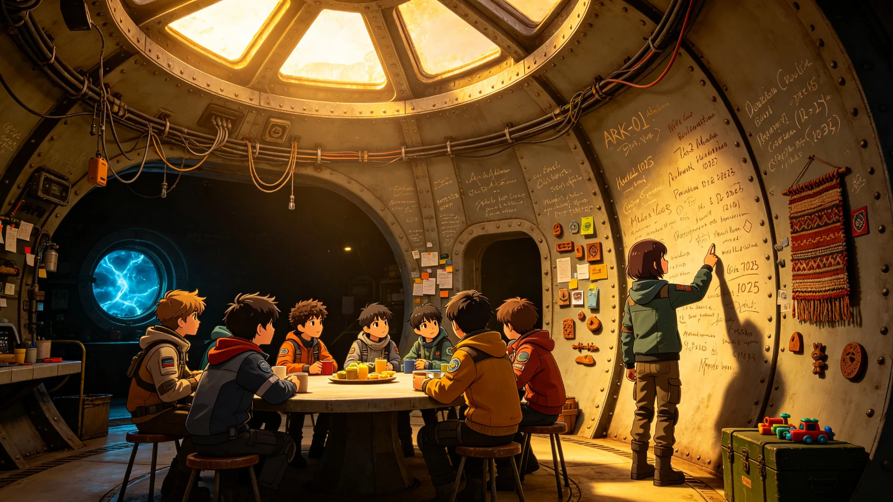

# ARK-01乘员代际称谓演变与"船生代"身份认同社会学调查公报

**船政总署 · 文化与社会处 · 社会学调查科**
**文件编号：** 船政社字〔2240〕第006号
**调查周期：** 2239年6月—2240年3月
**调查方式：** 问卷调查+深度访谈+参与式观察

---

## 一、调查背景

ARK-01航行至第九十年，全船人口已完成三次完整代际更替。初代乘员（地球出生、出港登船）仅剩247人，平均年龄87.3岁。船生一代（航行后第一个二十五年出生）平均年龄62.1岁，船生二代平均年龄37.4岁，船生三代平均年龄12.8岁，船生四代于2238年开始出生。

随着初代乘员逐渐凋零，"地球"作为直接经验的来源正在消退。船生三代及以后的乘员，对地球的认知完全来自教育、影像、口述与器物。代际称谓的演变与身份认同的漂移，成为理解全船社会文化变迁的核心线索。

本次调查为航行以来第三次大规模代际身份调查，旨在系统记录代际称谓的演变轨迹、测量各代际的身份认同结构，并为文化政策提供依据。

## 二、代际称谓演变

### 2.1 称谓谱系

调查发现，全船自发形成的代际称谓经历了以下演变：

| 时期 | 初代称谓 | 船生一代称谓 | 船生二代称谓 | 船生三代称谓 |
|---|---|---|---|---|
| 2150—2175 | "乘员""登船者" | "船上出生的""小的" | — | — |
| 2175—2200 | "老乘员""地球来的" | "船生一代""第一代" | "船上长大的" | — |
| 2200—2225 | "初代""原乘员" | "船生一代" | "船生二代""中生代" | "新的一代" |
| 2225—2240 | "地球人"（口语中渐含疏离感） | "老船生""第一代船人" | "船生二代""中坚代" | "船生三代""纯船生" |

### 2.2 关键称谓分析

**"地球人"：** 该词在2150年代为中性自称，所有乘员均称自己为"地球人"。至2240年，该词在船生三代口语中已带有微妙的疏离感，多用于指代初代乘员，而非自称。访谈中一名15岁船生三代受访者表示："他们是地球人，我们是船上人。"这一转变标志着"地球"从身份认同的核心退化为历史概念。

**"船生代"：** 该词最早出现于2180年代的行政文书中，为"船上出生世代"的缩写。至2240年，已成为全船最广泛使用的自称，涵盖船生一代至四代。其变体包括"船人""船上人""环上人"（居住环上的人）。

**"纯船生"：** 2230年后出现的新称谓，特指父母双方均为船生代的乘员（即船生三代及以后），与"半船生"（父母一方为初代）相对。该称谓在船生三代青少年群体中使用频率较高，带有一定的代际边界意识。

### 2.3 称谓使用频率调查

对全船1,200名受访者（覆盖各代际）进行称谓使用频率调查：

| 称谓 | 初代使用频率 | 船生一代 | 船生二代 | 船生三代 |
|---|---|---|---|---|
| "乘员"（正式） | 92% | 87% | 71% | 43% |
| "船生代" | 34% | 78% | 89% | 94% |
| "地球人" | 88% | 51% | 22% | 8% |
| "船上人" | 12% | 43% | 67% | 81% |
| "纯船生" | 0% | 0% | 14% | 37% |

## 三、身份认同结构测量

### 3.1 认同层级排序

采用"你首先认为自己是谁"的多选排序法，测量各代际的身份认同层级：

| 认同层级 | 初代 | 船生一代 | 船生二代 | 船生三代 |
|---|---|---|---|---|
| 第一认同 | 地球人（78%） | 船生代（56%） | 船生代（72%） | 船上人（81%） |
| 第二认同 | 乘员（61%） | 乘员（49%） | 职业身份（44%） | 职业身份（38%） |
| 第三认同 | 职业身份（42%） | 地球人（34%） | 舱区归属（31%） | 舱区归属（29%） |
| 第四认同 | 舱区归属（23%） | 职业身份（31%） | 地球人（18%） | 代际归属（24%） |

**核心发现：** 船生三代中，仅8%将"地球人"列入认同层级前四位，而81%将"船上人"作为第一认同。"地球"作为身份锚点的功能已基本消退。

### 3.2 对地球的认知与情感

| 问题 | 初代 | 船生一代 | 船生二代 | 船生三代 |
|---|---|---|---|---|
| "我对地球有归属感" | 94%同意 | 47%同意 | 19%同意 | 7%同意 |
| "抵达后我想住在地球风格的环境里" | 87% | 52% | 28% | 11% |
| "地球是一个抽象的历史概念" | 3% | 28% | 61% | 89% |
| "我能在地图上指出中国/美国的位置" | 100% | 82% | 41% | 17% |
| "我吃过地球原生食物（非船培品种）" | 100% | 23% | 2% | 0% |

### 3.3 对目的地的认知

| 问题 | 初代 | 船生一代 | 船生二代 | 船生三代 |
|---|---|---|---|---|
| "我相信我们能抵达目的地" | 98% | 91% | 84% | 76% |
| "抵达对我个人意义重大" | 96% | 72% | 48% | 31% |
| "我更关心船上的日常生活而非目的地" | 12% | 38% | 67% | 84% |

## 四、深度访谈摘录

以下为访谈中的代表性发言，已做匿名化处理，受访者编号为代际+序号。

**初代-07（89岁，原生态环控处工程师）：**
"他们不懂。他们不知道站在地球上是什么感觉——风从你脸上吹过去，雨落在你头上，脚下是真正的泥土。船上的一切都是假的，都是人造的。我有时候看着窗外的黑，就想，我这辈子还能不能再踩一次真正的地。"

**船生一代-12（64岁，退休教师）：**
"我父母是地球人，他们总跟我说地球怎么怎么样。但我出生在这里，这里就是我的家。我教地理课的时候，讲地球的山川河流，学生们就像听神话一样。我自己其实也没什么感觉——那些都是书上的图。"

**船生二代-23（38岁，外壳修复技师）：**
"目的地？那是我曾祖父辈关心的事。我关心的是这个月的修补任务能不能按时完成，孩子的学校配给够不够。船就是我的世界，环外的黑跟我没关系。"

**船生三代-05（15岁，学生）：**
"地球？就是那个已经死了的星球嘛？课本上说它还在，但谁知道呢。我以后想当巡检艇驾驶员，去外壳上看看。比去什么目的地有意思多了。"

**船生三代-11（14岁，学生）：**
"我们班同学都说自己是'纯船生'，觉得比那些有地球人爷爷奶奶的人更'正宗'。其实也没什么，就是觉得船上的一切才是真的，地球的东西都是老古董。"

## 五、文化漂移指标

### 5.1 语言漂移

对船生三代与初代的常用词汇进行对比分析，发现：
- 船生三代日常用语中，与地球自然环境相关的词汇（如"海洋""森林""沙漠""雨雪"）使用频率仅为初代的14%。
- 与飞船环境相关的新造词汇（如"环上""舱感""配给日""巡检季"）已进入日常用语，共记录新造词187个。
- 部分地球词汇发生语义偏移：如"天"在船生三代口语中多指"舱顶"而非"天空"；"地"多指"甲板"而非"土地"。

### 5.2 时间感知漂移

| 时间参照 | 初代使用频率 | 船生三代使用频率 |
|---|---|---|
| 公元纪年 | 100% | 67%（正式场合） |
| 航行日/航行周期 | 23% | 94%（日常） |
| 地球季节（春夏秋冬） | 89% | 12% |
| 栽培周期/配给周期 | 34% | 87% |

船生三代已形成以"航行周期"和"配给日"为核心的时间认知体系，地球季节概念基本消退。

## 六、结论与政策建议

1. **身份认同的代际断裂已基本完成。** 船生三代以"船上人"为核心认同，"地球"已退化为历史概念。这是封闭社会长期运行的自然结果，非政策可逆转，亦无需逆转。
2. **"纯船生"称谓的出现值得关注。** 该称谓隐含代际边界意识，虽当前无明显冲突，但未来若与资源分配、职业晋升等挂钩，可能形成社会分层。建议社会学调查科持续监控。
3. **目的地认同持续下降。** 船生三代中仅31%认为抵达对个人意义重大。这可能影响未来减速段及着陆阶段的社会动员。建议文化处加强"目的地教育"，但应避免空洞说教，可通过科学数据、工程进展等具象方式传递抵达的意义。
4. **语言漂移应纳入官方档案记录。** 新造词汇与语义偏移是文化演化的重要物证，建议语言学组每十年编制一次《船用语词典》更新版，存档于中央计算阵列。
5. **初代口述历史抢救。** 初代乘员仅剩247人，其地球经验是不可再生的文化资产。建议文化处于2240—2245年开展初代口述历史全面采集，录音录像存档。

**调查负责人：** 社会学调查科 科长 陆思远（船生二代）
**调查团队：** 6人（船生二代3人、船生一代2人、初代1人）
**审核：** 文化与社会处 处长 方晓棠（船生一代）
**签发日期：** 2240年4月10日
