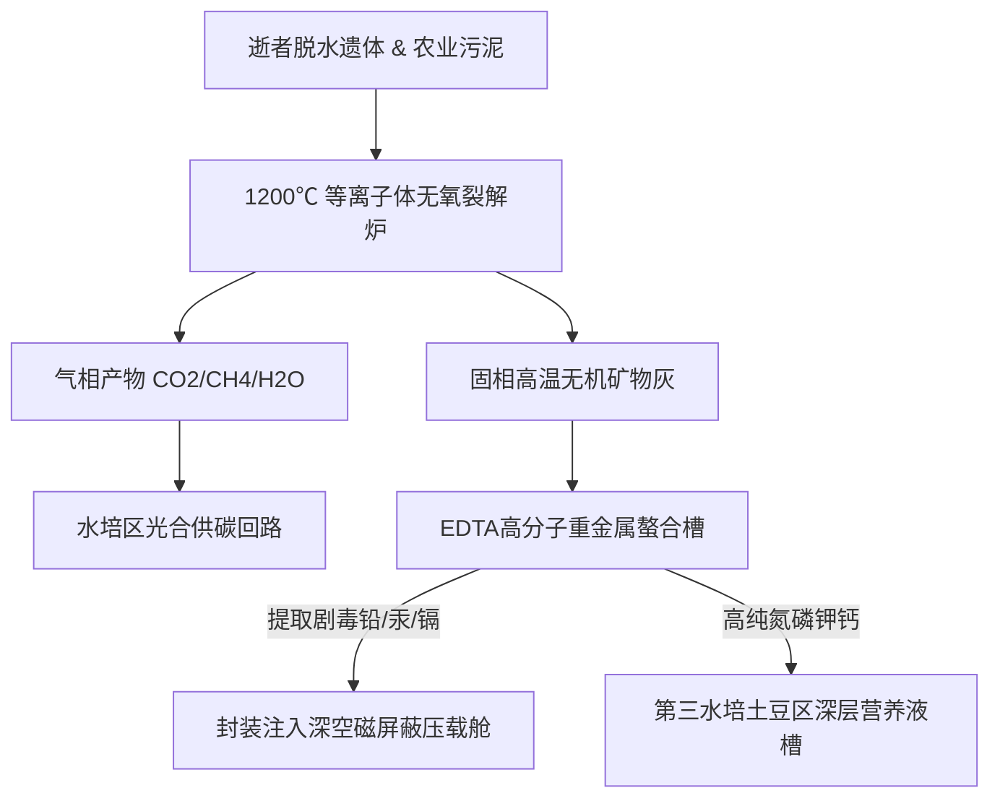

# ARK-01农业环区第七号有机物热解碳化与重金属螯合回收反应堆第340周期运行工单

**工单编号**：ARK-ECO-2192-WO-0340  
**作业工区**：第二旋转居住环外缘 · 农业与生化闭环第七号物料裂解下沉区（重力环境：$0.65g$）  
**反应堆型号**：等离子体高温气化与重金属磁流体螯合再造机组（代号：「归墟-07」）  
**作业班组**：农业环控循环三班（值班长：第二代船生技术员 孙建国）  
**本批物料性质**：日常农业秸秆残渣、生活污水生物污泥及 **第 42 航行年第 11 批次自然逝世乘员遗体降解残质**（共计 14 具遗体，经家属告别与低温脱水预处理完成）  

---

## 一、物料平衡输入与热解工艺参数

### 1. 入料质量称重
- **生活有机质及农业废料**：$14,280 \\text{ kg}$
- **脱水遗体骨肉干重**：$364.5 \\text{ kg}$（平均每具遗体干重 $26.04 \\text{ kg}$）
- **入料总固体负荷**：$14,644.5 \\text{ kg}$

### 2. 热解反应工况
- **等离子体炬主反应温区**：$1,250^\\circ\\text{C} \\pm 25^\\circ\\text{C}$（无氧超高压等离子弧）
- **气化裂解停留时间**：$4.2 \\text{ s}$
- **裂解气组分分析**：$\\text{CO} \\; 42.1\\%, \\; \\text{H}_2 \\; 38.4\\%, \\; \\text{CH}_4 \\; 11.2\\%, \\; \\text{N}_2 \\; 7.8\\%$（全量导入 4 号储气罐经催化转化为纯净 $\\text{CO}_2$ 注入水培区）。

---

## 二、无机矿物重金属分离与营养元素回收台账

为防止历代积累之重金属（汞、铅、砷、补牙填充物合金等）在封闭生态链中富集毒害蔬菜，所有高温残灰必须经三级螯合沉淀：

| 元素分类 | 理论输入量 (kg) | 实际回收提纯量 (kg) | 回收转化率 | 最终流向与配料去向 | 质检签名 |
|:---|:---:|:---:|:---:|:---|:---:|
| **高纯磷 (P 作为 $P_2O_5$)** | $142.8$ | $142.6$ | 99.86% | 调配为第三水培农区浓缩叶面肥 | 李燕（签） |
| **活性钾 (K 作为 $K_2O$)** | $286.4$ | $285.9$ | 99.82% | 注入甘薯与块茎类无土基质栽培槽 | 李燕（签） |
| **可溶性有效氮 (N)** | $412.0$ | $411.2$ | 99.81% | 合成硝酸铵水溶液补充螺旋藻池 | 李燕（签） |
| **骨骼钙质 (Ca)** | $188.5$ | $188.1$ | 99.79% | 超微粉碎后作为第四幼儿配方营养强化剂 | 孙建国（签） |
| **重金属毒物 (Pb/Hg/Cd)** | $0.428$ | $0.427$ | 99.76% | **螯合固化为高密度玻璃体，封存入船壳防辐射屏蔽层** | 孙建国（签） |

---

## 三、值班长巡检注记与伦理备忘

> 昨晚送进来的名单里有 02 区小学的退休数学老师陆奶奶，当年也是教过我画投影几何的。
> 
> 按照飞船《封闭物料守恒律》，经过 1200 度等离子弧烧过，没有名字，也没有魂灵，全变成了 18 公斤磷酸氢二钾和一罐白花花的碳酸钙。我亲手把分离出来的重金属铅块压成了防护铅砖，把钙粉筛细了送去 4 号农业水培舱。下周这批甘薯秧子抽了芽，喂饱的是第三代刚断奶的孩子。
> 
> 在这艘船上，活着是干活，死了是肥料。谁也不欠宇宙一克东西，谁也别想带走一克分子。这就是深空的硬道理。

---

**反应堆主操技师**：李燕（签字）  
**农业生态区值班长**：孙建国（签字）  
**船载生命支持司令部签批**：确认第 340 周期物料平衡闭环率达 $99.988\\%$，准予归档。
