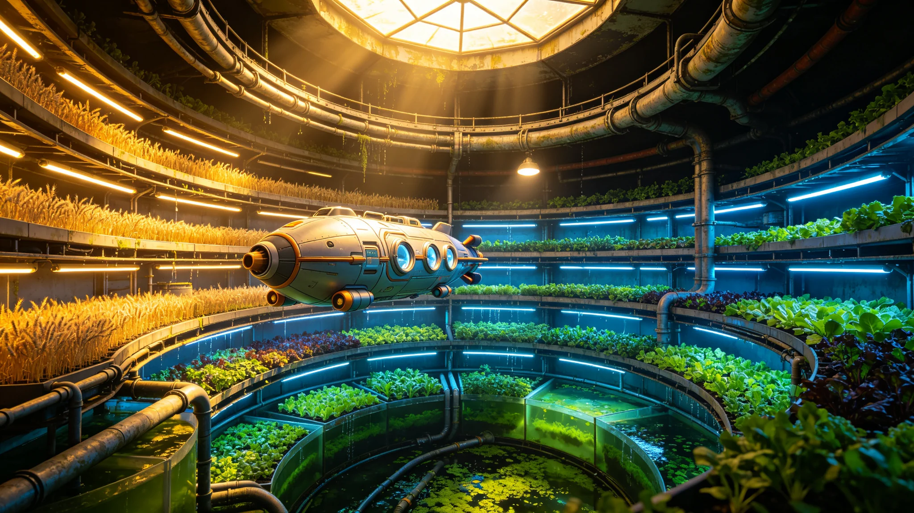

# ARK-01农业环第三轮作物基因漂移监测公报与种子库种质更新清册

**船政总署 · 生态环控处 · 农业科**
**文件编号：** 船政生字〔2168〕第011号
**监测周期：** 2163年1月—2167年12月（第三轮，共五年）
**监测范围：** 农业环A、B、C三区全部栽培单元及种子库

---

## 一、监测背景与方法

ARK-01农业环承载全船12,000余人的主粮与蔬菜供给，栽培作物共47种（含主粮6种、蔬菜28种、经济作物13种）。封闭环境下，作物种群规模有限、传粉媒介单一（主要为人工辅助授粉及受控蜂箱），基因漂移风险显著高于地球开放农田。

根据《农业环种质监测规程》（船政生字〔2152〕第003号），每五年开展一轮全作物基因漂移监测。本轮为第三轮，采用SNP芯片基因分型（每作物选取384—1,536个位点）与表型性状田间调查并行。采样覆盖全部栽培单元，每品种采样量不少于种群个体数的5%。

## 二、主粮作物基因漂移监测结果

### 2.1 小麦（栽培品种：船选-3号）

| 监测位点 | 2158年等位基因频率 | 2163年 | 2167年 | 五年漂移幅度 |
|---|---|---|---|---|
| Glu-D1（高分子量麦谷蛋白） | 0.87 | 0.84 | 0.81 | -0.06 |
| Ppd-D1（光周期响应） | 0.72 | 0.75 | 0.78 | +0.06 |
| Rht-B1（矮秆基因） | 0.91 | 0.90 | 0.88 | -0.03 |
| Vrn-A1（春化需求） | 0.65 | 0.63 | 0.60 | -0.05 |

小麦种群有效群体大小（Ne）经测算为342，低于设计阈值500。Ppd-D1位点频率上升与农业环恒定光周期环境下选择压力一致——光周期不敏感型个体在人工光照条件下结实率更高。

### 2.2 水稻（栽培品种：船粳-2号）

| 监测位点 | 2158年 | 2163年 | 2167年 | 五年漂移幅度 |
|---|---|---|---|---|
| SD1（半矮秆） | 0.94 | 0.93 | 0.92 | -0.02 |
| Wx（糯性） | 0.38 | 0.40 | 0.42 | +0.04 |
| Hd1（抽穗期） | 0.71 | 0.69 | 0.66 | -0.05 |

水稻Wx位点频率上升趋势值得关注。栽培环境下水温恒定（26±1℃），糯性等位基因在低振幅温度环境中胚乳发育优势尚不明确，需下一轮继续追踪。

### 2.3 大豆（栽培品种：船豆-1号）

大豆为本轮漂移幅度最大的主粮作物。Dt1（无限结荚习性）位点频率从2158年的0.58降至2167年的0.49，五年降幅0.09。农业环栽培架层高有限（1.2米），有限结荚型个体更适应密植环境，选择方向明确。

## 三、蔬菜作物漂移概况

28种蔬菜中，17种未检出显著漂移（等位基因频率变动<0.02），9种出现轻度漂移（0.02—0.05），2种出现中度漂移（>0.05）：

| 作物 | 显著漂移位点 | 漂移方向 | 可能选择压力 |
|---|---|---|---|
| 番茄（船番-2号） | fw2.2（果重） | 频率+0.07 | 小果型在水培密植中抗病性更好 |
| 生菜（船生-1号） | LsKN1（叶形） | 频率+0.06 | 散叶型在LED近距离光照下灼伤率低 |

## 四、遗传多样性变化

| 指标 | 2158年 | 2163年 | 2167年 | 变动趋势 |
|---|---|---|---|---|
| 小麦期望杂合度（He） | 0.342 | 0.331 | 0.318 | 缓慢下降 |
| 水稻He | 0.298 | 0.291 | 0.285 | 缓慢下降 |
| 大豆He | 0.367 | 0.351 | 0.334 | 下降较快 |
| 番茄He | 0.312 | 0.305 | 0.297 | 缓慢下降 |

全作物平均期望杂合度较2158年下降4.1%。遗传多样性流失速率在设计预期范围内（设计阈值为每五年≤5%），但大豆已接近警戒线。

## 五、种子库种质更新清册

种子库位于B环5层低温贮藏室，温度-18℃，相对湿度15%，保存全部47种作物的基础种源。本轮监测后，以下品种需进行种质更新（即从栽培种群中重新采种、检测、入库，替换老化或漂移超标的库存种子）：

| 序号 | 作物 | 品种 | 更新原因 | 入库种子量（kg） | 发芽率检测 |
|---|---|---|---|---|---|
| 001 | 小麦 | 船选-3号 | 库存种子贮藏超10年，发芽率降至89% | 12.5 | 94.2% |
| 002 | 水稻 | 船粳-2号 | 库存种子贮藏超10年 | 8.3 | 96.1% |
| 003 | 大豆 | 船豆-1号 | 遗传多样性下降较快，需补充新种质 | 6.7 | 91.8% |
| 004 | 番茄 | 船番-2号 | 果重位点漂移显著 | 2.1 | 93.5% |
| 005 | 生菜 | 船生-1号 | 叶形位点漂移显著 | 1.4 | 95.0% |
| 006 | 玉米 | 船玉-1号 | 库存种子贮藏超10年 | 9.8 | 92.7% |
| 007 | 马铃薯 | 船薯-2号 | 脱毒苗更新（组培苗继代） | 组培苗240株 | — |
| 008 | 辣椒 | 船椒-1号 | 库存种子贮藏超8年 | 1.8 | 94.6% |

### 5.1 种质更新操作规程

1. 从栽培种群中按单株选择法采集目标品种种子，每品种不少于200个单株。
2. 种子经干燥（含水量降至6%以下）、清选、活力检测后，分装于铝箔复合袋，每袋50g。
3. 每袋附基因条码标签，记录采样单元、采样日期、检测结果。
4. 入库前进行检疫，排除种子带菌（重点检测镰刀菌、灰霉菌）。
5. 旧库存种子移出低温库，转入"历史种质档案区"单独保存，不销毁。

## 六、风险评估与建议

1. **大豆遗传多样性预警。** 大豆He下降速率超过其他主粮，建议下一轮监测前开展一次大豆种内杂交复壮，从种子库历史种质中选取遗传距离较远的株系与栽培种群杂交，引入新等位基因。
2. **传粉媒介管理。** 当前受控蜂箱种群规模偏小（8箱，约4万只），可能加剧遗传漂变。建议在2169年扩繁至12箱。
3. **长期种质安全。** 种子库当前仅一份主库存，建议在C环增设备份库，实行双库异地（异舱）保存制度。
4. **表型追踪。** 对小麦Ppd-D1、番茄fw2.2等已检出方向性选择的位点，应建立表型—基因型关联追踪档案，评估农艺性状变化是否影响产量与品质。

**编制：** 生态环控处农业科 高级农艺师 陈穗兰
**审核：** 生态环控处 处长 赵稼祥
**签发日期：** 2168年2月14日
