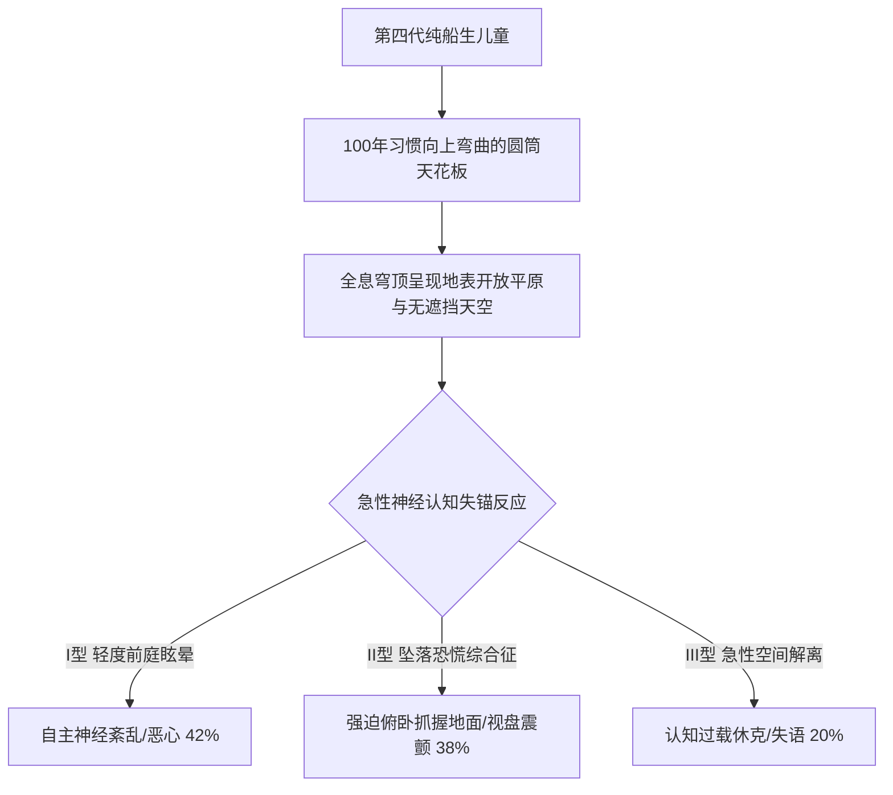

# ARK-01医务部关于第四代船生儿「重力凹陷幻觉」与地表开放空间模拟耐受性评估通报

**通报文号**：ARK-MED-2298-PSY-014  
**签发单位**：ARK-01 船载医务部神经发育与空间医学研究组  
**受试群体**：第四代纯船生健康儿童（年龄组：8 — 12 周岁，样本量：$N = 120$）  
**实验环境**：第三中央全息模拟穹顶（长 $60 \\,\\text{m}$，净高 $22 \\,\\text{m}$，配置视网膜级开放环境全景投影与可变离心重力平台）  
**测试目的**：评估长期处于圆筒内凹视野的后代在面对行星地表“开放天空与外凸地平线”时的前庭反应、视皮层电位与心理崩溃阈值，为未来五十年后的目的地着陆适应训练提供医学基线。  

---

## 一、病理机制与临床症状分型

第四代船生儿自出生起即生活在半径 $2.5 \\,\\text{km}$ 的旋转居住环内。其视觉系统的深度感知锚定于“**头顶上方永远是相对侧的金属舱壁与纵横管道**”（内凹视野），大脑神经元已固化了“向上看必定有实体阻挡”的先验模型。

当全息系统模拟地球或比邻星 b 广袤平原（地平线向下弯曲沉没、头顶为无限远之蓝色/紫色无边界高空）时，受试儿童出现普遍的**认知失锚与灾难性空间错觉**：

### 1. 「重力倒悬坠落幻觉」（Gravitational Inversion Panic）
受试者大脑无法理解“头顶无天花板”，视皮层将无限高的天空错误解释为“万丈深渊”，产生自己正在向无尽高空加速坠落的极其强烈的错觉。82.5%（99/120）的受试儿童在全息天空点亮瞬间，出现尖叫并本能地双膝跪地、十指死死抠住甲板防滑槽。

### 2. 生理监测指征异常
- **自主神经危象**：心率在投影启动后 15 秒内平均跃升至 $164 \\pm 18 \\; \\text{bpm}$，外周血管剧烈收缩导致指端血氧仪脉波幅度骤降 45%。
- **前庭眼震电图（ENG）**：垂直方向出现高频不规则痉挛性眼震，表明耳石器重力感知与视皮层空间重构发生严重信号冲突（神经失匹配率达 94.2%）。

---

## 二、测试统计数据与分类汇总

| 观察组别 | 年龄分布 | 测试场景（投影时长 10 min） | 强迫抓地发生率 | 惊恐发作与呕吐率 | 脑电 $\\theta$ 焦虑波占比 | 临床处置建议 |
|:---:|:---:|:---|:---:|:---:|:---:|:---|
| A 组 | 8—9 岁 | 地球温带草原（蓝天白云，无遮挡） | 90.0% (36/40) | 65.0% (26/40) | 78.4% (极高) | 立即终止，注射地西泮镇静 |
| B 组 | 10—11 岁 | 比邻星 b 晨昏峡谷（低矮红云，两侧有崖壁） | 57.5% (23/40) | 32.5% (13/40) | 52.1% (中高) | 增加虚拟格栅作为过渡支架 |
| C 组 (对照) | 11—12 岁 | **渐进式透光穹顶**（先保留 30% 虚拟钢桁架，逐步调淡） | **17.5% (7/40)** | **5.0% (2/40)** | **28.6% (可控)** | **推荐作为标准脱敏教具方案** |

---

## 三、医学组结论与代际启蒙指令

1. **严禁激进暴露**：在飞船抵达目的地前，全船基础教育课程严禁直接向未成年人展示无支撑的全景开阔天空视频；所有涉及地表风貌的教学必须强制在画面中叠加“**虚拟安全格栅**”（Safety Grids）。
2. **设立「阶梯式重力与视界脱敏舱」**：自下学期起，第三学校须将“低矮天花板—透明拱顶—开阔荒原”三级视界脱敏纳入五年级体育与神经发育必修考核。
3. **警惕代际异化**：医学组郑重指出，第四代人类在解剖学与神经反射上已成为纯粹的“圆筒生物”。未来的落地拓荒决不是田园牧歌式的回家，而是一场极其痛苦的神经重塑与肉体重建。

---

**首席神经医学专家**：江素梅 主任医师（签字）  
**船载教育部联席签署**：督学 郭怀仁（签章）  
**抄送**：ARK-01 舰桥指挥委员会、第一至第四综合学校教导处
