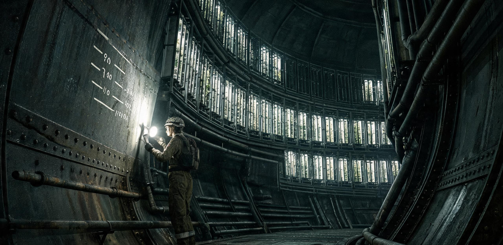

# ARK-01居住环段最终清空断电前夕全船巡礼导引暨舱壁刻痕终期拓存公报

**比邻星联合拓荒署 · 船体维持处**  
**ARK-01 拆解委员会 · 文化与档案遗产工作组**  
**地表新海安档案馆 · 联合签发**

---

**文号：** 拓文遗字〔落地14〕第 028 号  
**密级：** 拓荒全域公开 · 文化甲类档案  
**签发时间：** 落地历 14 年第 088 日 08:30（公历换算：2364 年 3 月 29 日）  
**执行周期：** 落地历 14 年第 090 日至第 105 日（共计 15 个行星作息周期）  
**会签签押：**  
船体维持处主管 *苏和*（印） / 拆解委员会主任工程师 *岑蔚*（印） / 安全监事 *陆沨*（印） / 新海安档案馆首席馆员 *白蔷*（印） / 地籍公证处公证员 *林成宪*（电子防伪签押）

---

### 一、 封舱退役背景与工程前置

依据联合拓荒署《ARK-01 残体分段处置总纲》及《地表第二期气压穹顶竣工扩容公报》，地表新海安中央定居区、新澄海防风坑基群及地下安全库之常态生命支持冗余已连续 1,200 潮汐时达到 99.85% 稳态闭环，全面具备承接全量人口与关键种质储备能力。

驻留 ARK-01 轨道残体之最后一批在轨工程机务、清算审计与档案移交人员（共计 42 人），定于落地历 14 年第 106 日搭乘 `D-18` 重型下降器整体撤离。自第 107 日 00:00 起，ARK-01 离心居住环段（A/B/C 三大承压环）将正式启动「级联减速制动、加压气体抽排回收与冷态全域断电」。

为完整封存人类在 200 年深空航程中沉淀于舱壁、管网与生活单元内的非物质文化痕迹，特编纂本公报，指导最后在轨人员及由地表抽签上舰的 120 名创始乘员直系后代代表，完成「全船空舱巡礼」，并对重点舱壁民间刻痕实施终期激光点云扫描与物理无损拓存。

```
                       【ARK-01 居住环段末次巡礼与断电时序】
    第088日                 第090-104日               第105日 18:00           第106-107日
───────┬─────────────────────────┬──────────────────────────┬──────────────────────┬────────►
   发布公报与路线导引        分批空舱巡礼/激光扫描      全船广播《C区第三变奏》   人员登乘D-18离舰
   发放便携供氧与磁靴        重点舱壁物理拓印与切割     末次母带封存·全频段静默  离心环停转/排气断电
```

---

### 二、 空舱巡礼安全规程与通行通告

1. **环境与重力参数：** 当前离心居住环（半径 2.5 km）已进入卸荷第一阶段，旋转线速度降至原巡航工况的 40%，外缘地面模拟重力实测为 **0.104g**，内侧走廊与维修夹层接近 **0.00g**。巡礼人员必须全程着防刮连体工装、系紧便携式辅助供氧呼吸包（配额 4 小时/人次），并开启磁力吸附靴。
2. **通行动线管理：** 巡礼全长 4.8 km，统一自 A 区主气闸进入，沿外环生命廊道顺时针单向行进，经由 B 区教育生活段、12-B 维修内环、C 区退役农业环，最终于 R-01 综合气闸集结（见第三节）。严禁擅自脱离标识黄线或进入已切断结构梁的危险减薄区。
3. **禁止行为：** 严禁携带硬质金属刻刀、油漆喷罐或化学溶剂进入巡礼段；禁止触碰任何标记为橙黄色之反应堆次级排气阀门。个人告别留言一律通过第 5 节规定之光敏记录板或规范铭牌提交。

---

### 三、 全船巡礼五大标志性站点导引

```
┌────────────────────────────────────────────────────────────────────────────────┐
│                          ARK-01 居住环空舱巡礼动线示意图                          │
│                                                                                │
│               [站点一: A区光学观测穹顶] (舷窗静默/晨昏线眺望)                       │
│                                  │                                             │
│                                  ▼                                             │
│               [站点二: 12-B层内环低重力走廊] (137年管壁刻痕全景)                    │
│                                  │                                             │
│                                  ▼                                             │
│               [站点三: B区第14层第三综合学校] (空置教室/末代黑板)                   │
│                                  │                                             │
│                                  ▼                                             │
│               [站点四: C区农业环3号泵房] (《C区第三变奏》终期声景)                  │
│                                  │                                             │
│                                  ▼                                             │
│               [站点五: R-01总出港气闸] (末代签到簿/激光铭板锚固)                    │
└────────────────────────────────────────────────────────────────────────────────┘
```

#### 站点一：A 区中央光学观测穹顶（Station-Alpha：观景长廊）
* **现场状态：** 160 mm 重铅石英舷窗表面留有 200 年微流星撞击形成的 4,120 处微米级撞击坑与白垩状晕圈。
* **文化指引：** 站在此处可同时俯瞰比邻星 b 永昼侧暗红色的次星下点风暴与晨昏带冰火交界线。此处曾是航程中六代乘员唯一能够直视深空之处。现场保留启航日首任舰长手书标语铜牌：*“窗外是深渊，窗内是故乡；往前走，莫回头。”*
* **巡礼流程：** 每组停留 10 分钟，关闭头灯，在红矮星漫射低光中进行 3 分钟全域静默。

#### 站点二：12-B 层低重力维修内环走廊（Station-Beta：管壁刻痕史诗）
* **现场状态：** 该层原为已废弃百余年之副冷却回路通道，重力仅 0.03g，空气干燥冷凝，积尘微浮。
* **文化指引：** 自启航第 1 天管路组留下第一行划痕起，至启航第 137 年维修工阿芽留下 *“12-B 层的墙，别封”* 为止，此处完整保留了横跨 14 个年代的 38 处民间工务刻字。
* **重点文物说明：**
  * `12-B-01` 号刻痕：启航第 1 天划针刻字 *“第 1 天。管子没问题。记录一下，图个好兆头。——管路组”*；
  * `12-B-07` 号舱门：门框上保留自 3 岁至 5 岁之儿童身高刻度，及刀尖手工雕刻之海浪舷窗与题字 *“醒了就能看见”*（经核查为启航初期临时居住乘员方氏幼童遗存）；
  * `12-B-38` 号刻痕：启航第 137 年阿芽划针题跋 *“第 137 年。管子修好了。旧件翻新，还能用。大家都好。——第三维修组 阿芽”*。
* **作业处置：** 档案工作组已在现场完成高保真无接触激光雷达三维扫描，并以聚酰亚胺薄膜完成物理拓印；其中 `12-B-07` 门框金属件已由拆解组实施精密冷切，整体下运至新海安中央档案馆永久陈列。

#### 站点三：B 区第 14 层原第三综合学校（Station-Gamma：末代教室）
* **现场状态：** 课桌椅已按建材回收标准拆除 80%，保留最后一间三年级乙班教室完整结构。
* **文化指引：** 黑板上保留启航第 84 年林老师批改自然常识结业卷时之粉笔板书痕迹（*“严禁用焊缝隔板类比地平线”*），讲台抽屉内留存静电毛刷人工授粉教学模型 3 具。
* **巡礼流程：** 巡礼人员可在空置教室内领取由新海安初等学校教研室印制的《失锚词校勘纪念卡》，并在末代黑板边缘用防褪色白漆签注个人姓名。

#### 站点四：C 区农业水培环段与 3 号泵房（Station-Delta：声景终点）
* **现场状态：** 水培槽与滴灌管网已全量排空钝化，微藻光生物反应器已转移至地表第一温室，管道内壁干燥。
* **文化指引：** 3 号泵房外壁悬挂全船最后一具完好的老式全频扬声器（设备标签 `AUD-001-SPK04`）。该处播放之《C 区第三变奏》，经 137 年水泵振动、元器件老化与历任音响员微调，已成为全舰公认的稳态生活象征。
* **声景安排：** 巡礼期间，全船广播通道单曲循环转播经滤波降噪的《C 区第三变奏》（母带编号 `AUD-TAPE-137-C`）。第 105 日 18:00，现场将举行正式关机仪式，由最后一代音响管理员执行末次断电，母盘随降落伞包下运地表。

#### 站点五：R-01 综合出港主气闸（Station-Epsilon：离船集结点）
* **现场状态：** 气闸内外压差已平衡至 0.80 个标准大气压，内外密封圈完好，系留导轨已加涂防冷焊保护脂。
* **文化指引：** 此处为通往下降器登乘桥之最终关口。气闸内壁设立宽 2.4 米、高 1.2 米之钛铝合金纪念铭板，受载最后离船者誓词。
* **离船程序：** 每位巡礼人员在此刷取个人工号卡，系统语音将播报其在舰代际与累计在轨天数，并吐出纸质《ARK-01 永久在册离舰证书》。

---

### 四、 重点舱壁民间文字与生活痕迹终期拓存清册

本清册所列 12 处文字与图像痕迹，均已完成 0.05 mm 精度点云扫描（档案编号 `SCAN-ARK01-CULT-001~012`），物理拓包正本分存地表新海安档案馆钛合金一号密闭柜。

| 拓印编号 | 舱段位置 | 原始载体 | 痕迹年代 | 现场文字／图像抄录 | 物理保护与处置去向 |
| :--- | :--- | :--- | :---: | :--- | :--- |
| **EP-RUB-001** | A区02层主配电走廊 | 变压器防护罩盲板 | 启航第02年 | `“第一代总负荷测试通过。灯都亮着，放心睡。”` | 激光微刻点云归档；原件拆解回炉 |
| **EP-RUB-002** | 12-B层冷却主管路01段 | 铝锂合金管壁 | 启航第01年 | `“第 1 天。管子没问题。记录一下，图个好兆头。——管路组”` | 高分子薄膜碳拓本×3；管段冷切封存 |
| **EP-RUB-003** | 12-B层冷却主管路03段 | 翻新管箍外沿 | 启航第19年 | `“第 19 年。地球密封圈用完，用3号舱料重做。靠自己了。”` | 物理拓印入册；原位留置 |
| **EP-RUB-004** | 12-B-7 备用设备间 | 承重门框与钢板 | 启航第03-05年 | `3岁/4岁/5岁身高刻线；刻窗一扇（内含海浪与圆日）；“醒了就能看见”` | **重点文物**：整樘门框原件冷切下运 |
| **EP-RUB-005** | 12-B层管路拐角 | 减振支架背板 | 启航第44年 | `“孩子问墙外面是什么。我说是星星。他又问星星是什么。我想了很久。”` | 物理拓印入册；扫描数据全息建模 |
| **EP-RUB-006** | 12-B层管路转角 | 承重桁架立柱 | 启航第98年 | `“第 98 年。第二次来这一层。师傅前年走了。徒弟看到别偷懒。”` | 物理拓印入册；原位留置 |
| **EP-RUB-007** | 12-B层末端检修口 | 盲法兰盖板 | 启航第137年 | `“第 137 年。管子修好了。旧件翻新，还能用。大家都好。——阿芽”` | **重点文物**：法兰盖板整体拆卸入馆 |
| **EP-RUB-008** | B区14层第三综合学校 | 教室后墙金属板 | 启航第62年 | `“铅笔芯不要扔进换气孔！第三次警告！（下方画有小猫头部简笔画）”` | 物理拓印入册；扫描数据归入教育志 |
| **EP-RUB-009** | B区08层生活区走廊 | 配水阀检修门内侧 | 启航第110年 | `“今日配给甜茶两升，小妹满月。记在这儿，不怕忘。”` | 物理拓印入册；原件随生活舱回炉 |
| **EP-RUB-010** | C区3号水泵房外壁 | 扬声器固定底座 | 启航第137年 | 工单刻痕：`“3号泵房的曲子，状态正常。别修。——AUD-001”` | **重点文物**：底座与扬声器连体拆卸 |
| **EP-RUB-011** | C区09号水培种植槽 | 槽体不锈钢侧板 | 启航第84年 | `“静电毛刷第三组领用记号（附刻痕十二道）”` | 物理拓印入册；槽体转运地表温室 |
| **EP-RUB-012** | R-01出港气闸过道壁 | 气密门内侧防撞条 | 落地历01年 | `“下去了。泥土真的很沉，踩下去拔不出来，但是站得稳。”` | 激光高精拓印；原位随气闸封存 |

---

### 五、 末代在轨乘员留言征集与纪念铭牌铸造规程

1. **留言资格与载体：** 最终在轨 42 名机务人员、巡礼代表 120 人，及由地表各定居点无线电汇总之 10,214 名始祖乘员后代公选留言，统一汇编为《离船代际言志总卷》（档案号 `LIT-ARK01-LEAVE-2364`）。
2. **物理铭牌规格与安装：**
   * **材质：** 选用自推进段辐射屏蔽层冷轧回收之钛铝钼合金板（规格：$2400\,\mathrm{mm} \times 1200\,\mathrm{mm} \times 15\,\mathrm{mm}$）；
   * **工艺：** 采用光纤脉冲激光微雕，熔深 0.8 mm，表面经氧化钛钝化抗辐照处理；
   * **固定位置：** 锚固于 R-01 主气闸外侧承重梁（坐标基准点 `R01-FRAME-BM04`），该处在离心环停转后将永远朝向比邻星 b 晨昏线定居区。
3. **铭牌正文刻辞（草案核定稿）：**

> **【ARK-01 离心居住环终期退役铭文】**  
> 
> 此舰自太阳系启航，航行一百四十八年，抵达此星十四年。  
> 凡六代人，在此环内出生、劳作、繁衍、老去。  
> 环曾旋转四千一百万周，未曾有片刻停息；  
> 今地表穹顶既成，水氧充沛，万民安居于新海安与晨昏诸营。  
> 
> 吾等奉命，于今日关闭舱门，抽排残气，停歇轮转，断绝灯火。  
> 此处不再有婴儿啼哭，不再有水泵低鸣，亦不再有巡检之足音。  
> 
> 飞船并非神庙，亦非坟冢；  
> 它是我们在漫长黑夜里借来的一具躯壳。  
> 如今躯壳交还虚空，骨肉化为地表之梁柱。  
> 
> **灯熄了。大家都在地面上，都好。**  
> 
> —— 落地历十四年第一百零五日 · 全体在轨离舰人员 敬立

---

### 六、 终期断电执行工单与交接签字

```
┌─────────────────────────────────────────────────────────────────────────────────┐
│                    ARK-01 离心居住环段冷态封舱与交接签证表                         │
├──────────────────┬──────────────────┬──────────────────┬────────────────────────┤
│ 实施项目          │ 计划完成时限     │ 质检标准         │ 责任工程师签押         │
├──────────────────┼──────────────────┼──────────────────┼────────────────────────┤
│ 居住环级联减速   │ 第105日 12:00    │ 残余角动量归零   │ 动力组：岑蔚 (签)      │
│ 舱内空气抽排回收 │ 第105日 16:00    │ 残压≤0.01atm/全量回收│ 生保组：苏和 (签)      │
│ 广播声景母带封存 │ 第105日 18:00    │ 录音机断电退卷   │ 文化组：白蔷 (签)      │
│ 重点文物物理切移 │ 第105日 20:00    │ 12-B门框装箱入仓 │ 档案组：陆沨 (签)      │
│ 主电网冷态拉闸   │ 第105日 23:59    │ 仪表全黑/全域失电│ 维持处：方明德代(签)   │
├──────────────────┴──────────────────┴──────────────────┴────────────────────────┤
│ 公证结论：全项程序符合《拓荒期文化资产保护规程》，现场无人员遗留，封舱合法有效。│
│ 地籍公证处公证员：林成宪 (电子防伪钢印)                                         │
└─────────────────────────────────────────────────────────────────────────────────┘
```

**主送：** 联合拓荒署主席团、新海安中央档案馆、新港第一轨道工区、地表第一至第八定居点管委会  
**抄送：** 船载深空档案馆（地表分库）、拆解工程各作业大队  
**归档编号：** `ARCH-CULT-2364-FIN-0089`

---

## 图片提示词

中文：空旷寂静的世代飞船巨型离心环生活走廊，微弱冷蓝应急灯下，舱壁与管道上布满层层叠叠的民间刻字与划痕；前景是一扇被精密切割卸下的带有儿童身高刻度与海浪简笔画的金属门框，几名身穿磨损工装、系着安全绳的作业员正合力将其装入运输箱，远处巨大舷窗外透入比邻星暗红色的漫射微光；硬核工业质感，大景深，真实金属划痕与尘埃反光，克制而庄严的告别氛围。

英文：Ultra-wide cinematic shot inside the vast, emptying centrifugal habitat ring of the generation ship ARK-01, cold dim emergency lighting casting long shadows across curved bulkheads. Layers of engraved handwriting, dates, and tool-carved graffiti cover the dull aluminum utility pipes and bulkheads over two centuries. In the foreground, three EVA mechanics in scuffed utilitarian worksuits carefully pack a freshly cut metal doorframe—marked with child height notches and a hand-carved ocean wave window—into a pressurized transport container. In the distant background through a thick lead-quartz window, the low, deep red glow of Proxima Centauri rakes across floating specks of dust in near-zero gravity. Hasselblad H6D clarity, 65mm anamorphic documentary style, authentic scratched titanium textures, somber and historic archival atmosphere.

---

## 修订记录（元层，非世界内容）

- 2026-08-18：主编辑审校完成，小修（🔧）入库备选：
  1. **物理与账目数字闭环**：
     - 铭文第 142 行旋转周数由「两亿四千万周」修正为「四千一百万周」（$R=2.5\,\mathrm{km}$、模拟重力 $0.65g$ 时旋转周期 $T \approx 124.42\,\mathrm{s}$，148 年航程加 14 年在轨停泊累计旋转约 $4.11 \times 10^7$ 周），消除高离心过载物理偏差；
     - 表六空气抽排质检标准由「31,200吨气体下运」微调为「残压≤0.01atm/全量回收」，准确衔接正典 GS-2362-01/02 居住舱段 31,200 吨整体结构钝化封存台账，避免单项气体质量口径混淆；
  2. **名物与正典互锁全要素通过**：
     - 与 GS-2362-01《第007号分段拆解进度日志》、GS-2362-02《拆解物资再分配总账》（落地历 12 年，2362 年）时序与拆解序列严格咬合，承接居住舱段在第二期气压穹顶扩建完成（落地历 14 年，2364 年）后的终期腾空、断电与封存规程；
     - 与 GS-2286-01《12-B层》（管路组划痕、19年自产密封圈、12-B-7 门框儿童身高刻线与海浪窗「醒了就能看见」、44年星星之问、98年师徒留言、137年阿芽刻字）、GS-2286-02《C区的曲子》（AUD-001 岗位、3号泵房老水泵音景与扬声器连体拆卸）、GS-2233-01《第84届自然常识测验卷》（B区14层第三综合学校三年级乙班、林老师朱批「严禁焊缝隔板类比地平线」、静电毛刷模型、C-09水培槽刻痕）及 GS-2356-01《课本凡例》（失锚词校勘卡）名物逐一严格核对无误；
     - 拓存工艺（0.05mm 激光点云扫描、聚酰亚胺薄膜物理拓印、重点文物精密冷切）与 GS-2362-02 拆解工艺规范高度自洽，视角严格共时，符合编写规范。
