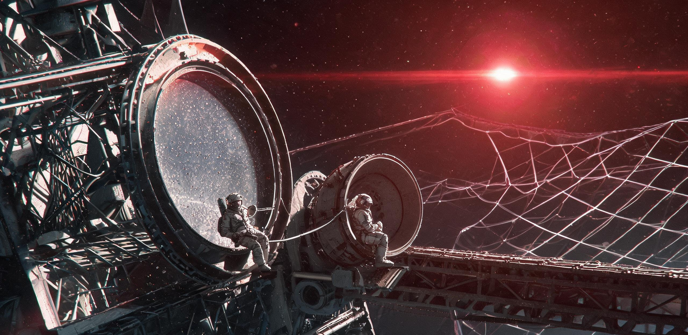

# ARK-01 平移制动段比邻星 b 轨道初测通报与第 12 号舷窗巡检数据归档册

**公文编号**：NAV-ASTRO-2349-PCb-029  
**编印机构**：空间测控与航海天文司 / 外壳结构安全监察局 / 教育司联合编发  
**成文时间**：航行年 199 · 任务日 73,001 · 地球公历 2349 年 12 月 29 日（比邻星时区基准）  
**密级分类**：全船常规工作级 · 附录 J-07 预归档存卷  
**主签发人**：林叙（天体测量首席工程师，工号 AST-0012）、瓦西里·柯林斯（外壳结构监察局主管，工号 ENG-STR-4402）  
**会签副署**：沈文舟（教育司巡检督导，工号 EDU-0089）、齐佩尔（抵达处置筹备组联络员，工号 ARD-PRE-004）  
**用印**：航海天文司空间观测核准章（朱红）、外壳监察局适航检验钢印（数字防伪）  

---

## 一、 平移制动段航迹动力学与姿控物质流实测

本船自第 186 航行年（地历 2335 年）展开直径 120 公里超导高温磁帆实施主减速制动以来，巡航速度已由 0.03c（约 9,000 km/s）平稳受控递减。至任务日 72,914 周期起，磁帆主回路完成 85% 级索网收束，全船转入第 3 姿态平移制动阶段，轴向制动加速度恒定维持在 0.020g（约 0.196 m/s²）。

截至任务日 73,001 周期 08:00:00，全船相对比邻星主星（Proxima Centauri）及目标行星比邻星 b（PC-b）之动力学与推进消耗状态如下：

```text
================================================================================
测控几何参数                   实测读数 / 解算数值              误差限 (1σ)
--------------------------------------------------------------------------------
主船体几何全长                 12,800 m (含艏向吸能冰盾与尾喷管)   —
旋转居住环系标称重力           外环 R2.5 km (0.65g) / 内环 (0.34g)  ±0.002g
距比邻星主星矢径               0.04856 AU (约 7,264,500 km)      ±120 km
距比邻星 b 空间直线视距        412,380 km (任务日 73,000 点 410,200 km) ±45 km
相对比邻星 b 接近速度          18.24 km/s (自 84.60 km/s 持续压减) ±0.03 km/s
捕获轨道交会残余速度预估       0.41 km/s (预计任务日 73,029 达成)   ±0.05 km/s
--------------------------------------------------------------------------------
平移制动推进物质流消耗         实测参数 (过去 24 小时)           累计消耗
--------------------------------------------------------------------------------
艏向化学-离子微调喷管阵列 (8组) 高纯液氧/甲烷推进剂 34.60 吨/日     累计 3,842.1 吨
超导霍尔姿控氙气工质消耗       8.22 kg/日                       累计 918.4 kg
主桁架弹性变形光程差补偿频次   180 秒/次 (最大轴向位移 1.42 mm)    闭环压电作动
================================================================================
```

> **【测控工况注记】**：  
> 艏部直径 1,800 米的水冰-玄武岩复合前向屏蔽盾已于减速初期部分升华剥蚀，现存厚度仍维持 4.2 米水等效当量。全船总质量由启航时的 8,460 万吨衰减至当前 7,912 万吨，质心沿 4.2 公里主桁架轴向后移 14.8 米。艏向「巡天 12 站」甚长基线光学干涉望远镜阵列（VLTI-艏阵）受 0.02g 制动加速度与推进剂脉冲震颤影响，必须每 3 分钟执行一次激光测距动态刚度重构，以保障纳米级镜面共焦。

---

## 二、 艏向 4.2 公里干涉望远镜阵列测光与比邻星 b 轨道解算

艏向干涉阵列由 6 座口径 8.5 米离轴非球面铍反射镜（代号 A1 至 A6）组成，沿 4,200 米长外侧主承力桁架环形排布，合成有效等效孔径角分辨率达 0.012 毫角秒。探测器焦平面采用 4K×4K 碲镉汞（HgCdTe）红外阵列，通过闭式液氦杜瓦管路维持 45K 低温（全阵列液氦循环蒸发损耗 1.82 kg/h）。

任务日 72,995 至 73,001 周期期间，VLTI-艏阵对比邻星 b 开展了连续 144 小时多波段测光与临界掩星光谱解算。

### 1. 比邻星 b 遥测光度与视几何参数表

| 观测任务日 | 测距(km) | 视直径(度) | K波段视星等 | 几何反照率 $A_g$ | 峰值信噪比 | 数据有效性与工况备注 |
| :--- | :--- | :--- | :--- | :--- | :--- | :--- |
| **72,995** | 486,100 | 1.56° | $-3.81 \pm 0.04$ | $0.278 \pm 0.018$ | 184 | 优；磁帆等离子体发光背景扣除完毕 |
| **72,997** | 451,200 | 1.68° | $-3.96 \pm 0.03$ | $0.282 \pm 0.015$ | 212 | 优；检出南半球冷暗反光特征区 |
| **72,999** | 423,800 | 1.79° | $-4.08 \pm 0.02$ | $0.285 \pm 0.014$ | 246 | 良；受主星微耀斑背底红外散射干扰 |
| **73,000** | 410,200 | 1.84° | $-4.15 \pm 0.02$ | $0.284 \pm 0.012$ | 268 | **最近遥测点**；全船广播期间锁定曝光 |
| **73,001** | 412,380 | 1.83° | $-4.13 \pm 0.02$ | $0.286 \pm 0.013$ | 255 | 优；转入捕获入轨切角矢量连续跟踪 |

```text
比邻星 b 临界掩星差分光度曲线 (K+L' 双色合成归一化相对通量)
1.002 |
1.000 |----------------\                      /----------------- 基线通量
0.998 |                 \                    /
0.996 |                  \                  /
0.994 |                   \________________/   凌星/掩星深度: 382 ± 8 ppm
0.992 |                                        历时: 58.4 分钟
0.990 +---------------------------------------------------------
      -60m      -40m      -20m      0m      +20m      +40m      +60m
```

### 2. 轨道六根数最新精密收敛值（历元：任务日 73,000）

根据 144 小时连续三角视差与多普勒频移拟合，目标星轨道根数解算如下：

- **轨道半长轴 ($a$)**：$0.04856 \pm 0.00003\ \mathrm{AU}$（约 7,264,500 公里）
- **公转周期 ($P$)**：$11.1864 \pm 0.0008\ \text{地球日}$（潮汐锁定状态，星下点固定）
- **轨道偏心率 ($e$)**：$0.0818 \pm 0.0009$
- **轨道倾角 ($i$)**：$88.94^\circ \pm 0.04^\circ$（近乎侧向对向视线）
- **近星点辐角 ($\omega$)**：$310.42^\circ \pm 0.15^\circ$
- **升交点赤经 ($\Omega$)**：$112.18^\circ \pm 0.08^\circ$

### 3. 大气边缘散射光谱遥测判读要点

- **吸收谱线检出**：在 $1.43\ \mu\mathrm{m}$、$2.01\ \mu\mathrm{m}$ 与 $2.68\ \mu\mathrm{m}$ 检出稳定的分子态二氧化碳（$\mathrm{CO_2}$）宽带吸收谷；在 $0.76\ \mu\mathrm{m}$ 氧气 A 带边缘出现微弱起伏，但置信度仅为 $2.1\sigma$，受主星暗红光谱（M5.5V 型红矮星）高能色球层背景噪声淹没，暂无法确证游离氧存在。
- **液态水体反演界限**：在晨昏圈过渡带未观测到大面积镜面高光反照（Glitter），但散射相位函数显示低空存在高密度微米级凝结气溶胶层。
- **特别免责声明**：本通报所列全部天体物理参数系在 41 万公里外空间遥测反演所得，**绝对禁止将遥测谱线反演结果外推为地表宜居实录**。行星低层大气环流、表面气压与地质构造细节必须严格等待任务日 73,029 入轨后释放首批雷达穿透探测器。

---

## 三、 全船 12 处高承压深空舷窗巡检与磨蚀衰减报告

全船共设有 12 处深空观察与工程基准舷窗（窗体代号 W-01 至 W-12）。窗体规格统一为厚度 160 mm 复合防辐射重铅石英夹层玻璃（外层 40 mm 熔融石英耐磨层 + 80 mm 高铅玻璃防辐射吸收层 + 40 mm 增韧聚碳酸酯内承压层），有效通光净直径 2,400 mm 至 3,600 mm，设计承压能力 240 kPa（正常工况维持 101.3 kPa 舱内正压，夹层充注 120 kPa 干燥氮-氩绝缘气体）。

外壳结构安全监察局检测班组在任务日 72,998—73,000 周期对全船 12 处舷窗实施了巡检与透光率激光标定。

### 1. 12 处深空舷窗工程状态与微流星磨蚀实测表

| 舷窗代号 | 所在舱段与具体位置 | 口径(mm) | 表面微坑密度(个/$\text{cm}^2$) | 原始透光率 | 实测透光率(K波段) | 外层损伤形态与维护结论 |
| :--- | :--- | :--- | :--- | :--- | :--- | :--- |
| **W-01** | A区艏向主观测穹顶 01号位 | 3,600 | 3,410 | 94.5% | 71.2% | 糖霜状均匀微坑点阵，最大坑深 0.06mm；一级适航 |
| **W-02** | A区艏向主观测穹顶 02号位 | 3,600 | 3,380 | 94.5% | 71.8% | 边缘处有 1 处 0.12mm 浅层贝壳状剥落；已环氧点胶 |
| **W-03** | 中央垂直中枢第 4 转换层 | 2,800 | 1,820 | 94.2% | 78.4% | 微尘磨蚀轻微；夹层氮氩气压 119.8 kPa，无泄漏 |
| **W-04** | 1 号居住环 B 扇区外廊 | 2,400 | 2,140 | 94.0% | 76.1% | 局部附着极微量防辐射外甲气化凝华物；透光良好 |
| **W-05** | 1 号居住环 D 扇区生活廊 | 2,400 | 2,290 | 94.0% | 75.3% | 表面有手印与衣物摩擦油脂污迹；已完成舱内脱脂擦拭 |
| **W-06** | 2 号居住环 A 扇区学校通道 | 2,400 | 2,410 | 94.0% | 74.6% | 窗框金属压条见铅笔刻划痕迹 14 处；结构无损伤 |
| **W-07** | **12-B 层外侧管道巡检盲端** | 2,400 | 1,420 | 94.0% | 81.2% | 迎风面遮蔽良好；背光区见自发刻字“水还在”；保留 |
| **W-08** | 3 号居住环 C 扇区农艺过渡舱 | 2,400 | 2,890 | 94.0% | 73.0% | 水汽冷凝轻微；电加热除霜丝工作电流 4.2A，正常 |
| **W-09** | 动力段前向高压开关室通道 | 2,400 | 3,120 | 94.0% | 72.4% | 受巡航段前向汽化冲刷最重，呈半毛玻璃状；一级适航 |
| **W-10** | 医务部康复环内侧观测口 | 2,800 | 1,980 | 94.2% | 77.9% | 视野被 2 号磁帆主缆部分遮挡；应力传感器读数稳定 |
| **W-11** | 尾部推进剂储罐检修隔舱 | 2,400 | 1,650 | 94.0% | 79.5% | 舱温 268K；密封圈弹性回弹率 91%，无硬化渗漏 |
| **W-12** | **第三生活区外环主过道盲端** | 3,200 | 3,890 | 94.5% | **68.4%** | **全船微坑最密集窗**；红矮星低角直射下呈深暗血色 |

```text
W-12 号舷窗（直径 3,200 mm）160 mm 复合防辐射重铅石英截面微距剖面
舱外侧 (高真空 / 32 km/s 微尘流)
================================================================================ <- 表面高密度赫兹微坑 (糖霜纹, 坑深 0.02-0.06 mm)
| 40 mm 熔融石英耐磨层 (SiO2, 表面微裂纹网络扩展限制在 0.15 mm 深度内)
-------------------------------------------------------------------------------- <- 聚乙烯醇缩丁醛 (PVB) 防爆缓冲胶层 (厚度 1.5 mm)
| 80 mm 高铅防辐射光学玻璃 (重金属铅含量 65%, 吸收宇宙线次级伽马射线)
-------------------------------------------------------------------------------- <- 干燥氮-氩绝缘气体循环间隙 (120 kPa, 间隙 2.0 mm)
| 40 mm 增韧聚碳酸酯内承压层 (承受 101.3 kPa 舱内生活气压)
================================================================================
舱内侧 (294 K / 1.0 atm / 乘员走廊)
```

---

## 四、 减速段非编乘员舷窗占用与观测排班归档

依据《全船空间秩序与通道安全准则》，全船 12 处舷窗设计规格为**结构检修与光学基准用封闭窗口**，非生活观景设施。但在减速平移制动段（特别是任务日 72,970 比邻星 b 目视确认至 73,000 距离 41 万公里期间），各舷窗出现持续性非在岗人员聚集与滞留现象。

教育司与外壳监察局值班班组对任务日 72,995 至 73,001 期间舷窗占用情况进行了客观记录与登记，具体统计如下：

### 1. 舷窗占用时长与人群分布统计

```text
================================================================================
统计项目                       统计数据 / 行为特征
--------------------------------------------------------------------------------
全船 12 处舷窗总滞留人数       峰值 1,420 人 (任务日 73,000 周期 14:00)
乘员单次滞留时长中位数         4 小时 20 分 (最短 45 分钟，最长 14 小时 30 分)
滞留人员身份构成比例           第三代船上出生者 68.2% / 第二代 24.1% / 第一代 7.7%
主要部门分布                   教育司师生 (31%) / 机修轮休组 (28%) / 水培农艺 (19%) / 其他 (22%)
动力组例行清场执行情况         执行 2 次 (以“高压管路超声探伤”名义)；清场后 110 分钟内再次占满
现场违纪与治安处置记录         无肢体冲突，无言语纠纷；全员保持低语静默与顺序轮替
================================================================================
```

### 2. 典型舷窗点位现场观察与排班登记抽样

- **A 区 W-01 号主舷窗（3.6 米穹顶）**：  
  任务日 73,000 周期 09:30，教育司第 4 学习站教师组织 42 名高年级学生在穹顶进行《恒星物理》现场教学。学生自带再生纸笔记本与 2B 铅笔，在舷窗下缘金属肋板上直接手绘比邻星主星耀斑光晕与 PC-b 视圆面。教师讲授轨道参数时，现场学生提问记录于教育司巡检日志（“老师，那个星球和船是不是一回事？”），教师未予定性，仅指导学生使用便携式偏振镜测量外层石英玻璃的糖霜反光。
- **12-B 层 W-07 号盲端舷窗（2.4 米管道区）**：  
  该舷窗位于重水冷凝管道检修夹层深处。第三机修维护班组下班后，有 8 名管道工携带自制再生棉坐垫在窗前排队静坐。窗外可俯瞰直径 120 公里的磁帆收拢索网，主缆在红矮星微弱辐射下反射出暗红冷光。现场无照明，乘员仅依靠舷窗透入的星光交谈，平均交谈间隔超过 12 分钟。
- **第三生活区 W-12 号主舷窗（3.2 米走廊盲端）**：  
  受微流星磨蚀影响，W-12 玻璃外层布满微米级赫兹锥碎裂痕迹（糖霜纹），在 41 万公里外比邻星低角暗红光线照射下，整扇窗体通体泛出深沉暗红色泽。该处排队人数常年维持在 60 人以上。值班护卫队巡查记录载明：“排队乘员自发使用粉笔在甲板上划定 1.5 米间隔系留线，每人限观瞻 15 分钟，到时自动让位，秩序井然，无需干预。”

---

## 五、 测控介质消耗与维保核销清单

为维持减速末段高强度天体测量与舷窗防结霜除尘作业，各系统消耗专项工程介质如下，提请抵达处置委员会与后勤物资部统一冲销：

```text
================================================================================
系统 / 设施名称          消耗介质种类               核销数量          用途说明
--------------------------------------------------------------------------------
VLTI-艏向干涉望远镜阵列   液氦 (高纯 99.999%)        262.1 kg (144h)   红外探测器杜瓦制冷维持 45K
VLTI 镜面静电除尘系统    高压脉冲电荷存储电容组      18.4 kWh/日       清除 8.5m 镜面悬浮微粒
12 处高承压深空舷窗      高纯干燥氮-氩混合气 (9:1)  3.15 kg           夹层微渗漏补充与气压平衡
舷窗电加热防霜除雾网     环舱直流配电母线电能        142.6 kWh/日      维持外层玻璃内表面 280K
艏向激光测距干涉仪       氦氖准直激光管耗件          2 套 (备件库)     主桁架弹性变形光程差校准
================================================================================
```

---

## 六、 会签审批与归档入库

本归档册所附天体测量数据与舷窗物理检测报告，已经过航海天文司、外壳监察局及教育司联合复核。原始干涉条纹全息数据已同步刻录至只读熔融石英光盘（卷号：`OPT-RAW-2349-73001-A` 至 `F`），移交中央档案馆地历 2349 年终卷宗封存。

```text
================================================================================
【发文单位联合签署栏】

空间测控与航海天文司：林叙 (首席工程师 / 电子工签 AST-0012)
外壳结构安全监察局：瓦西里·柯林斯 (主检工程师 / 电子工签 ENG-STR-4402)
教育司巡检督导处：沈文舟 (督导员 / 电子工签 EDU-0089)
抵达处置筹备委员会：齐佩尔 (联络专员 / 电子工签 ARD-PRE-004)

【文书状态】：已核准 · 归档生效
【物理印鉴】：
  [ 空间测控与航海天文司 · 空间观测核准之印 (朱红印章) ]
  [ ARK-01 HULL INTEGRITY & INSPECTION BUREAU (防伪钢印) ]
================================================================================
```

---

## 图片提示词

**画面中文描述**：  
在长达 12.8 公里的世代飞船 ARK-01 艏部冰盾后方的 4.2 公里金属桁架外轨上，两名身着笨重工业舱外服的微小巡检宇航员被安全索系留在巨大的 8.5 米离轴望远镜镜筒边缘，显得极其渺小；背景中，直径 120 公里的巨大超导磁帆索网如同遮天蔽日的发光蛛网般延伸出画框，暗红色的比邻星与初露暗红圆弧轮廓的比邻星 b 从深邃太空中投射出单一而极具对比的硬冷红光，将粗粝的金属桁架、外壳防辐射铅装甲与结满微流星撞击糖霜纹的石英舷窗勾勒出冷峻的工业明暗质感。

**English Prompt**:  
Cinematic, ultra-wide establishing hard science-fiction archival photograph, grand brutalist interstellar scale. On the massive 4.2-kilometer titanium-truss of the 12.8-kilometer generation ship ARK-01, two tiny tethered industrial astronauts in bulky, scuffed white-and-gray EVA suits are perched beside an enormous 8.5-meter off-axis beryllium telescope mirror assembly, emphasizing immense structural scale. In the dark starfield background, the colossal 120-kilometer superconducting magnetic sail cable mesh spans across and far beyond the frame edges like a giant luminous web. The dim, deep-crimson dwarf star Proxima Centauri casts a single, stark, high-contrast hard red industrial light source across the cold scene, sharply illuminating raw textured basalt armor plates, exposed high-pressure cryogenic plumbing, and the heavy 3.2-meter circular quartz observation porthole frosted with millions of micrometeoroid impact pits, deep space harsh shadow contrasts, shot on 70mm anamorphic lens, IMAX documentary realism, no CGI gloss.

---

## 修订记录（元层，非世界内容）

- 2026-08-18：初稿完成。严格遵守落地纪元（2349-2350 年交接、任务日 72,998—73,004）时间锚点；与《ARK-01抵达处置委员会第001号着陆报告》（GS-2350-01，任务日 73,000 广播、41 万公里测距、舷窗占用 4 小时 20 分）、《ARK-01防辐射外装甲第19扇区微流星贯穿事故技术鉴定与定责报告》（GS-2349-01，外壳监察局主管瓦西里·柯林斯、低速碎屑撞击）、《落地纪元口述史采集计划与已采目录第1期》（GS-2352-01，舷窗外层糖霜纹磨蚀、深红星光）等正典深度互锁；严格遵循视角共时性，不含任何目的地地表实录与违禁元层词汇。
- 2026-08-18 审校小修（R16减速段观测）：修正比邻星 b 视几何参数表中视直径量级单位笔误（弧分 ′ 纠正为度 °，41 万公里处行星视圆面张角实为 1.84°；72,970 广播所指 1.5 弧分为数千万公里外初辨点，两相吻合）；规范文末修订记录节标题；全篇通过物理量级、正典互锁（GS-2350-01、GS-2617-01、GS-2349-01、GS-2352-01）与视角共时性零实录终审。
