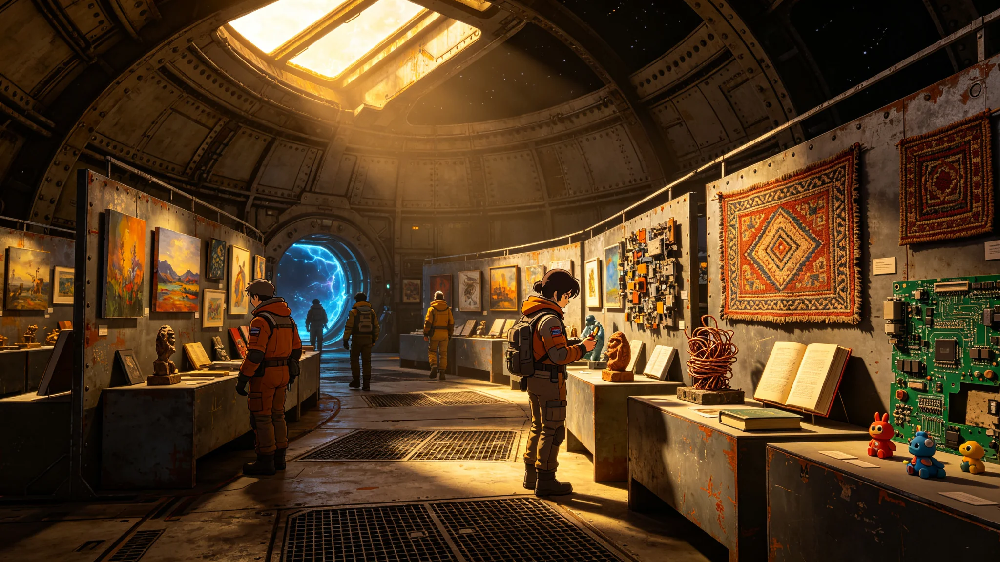

# ARK-01第130航行年全船艺术季作品编目公报与民间创作普查清册

**船政总署 · 文化与社会处 · 艺术科**
**文件编号：** 船政艺字〔2280〕第011号
**艺术季展期：** 2280年3月1日—4月30日
**展览地点：** C环中央展厅（面积1,200m²）+ 各环区巡回展

---

## 一、艺术季概况

第130航行年全船艺术季为航行以来第26届艺术季，主题为"环上的日子"（本届主题由全船公开征集选定，获票3,847张，占有效投票的41.2%）。艺术季旨在展示全船乘员在航行间隙中的创作成果，记录封闭社会中的文化生产与精神生活。

本届艺术季共收到应征作品847件，经艺术委员会评审（7人，含船生二代3人、船生三代3人、船生一代1人），入选展览312件，入选率36.8%。展览期间累计观展4,127人次（全船常住人口约11,800人，观展率35.0%）。

## 二、作品分类编目

### 2.1 按媒介分类

| 媒介类别 | 应征数 | 入选数 | 入选率 | 代表作品 |
|---|---|---|---|---|
| 绘画（金属板/回收材料画布） | 187 | 76 | 40.6% | 《B环黄昏》《巡检艇归来》 |
| 编织与纤维艺术 | 143 | 58 | 40.6% | 《配给票拼贴挂毯》《三代人的手套》 |
| 雕塑与装置（回收金属/电子元件） | 121 | 47 | 38.8% | 《聚变之心》《种子》 |
| 摄影（船载数码相机输出） | 98 | 34 | 34.7% | 《外壳上的光》《水培层光影》 |
| 文学（诗歌/散文/短篇小说） | 156 | 52 | 33.3% | 《环上的日子》诗集 |
| 音乐（原创曲目/改编） | 76 | 28 | 36.8% | 《第130年变奏曲》 |
| 手工器物（陶瓷/木工/皮具） | 66 | 17 | 25.8% | 《船陶系列》 |
| **合计** | **847** | **312** | **36.8%** | |

### 2.2 按创作者代际分类

| 代际 | 创作者人数 | 应征作品数 | 入选作品数 | 人均应征 |
|---|---|---|---|---|
| 船生一代（65—90岁） | 47 | 89 | 41 | 1.89 |
| 船生二代（40—64岁） | 183 | 312 | 128 | 1.70 |
| 船生三代（15—39岁） | 298 | 412 | 137 | 1.38 |
| 船生四代（0—14岁） | 34 | 34 | 6 | 1.00 |
| **合计** | **562** | **847** | **312** | **1.51** |

船生三代为创作主力，占应征作品的48.6%。船生一代虽人数少，但人均创作量最高，且入选率最高（46.1%）。

### 2.3 按创作者职业分类

| 职业类别 | 创作者占比 | 应征作品占比 |
|---|---|---|
| 教育工作者 | 14.2% | 18.7% |
| 医疗工作者 | 9.8% | 11.3% |
| 生态与农业 | 12.1% | 13.8% |
| 工程与维护 | 18.4% | 16.2% |
| 计算与数据 | 8.7% | 9.4% |
| 行政与后勤 | 11.3% | 10.1% |
| 精密制造 | 7.2% | 8.6% |
| 学生（未成年） | 6.1% | 4.0% |
| 退休人员 | 12.2% | 7.9% |

## 三、重点作品编目（节选）

以下为艺术委员会评定的本届艺术季"年度推荐作品"（共12件，此处节选6件）：

### 作品编号 A-2280-003
**标题：** 《B环黄昏》
**作者：** 林晚秋（女，船生二代，52岁，生态环控处水培科）
**媒介：** 回收铝板油画（颜料为船载化学实验室调配）
**尺寸：** 60cm × 80cm
**作品说明：** 描绘B环水培层在LED光照切换间隙的瞬间——暖金色余光与冷蓝色阴影在作物梯田上交错，一名运维员的身影站在远处的管桥上。作者自述："每天换班的时候都能看到这个光，画了七年才画满意。"
**评委评语：** 对船上日常光影的精准捕捉，无地球风景的怀旧，纯粹的船上美学。

### 作品编号 A-2280-017
**标题：** 《三代人的手套》
**作者：** 陈志刚（男，船生三代，28岁，工程处外壳科）
**媒介：** 纤维装置（三副实际使用过的工作手套，裱于铝板）
**尺寸：** 90cm × 120cm
**作品说明：** 三副手套分别属于作者的祖父（初代，外壳修复技师）、父亲（船生一代，水培运维员）和作者本人（船生三代，精密电子维修师）。每副手套的磨损位置不同——祖父的手套指尖磨损严重，父亲的手套掌心有化肥腐蚀痕迹，作者的手套指腹有精密操作的细小穿孔。
**评委评语：** 以劳动物证呈现代际职业变迁，物质性极强。

### 作品编号 A-2280-028
**标题：** 《聚变之心》
**作者：** 苏明哲（男，船生三代，31岁，聚变推进处）
**媒介：** 回收电子元件雕塑（旧电路板、电容、铜线、LED残片）
**尺寸：** 直径45cm（球形）
**作品说明：** 用报废计算阵列的旧元件焊接成球形装置，内部装有慢速旋转的微型马达，表面LED以聚变脉冲的节律闪烁。作者自述："每天面对聚变堆的仪表，就想做一个能拿在手里的'心脏'。"
**评委评语：** 将工业废料转化为具有仪式感的器物，体现船上的物质轮回。

### 作品编号 A-2280-041
**标题：** 《环上的日子》（诗集）
**作者：** 方晓棠（女，船生二代，47岁，文化处，已退休）
**媒介：** 手工装订诗集（回收纸张，封面为旧帆布条）
**篇幅：** 32页，收录诗歌24首
**作品说明：** 作者历时五年创作的诗集，以日常船上生活为主题，包括《配给日》《巡检季》《藻舱的绿》《刻痕墙》等。其中《刻痕墙》一首被艺术委员会评为"本届最佳文学作品"。
**评委评语：** 语言质朴，无宏大叙事，将船上的时间感凝固为诗句。

### 作品编号 A-2280-056
**标题：** 《外壳上的光》
**作者：** 何秀兰（女，船生三代，34岁，工程处外壳科，巡检艇驾驶员）
**媒介：** 摄影（船载数码相机，金属相纸输出）
**尺寸：** 50cm × 70cm（共6幅组照）
**作品说明：** 作者在12次外壳巡检任务中拍摄的飞船外壳光影记录——微流星撞击坑在星光下的阴影、陶瓷面板在聚变尾焰余光中的反光、巡检艇工作灯在装甲上投射的光斑。
**评委评语：** 唯一从飞船外部视角拍摄的作品，尺度感震撼。

### 作品编号 A-2280-073
**标题：** 《第130年变奏曲》
**作者：** 王雅琴（女，船生三代，26岁，医疗处，业余作曲）
**媒介：** 音乐（船载合成器+人声，时长7分42秒）
**作品说明：** 以全船环境录音为素材创作的电子音乐——水培舱的水流声、聚变堆的低频嗡鸣、巡检艇的推进器声、居住区的人声嘈杂，经变奏处理后融合为完整曲目。
**评委评语：** 将船上的声音环境转化为音乐，是最具"船上性"的作品。

## 四、民间创作普查清册

艺术季期间，艺术科同步开展全船民间创作普查，旨在记录未参与艺术季但在日常生活中持续进行的非正式创作。普查采用问卷+实地走访方式，覆盖全船1,200户。

### 4.1 民间创作类型统计

| 创作类型 | 参与户数 | 占比 | 主要形式 |
|---|---|---|---|
| 墙面刻痕/涂鸦 | 847户 | 70.6% | 舱壁刻名、生卒年、图案 |
| 编织/缝纫 | 623户 | 51.9% | 毛衣、挂毯、补丁艺术 |
| 园艺（私人种植） | 534户 | 44.5% | 舱室盆栽、窗台小菜园 |
| 音乐演奏/歌唱 | 412户 | 34.3% | 吉他（船载制作）、合唱、口哨 |
| 手工器物制作 | 387户 | 32.3% | 木雕、陶艺、皮具、首饰 |
| 写作（日记/故事/诗歌） | 356户 | 29.7% | 私人日记、家族故事、同人创作 |
| 摄影/绘画 | 289户 | 24.1% | 手机摄影、素描、水彩 |
| 烹饪创新 | 891户 | 74.3% | 配给食材的创意料理 |

### 4.2 民间创作材料来源

| 材料来源 | 占比 | 说明 |
|---|---|---|
| 回收工业废料 | 42.1% | 旧电路板、金属边角料、废布料 |
| 配给物资剩余 | 28.7% | 配给线、配给纸、食品包装 |
| 自然材料（船上生产） | 18.3% | 木材（水培间伐）、黏土（生态舱）、植物纤维 |
| 船载工坊材料 | 10.9% | 艺术科配给的颜料、纸张、工具 |

### 4.3 代表性民间创作记录

**C环12-B层刻痕墙：** 位于C环12-B层公共走廊，全长27米，自2160年代起被乘员自发刻写。截至2280年普查，共记录姓名3,847个、生卒年1,206组、图案412幅。最早可辨识刻痕为2163年"林秀芳，到此一游"。刻痕墙已被文化处列为"全船重点民间文化遗产"，禁止粉刷覆盖。

**B环7层"种子交换角"：** 位于B环7层公共休息区，乘员自发交换私人种植的种子与扦插苗。自2210年形成，至今已记录交换种子品种47种（含船上选育的蔬菜变种12种）。

**A环3层"老歌会"：** 每月第一个周末在A环3层公共活动室自发组织的合唱活动，主要演唱船生一代创作的歌曲及地球老歌的船上改编版。固定参与约80人，以退休人员为主。

## 五、创作生态分析

1. **材料约束催生独特美学。** 船上无艺术材料的专门供给，90%以上的创作材料来自回收与配给剩余。这种材料约束催生了"废料美学"——旧电路板、金属边角料、废布料成为主要媒介，赋予作品强烈的物质真实性。
2. **创作与劳动深度融合。** 多数创作者为在职人员，创作内容直接源于劳动经验——外壳修复师画外壳、水培运维员画水培层、聚变工程师做聚变雕塑。艺术非独立于劳动的"高雅"活动，而是劳动的延伸与反思。
3. **代际传承清晰可见。** 船生一代的创作多带有地球文化的怀旧痕迹，船生二代处于过渡期，船生三代的创作已完全基于船上经验。《三代人的手套》等作品直观呈现了这一传承与断裂。
4. **民间创作的广度远超正式艺术季。** 艺术季入选312件，而民间创作普查记录的持续创作行为覆盖70%以上的住户。正式艺术季只是冰山一角。

## 六、建议

1. **扩大艺术季展览空间。** 当前C环中央展厅1,200m²已不足以容纳全部入选作品，建议2285年艺术季增设B环分展厅。
2. **建立民间创作档案库。** 对刻痕墙、种子交换角等民间创作遗产进行系统记录（摄影、拓印、口述历史），存档于中央计算阵列。
3. **增加艺术材料配给。** 建议船政总署将艺术材料配给纳入年度配给计划，每年配给颜料20kg、纸张500kg、基础工具套装100套，以支持创作。
4. **开展"船上美学"理论整理。** 经过130年发展，船上已形成独特的美学体系。建议文化处组织理论工作者整理"船上美学"的概念、特征与演变，形成官方文献。

**编目负责人：** 艺术科 科长 林晚秋（船生二代）
**普查负责人：** 艺术科 调研员 陈志刚（船生三代）
**审核：** 文化与社会处 处长 方晓棠（船生二代，已退休返聘）
**签发日期：** 2280年5月15日
