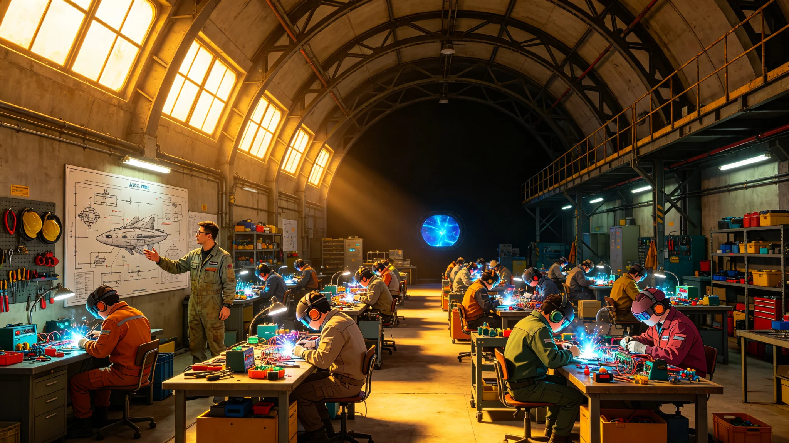

# ARK-01第50航行年全船职业技能再分配普查公报与转岗培训结业清册

**船政总署 · 人事与劳动处**
**文件编号：** 船政人字〔2195〕第009号
**普查标准时点：** 2195年9月1日0时
**培训结业区间：** 2190年1月—2195年8月

---

## 一、普查背景

ARK-01航行至第50年（航历纪年，对应公元2195年），全船劳动力结构发生显著变化：初代乘员（出港时登船者）中60岁以上者占比已达71.4%，大量进入退休或半退休状态；船生一代（航行后出生）中18岁以上者共4,872人，已逐步进入各岗位。与此同时，飞船各系统经半世纪运行，维护需求结构发生变化——早期建设型岗位需求下降，长期运维型、精密修复型岗位需求上升。

根据《全船劳动力动态管理条例》（船政字〔2178〕第005号），每十年开展一次职业技能再分配普查。本次为航行以来第五次普查，重点评估职业供需缺口、技能老化程度及转岗培训成效。

## 二、全船职业结构现状

### 2.1 职业大类分布

| 职业大类 | 在岗人数 | 占比 | 较2185年变动 |
|---|---|---|---|
| 生态与农业 | 1,654 | 14.1% | -2.3% |
| 工程与维护 | 3,127 | 26.7% | +1.8% |
| 医疗与健康 | 943 | 8.0% | +0.9% |
| 教育与培训 | 786 | 6.7% | +1.2% |
| 行政与管理 | 689 | 5.9% | -0.4% |
| 计算与数据 | 712 | 6.1% | +0.8% |
| 聚变推进与能源 | 1,156 | 9.9% | -0.5% |
| 后勤与配给 | 1,023 | 8.7% | -0.6% |
| 安全与应急 | 587 | 5.0% | -0.2% |
| 文化与心理 | 398 | 3.4% | +0.7% |
| 精密制造与备件 | 487 | 4.2% | +1.5% |
| 待分配/培训中 | 621 | 5.3% | -2.9% |
| **合计** | **12,183** | **100%** | |

注：在岗人数不含退休人员（1,847人）及未成年人口（2,986人）。

### 2.2 供需缺口分析

| 职业方向 | 需求人数 | 当前在岗 | 缺口 | 缺口率 |
|---|---|---|---|---|
| 外壳装甲修复技师 | 187 | 124 | -63 | -33.7% |
| 精密电子维修师 | 245 | 178 | -67 | -27.3% |
| 聚变堆维护工程师 | 156 | 139 | -17 | -10.9% |
| 水培系统运维员 | 312 | 298 | -14 | -4.5% |
| 全科医生 | 89 | 87 | -2 | -2.2% |
| 基础建设工（焊接/装配） | 420 | 534 | +114 | +27.1%（过剩） |
| 货物搬运/物流 | 280 | 376 | +96 | +34.3%（过剩） |
| 行政文员 | 310 | 389 | +79 | +25.5%（过剩） |

核心结论：**建设型岗位过剩，运维型岗位短缺。** 出港初期配置的大量基础建设工人，在飞船进入长期运维阶段后岗位需求萎缩；而外壳修复、精密电子等需要长期经验积累的岗位因初代技师退休而出现断层。

## 三、转岗培训实施情况

### 3.1 培训规模与流向

2190—2195年，船政人事处共组织转岗培训14期，累计培训1,847人。转岗流向如下：

| 原岗位 → 新岗位 | 培训人数 | 结业人数 | 结业率 |
|---|---|---|---|
| 基础建设工 → 外壳装甲修复技师 | 312 | 287 | 92.0% |
| 基础建设工 → 精密电子维修师 | 245 | 198 | 80.8% |
| 物流搬运 → 水培系统运维员 | 187 | 176 | 94.1% |
| 行政文员 → 计算与数据运维 | 156 | 142 | 91.0% |
| 行政文员 → 教育辅助员 | 134 | 128 | 95.5% |
| 聚变堆辅助工 → 聚变堆维护工程师 | 98 | 76 | 77.6% |
| 其他转岗 | 715 | 654 | 91.5% |
| **合计** | **1,847** | **1,661** | **89.9%** |

### 3.2 培训周期与课程

| 目标岗位 | 培训周期 | 理论课时 | 实操课时 | 考核方式 |
|---|---|---|---|---|
| 外壳装甲修复技师 | 18个月 | 480h | 720h | 实操考核+笔试 |
| 精密电子维修师 | 24个月 | 640h | 960h | 实操考核+故障排查 |
| 水培系统运维员 | 12个月 | 320h | 480h | 实操考核+口试 |
| 聚变堆维护工程师 | 30个月 | 800h | 1,200h | 实操考核+模拟应急 |

培训期间学员享受原岗位80%薪资，结业并通过考核后按新岗位薪资标准执行。未结业者返回原岗位或进入待分配池。

## 四、转岗培训结业清册（摘要）

以下为第12—14期（2194—2195年）结业人员摘要，完整清册存档于人事处档案库。

**第12期 外壳装甲修复技师班（结业47人）**

| 序号 | 姓名 | 工号 | 原岗位 | 结业成绩 | 分配单位 |
|---|---|---|---|---|---|
| 001 | 陈志远 | E-2187-0342 | 基础建设工 | 优 | 工程处外壳科 |
| 002 | 林秀芳 | E-2188-0517 | 基础建设工 | 良 | 工程处外壳科 |
| 003 | 王大海 | E-2186-0089 | 物流搬运 | 良 | 工程处外壳科 |
| ... | ... | ... | ... | ... | ... |
| 047 | 赵明辉 | E-2189-0721 | 基础建设工 | 合格 | 工程处外壳科 |

**第13期 精密电子维修师班（结业38人）**

| 序号 | 姓名 | 工号 | 原岗位 | 结业成绩 | 分配单位 |
|---|---|---|---|---|---|
| 001 | 苏晓琳 | C-2188-0156 | 行政文员 | 优 | 计算处硬件科 |
| 002 | 何建军 | C-2187-0234 | 基础建设工 | 良 | 计算处硬件科 |
| ... | ... | ... | ... | ... | ... |
| 038 | 吴雅琴 | C-2189-0445 | 行政文员 | 合格 | 医疗处设备科 |

**第14期 水培系统运维员班（结业52人）**

全部结业，分配至生态环控处各栽培区。

## 五、船生一代职业适配

船生一代（航行后出生）中已进入劳动力市场者共4,872人，其职业分布与初代存在显著差异：

| 职业方向 | 船生一代占比 | 初代占比 | 差异 |
|---|---|---|---|
| 计算与数据 | 12.3% | 3.1% | +9.2% |
| 精密制造与备件 | 8.7% | 2.4% | +6.3% |
| 医疗与健康 | 10.1% | 6.8% | +3.3% |
| 教育与培训 | 9.4% | 4.2% | +5.2% |
| 基础建设 | 3.2% | 18.7% | -15.5% |
| 物流搬运 | 2.1% | 11.3% | -9.2% |

船生一代普遍接受过船上系统化教育（12年基础教育+2年职业预科），对精密技术岗位适应度更高，对重体力岗位意愿较低。这一趋势与岗位需求变化方向一致，但短期内基础建设岗位过剩人员的转岗压力仍然较大。

## 六、问题与建议

1. **精密电子维修师结业率偏低（80.8%）。** 该岗位对数学与电路基础要求较高，部分转岗学员基础薄弱。建议在培训前增设6个月预科班，强化数学与电子基础。
2. **聚变堆维护工程师培训周期长（30个月）且结业率最低（77.6%）。** 该岗位为全船关键岗位，缺口虽当前不大但未来五年随初代工程师退休将扩大。建议从船生一代中提前选拔定向培养。
3. **退休潮加速。** 未来五年预计有634名初代乘员退休，其中外壳修复、聚变维护等关键岗位占比高。建议建立"师徒制"退休返聘机制，退休技师以顾问身份带教新人，每周期不超过20工时。
4. **职业认同问题。** 部分转岗学员存在心理落差，从"建设者"转为"维护者"的身份转换需要心理支持。建议心理处介入，在培训期间增加职业认同辅导课程。

**编制：** 人事与劳动处 劳动力科 科长 张维平
**审核：** 人事与劳动处 处长 李婉清
**签发日期：** 2195年10月15日
