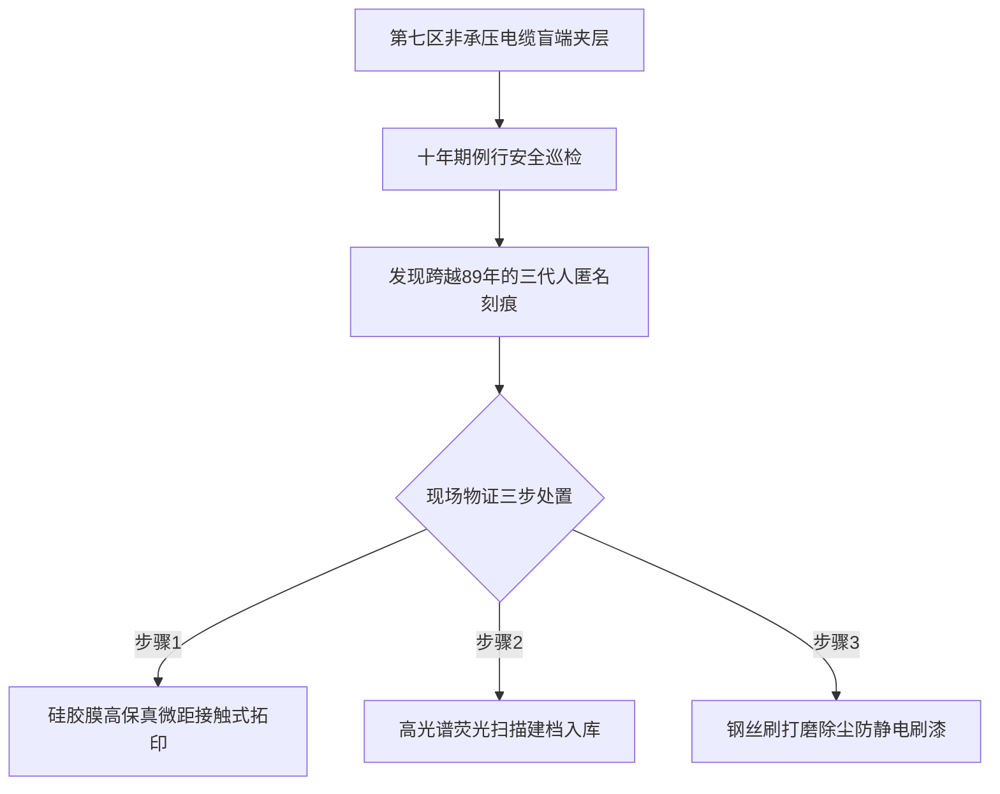

# ARK-01第七区盲端管廊内壁匿名粉笔刻痕拓片与第89航行年清理记录

**公文文号**：ARK-SEC7-MAINT-2239-089  
**清理区域**：第七居住环下层 · 41号电缆主盲端夹层（非承压非通行冷死角，环境温度：$-12^\\circ\\text{C} \\sim -4^\\circ\\text{C}$）  
**巡检作业班**：动力与管网安全保卫处 第十二巡护小队  
**执行人**：第三代船生巡检员 曹大江（工号：`ARK-SEC-2218-0411`）  
**清理性质**：每十年一次的非规范舱壁杂物清理、易燃粉尘刮除与文化遗存拓印封存  

---

## 一、盲端管廊环境与违规刻痕发现情况

41 号主盲端系连接第一主推进机房与第七居住环通风回风口的死角夹层，内部密布主冷却剂高压管与老式光纤槽道。因该区域常年无监控探头且仅受微弱离心重力（$0.22g$）影响，成为历代乘员独处、违规聚集及宣泄情绪的地下私密空间。

本次清理共发现历年累积粉笔书写、油性记号笔涂鸦及锐器物理刻划痕迹 **38 处**。依据《飞船内部设施防静电涂层维护规程》，在进行机械打磨除尘前，巡检组已使用柔性硅胶拓片对典型刻痕进行 1:1 无损物理拓印。

---

## 二、典型刻痕拓片与年代文本考释（抄录）

| 拓片编号 | 物理介质与手段 | 估算书写年代 | 刻痕文本 / 图案内容 | 考释分析与文化特征 |
|:---:|:---|:---:|:---|:---|
| **TP-2239-01** | 油性红漆涂鸦 （字迹已氧化发黑） | 约 2152年 （启航第 2 年） | *“南京下雪的时候，玄武湖的冰很薄。陈明远 2152.01”* | **第一代启航者所留**。文字带有鲜明的地表季节与地名记忆，充满对母星自然气候的具象眷恋。 |
| **TP-2239-07** | 碳酸钙粉笔划痕 （字迹重叠覆盖 3 次） | 约 2195年 （启航第 45 年） | *“我出生在 12 号水培区。他们说外面有个太阳，我不信。太阳怎么可能塞进管子里？”* | **第二代船生人所留**。表现出对“外部恒星”概念的严重怀疑与认知失锚，地表神话在舱内开始解构。 |
| **TP-2239-14** | 坚硬金属锐器刻划 （划痕深度 0.8mm） | 约 2218年 （启航第 68 年） | **47 道等距细横杠**，下方刻有几何公差符号：$\\perp 0.02 \\; \\text{A}$ 与简易扳手图案。 | **第三代技术员刻痕**。手法与老工匠扳手刻痕（`object/wrench-47`）形制完全一致，为深空机械工代际隐语。 |
| **TP-2239-22** | 荧光黄粉笔短诗 | 约 2235年 （启航第 85 年） | *“前面是黑的 / 后面是黑的 / 仪表盘是绿的 / 骨头是脆的。”* | **当代（第三/四代）深空虚无情绪**。语言高度极简，以舱内冷冰冰的器械颜色对冲星际空间的虚无。 |

---

## 三、现场遗留废弃物清点与清理处置

除舱壁刻痕外，现场共清出私藏违禁杂物 3 件：
1. **干枯向日葵花盘残片 1 个**：封装于简易热封塑料袋内，花盘直径 4 cm，经质谱测定为 2150 年地表带上飞船的初代农作物干燥标本。
2. **手磨铝合金八面骰子 1 粒**：各面未标点数，而是分别刻有“进风、排气、加压、失压、点火、熄火、睡眠、换班”八个飞船日常词汇。
3. **已失效的低重力镇静喷雾空罐 2 支**。

---

## 四、巡检员结案批注

> 拓印完了，下午按规定带着两个学徒拿钢丝刷全给打磨掉了，重新刷了三遍灰色的阻燃环氧树脂漆。
> 
> 刷漆的时候学徒问我：“师傅，把那些老祖宗写的话都刷平了，飞船飞到了地方，谁还记得他们当年在管子底下哭过？”
> 
> 我跟他说：“飞船不需要眼泪，飞船只需要管道不漏气。漆刷厚一点，管子能多挺五十年，这就是给后代最大的积德。”

---

**拓印技术员**：曹大江（签字）  
**动力防保处审核**：处长 何维礼（签章）  
**归档附件**：硅胶拓片实物 4 盒（入藏船载历史陈列馆地库）
