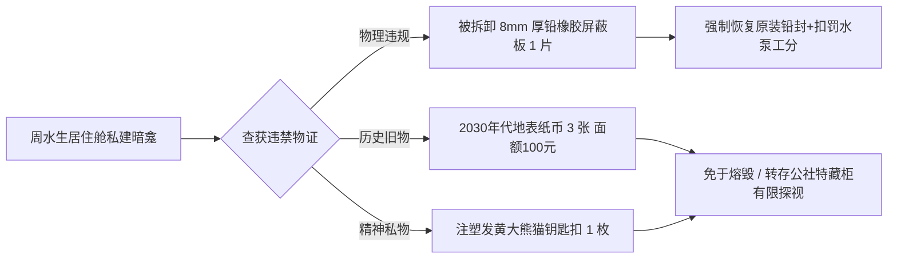

# ARK-01第三居住环第12互济公社关于私自改装电离辐射屏蔽层与私藏旧地球纸币之调解裁决书

**公文编号**：ARK-MUTUAL-2240-ADJ-044  
**调解机构**：ARK-01 飞船第三居住环第 12 基层互济公社调解委员会  
**被申诉人**：居民 周水生（工号：`ARK-ENG-2208-0914`，第三居住环 B 区 402 室住户，任职于农业区水泵维修班）  
**查处事由**：在居住舱例行防辐射气密巡检中，被安全员查获**私自拆卸舱壁铅橡胶防辐射屏蔽层（面积约 $0.12 \\,\\text{m}^2$）**，并违规掏空骨架隔热棉改建为私密储物暗龛；暗龛内藏有未申报之旧时代违禁物品。  

---

## 一、现场搜获物证清点台账

经第 12 互济公社治安委员及安保员当场启获，封存物证如下：

1. **结构破坏原物**：
   - 被切割拆卸之 $8 \\,\\text{mm}$ 厚高韧度含硼铅橡胶防辐射衬垫 1 块（自重 $1.85 \\,\\text{kg}$，边缘有简易手锯粗糙锯切痕迹）。
2. **私藏非配给物品**：
   - **地表纸质法定货币 3 张**：经光谱与油墨防伪鉴定，系公元 2030 年代中国人民银行发行之第五套人民币（面额：壹佰圆整，共计叁佰圆）。纸张因长期受舱内微湿空气侵蚀，边缘有轻微纤维霉斑，被夹在一本 2140 年版《电机绝缘耐压手册》夹层内。
   - **注塑塑料工艺品 1 件**：长约 5 cm 之大熊猫造型钥匙扣（带生锈铁链），注塑体已严重黄化变脆。

---

## 二、当事人陈述与公社听证调查

- **周水生自白口供**：
  > “那三张纸票子和我手里的钥匙扣，是我太爷爷（周远）2150年启航时缝在工作服夹层里带上船的。太爷爷走前跟我爷爷说，这是地球老家买米买布用的钱，上面印着地表的山和水。到了我这一辈，船上全都是工分和水冰代币，纸票子连一块饼干都换不来。我就是想留个念想，每天下班回屋掀开铅板瞅上一眼，知道自己不是从管子里凭空生出来的铁人……拆那块铅板是我糊涂，我不该拿整层楼的辐射剂量开玩笑。”
- **邻里与公社安保质证**：
  - 居住舱对壁住户李阿姨证实：周水生平时工作勤恳，未发现其他破坏公物行为；但该暗龛所处位置正对飞船主电离辐射渗漏监测走廊，铅板缺失导致该区域局部中子辐射本底读数由 $0.18 \\,\\mu\\text{Sv/h}$ 升至 $0.42 \\,\\mu\\text{Sv/h}$，构成邻里安全隐患。

---

## 三、互济调解委员会处理决议

鉴于被申诉人认错态度诚恳，且私藏物品系家族代际情感纪念物、未发生对外倒卖或邪教传播行为，依据《飞船基层自治与情理折中暂行条例》，作出如下兼顾法度与人情之裁决：

1. **工程强制整改**：
   - 周水生须在 24 小时内无条件配合工务段，将原厂铅橡胶屏蔽层原位焊接复原，并承担特种密封胶耗材费用（扣除其个人结余水工分 **45 点**）。
2. **违禁旧物处置（折中托管）**：
   - 没收的三张旧地表纸币及塑料钥匙扣**免予等离子体焚毁**；
   - 由第 12 互济公社代为存入社区「家族历史档案特藏柜」，建立专档。周水生每年可在公社法定节庆日（启航纪念日、冬至日）申请开柜探视、擦拭保养 **两次**（每次不超过 15 分钟）。
3. **社区公益劳务**：
   - 罚处周水生利用业余轮休时间，为本居住环公共水培农场义务疏通排渣管路 **20 工时**。

---

**被申诉人签认**：周水生（按指印）  
**邻里见证代表**：李翠兰（签字）  
**互济公社主任**：常有德（签印）  
**公文执行报备**：ARK-01 船载民政司法署备案
