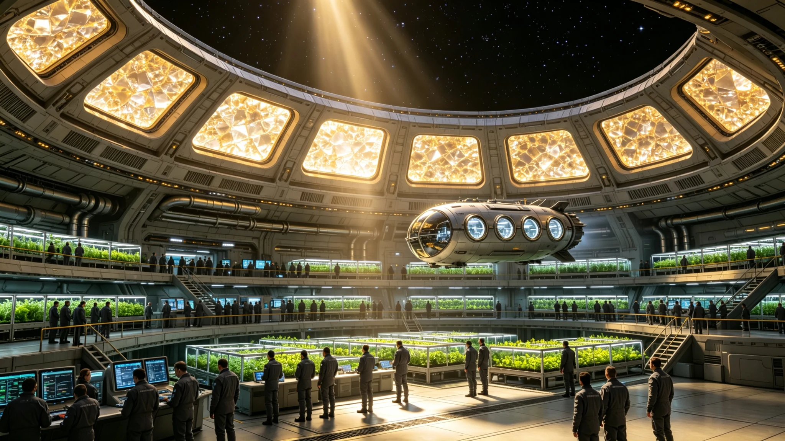

# ARK-01第二航行世纪全船人口结构与代际更替普查公报

**船政总署 · 人口与社会统计处**
**文件编号：** 船政统字〔2200〕第001号
**普查标准时点：** 2200年1月1日0时（船载原子钟）
**普查范围：** ARK-01全船A、B、C三环全部驻留舱段

---

## 一、普查概况

本次普查为航行以来第五次全船人口普查，采用舱段登记与生物特征核验双轨方式，普查覆盖率99.94%，未登记11人均为长期深潜作业人员，已由所在单位代报。

## 二、人口总量与代际结构

| 代际 | 定义 | 人数 | 占比 |
|---|---|---|---|
| 初代（地球出生） | 启航前出生并登船 | 1,847 | 11.2% |
| 船生一代 | 航行后第一个二十五年内出生 | 6,732 | 40.8% |
| 船生二代 | 航行后第二十五年至五十年间出生 | 7,106 | 43.1% |
| 船生三代 | 航行第五十年后出生 | 814 | 4.9% |
| **合计** | | **16,499** | **100%** |

## 三、年龄分布与性别比

| 年龄段 | 人数 | 占比 | 性别比（男/女） |
|---|---|---|---|
| 0—14岁 | 2,986 | 18.1% | 104.2 |
| 15—39岁 | 7,412 | 44.9% | 101.8 |
| 40—59岁 | 4,203 | 25.5% | 98.6 |
| 60—79岁 | 1,654 | 10.0% | 93.1 |
| 80岁以上 | 244 | 1.5% | 87.4 |

全船性别比为100.7，基本均衡。初代乘员平均年龄71.4岁，船生一代平均年龄31.2岁。

## 四、出生率与死亡率

| 指标 | 近五年均值 | 设计阈值 | 状态 |
|---|---|---|---|
| 粗出生率 | 12.8‰ | 10—15‰ | 正常 |
| 粗死亡率 | 4.1‰ | ≤6‰ | 正常 |
| 自然增长率 | 8.7‰ | 5—10‰ | 正常 |
| 预期寿命 | 84.2岁 | ≥80岁 | 达标 |

近五年共出生1,056人，死亡338人。死亡原因首位为循环系统疾病（38%），其次为肿瘤（22%）、意外工伤（14%）。

## 五、职业分布与舱段居住

| 职业大类 | 人数 | 占比 |
|---|---|---|
| 工程运维 | 4,128 | 25.0% |
| 生态农业 | 2,876 | 17.4% |
| 科研与技术 | 2,310 | 14.0% |
| 制造与加工 | 2,145 | 13.0% |
| 医疗与照护 | 1,320 | 8.0% |
| 教育与文化 | 986 | 6.0% |
| 行政与司法 | 642 | 3.9% |
| 其他/未分类 | 2,092 | 12.7% |

## 六、备注与数据局限

本次普查未计入长期处于卧床医学观察状态的7人（均为初代乘员，患退行性疾病，长期卧床隔离照护）。船生三代人口统计存在约2%的漏报，原因是部分边远舱段新生儿登记延迟。人口总量较五十年前启航时的12,000人增长37.5%，增速在封闭生态承载范围内。

**船政总署人口与社会统计处**
**2200年2月28日**
