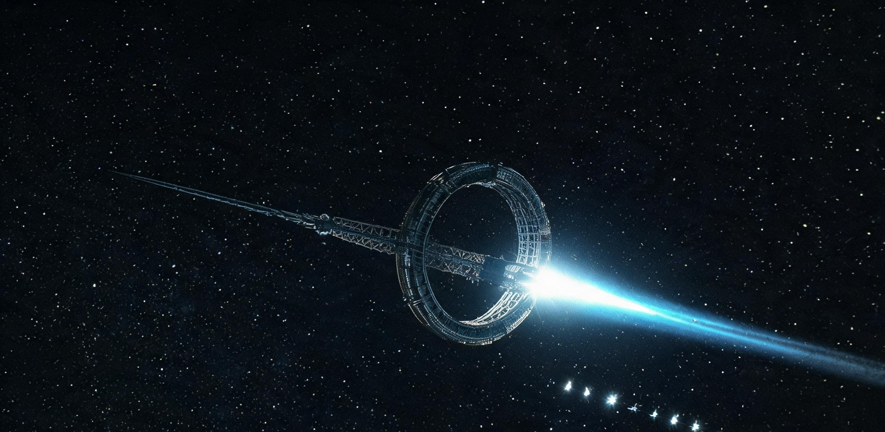

**世代飞船工程总指挥部 · 谷神星外轨天梭-01深空总装锚地**  
**ARK-01 聚变脉冲主推进系统全功率联合试车遥测公报暨试车窗口航道清空与残骸防护调度令**

文号：船指试〔2152〕第 002 号（遥测公报） / 船指调〔2152〕第 006 号（航道调度令，附）  
试车对象：ARK-01 主推进系统（聚变脉冲推进，四象限 16 单元磁场喷嘴阵列）  
试车窗口：公元 2152 年 3 月 14 日 02:00—06:30（锚地标准时）  
文书纪年：公元 2152 年 3 月 16 日  
密级：工程受限 / 主带航行警告同期播发（NAVAREA-BELT 2152-014）

---

### 一、 试车总体

本次试车为 ARK-01 出港前最后一次主推进全功率联合试车，目的：验证 16 单元脉冲阵列在 100% 设计功率下的同步性、喷流指向与船体结构响应，为 2152 年 6 月启航签发推进适航证。试车于锚地专用试车走廊内进行，全船未加注全部推进剂（仅装载试车用药丸批次）。

| 试车指标 | 设计值 | 实测值 | 判定 |
|---|---|---|---|
| 脉冲模式 | 氘-氦3 惯性约束药丸，0.5 Hz | 0.5 Hz（全程 4,050 脉冲） | **合格** |
| 单脉冲当量 | 4.2 GJ | 4.18 ± 0.09 GJ | **合格** |
| 等效稳态推力 | 1,120 kN | 1,114 kN | **合格** |
| 平均喷射速度 | 9,600 km/s | 9,590 km/s | **合格** |
| 16 单元同步偏差 | ≤ 2 ms | 0.8 ms | **合格** |
| 喷流合成指向偏差 | ≤ 0.02° | 0.011° | **合格** |
| 船体一阶结构响应 | ≤ 0.012 g（脉冲瞬态） | 0.009 g | **合格** |
| 试车总冲 | — | 4.51 × 10⁹ N·s | 药丸 4,050 枚全部正常 |
| 磁场喷嘴线圈温升 | ≤ 62 K | 58 K | **合格** |

试车程序：02:00 起 10% 功率 200 脉冲（磁嘴冷态磨合），03:10 起 50% 功率 800 脉冲，04:40 起 100% 功率 3,050 脉冲（连续 101.7 分钟），06:01 按计划序列停堆。全部 4,050 枚药丸点火成功率 100%，无哑弹、无连发、无磁场喷嘴失超。

**尺度注记**：试车走廊以锚地为中心前后各延伸 1,000 公里、横向 ±200 公里——一段 2,000 公里长的深空被清空 4.5 小时，只为让一艘船在原地（相对锚地速度被侧向系留缆抵消）把它的发动机真正点着一次。警戒巡逻艇「斥候-04」全程 3 圈巡飞，艇长 22 米，在走廊边界监视屏上，这艘船和它 2,000 公里的清空区相比，只是走廊几何中心的一个像素。

### 二、 分系统遥测摘要

1. **药丸注入与点火**：药丸（单枚 0.84 g，氘-氦3 冷冻壳层）由电磁轨道注入聚爆腔，16 路惯性约束驱动束（每路 262 MJ/4.8 ns）同步压缩。4,050 枚药丸聚爆中子产额均值 1.31×10¹⁹/枚，偏差 3.1%。
2. **磁场喷嘴**：能量转换效率（聚变能→定向喷流动能）61.4%；喷嘴超导线圈（MgB₂，运行温度 18 K）在 4.5 小时满功率下端部温升 58 K，失超裕度 34 K。
3. **船体结构**：脉冲序列引起的居住环段（R 2,500 m）切向振动幅值 0.9 mm，恢复环（R 1,310 m）0.4 mm，均在居住容许限内；船上乘员报告「像远处有人以固定节拍敲一面很大的鼓」。
4. **辐射与屏蔽**：聚变中子经喷嘴区复合屏蔽（硼化聚乙烯+铅铋+注水层）衰减后，居住边界剂量率增量 0.002 mSv/h，试车全程乘员累积附加剂量 0.007 mSv，低于一次月面出舱作业的 1/20。
5. **推进剂账目**：试车共消耗药丸 4,050 枚（3.40 t），占全船载弹量（612 万枚 / 5,140 t）的 0.066%；剩余药丸按航程预算（加速段 18 个月 + 减速段 14 个月）核算冗余 4.2%。

### 三、 航道清空与残骸防护调度令（船指调〔2152〕第 006 号，执行摘要）

1. **清空走廊**：试车前 72 小时，主带航行警告 NAVAREA-BELT 2152-014 生效，走廊（轴向 ±1,000 km，横向 ±200 km）内全部航运改道；受影响航班 17 班次，由环带货运自治公会调度司统一重排（附改道清单）。
2. **警戒部署**：走廊边界四角部署警戒艇 4 艘（斥候-03/04/05/06），内圈巡检艇 2 艘；锚地本身退至走廊中心后方 80 km。
3. **残骸防护**：试车聚爆产物（高温等离子体+未燃尽药丸壳层碎屑）沿喷流反向前方喷出；前方 1,000 km 设被动碎屑监测阵（12 单元光学+雷达），实测碎屑云最大尺寸 4 mm、总数 218 颗，全部处于预报弹道包络内，无一颗返回锚地方向。
4. **防护审议**：碎屑云将于 47 年后穿越内主带航道密集区前自然扩散至无害密度（轨道积分见附表），无需主动清除；登记入深空碎片台账第 2152-014 号。

### 四、 结论

ARK-01 主推进系统全功率联合试车各项指标全部合格。**总指挥部据此签发推进适航证（编号 PROP-CERT-2152-001）**，ARK-01 进入出港前最后 90 天程序：药丸全装载（4 月）、乘员终训（5 月）、启航窗口（2152 年 6 月 11 日 ± 3 天）。

**签署：**  
主推进系统总师 秦焊（印）  
试车指挥长 白沧（印）  
结构安全监察局主管 V. Kolesnikov（电子签）  
总指挥部轮值总指挥 闻远（印）

**用印：** 世代飞船工程总指挥部试车专用章（朱文）  
**存档：** 船载档案总库甲字第 1 柜（随船正本）/ 锚地档案分库副本壹份 / 地联航天登记局报备副本壹份  
**公元 2152 年 3 月 16 日**

---

## 图片提示词

深空试车走廊工业档案摄影：2.5 公里直径的巨型居住环与主桁架船体横贯画面切出画框，船艉 16 单元磁场喷嘴阵列正喷出一道笔直刺眼的蓝白色脉冲喷流延伸至远方消失；船体其余部分几乎全黑，只有哑光装甲被喷流照亮的边缘；远处一艘 22 米警戒艇如微小光点悬在清空走廊边界。

Archival engineering photograph in a deep-space test corridor: a colossal habitat ring and main truss of a generation ship spans the frame cropped at both edges, its stern magnetic nozzle array firing a single needle-straight blinding blue-white pulse exhaust jet that recedes into the distance; the rest of the hull nearly black, only matte armor edges lit by the exhaust glow; far away a tiny 22-meter patrol craft hangs as a faint point of light at the corridor boundary; pitch-black space, dense star field; shot on 35mm film, visible film grain, blown highlight at the nozzle, slight lens flare smear, off-center candid framing, archival scan, no readable text, no signage, no national flags.

---

## 修订记录（元层，非世界内容）

- 2026-08-18：主会话直写（子 agent 配额 429 后主笔）。互锁：Phase 0 任务文件（聚变脉冲推进硬约束）、GS-2150-01 船台合拢（0.482rpm/双环几何）、GS-2150-02 生物圈殖装（谷神星外轨天梭-01 锚地、2150-09 检疫）、世界大纲工程轨迹（2100 聚变脉冲推进样机、2140 龙骨铺设）；药丸账（612 万枚）与 0.0288c/148 年航程预算自洽。试车时间设定 2152=启航纪元初年，与 2150 合拢/检疫链条衔接。
