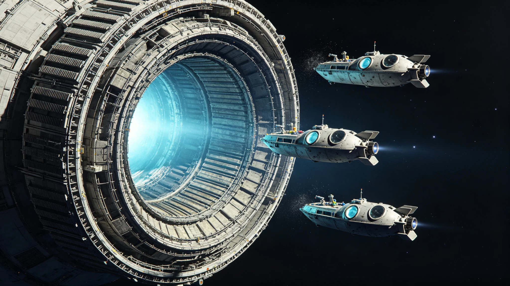

# ARK-01聚变脉冲推进系统第120航行年大修与换料工程验收单

**工程总署 · 推进系统处**
**文件编号：** 船工推验字〔2270〕第003号
**工程代号：** 聚变脉冲推进系统第120航行年大修（PROP-OVERHAUL-120Y）
**施工周期：** 2269年3月—2270年6月（15个月）
**验收日期：** 2270年7月10日—14日

---

## 一、工程范围

本次大修涵盖聚变脉冲推进系统全部三大分系统：脉冲燃烧室与第一壁、磁约束线圈与超导磁体、燃料注入与排灰系统。同时完成第120航行年定期换料，更换全部24组聚变燃料靶丸存储单元。施工期间推进系统完全停机，飞船维持惯性巡航，姿态由冷气姿控喷口保持。

## 二、主要部件更换与检修

| 部件 | 编号 | 运行时长 | 处置方式 | 状态 |
|---|---|---|---|---|
| 第一壁钨装甲板 | FW-01至FW-12 | 120年 | 全部更换 | 已更换 |
| 磁约束超导线圈 | MC-A/B/C | 120年 | 检测+3组更换 | 3组更换 |
| 燃料注入阀 | FI-01至FI-08 | 120年 | 全部更换密封件 | 已完成 |
| 排灰螺旋泵 | EP-01/02 | 90年 | 解体检修 | 已完成 |
| 中子屏蔽层 | NS-整体 | 120年 | 厚度检测+局部补填 | 合格 |
| 散热肋片阵列 | RA-外环 | 120年 | 变形校正+14片更换 | 已完成 |
| 聚变燃料靶丸 | 24组存储单元 | — | 全部换料 | 已换装 |

## 三、换料数据

| 项目 | 旧料余量 | 新料装填 | 设计容量 |
|---|---|---|---|
| 氘气（D₂） | 18.4吨 | 60.0吨 | 62吨 |
| 氚气（T₂） | 3.1吨 | 12.5吨 | 13吨 |
| 氦-3引燃剂 | 0.8吨 | 2.0吨 | 2.2吨 |
| 靶丸聚态石蜡外壳 | 2.1吨 | 5.6吨 | 6吨 |

换料后燃料储备可支撑后续60年巡航脉冲推进需求（含减速段预留）。

## 四、试车验收数据

| 测试项目 | 设计指标 | 实测值 | 结论 |
|---|---|---|---|
| 单脉冲聚变功率 | ≥80 GW | 84.3 GW | 优良 |
| 脉冲重复频率 | 0.2—0.5 Hz | 0.35 Hz稳定 | 合格 |
| 推力（满频） | ≥1.2×10⁶ N | 1.28×10⁶ N | 优良 |
| 第一壁温度峰值 | ≤1,850 K | 1,792 K | 合格 |
| 磁约束场强 | ≥12 T | 12.4 T | 优良 |
| 系统总效率 | ≥42% | 43.1% | 优良 |
| 氚增殖比 | ≥1.05 | 1.08 | 合格 |

## 五、遗留项与限制

1. 第7号第一壁背板在拆卸中发现微裂纹（长度2.3mm），已更换但裂纹成因需在下次大修前完成材料分析。
2. 散热肋片外环有3片微陨石穿透损伤（孔径0.8—1.4mm），已补焊，不影响散热效率。
3. 大修期间飞船姿态控制精度略有下降（±0.03°），推进系统重启后已恢复至±0.005°。

## 六、验收结论

聚变脉冲推进系统第120航行年大修与换料工程全部项目验收合格，系统恢复额定运行状态。推进处同意签署验收单，系统转入日常巡航运行。下次大修窗口为第180航行年（2330年），届时需结合减速段推进需求评估第一壁剩余寿命。

**验收负责人：** 推进系统总工程师（签章）
**工程总署署长：**（签章）
**2270年7月15日**
