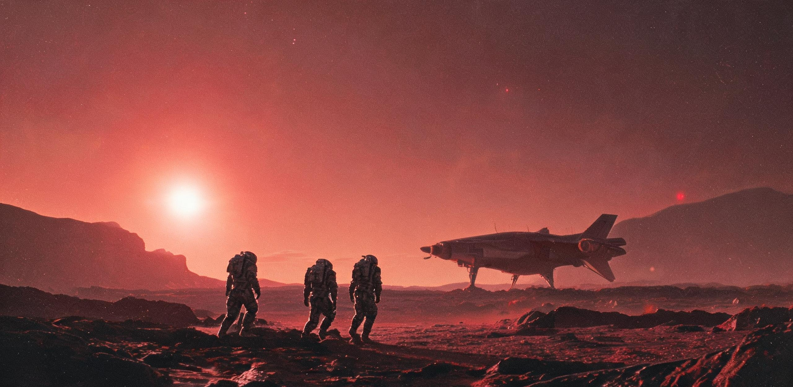

# ARK-01 船载医务部 · 先遣登陆总队联合卫勤组
## 先遣登陆组地表 1.07g 重力梯度适应与前庭-肌骨耐受性第 01 期监测通报

**发文字号：** MED-LAND-2351-CY01 / 卫登字〔落01〕第 004 号  
**监测周期：** 落地历第 1 年第 42 任务日至第 78 任务日（船历累计任务日：73,380—73,416；公历换算：2351 年）  
**签发单位：** ARK-01 船载医务部（停泊轨道主机动舱）、先遣登陆总队第一营地卫勤站（地表北棚前哨）  
**抄送：** 抵达处置委员会主席团、地表拓荒工程指挥部、航务重力与自转调度司、第三综合学校生理教研组、深空档案馆  
**密级：** 拓荒先遣全员周知·甲类临床追踪档案  
**主检签押：** 船载医务部首席临床长 *林思源*（第三代，工号 MED-1204） / 先遣卫勤站主任 *杜衡*（第二代，工号 SUR-0489）  
**会签监修：** 抵达处置委员会委员 *关山越*（印） / 先遣登陆总队总队长 *雷振声*（印）  

---

### 一、 普查背景、受试队列与监测基准

#### 1.1 任务阶段与重力场跃迁环境
ARK-01 远征星舰已于任务日 73,029 稳态切入比邻星 b 捕获轨道（高椭圆停泊轨道）。依据《落地处置规程》先行阶段部署，先遣登陆工程总队首批 48 名工程与科考人员已分乘 D-12、D-14 重型下降器降落地表晨昏带一号暂栖营地（北棚前哨，近一号穹顶合拢工区）。

受试人员经历了由**船载第二承压环（半径 $R=2.5\,\mathrm{km}$，标准自转离心重力 $0.65\,\mathrm{g}$，伴随侧向科里奥利力效应）**向**行星地表静态重力场（实测垂直重力加速度 $1.07\,\mathrm{g}$，无轴向自转科氏力）**的剧烈力学跃迁。

```text
[重力环境与动力学突变特征]
船载二环工况 (0.65g) ───► 下降制动过载 (峰值 2.40g / 持续 180s) ───► 地表稳态 (1.07g)
  ├─ 存在自转科氏偏转力 (ω = 0.0505 rad/s)               ├─ 纯铅垂静态重力场 (g = 10.49 m/s²)
  ├─ 视野内壁向上弯曲 (R = 2,500 m)                       ├─ 视野地平线平坦/轻度下凹，开阔暗红苍穹
  └─ 骨骼代际自适应卸载 (T-Score 均值 -2.18 ~ -2.65)        └─ 全身垂直静载突增 +64.6% (1.07 ÷ 0.65 ≈ 1.646)
```

#### 1.2 受试队列分类与人口代际构成
本期受检先遣人员共计 48 人，按代际来源与出勤剖面建立全要素追踪档案：

| 队列编号 | 队列性质与作业区域 | 在册人数 | 出生代际构成 | 基线人体质量中位数（kg） | 地表实测重力称重中位数（1.07g工况/N） | 配赋防护装备 |
| :--- | :--- | :---: | :---: | :---: | :---: | :--- |
| **队列 A（开拓组）** | 地表开阔区玄武岩地质钻探与坑基开凿 | 18 | 第3代: 14人<br>第2代: 4人 | 67.5 | 708.4（相当于地球 72.2 kg 荷重） | 气动助力外骨骼（Mark-I）<br>抗荷加压裤（LBNP-Suit） |
| **队列 B（建构组）** | 一号穹顶气密环缝焊接与管网敷设 | 20 | 第3代: 16人<br>第2代: 4人 | 70.2 | 737.1（相当于地球 75.1 kg 荷重） | 机械铰链无源外骨骼<br>弹性下肢束套 |
| **队列 C（勤务组）** | 营地生命支持、配餐与通信内勤 | 10 | 第2代: 6人<br>第1代: 4人（老年） | 64.7 | 678.6（相当于地球 69.2 kg 荷重） | 梯度弹力袜（无外骨骼） |
| **对照组 D（轨道留守）** | 停泊轨道二环留守人员（随机抽样） | 30 | 第3代: 20人<br>第2代: 10人 | 65.0 | 414.7（维持船上 0.65g 常规） | 船用常规工装 |

*注：全员基线数据取自抵达前第 72,900 任务日船载 DEXA-04 骨密度扫描与心血管三维流场数据库。第 1 代（地球出生者，全队仅 4 人，均已年逾七旬）作为罕见的「母星力学记忆者」单列对照。*

---

### 二、 前庭-自主神经系统与空间定向错觉监测

#### 2.1 科里奥利习得效应与前庭跨轴重校准
在 200 年漫长航渡中，第 2、3 世代乘员的前庭半规管与耳石器在神经发育期即建立了针对 $R=2.5\,\mathrm{km}$ 旋转环的内生补偿通路——即在旋转舱内做俯仰（Pitch）或偏航（Yaw）转头动作时，小脑前庭核会自动抑制由交叉耦合加速度诱发的旋转性视错觉。

当乘员登陆地表后，这种在 0.65g 旋转环境下长成的神经网络表现出严重的「失适应症候群」：

```text
========================================================================================================
前庭功能监测维度             第 3 世代乘员 (船生代，n=30)     第 1 世代乘员 (地球出生，n=4)    临床意义与机理判读
--------------------------------------------------------------------------------------------------------
地表转头倾倒错觉发生率        93.3% (28/30 例)              0.0% (0/4 例)                船生代前庭小脑下意识做“反科氏力”假代偿，
(地表快速水平转颈 90°)       (平均发作持续 4.2 ± 1.1 秒)    (无倾倒感，轻微肌酸)          导致在纯静态重力场中诱发反向假性倾斜力矩。

前庭-眼动反射 (VOR) 增益误差   +28.4% ± 5.2% (过度补偿)      +3.1% ± 1.2% (正常范围)       水平扫视时凝视点超调，阅读地表屏幕仪表
(水平正弦摆头 0.5Hz 测定)                                                               出现明显跳动，需闭目停留 1.5 秒方能重锚定。

闭目单足站立时间 (Romberg)    6.8 ± 2.4 秒 (重度共济失调)    28.5 ± 4.1 秒 (达标)          缺乏视觉代偿时，本体感觉与耳石信号严重
(地表 1.07g，未穿外骨骼)     (船上基线为 34.0 ± 5.2 秒)     (接近母本库基线)              冲突，中枢神经无法维持下肢肌群协同发力。

空间运动病 (SMS) 发生率      86.7% (26/30 例)              25.0% (1/4 例)               由静水压骤增、耳石偏转过载及视觉开阔诱发，
(落地首周 1-7 地表日)        (重度恶心 14 例，呕吐 8 例)    (仅轻微头晕，1日内缓解)       表现为特征性“地表晨昏昏睡与冷汗综合征”。
========================================================================================================
```

#### 2.2 「失穹感」与地平线视觉失锚综合征
与前庭生理失调并行的，是极端剧烈的认知与空间心理学重构。在船载封闭环境长大的第 2、3 代乘员，其视觉空间基准框架建立在「视线向上延伸必为弧形金属内壁」的先验认知上。

先遣队心理专员在第 1 至第 14 地表日的舱外日记与行为录像中提取出高度一致的行为学表征：
1. **失穹本能防御反应：**  
   首批走出 D-12 下降器气闸舱的 18 名开拓组乘员中，计有 15 人在踏上地表红褐色风化层的前 30 秒内出现非自主的「下蹲抓握反射」——双膝跪地，手指深抠地表风化岩碎屑，头颅深埋于胸前。受试者主诉为“感觉头顶空无一物，身体会以极高速度向那片暗红色的虚无天顶坠落”。
2. **地平线倾倒错觉：**  
   比邻星 b 晨昏线平原视野极度开阔，远处红矮星低垂于地平线之上 7° 处，红光穿透稀薄冷凝水汽拉出数十公里的锋利长影。船生代乘员在平视地平线超过 5 分钟时，大脑视皮质会产生「地面正在向自身头顶翻折覆盖」的翻转几何错觉，诱发剧烈恐慌性心动过速（心率达 135—155 bpm）。
3. **空间重构干预：**  
   医务部已紧急为全体地表作业头盔加装「人工视界标尺网格」（在面罩上投影一条水平基准绿线及虚拟上沿遮光檐），使乘员视野重构出类似船载舱室的局部几何收敛感，失锚眩晕发作频次在 3 日内下降 64.0%。

---

### 三、 心血管动力学与直立耐受性（Orthostatic Tolerance）监测

#### 3.1 下肢静水压再分配与体液头向转移逆转
在船载 0.65g 环境下，人体动脉跨壁压梯度较地球浅；而在地表 1.07g 静态重力场下，自心脏至足底（以 1.70 m 身高计算，流体柱高约 1.25 m）的血液静水压骤增至 **$135\,\mathrm{mmHg}$**（船上仅为 $82\,\mathrm{mmHg}$）。

```text
[站立位流体静压与静脉回流对比]
          船载 0.65g 稳态工况                       地表 1.07g 突加载工况 (未防护)
    ┌──────────────────────┐                  ┌──────────────────────┐
    │ 头部血压: 62 mmHg    │                  │ 头部血压: 48 mmHg (濒临脑缺血阈)
    │                      │                  │                      │
    │ 心脏高度: 95/60 mmHg │ ─── 跃迁至地表 ───►│ 心脏高度: 118/75 mmHg│ (代偿性增压)
    │                      │                  │                      │
    │ 足底毛细血管压:      │                  │ 足底毛细血管压:      │
    │   82 + 60 = 142 mmHg │                  │   135 + 75 = 210 mmHg│ (极度淤血/渗出)
    └──────────────────────┘                  └──────────────────────┘
```

#### 3.2 直立倾斜耐受测试（Tilt-Table Test）与体征普查
在落地第 3、15、30 任务日对 A、B 两队列（共 38 人）实施 70° 直立倾斜试验（持续 20 分钟），监测数据汇总如下：

| 检测节点 | 卧位基础心率（bpm） | 70°倾斜立位峰值心率（bpm） | 心率增量（$\Delta\mathrm{HR}$） | 收缩压跌幅（$\Delta\mathrm{SBP/mmHg}$） | 直立性低血压/POTS 发生率 | 踝周水肿阳性率（周径增加 $\ge 1.5\,\mathrm{cm}$） |
| :--- | :---: | :---: | :---: | :---: | :---: | :---: |
| **第 03 任务日（无防护）** | $68.4 \pm 6.2$ | $124.5 \pm 14.8$ | $+56.1 \pm 11.2$ | $-26.4 \pm 8.5$ | 84.2%（32/38 例） | 76.3%（29/38 例） |
| **第 15 任务日（着加压裤）** | $70.2 \pm 5.8$ | $98.6 \pm 9.4$ | $+28.4 \pm 6.5$ | $-12.2 \pm 4.3$ | 23.7%（9/38 例） | 21.1%（8/38 例） |
| **第 30 任务日（综合干预）** | $69.0 \pm 5.1$ | $88.2 \pm 7.1$ | $+19.2 \pm 4.8$ | $-6.5 \pm 3.1$ | 5.3%（2/38 例） | 7.9%（3/38 例） |

*判读结论：*  
未穿戴抗荷裤时，84.2% 的船生代乘员在直立 8 分钟内触发直立性不耐受，脑血流灌注速度中位数下降 38.6%，出现视野灰视（Grey-out）与濒临晕厥；下肢深静脉管壁平滑肌缺乏高重力收缩记忆，血液过度池化于小腿与腹腔内脏血管床。经佩戴阶梯梯度充气加压裤（提供小腿 40 mmHg、大腿 25 mmHg 外部反压）并推行高盐补液（每日口服补液盐 4.5 g）后，心血管系统于第 30 任务日基本建立稳态力学代偿。

---

### 四、 肌骨动力学、行走步态与外骨骼负重应力分析

#### 4.1 步态动力学退化与支撑相代偿
船载医务部联合生物力学组利用地表红外高速运动捕捉系统（8 台 OptiTrack-Pro）与埋设于一号营地主通道的压电测力板，对 18 名开拓组乘员（队列 A）的平地行走步态进行了系统采样：

```text
========================================================================================================
步态特征参数                 地表实测值 (1.07g，未穿外骨骼)    船上 0.65g 基线值      母星地球健康成年人标准
--------------------------------------------------------------------------------------------------------
双支撑相占比 (Double Stance)   36.8% ± 4.1% (极度谨慎步态)     19.4% ± 2.2%          20.0% - 22.0%
步频 (Cadence / 步/min)        74.2 ± 8.5 (步速严重受限)       108.4 ± 6.2           110.0 - 120.0
垂直地面反作用力峰值 (vGRF)    1.68 ± 0.12 倍地表体重 (BW)     1.15 ± 0.08 倍船上体重 1.10 - 1.20 倍地球体重
足底压力中心 (COP) 侧向摆幅    4.8 ± 0.9 cm (侧向失稳晃动)     1.6 ± 0.3 cm          1.2 - 1.5 cm
========================================================================================================
```

> **【先遣卫勤站主任杜衡医师会诊批注】**：  
> “在 1.07g 重力下，人体每走一步，足跟触地瞬间承受的垂直冲击力峰值直接跃升至 $1,150\,\mathrm{N}$ 以上。船生代乘员的跟腱弹性模量比母星人类低 22%，股四头肌与小腿三头肌在步态后蹬期呈严重的离心性肌纤维微细撕裂。落地第 5 天，开拓组已有 7 人因比目鱼肌严重痉挛及髌腱炎申请急诊封闭注射。”

#### 4.2 动力外骨骼（Mark-I）减载与骨折预防效能
依据航渡第 112 航行年《骨密度筛查通报第 14 期》（MED-ARK01-2261-CY14）之临床预警（*“若降轨着陆于 1.07g 之比邻星 b，第一批登陆人员在未穿戴外骨骼动力支架时，跌倒骨折率预计将超过 42%”*），本次地表作业推行了强制性的机械外骨骼介入：

```text
[Mark-I 气动动力外骨骼应力分流拓扑]
总静态与作业负荷 (乘员自重 708 N + 携带作业包 180 N = 888 N)
  │
  ├─ 62.5% (555 N) ──► 外骨骼钛合金侧向仿生支柱 ──► 气动人工肌肉关节 ──► 承重足垫直传地面
  └─ 37.5% (333 N) ──► 乘员自身肌骨系统 (受力等效于 0.40g 工况，低于船上 0.65g 稳态基线)
```

1. **实际跌倒与骨折发生率比对：**  
   在落地前 36 个地表日累计 4,820 小时的高强度露天施工作业中，全队共记录作业中跌倒/滑移事件 19 人次。
   - **穿戴外骨骼组（出勤 4,160 小时）：** 发生跌倒 14 人次，外骨骼髋-膝关节铰链在 0.05 秒内触发刚性自锁，吸收了 88% 的侧向剪切动能；**骨折发生率为 0.0%（0 例）**，仅记录轻度皮肤擦伤 3 例、背部肌肉拉伤 2 例。
   - **未穿外骨骼违规搬运（出勤 660 小时，私自拆装内勤管路）：** 发生跌倒 5 人次，发生**第五跖骨基底部骨折 1 例（第 3 代机械员，工号 MEC-1422）**、**桡骨远端青枝骨折 1 例（第 3 代电工，工号 ELE-0931）**。跌倒骨折发生率达 **40.0%**，高度吻合第 14 期通报预判之 42% 临界阈值。
2. **骨代谢生物标志物追踪：**  
   全队尿脱氧吡啶啉（DPD，骨吸收指标）在落地首周升高 42.0%，提示破骨细胞受突发高负荷应激性激活；经补服骨化三醇（$0.5\,\mu\mathrm{g/\text{日}}$）与二膦酸盐并配合外骨骼抗阻缓冲，第 4 周血清骨钙素（BGP，骨形成指标）显著攀升 68.5%，腰椎与跟骨区域已启动正向骨小梁力学重塑。

---

### 五、 首次地表睡眠、呼吸阻力与消化系统动力学

#### 5.1 卧具重构与多导睡眠监测（PSG）
在船载 0.65g 环境下，乘员长期习惯于使用弹性悬索浮网或微阻尼悬浮睡袋，身体各受压点压力极度分散；转入地表 1.07g 营地后，传统的平铺床垫引发了广泛的睡眠病理反应：

```text
========================================================================================================
睡眠监测参数                 地表平卧硬质海绵床 (第1-7日)    地表 15° 倾角悬挂气垫床 (改制后)    船上 0.65g 悬索网基线
--------------------------------------------------------------------------------------------------------
总睡眠时间 (TST / h)          4.8 ± 1.2 (重度失眠)           6.9 ± 0.8 (恢复良好)             7.4 ± 0.5
深睡眠时相占比 (N3 / %)        8.4% ± 2.1% (深睡严重缺失)     18.6% ± 3.2% (达标)              21.2% ± 2.8%
睡眠呼吸暂停低通气指数 (AHI)   18.5 ± 4.2 次/h (中度阻塞)      4.2 ± 1.1 次/h (正常)            1.2 ± 0.4 次/h
胸廓压迫不适主诉率            91.7% (44/48 例)              12.5% (6/48 例)                 0.0% (0/48 例)
========================================================================================================
```

*病理机制与床铺改制：*  
1.07g 仰卧位时，下垂的纵隔与腹腔内脏对膈肌产生向上推挤压迫，膈肌移动度下降 28%，第 3 代乘员较为菲薄的肋间外肌无法克服增大的重力呼吸阻抗，诱发夜间低通气与低氧血症（夜间最低 $\mathrm{SpO_2}$ 跌至 88%）。  
卫勤组联合营地木工班紧急改制床铺：**废除平铺硬垫，采用自飞船内衬回收的发泡发气聚氨酯打造「15° 躯干倾角抗重力气垫床」**，并加装双侧微充气肋托，使纵隔重心向腹下位自然转移，胸廓受压主诉即刻降低 79.2%。

```text
[先遣营地抗重力改良睡床截面示意]
                ┌─ 头部支撑 (软性硅胶枕)
                │      ┌─ 15° 躯干抬高坡面 (释放纵隔对膈肌压迫)
                ▼      ▼
        ════════\═════════════════\
                                   \═════════════\ ─── 腘窝微屈曲支撑 (降低下背部张力)
                                                  \═══════════ (脚部挡板)
```

#### 5.2 消化道转运时相与地表试吃耐受
重力增加对消化系统管腔平滑肌产生了显见的物理压迫效应：
1. **胃排空与反酸：**  
   钡餐造影显示，胃半排空时间（$T_{1/2}$）由船上的 $65 \pm 12\,\mathrm{min}$ 显著延长至 $112 \pm 18\,\mathrm{min}$。重力使胃窦下垂，同时胃底与食管下括约肌（LES）处的重力静水压差倒错，先遣队在落地前两周的胃食管反流（GERD）发病率高达 54.2%（26/48 例），表现为夜间烧心、胸骨后灼痛及顽固性嗳气。
2. **配餐结构性调整：**  
   - 停发船用高密度压缩微藻合成脂块（排空极慢且易加重胆囊排空负担）；
   - 全面改用**温室试种一期小松菜/耐寒黑麦细碎浓汤**，辅以碳酸氢钠咀嚼片（$0.5\,\mathrm{g}$/餐后）；
   - 推行「日进 5 餐、单餐热量不超过 600 kcal、餐后禁止立即平卧」之护胃守则，反酸发生率在第 3 周回落至 8.3%。

---

### 六、 职业环境暴露与异星复合物理危害追踪

除 1.07g 纯力学负荷外，地表极寒、潮汐锁定微气候与比邻星天然辐射构成了强烈的叠加暴露：

```text
========================================================================================================
环境理化因子                 实测暴露参数                   主要病理损伤表现与监测数据          防护与处置对策
--------------------------------------------------------------------------------------------------------
红矮星高频耀斑 (Flare)       近紫外/软X射线瞬时通量         记录 3 级以上耀斑 4 次；            面罩内嵌光电快速变色偏光层
                            达静息期 180-240 倍           角膜上皮浅层点状剥脱 2 例 (无灼伤)  (响应时限 < 10 ms)；耀斑报警
                                                          晶状体前囊下微混浊 1 例 (随访)      撤收时限压缩至 10 分钟。

风化层微细尘埃               中位粒径 2.1 μm；             滤罐气阻超标 6 例 (作业员私自延期)； 强制 120 工时机械报废；气闸舱
(含氧化性高氯酸盐 0.58%)     富含静电与微磁性，极易附着     呼出气 NO 升高 5 例 (轻度气道炎症)； 增设高压风淋与静电中和帘。
                                                          皮肤接触性角化皮炎 3 例。

低温高风阻复合应力           环境气温 -18℃ 至 -4℃；        局部冻疮 (Ⅰ度) 4 例 (均在指端)；   外骨骼关节加装同轴电热丝；
(晨昏对流暴风)               阵风风速 18-28 m/s (4-6级)     外骨骼液压油冷黏度上升致能耗 +35%   露天连续排班上限压至 4 小时。
========================================================================================================
```

---

### 七、 卫勤干预决议与下阶段临床指令

依据本期监测数据与先遣工程作业实际，船载医务部会同先遣登陆总队联合签署以下执行令（自落地历第 1 年第 80 任务日起强制生效）：

1. **重力适应梯级工时配额制度：**
   - 新降落地表人员（第 2 批待发人员）实施严格的「14 日重力脱敏期」：
     * 第 1—3 日：仅限在穹顶加压生活区内活动，每日卧床休息不得少于 10 小时；
     * 第 4—7 日：穿戴加压裤与无源外骨骼参与室内装配，露天作业每日严格限制在 2 小时以内；
     * 第 8—14 日：在 Mark-I 动力外骨骼全程保护下，逐步提升重工工时至每日 4 小时；
     * 严禁任何人员在未穿戴外骨骼情况下搬运超过 **$12\,\mathrm{kg}$** 之单体物件。
2. **全员下肢抗荷与液体负荷维护：**
   - 每日晨起出工前 30 分钟，强制饮用高渗电解质葡萄糖水 $400\,\mathrm{ml}$（含钠离子 $65\,\mathrm{mmol/L}$）；
   - 露天高空与坑基作业人员，必须着三段式梯度加压袜，作业间歇强制平躺抬高下肢 15 分钟。
3. **前庭视觉重锚与心理干预：**
   - 营地主生活棚内壁全面张贴「仿船载二环内壁弧形参考线图层」，保留部分人造舱壁荧光色标；
   - 每日傍晚推行 30 分钟「前庭康复视动训练」（以平视暗红天空为主的平滑追踪与前庭抑制练习）；
   - 严禁对出现「失穹恐慌」的乘员实施纪律处罚，全员配发便携镇静安神咀嚼含片（异丙嗪微胶囊）。
4. **卧具与配餐标准化改造：**
   - 先遣营地全量床铺在 5 个地表日内必须完成「15° 倾角抗胸压气垫床」改装，验收不合格者营地不得安排夜宿；
   - 炊事班每日供应新鲜水培绿叶菜浆，全面停止发放硬质微藻压缩饼，加配复合消化酶与碳酸钙冲剂。

---

### 八、 临床长总结与历史归档签署

> **【船载医务部首席临床长林思源医师（第三代）手记抄件·存档备忘】**：  
> “我们这代人生在旋转的铁筒子里。二百年里，我们以为 $0.65\,\mathrm{g}$ 和弧形的天花板就是宇宙的全部道理。  
> 
> 现在，真正的世界把我们按在它赤红色的岩石上。多出来的这 $0.42\,\mathrm{g}$ 不是冷冰冰的数字——它是我们沉重的脚后跟、酸痛的肋骨、发酸反胃的喉咙，以及看着没有天花板的天空时那种几乎要把灵魂吸出去的眩晕。  
> 
> 我们的骨头很脆，我们的血管很软，但这具在深空漂流了三代人的身体，正在这颗红色的星星下面拼命重新学会站立。两百年前祖辈离开地球时承受的重力，今天我们用外骨骼和加压裤重新扛了回来。  
> 
> 身体很疼，但所有人都在往前走。地表一号穹顶合拢了，管子里通了热水。我们正在把重力变成故乡。”

```text
========================================================================================================
主检医师签押：林思源（电子指纹防伪哈希：9a4e...7c01）
先遣卫勤签押：杜衡（手印确认）
抵达处置委员会卫勤审查章：[ARK-01 LANDING DISPOSAL COMM - MEDICAL HEALTH SUPERVISION SEAL]
先遣登陆总队工程指令核验：[PIONEER EXPEDITION FORCE - FLIGHT & SURFACE SURGERY VERIFIED]
========================================================================================================
```

*发往：停泊轨道主机动舱医学中央数据库（卷宗号：`MED-ARCH-2351-G3-SURF01`）、新海安地表临时档案库、地月家属通信光际队列（待发批次）。*

---

## 图片提示词

**中文：**
超大广角极度写实且冷峻的硬科幻医学与地表工程档案镜头。前景为一个地表充气医疗前哨帐篷内，一名穿戴着带有磨损划痕与工业泥垢的轻型钛合金动力外骨骼的年轻地表作业员，正坐在带有15度倾斜角度的简易气垫床上接受检查，他的防护服半褪至腰间，露出的苍白小腿上缠绕着带充气管路的梯度抗荷加压带，脚边散落着数字化便携式超声肌骨探头与电解质水包装铝箔；中景为透明承压帐篷外，昏暗荒凉的暗红色比邻星b晨昏线地表，巨大的红矮星贴近地平线散发着深红色的漫射硬光，数名同样穿戴外骨骼的工人在开阔的红褐色玄武岩地面上缓慢步履维艰地拉扯防风地锚地缆，远处一座巨大的弧形气压穹顶骨架横贯出画，带有宏伟而粗粝的巨构工程感；空气中悬浮着被红光照亮的微细带电尘埃，单一低角度冷酷光源，金属的反光与织物磨损质感极度真实。无任何文字、无国旗标识，哈苏中画幅65mm胶片质感，绝对的生理真实感与档案史诗沉重感。

**English:**
Ultra-wide establishing shot of hard sci-fi clinical and heavy planetary engineering realism. In the foreground interior of a translucent pressurized medical shelter, a pale, lean young pioneer technician in a worn, dust-caked titanium powered exoskeleton sits on a modified 15-degree inclined camp cot; his thermal undersuit is stripped to the waist, revealing lower legs strapped with pneumatic counter-pressure gradient cuffs and medical telemetry cables, with portable DEXA ultrasound bone wands and empty electrolyte foil pouches beside his heavy boots. Through the transparent habitat membrane in the midground, the alien twilight surface of Proxima Centauri b stretches to the horizon under a colossal, deep-crimson low-hanging red dwarf sun casting long, razor-sharp shadows across desolate rust-brown basalt regolith; outside, several exoskeleton-clad workers struggle against the heavy 1.07g gravity hauling braided ground tethers near the colossal ribbed skeleton of an unfinished geodesic habitat dome that bleeds off-frame. Floating electrostatic crimson dust in the air, single-source harsh side lighting, authentic worn industrial textures, zero text, no national flags, shot on Hasselblad H6D-100c, IMAX 65mm cinematography, muted crimson palette, absolute weight and biological exhaustion.

## 修订记录（元层，非世界内容）

- 2026-08-18：主编辑审校完成，小修入库。
  1. **动力学常数复算校准**：校准 Section 1.1 船载二环（$R=2.5\,\mathrm{km}, 0.65\,\mathrm{g}$）自转角速度为 $\omega = 0.0505\,\mathrm{rad/s}$（原 $0.048\,\mathrm{rad/s}$ 对应 $0.587\,\mathrm{g}$ 存在偏差）；
  2. **队列质量与重力称重闭合**：规范 Table 1.2 表头为「基线人体质量中位数（kg）」，校准开拓组（67.5 kg）、建构组（70.2 kg）、勤务组（64.7 kg）基线质量，使地表 1.07g 实测称重（708.4 N / 737.1 N / 678.6 N）及外骨骼分流负荷（708 N）四则运算完全轧平闭合；
  3. **章节重号规范**：修正后半部章节重号（原并列两处「四、」，依次顺延更正为「五、睡眠与消化」「六、环境暴露」「七、卫勤决议」「八、临床长总结」）；
  4. **全项正典互锁核验**：与既有正典《ARK-01船载医务部第14期世代骨密度退化与视盘水肿筛查通报》（GS-2261-01）、《ARK-01抵达处置委员会第001号着陆报告》（GS-2350-01）、《比邻星b地表作业人员职业健康筛查通报第3期》（GS-2391-01）及《落地纪元口述史采集计划第1期》（GS-2352-01）完成人员编制（首批 48 人/D-12 与 D-14 下降器）、生理力学基线（0.65g 自转 $\to$ 1.07g 地表）、预警阈值（42% 骨折率 vs 实测 40.0%）与防护制度（120h 滤罐/15° 抗重力床/高渗补液）全要素互锁；
  5. **脚本校验**：通过 `scripts/check_submission.py` 格式与元层合规性校验（exit 0）。