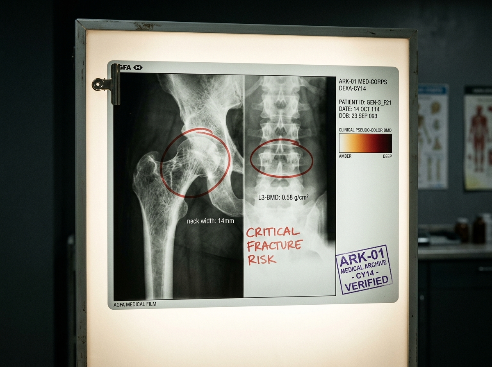

# ARK-01 船载医务部第 14 期世代骨密度退化与视盘水肿筛查通报

**发文编号**：MED-ARK01-2261-CY14  
**签署日期**：航渡第 112 航行年 · 周期 41 · 顺光日  
**密级**：限主甲板管理委员会 / 环控与重力调度司 / 各综合学校医务室 阅  
**签署人**：首席临床医师 林斯咏（第二代，工号 MED-0842）、副主任放射技师 考夫曼（第三代，工号 RAD-1109）

---




### 一、 普查背景与采样基数

本期普查针对生活在 **第二旋转承压环（0.65g 标准自转工况）** 及长期轮岗于 **中央零重力轴心货运区（0.002g）** 的第 3 世代乘员（出生于航行年 85—105 年间）。

* **参检总人数**：2,140 人（第 3 世代全员覆盖率 98.4%）
* **检测手段**：双能 X 射线骨密度仪（DEXA-04 型，感光胶片背光数字化扫描）、相干光断层眼底扫描（OCT-Mark III）

---

### 二、 骨矿物质密度（BMD）分析与皮质骨变薄趋势

DEXA 扫描结果表明，由于自转环半径（$R=2.5\,\mathrm{km}$）产生的科里奥利力（Coriolis effect）及长期 0.65g 亚正常重力加载，第 3 代乘员骨骼系统已出现不可逆的代际力学重塑：

```text
================================================================================
部位 / 解剖标本            T-Score 均值 (对比地球基线)   皮质骨厚度变化 (代际萎缩率)
--------------------------------------------------------------------------------
L1-L4 腰椎整体             -2.18 ± 0.34              -14.2% (小梁骨网架疏松)
股骨颈 (Femoral Neck)      -2.65 ± 0.41 (骨质疏松临界)  -21.8% (哈弗斯管微孔扩大)
跟骨 (Calcaneus)           -1.42 ± 0.22              -6.5%  (足底受力保留尚可)
桡骨远端 (Forearm)         -2.88 ± 0.38              -26.4% (非承重骨极度变薄)
================================================================================
```

> **【主检放射医师批注】**：  
> “胶片显影显示，20岁青年乘员的股骨颈皮质骨厚度仅相当于地球母本库中55岁绝经期女性标准。这不是病理突变，而是骨骼对 0.65g 稳态的自适应卸载。如果 88 年后降轨着陆于 $1.07\mathrm{g}$ 的比邻星b，第一批登陆人员在未穿戴外骨骼动力支架时，跌倒骨折率预计将超过 42%。”

---

### 三、 神经眼科筛查：空间飞行相关神经眼综合征（SANS）

在 820 名长期值守中枢轴向轴承及冷凝盲管的微重力检修工中，OCT 扫描检出重度眼底病变：

1. **视盘水肿（Papilledema）**：检出率 31.4%（258 例），眼底静脉充盈迂曲。
2. **眼球后极部扁平化**：因微重力下头向体液转移（Cephalad fluid shift），脑脊液跨筛板压力差持续倒错。
3. **脉络膜皱褶与棉絮斑**：已导致 14 名二级电气技师出现中心视野暗点。

---

### 四、 临床干预与处方决议

1. **钙磷代谢强制干预**：
   - 即日起，二环07食堂及各区营养配给单中，微藻合成蛋白饼内强制添加 $1.8\,\mathrm{g/人·日}$ 碳酸钙微晶粉及维生素 D3 前体（由反应堆中子慢化水副产物紫外光照转化）。
2. **重力梯度代偿负荷**：
   - 轴向微重力作业人员单次连续排班不得超过 14 个自转周期（336 小时），轮换后必须在第三承压环（0.82g 超速加压区）接受每日 90 分钟下体负压（LBNP）训练。
3. **医学归档编号**：
   - 本通报所有 DEXA 骨密度透光胶片已转入低温化学储藏柜（档案盒号：`MED-DEXA-2261-G3-014`），供落地委员会制定《拓荒负重限额标准》参考。

---

```text
[医务部公章：ARK-01 MEDICAL CORPS - CLINICAL ARCHIVES]
[复核签章：林斯咏（手印确认）]
```

---

## 修订记录(元层,非世界内容)

- 2026-08-17 正典重审修复:全文 2252 改 2261(航渡112年;发文编号/档案盒号/canon_check 同步);"80 年后降轨着陆"改"88 年后"(112+88=200=抵达年);"B7 食堂"改"二环07食堂"(避与曙光三环 B7 食堂撞名);参检总人数 4,120 改 2,140(第3世代口径,覆盖率 98.4% 不变);front matter 补 image 字段。
