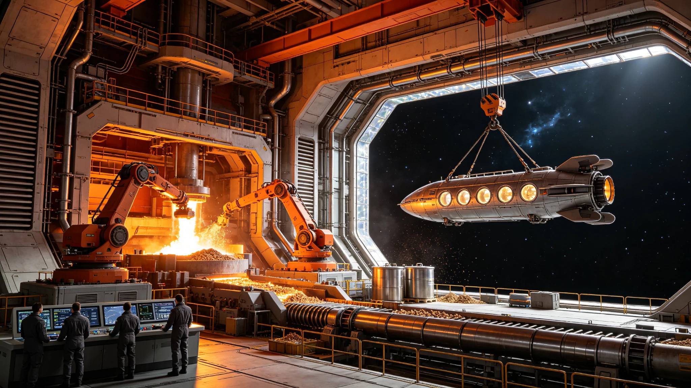

# ARK-01船载工业体系第150航行年全要素自持率核验公报

**船政总署 · 工业与物资管理处**
**文件编号：** 船政工核字〔2300〕第005号
**核验周期：** 2295—2300年度（第五次全要素自持率核验）
**核验范围：** 全船A、B、C三环全部工业制造与回收设施

---

## 一、核验方法

本次核验采用"全要素物料平衡法"，对船载工业体系的原料输入、加工制造、产品分配与废弃回收四个环节进行为期五年的连续追踪。自持率定义为：船内可自产自足的物资品类数占全船消耗物资品类总数的比例，按质量加权计算。

## 二、分行业自持率

| 工业门类 | 主要产品 | 自持率 | 较140年变化 |
|---|---|---|---|
| 金属冶炼与加工 | 钛合金、铝合金、不锈钢 | 94.2% | +2.1% |
| 化工与材料 | 塑料、橡胶、胶粘剂、溶剂 | 87.6% | +3.4% |
| 电子与电气 | 电路板、线缆、传感器 | 71.3% | +5.8% |
| 精密机械 | 轴承、阀门、泵体 | 82.5% | +1.9% |
| 纺织与服装 | 工作服、布料、绳索 | 96.8% | +0.5% |
| 食品加工 | 配给食品、调味品 | 88.4% | +2.7% |
| 医药与化工 | 常用药品、消毒剂 | 63.2% | +4.1% |
| 光学与石英 | 窗板、透镜、光纤 | 78.9% | +3.2% |
| 聚变堆备件 | 第一壁、线圈、靶丸 | 55.6% | +6.3% |

## 三、关键物资物料平衡（近五年均值）

| 物资 | 年消耗量 | 年产量 | 年回收量 | 缺口/盈余 |
|---|---|---|---|---|
| 钛金属 | 420吨 | 386吨 | 31吨 | 缺口3吨 |
| 铜金属 | 85吨 | 72吨 | 11吨 | 缺口2吨 |
| 锂化合物 | 12吨 | 9吨 | 2吨 | 缺口1吨 |
| 稀土元素 | 3.2吨 | 1.8吨 | 1.1吨 | 缺口0.3吨 |
| 石英玻璃 | 180吨 | 165吨 | 12吨 | 盈余-3吨 |
| 碳纤维 | 24吨 | 22吨 | 1.5吨 | 缺口0.5吨 |

## 四、综合自持率

| 指标 | 140航行年 | 150航行年 | 变化 |
|---|---|---|---|
| 品类自持率（未加权） | 78.4% | 83.7% | +5.3% |
| 质量加权自持率 | 85.1% | 89.2% | +4.1% |
| 关键备件自持率 | 62.8% | 69.5% | +6.7% |
| 废弃物资回收率 | 91.2% | 94.6% | +3.4% |

## 五、不可自持物资清单（部分）

以下物资因原料枯竭或工艺能力不足，目前仍依赖启航时库存，需严格配给：

| 物资 | 剩余库存 | 预计耗尽年份 | 替代方案进展 |
|---|---|---|---|
| 铂族金属催化剂 | 0.8吨 | 2340年 | 铁基催化剂替代试验中 |
| 高纯度硅晶圆 | 1.2万片 | 2360年 | 船载区熔法产能建设中 |
| 特种光刻胶 | 300升 | 2335年 | 配方简化替代研究 |
| 医用同位素 | 逐年衰减 | 2325年 | 船载中子活化生产可行性评估 |

## 六、结论与建议

船载工业体系第150航行年全要素质量加权自持率达89.2%，较十年前提升4.1个百分点。体系整体运行稳定，回收体系持续优化。建议：（1）优先攻克电子与医药门类自持瓶颈；（2）建立不可自持物资的替代研发专项；（3）减速段与抵达后工业需求应在2320年前完成产能规划。

**船政总署工业与物资管理处**
**2300年4月22日**
