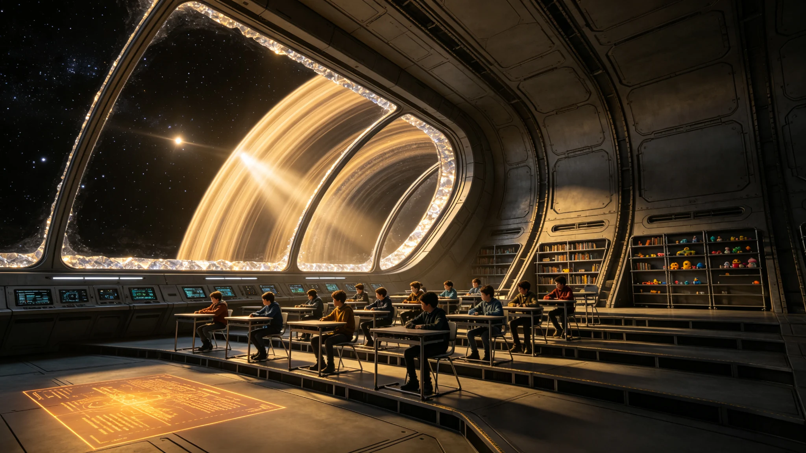

# ARK-01船载教育体系第160航行年课程改革与失锚词处置公报

**船政总署 · 教育与文化处**
**文件编号：** 船政教改字〔2310〕第008号
**改革周期：** 2310—2320学年
**适用范围：** 全船12所综合学校、3所职业技术学校

---

## 一、改革背景

航行一百六十年来，船内语言经历了显著的代际漂移。全船词汇使用频率调查显示，约1,200个地球原生概念词在船生四代（10—18岁）群体中的理解正确率低于60%，其中340词低于30%，被界定为"失锚词"——即词义与原始指称物脱节、仅作为抽象符号或隐喻存在的词汇。本次课程改革核心任务之一即建立失锚词的标准化处置机制。

## 二、课程结构调整

| 课程模块 | 原课时占比 | 新课时占比 | 调整内容 |
|---|---|---|---|
| 语言与文学 | 22% | 18% | 压缩古典文学，增加船内当代文本 |
| 数学与逻辑 | 18% | 18% | 不变 |
| 物理与工程 | 16% | 20% | 增加飞船系统实操课时 |
| 生态与农业 | 10% | 14% | 增加水培舱实习与生态循环课 |
| 历史与社会 | 12% | 10% | 地球史压缩为通识模块 |
| 艺术与音乐 | 8% | 8% | 不变 |
| 职业导向 | 10% | 8% | 提前至14岁分流 |
| 失锚词专题 | 0% | 4% | 新增必修模块 |

## 三、失锚词分类与处置

| 类别 | 定义 | 典型词例 | 数量 | 处置方式 |
|---|---|---|---|---|
| A类：可体验 | 船内有近似体验可类比 | 雨、风、海、山 | 187 | 标注"类比义"，配物理模拟体验 |
| B类：可推理 | 可通过物理知识推导理解 | 彩虹、潮汐、地震 | 96 | 标注"推定义"，配原理解说 |
| C类：纯抽象 | 仅存于文本与影像，无体验可能 | 雪、森林、沙漠 | 42 | 标注"历史词义"，配档案影像 |
| D类：已异化 | 词义已发生根本性漂移 | 阳光（现指石英窗透光）、天空（现指舱顶） | 15 | 保留新义，旧义标注"古义" |

## 四、失锚词教学示例

| 词语 | 原义（地球） | 船生四代理解调查 | 标准处置标注 |
|---|---|---|---|
| 雨 | 大气中水汽凝结降落 | 42%知道原义，58%以为"舱内冷凝滴水" | A类·类比义 |
| 森林 | 大面积树木群落 | 28%知道原义，多数以为"水培舱" | C类·历史词义 |
| 阳光 | 太阳直射光 | 71%理解为"石英窗透入光" | D类·保留新义 |
| 海洋 | 大面积咸水水域 | 19%知道原义，多数以为"储水罐" | C类·历史词义 |
| 风 | 空气流动 | 63%知道原义，但体验仅限通风管道气流 | A类·类比义 |

## 五、教材修订

本次改革涉及修订教材47种，其中：
- 删除地球地理中无法体验的章节12章（如"气候带""洋流系统"），改为"地球环境档案"选修
- 新增《船载生态系统》《飞船工程基础》《失锚词手册》三种必修教材
- 古典文学作品中失锚词加注脚，注脚采用"原义—船内类比—使用建议"三段式

## 六、争议与说明

改革方案在审议中收到异议37件，主要集中于：（1）地球史压缩是否导致文化断裂；（2）D类词"保留新义"是否等于承认词义篡改。教育处答复：地球史作为通识模块保留核心脉络，不构成断裂；D类词新义已在日常语言中固化，强行恢复旧义反致交流障碍，标注古义即完成历史传承。

**船政总署教育与文化处**
**2310年8月10日**
