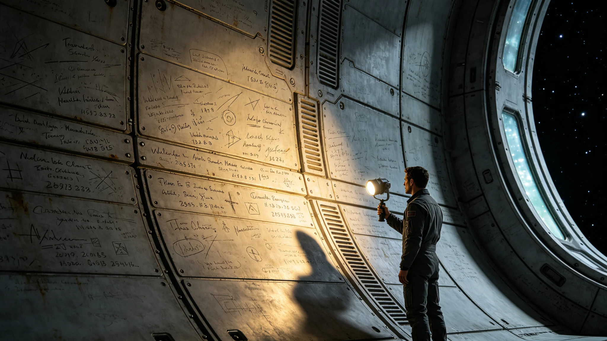

# ARK-01船载文化遗产第170航行年舱壁刻痕普查与拓存公报

**船政总署 · 文化遗产处（联合船载民间记忆学社）**
**文件编号：** 船文遗普字〔2320〕第002号
**普查周期：** 2318—2320年
**普查范围：** 全船公共走廊、气闸间、维修通道等非承压舱壁（不含居住舱私人区域）

---

## 一、普查背景

舱壁刻痕是船内最广泛的民间文化遗存。自启航以来，乘员在工作间隙、等候排队、情绪波动时，以钥匙、改锥、指甲等在金属舱壁上留下刻痕。这些刻痕未经官方规划，却构成了航行史的草根记录。本次普查为第三次全船刻痕普查，首次采用高分辨率光学扫描与硅胶翻模双轨记录。

## 二、刻痕总量与分布

| 舱段 | 普查面积(m²) | 刻痕总数 | 密度(处/m²) | 最早可辨年份 |
|---|---|---|---|---|
| A环公共走廊 | 4,200 | 18,642 | 4.4 | 2151 |
| B环公共走廊 | 5,800 | 31,207 | 5.4 | 2150 |
| C环公共走廊 | 3,600 | 12,884 | 3.6 | 2153 |
| 气闸间（全船42处） | 840 | 7,421 | 8.8 | 2150 |
| 维修通道 | 2,100 | 5,633 | 2.7 | 2155 |
| 食堂等候区 | 320 | 4,108 | 12.8 | 2151 |
| **合计** | **16,860** | **79,895** | **4.7** | **2150** |

## 三、刻痕类型统计

| 类型 | 定义 | 数量 | 占比 |
|---|---|---|---|
| 姓名缩写 | 姓名首字母或工号后四位 | 28,762 | 36.0% |
| 日期标记 | 航行年/公元年/个人纪念日 | 15,180 | 19.0% |
|  tally计数 | 正字/五道杠等计数符号 | 12,783 | 16.0% |
| 图形符号 | 心形、星形、简笔人脸等 | 9,587 | 12.0% |
| 文字短句 | 名字、留言、诗句、口号 | 7,191 | 9.0% |
| 技术涂鸦 | 公式、电路图、管路草图 | 4,794 | 6.0% |
| 不可辨识 | 重叠/磨损/过浅 | 1,598 | 2.0% |

## 四、重要刻痕选录（已拓存）

| 编号 | 位置 | 内容 | 年代推断 | 等级 |
|---|---|---|---|---|
| BH-001 | B环食堂等候区 | "2150.3.15 最后一眼地球" + 简笔地球 | 2150 | 一级 |
| BH-047 | A环3号气闸间 | 四代人同一位置姓名缩写，跨度2151—2298 | 2151—2298 | 一级 |
| BH-112 | C环维修通道 | 聚变堆管路手绘图 + "第37次漏点" | 2215 | 二级 |
| BH-203 | B环12-B层 | 连续17年生日 tally 计数 | 2188—2204 | 二级 |
| BH-318 | A环中央走廊 | "我们的孩子会见到吗" + 问号 | 2240 | 一级 |

## 五、保护与拓存

本次普查完成一级刻痕拓存87处（硅胶翻模+三维扫描），二级刻痕312处（三维扫描），其余全部完成高清拍照存档。文化遗产处建议：
1. 一级刻痕所在舱壁禁止翻修覆盖，已设金属保护框
2. 食堂等候区（密度最高12.8处/m²）列为"舱壁遗存保护区"
3. 每20年开展一次复查，监测刻痕自然磨损速率

## 六、数据局限

本次普查未覆盖居住舱私人区域（涉及隐私），据抽样估算私人舱壁刻痕总量约为公共区域的1.4倍。部分早期刻痕（2150—2180年）因舱壁翻修已永久消失，据档案记录约损失1,200处。刻痕年代推断基于笔迹风格与叠加关系，存在±5年误差。

**船政总署文化遗产处**
**2320年5月5日**
