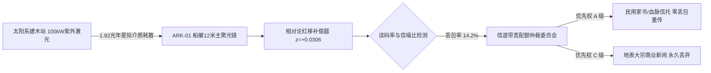

# ARK-01船载激光通信中枢关于太阳系长波信标多普勒频移校准与第118号丢包重传仲裁令

**公文文号**：ARK-COM-2214-ARB-0118  
**签发单位**：ARK-01 船载相干光学通信与深空导航中枢（深空天线阵位：船艉第一射电屏蔽锥）  
**航行状态**：航行第 64 年 / 距太阳系基准点 $1.92 \\text{ ly}$ / 距比邻星系 $2.32 \\text{ ly}$  
**当前航速**：$0.0302c$（标称巡航段） / 单向光通信时延：**701.4 地球日**（约 1.92 地球年）  

---

## 一、激光中继下行链路状态与频移校准

由于飞船沿航向持续高速远离太阳系，星际尘埃消光及狭义相对论纵向多普勒效应引发光波长红移：
$$\lambda_{\text{recv}} = \lambda_{\text{emit}} \sqrt{\frac{1 + \beta}{1 - \beta}} \approx 1.03066 \cdot \lambda_{\text{emit}}$$

船艉光学解调阵列已将接收基准由 $355 \\,\\text{nm}$ 紫外波段动态平移补偿至 $365.88 \\,\\text{nm}$。但在近三个地球月的接收窗口中，由于穿过局部高密度星际氢分子云，第 118 批次下行数据包（总数据量 $4.8 \\,\\text{TB}$）发生大面积相位退相干，物理层误码率（BER）飙升至 $1.42 \\times 10^{-2}$，导致大量冗余纠错帧（LDPC 校验块）溢出崩溃。

---

## 二、信道配额挤压与丢包丢弃仲裁明细

依据《ARK-01 航行期信道资源紧急分配公约》第 9 条，通信总长针对第 118 批次受损数据包作出如下终局仲裁：

| 数据包编号 | 内容分类与来源 | 原始大小 | 损毁状态 | 仲裁决议 | 仲裁理由与执行说明 |
|:---|:---|:---:|:---:|:---:|:---|
| PKT-118-01 | **民用光际家书与血脉信托专包** （含地球顾氏家族致船上叶素后裔信件） | $24.8 \\text{ GB}$ | 校验块损毁 8.2% | **全量重构 / 强制本地修复** | 动用船载量子退火算力进行概率填词重构，缺损字用 `[缺损]` 标记，严禁丢弃。 |
| PKT-118-02 | 地球联合科学院《引力波前沿理论汇编（2210卷）》 | $410 \\text{ GB}$ | 校验块损毁 3.4% | **排队请求太阳系单向重发** | 属于二级科学典籍，登记入三年后重传队列。 |
| PKT-118-03 | 地球泛欧亚大陆第 14 届民间交响乐节多轨原声母带 | $1.8 \\text{ TB}$ | 校验块损毁 21.0% | **有损降噪压缩入库** | 自动降级为单声道 64kbps 存档，释放缓存区。 |
| PKT-118-04 | 地月系大宗碳氢资源现货交易指数与衍生品月报 | $2.5 \\text{ TB}$ | 校验块损毁 34.5% | **【永久丢弃 / 不予重传】** | 船内已与太阳系经济体物理断联半世纪，此类数据无任何生存与工程价值。 |

---

## 三、典型修复家书片段抄录（公证书附录）

> **【修复后家书抄件片段】**  
> 发件人：地球华东南岸海堤管理站 顾清秋（第五代孙 顾明道）  
> 收件人：ARK-01 农业二区 叶素（第三代孙 叶思源）  
> 日期标戳：地球历 2212年10月11日发 / 船历 2214年08月29日解编  
> 
> *“……思源表哥（按家谱排辈）：太湖边的老银杏树今年又落了满地黄叶。按算力中心的信道账单，发这封信要扣除老宅三年的潮汐发电分红。家里一切都好，海堤上的无人机已经换成了第七代……你们在深空里抬头还看得见太阳吗？这里夜里的海浪声，我录了十秒放在附件包里，不知 `[数据缺失52字节]`……愿你们平安。”*

---

**通信值班总长**：林默（签字）  
**船载算力仲裁官**：艾哈迈德（签字）  
**归档**：ARK-01 中央档案库通信专卷
