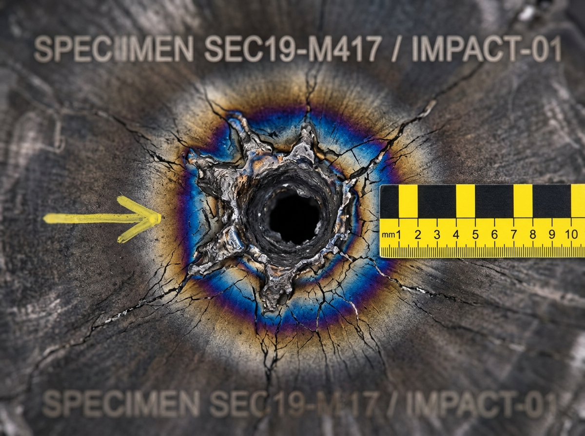

# ARK-01 防辐射外装甲第 19 扇区微流星贯穿事故技术鉴定与定责报告

**报告编号**：ENG-DMG-2349-SEC19-009  
**鉴定日期**：航行年 199 · 周期 19 · 逆光半周期  
**承办机构**：外壳结构安全监察局 / 损伤法证实验室  
**现场取证工程师**：瓦西里·柯林斯（主检，工号 ENG-STR-4402）、苏晓曼（无损探伤技师，工号 NDT-0188）

---



### 一、 制动段撞击风险背景

本船自第 186 航行年（地面历 2335 年）起实施磁帆制动，船速自巡航值 0.03c（约 9,000 km/s）持续下降。至本事件发生的第 199 航行年，船速已降至数十 km/s 量级。

巡航段的撞击威胁形态与本事件截然不同。0.03c 巡航下，星际介质中微米级尘埃相对动能处于峰值，毫米级以上碎片若侧向命中任何结构都将造成灾难性后果；但巡航段威胁由前向磁盾与注水冰盾全向承担，航路雷达（LIDAR-NAV）对毫米级以上目标可提前识别规避，故历次撞击记录均为前向扇区冰面汽化剥蚀，后果止于扇区级，从未发生装甲贯穿。

制动段威胁形态出现两个变化：

1. **前向遮蔽失效**：船速降至 km/s 级后，前向盾的"蒸发-吸收"冗余不再绝对，侧向扇区首次暴露于低速碎屑威胁。低速（数十至数百 km/s）撞击不再将撞击体完全等离子体化，毫米级碎屑可保持结构完整性贯穿多层装甲，其损伤形态与巡航段截然不同。
2. **碎片来源本土化**：磁帆张帆初期帆面边缘剥离残片（数十克至数千克）、冰盾表面低温蒸发凝华物（毫克级微粒）、以及深空低速本底微粒（微克至毫克级），相对速度与船速同量级，无法以巡航段雷达门限识别。

制动段碎屑动能已降至巡航段的约十万分之一（速度比平方），本局自第 194 航行年起将雷达免责门限由 D<2mm 上调至 D<5mm。本事件表明，5 mm 以下高速硅酸盐微粒在制动末段仍具贯穿能力，门限复核已列入下一航行年度计划。

**附：历次外装甲撞击记录（节选，完整卷宗存外壳结构安全监察局）**

| 航渡年份 | 扇区 | 撞击体 | 相对速度 | 处置 |
|---|---|---|---|---|
| 第 57 年 | 前向冰盾 01 扇区 | 微米级尘埃团 | ≈9,000 km/s | 冰面汽化剥蚀，例行熔补，扇区级 |
| 第 103 年 | 前向冰盾 02 扇区 | 微米级尘埃团 | ≈9,000 km/s | 同上 |
| 第 157 年 | 前向冰盾 03 扇区 | 微米级尘埃团 | ≈9,000 km/s | 同上 |
| 第 193 年 | 艏侧 08 扇区 | 毫米级碎屑 | ≈400 km/s | 局部穿孔，自动熔断封堵，扇区级 |
| 第 199 年 | 第 19 扇区 | 0.082 g 硅酸盐微粒 | 32.4 km/s | 贯穿事故，靶板回收取证，本报告定责 |

---

### 二、 事件概述

航行日 72,685 周期 03:14:09 UTC，飞船艏部向日侧防辐射外甲 **第 19 扇区（外层注水冰屏蔽层下方第 3 承力肋位）** 触发超声波失压与动能冲击警报。

外壳自动熔断系统（Pyro-seal）在 42 毫秒内完成局部气闸自锁，未造成加压主舱失压。维保班组在 6 小时后实施 EVA 出舱切割，回收了受损的 $800\times 800\,\mathrm{mm}$ 复合装甲靶板试样（标本编号：`SPEC-SEC19-M417`）。

---

### 三、 宏观法证物证与几何测量记录

根据损伤法证实验室在环形无影 LED 测绘台上的高精度光学扫描与宏观微距摄影（附 $100\,\mathrm{mm}$ 黄黑标准法证标尺）：

```text
================================================================================
测量项目               实测参数 / 物理形态
--------------------------------------------------------------------------------
撞击物估计属性         星际硅酸盐微流星体，质量约 0.082 克，相对撞击速度 ~32.4 km/s
前部迎弹孔 (穿入孔)    直径 4.82 mm 规则圆形穿孔，孔边缘呈现超高速熔融金属飞溅反卷唇边
热退火变色环           穿孔周围 15 mm 范围内呈现清晰同心钛合金高温退火氧化彩环 (紫-金-深蓝)
陶瓷缓冲层破损形态     第二层碳化硅 (SiC) 装甲呈典型脆性赫兹锥形碎裂 (碎裂角 48°)
注水冰吸能层表现       第三层 5 米注水冰层局部汽化空腔直径 340 mm，空腔内壁重结晶良好
内层承压壁背面损伤     第四层 TC4 钛合金承压壁内表面出现 1.2 mm 高局部后凸变形，背部微裂纹 0.18 mm
================================================================================
```

> **【宏观金相显微镜观察批注】**：  
> “截面金相显微照片显示，内层钛合金背部未发生层裂（Spallation）击穿，仅在晶界处观察到微量沿晶微裂纹。Whipple 间隙设计成功使撞击物在穿透前两层时完全等离子体化，能量在注水冰层中完全衰减。黄色记号笔已在试样正面标出微流星体入射俯角（倾角 $17.4^\circ$）。”

---

### 四、 责任鉴定与定责结论

1. **结构设计合规性**：
   - 19 扇区外层装甲的能量耗散表现完全符合《ARK-01深空航行结构冗余规范》（STD-ARK-002）第 8.4 款要求。
2. **预警雷达盲区核查**：
   - 本次撞击物直径小于航路雷达（LIDAR-NAV）有效反射截面门限（$D < 5\,\mathrm{mm}$），属制动段不可规避的本底微粒碰撞，免除雷达值守组责任。
3. **维保处置裁决**：
   - 现场切割试样移交档案库长期保存（物证箱号：`CRIME-ENG-2349-09`）；
   - 19 扇区受损部位已通过外层电子束就地熔融补焊玄武岩防辐射补丁（厚度 80 mm），通过氦质谱检漏，评定为“一级适航恢复”。

---

```text
[监察局印章：ARK-01 HULL INTEGRITY & FORENSIC BUREAU]
[现场勘验复核：瓦西里·柯林斯（电子工签生效）]
```

---

## 修订记录(元层,非世界内容)

- 2026-08-17 正典重审修复:事件由航渡第108年(2248年)巡航期平移至第199年(2349年)磁帆制动末段——航行年/航行日(72,685)/报告编号(ENG-DMG-2349-SEC19-009)/物证箱号(CRIME-ENG-2349-09)/canon_check 同步;损伤表全盘保留;新增「制动段撞击风险背景」节并附历次撞击序列表(巡航段事件相对速度≈9,000 km/s、后果止于扇区级;制动段事件速度量级与减速进度自洽);雷达免责门限 D<2mm 改 D<5mm(0.082g 硅酸盐直径≈3.7mm,算术愈合,定责免责成立);front matter 补 image 字段。
