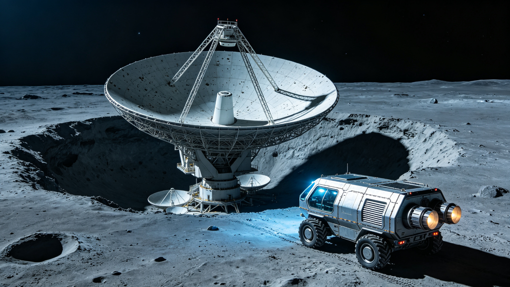

# 月球背面冯·卡门撞击坑射电静默观测基地首期建成公报

**发文编号：** FARSIDE/2043/COM-001
**发布机构：** 月球背面射电观测基地国际建设管理局
**发布日期：** 2043年7月15日

## 一、基地建设概况

月球背面冯·卡门撞击坑射电静默观测基地（以下简称"基地"）首期工程于2040年3月开工，历时3年4个月，于2043年7月10日通过竣工验收。基地位于冯·卡门撞击坑中心偏北区域，坑底海拔低于月球平均半径2.3公里，撞击坑边缘的天然地形遮挡可将来自地球的射频干扰（RFI）衰减至-120 dBm以下。

首期工程建设内容包括：1座直径150米的固定球面射电望远镜（LS-150）、4座直径30米的可转向射电望远镜（LS-30阵列）、1座数据处理与通信中心、1座无人值守运维站、以及总长度12.7公里的射频干扰屏蔽围栏。基地总建设成本为47.3亿美元，由12个参与国按约定比例分摊。

## 二、射电静默区管理

基地周边划定了半径50公里的射电静默核心区和半径200公里的射电静默缓冲区。核心区内禁止任何非授权的射频发射活动，包括着陆器通信、漫游车遥测、以及人员定位信标。所有进入核心区的作业车辆必须使用有线通信或激光通信。

缓冲区实施射频发射许可制度，所有发射活动须提前72小时向基地频谱管理办公室申报，经评估对观测的干扰低于-180 dBm/Hz后方可实施。2043年上半年共收到缓冲区发射许可申请47件，批准42件，驳回5件（均为着陆器下降段的通信频段与观测频段冲突）。

基地自身的通信系统采用两条独立链路：数据通过中继卫星在月背轨道上接收后转发至地球，通信频段严格限制在Ku波段的指定子频段内；运维遥测使用激光通信链路，不产生射频泄漏。竣工验收阶段的射频干扰测量显示，基地核心区的背景射频噪声水平为-205 dBm/Hz（10 MHz频段），达到设计指标。

## 三、望远镜系统性能指标

LS-150固定球面射电望远镜的有效接收面积为14,300平方米，工作频段覆盖50 kHz–100 MHz。该频段是观测宇宙黎明时期21厘米氢线红移信号的关键窗口，在地球上因电离层扰动和人为射频干扰而几乎无法进行高灵敏度观测。

LS-30阵列由4台直径30米的可转向望远镜组成，基线长度为2.3公里，工作频段覆盖100 MHz–10 GHz。阵列的角分辨率在10 GHz频段为0.3角秒，可用于脉冲星测时阵列和活动星系核的高精度观测。

系统温度在5–50 MHz频段低于50 K，达到了月背射电观测的预期性能。在50 kHz以下的极低频段，系统温度受银河系同步辐射主导，升高至380 K，仍在可接受范围内。

## 四、首期试观测计划

基地将于2043年8月1日启动首期科学试观测，为期6个月。试观测的核心项目为宇宙黎明21厘米信号巡天，观测天区为南天极附近200平方度的区域。同时开展的验证项目包括：脉冲星测时阵列的月背基线测试、太阳射电爆发的低频频谱监测、以及木星磁层射电辐射的偏振测量。

试观测期间的数据处理在基地数据中心完成初步校准后，通过中继卫星链路下传至地球，日均数据量为2.8 TB。科学数据将经过12个月的团队专属分析期后向全球研究者开放。

基地的二期扩建工程规划已进入可行性研究阶段，计划在2047年前后启动，主要内容包括增加4台LS-30望远镜将阵列基线扩展至8公里、以及建设1座直径500米的低频阵列天线场。

**抄送：** 国际天文学联合会、各参与国航天机构、射电天文频谱管理国际委员会
