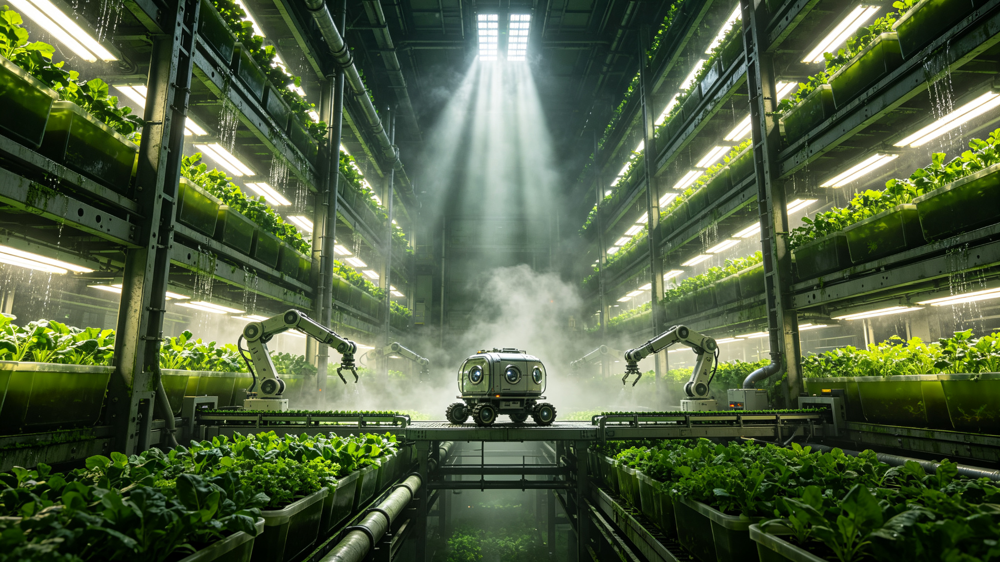

# 全球首个全自动化垂直农业塔群建成与城市食物自给率突破公报

**发文单位**：全球城市农业基础设施管理局 · 垂直农业工程技术中心
**公报编号**：VFA-2083-CN-007
**签发日期**：2083年11月20日
**密级**：公开

## 一、项目概况

"青禾"垂直农业塔群位于长江三角洲城市群西翼，占地14.7公顷，由12座单体农业塔及中央加工配送枢纽组成。项目于2078年3月奠基，2083年10月31日完成竣工验收并投入全负荷运行，建设周期68个月。总投资折合2083年不变价47.3亿元，其中中央财政补贴占35%，城市建设债券占40%，社会资本占25%。

每座农业塔为钢筋混凝土—钢混合结构，地上62层、地下4层，建筑高度248米，单塔有效种植面积8.4万平方米（按各层种植面累加计算），塔群总有效种植面积100.8万平方米，相当于1,410亩传统耕地。

## 二、技术体系

### 2.1 全自动化种植系统

塔群采用第三代全自动化垂直种植技术体系，核心特征为"无人化生产、机器人运维、闭环资源循环"：

- **移栽机器人**：每塔配置18台六轴移栽机械臂，负责播种、移栽、采收全流程操作，定位精度±0.5毫米，单臂日均处理植株2,400株
- **智能输送系统**：各层种植托盘沿环形轨道自动流转，从播种区到生长区再到采收区，全程无需人工搬运，流转周期根据作物品种自动调整（叶菜类14–21天，果菜类45–60天）
- **环境精准控制**：每层独立控制温度、湿度、光照、CO₂浓度、气流速度，传感器密度为每2平方米1组，控制响应延迟小于30秒
- **病虫害AI识别**：高光谱成像系统每6小时对全部植株扫描一次，病虫害识别准确率99.2%，发现异常后自动启动靶向处理（局部紫外照射、天敌昆虫释放、生物农药喷洒）

### 2.2 光源与能源

塔群采用全人工光方案，不依赖自然光。光源为高效固态发光面板，光谱经作物光合效率优化（红:蓝=4:1，含5%远红光），光电转换效率42.7%。单塔光源总装机功率3.2兆瓦，塔群总装机38.4兆瓦。

能源供给方面，塔群配套建设一座5兆瓦分布式聚变热电联供站（2082年并网），以及12兆瓦时的储能装置。农业生产用电占聚变站出力的76.8%，余热全部回收用于塔群供暖与水加热。全系统能源利用效率（一次能源到生物量）为6.3%，较传统温室（1.8%）提升3.5倍。

### 2.3 水与营养闭环

- **水回收率**：96.5%，主要损耗为作物蒸腾与产品含水带出
- **营养液循环**：采用深水培（DWC）与营养液膜技术（NFT）混合方案，营养液每72小时全量过滤消毒一次，EC值与pH实时闭环控制
- **固废处理**：不可食用生物量（根系、残叶）进入塔式厌氧发酵系统，产生的沼气用于补充能源，沼渣经处理后作为有机肥料回用于栽培基质

## 三、产能与食物自给率

### 3.1 设计产能

塔群全负荷运行后的年产能估算：

| 品类 | 年产量（吨） | 占比 | 主要品种 |
|------|-------------|------|---------|
| 叶菜类 | 48,600 | 43.2% | 生菜、菠菜、小白菜、芝麻菜、羽衣甘蓝 |
| 果菜类 | 27,300 | 24.3% | 番茄、黄瓜、甜椒、茄子、草莓 |
| 根茎类 | 12,800 | 11.4% | 萝卜、胡萝卜、马铃薯（矮化品种） |
| 食用菌 | 9,400 | 8.4% | 平菇、杏鲍菇、金针菇、香菇 |
| 微藻与蛋白 | 7,200 | 6.4% | 螺旋藻、小球藻、单细胞蛋白 |
| 香草与调味 | 4,100 | 3.7% | 罗勒、薄荷、香菜、小葱 |
| 其他 | 3,000 | 2.6% | 芽苗菜、花卉（少量） |
| **合计** | **112,400** | **100%** | — |

### 3.2 城市食物自给率影响

塔群服务范围覆盖周边三个城市的核心城区，服务人口约840万。根据城市农业管理局的测算模型，塔群投产后：

- 服务区域内新鲜蔬菜自给率从当前的34.7%提升至61.2%
- 食用菌自给率从28.1%提升至52.6%
- 城市食物系统的运输碳足迹减少约180万吨/年（按减少长距离运输的蔬菜量折算）
- 城市热岛效应在塔群周边2公里范围内有可测量的缓解（夏季平均气温降低0.3°C）

## 四、运维与人员

塔群全自动化运行后，日常运维团队编制为1,240人，其中：系统工程师与技术维护380人、农艺师与品质管理260人、加工与配送420人、管理与行政180人。

与同等产能的传统农业（需约12,000名农业劳动力）相比，劳动生产率提升约10倍。运维人员平均受教育年限为15.2年，其中农业工程、自动化、生物技术相关专业背景占78%。

## 五、经济效益

塔群年运营收入估算为38.6亿元（按当前城市农产品平均批发价格计算），年运营成本21.4亿元（含能源、人工、折旧、维护），年净收益17.2亿元，投资回收期约7.4年。若计入碳减排收益与城市生态服务价值，综合投资回收期可缩短至5.8年。

## 六、推广计划

根据全球城市农业基础设施管理局的部署，"青禾"塔群作为首个全负荷运行的全自动化垂直农业示范项目，其技术方案与运营经验将标准化并向全球推广。计划到2090年，在全球人口超过500万的城市中建设至少60座同类型塔群，覆盖城市人口约4.2亿，使全球城市蔬菜平均自给率提升至45%以上。

**签发**：垂直农业工程技术中心主任 方晓耘
**审核**：全球城市农业基础设施管理局副局长 马库斯·韦伯
**抄送**：各城市农业管理部门、聚变能源管理局、城市规划研究院、档案登记处
