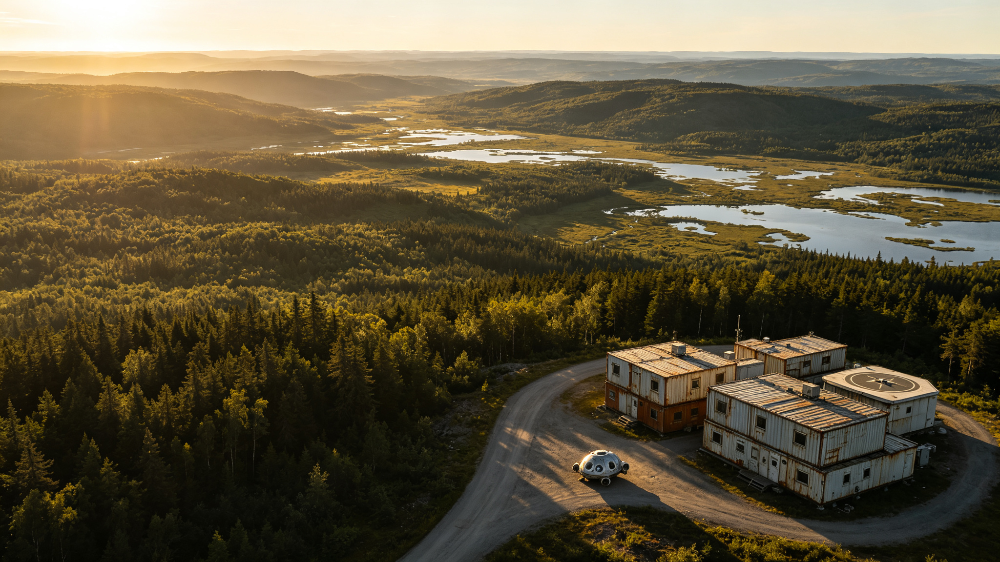

# 地球首个"原乡保护区"设立与低密人口带迁出安置公报

**发文单位**：全球生态恢复与人口布局管理委员会 · 原乡保护专项办公室
**公报编号**：HLR-2163-001
**签发日期**：2163年5月22日（国际生物多样性日）
**密级**：公开

## 一、设立背景

自22世纪中叶以来，随着全球人口持续向高密度城市带集聚、垂直农业与聚变能源的普及使人类对土地的直接依赖大幅降低，地球表面出现了大面积的人口低密度带。这些区域的人口持续外流，基础设施老化，经济活动萎缩，但同时也为大规模生态恢复提供了前所未有的机遇。

根据全球生态恢复与人口布局管理委员会2158年发布的《地球表面生态恢复潜力评估报告》，全球约有3,800万平方公里的土地（占陆地总面积的25.3%）具备"主动生态恢复"的条件——即通过人为减少人类活动干扰，使生态系统在数十年至数百年尺度上自然恢复至接近工业化前的状态。

在此背景下，委员会提出"原乡保护区"（Homeland Reserve）概念：选择具有重要生态价值、当前人口密度已低于阈值的区域，通过有序的人口迁出与土地利用方式转变，设立永久性的生态恢复保护区，让自然在这些区域重新主导。2160年，委员会确定首个原乡保护区试点区域，并启动筹备工作。

## 二、保护区概况

首个原乡保护区命名为"青川原乡保护区"，位于欧亚大陆东部内陆，总面积47.3万平方公里，范围涵盖3个省级行政区的部分区域。保护区设立前的人口密度为11.2人/平方公里（2160年统计），远低于全国平均水平（184人/平方公里）。

### 2.1 生态价值

保护区区域具有以下重要生态价值：

- **温带森林生态系统**：区域内现存天然次生林面积约18.7万平方公里，是欧亚大陆东部最大的连片温带次生林区之一，拥有维管植物约2,800种、脊椎动物约420种
- **河流源头与水源涵养**：区域内有3条主要河流的发源地，年径流量约480亿立方米，下游影响人口约2,300万
- **湿地与候鸟栖息地**：区域内有各类湿地约3.2万平方公里，是东亚—澳大利西亚候鸟迁徙路线上的重要停歇地与繁殖地，每年过境候鸟约1,200万只
- **碳汇潜力**：根据生态模型估算，若区域内生态系统恢复至接近原生状态，年碳汇量可达2.8亿吨CO₂当量，相当于当前全球年碳排放的0.7%

### 2.2 保护区功能分区

- **核心保护区**（18.7万平方公里）：严格保护，禁止任何形式的人类永久居住与经济活动，仅允许经批准的科学监测人员短期进入（每年累计不超过30人日/平方公里）
- **生态恢复区**（21.4万平方公里）：以生态自然恢复为主，辅以有限的人工恢复工程（如关键物种重引入、入侵物种清除、水文修复），允许监测与研究人员常驻（每平方公里不超过0.1人）
- **缓冲与过渡带**（7.2万平方公里）：允许低密度的生态旅游（每年游客容量不超过50万人次）、传统非木材林产品采集（仅限注册的原居民社区）、以及生态研究与教育活动

## 三、人口迁出安置

### 3.1 迁出人口规模

保护区设立前，区域内常住人口约530万人。根据人口布局管理委员会的规划，核心保护区与生态恢复区内的人口需全部迁出，缓冲与过渡带内的人口可自愿选择迁出或留下（但需转为生态保护相关职业）。

需迁出人口约412万人，其中核心保护区内约87万人、生态恢复区内约325万人。缓冲与过渡带内约118万人中，预计自愿迁出约60万人，留下约58万人（转为生态管护、生态旅游等职业）。

### 3.2 迁出原则与政策

人口迁出工作遵循以下原则：

1. **自愿原则**：所有迁出均以居民自愿为前提，不实施强制搬迁。对不愿迁出的居民，在缓冲与过渡带内提供安置选项；对坚持在核心保护区居住的极少数居民，提供"生态守护者"特殊岗位（编制不超过200人），其职责为生态监测与传统知识记录
2. **充分补偿原则**：迁出居民获得的补偿包括：住房置换（在迁入地提供不小于原住房面积的新建住房）、就业安置（提供职业培训与就业推荐）、一次性经济补偿（按家庭人口计算，人均约相当于当地5年平均收入）、社保接续（养老、医疗等社保关系无缝转移）
3. **文化传承原则**：对迁出区域内具有历史文化价值的村落、建筑、非遗项目，进行数字化记录与实物迁移（可移动文物迁至迁入地的文化中心），原居民的文化传统在迁入地得到保护与传承

### 3.3 迁入地安排

迁出人口主要安置在以下三类区域：

| 迁入地类型 | 安置人数 | 占比 | 主要城市/区域 |
|-----------|---------|------|--------------|
| 周边中密度城市带 | 198万 | 48.1% | 保护区周边300公里内的8个地级市 |
| 远距离高密度城市带 | 142万 | 34.5% | 沿海三大城市群的卫星城 |
| 新建生态城镇 | 72万 | 17.4% | 保护区缓冲带外缘新建的4座生态城镇 |

新建生态城镇以生态保护与绿色产业为定位，居民主要从事生态旅游、生态农业、环境监测、文化创意等产业。城镇建设采用被动式节能建筑、分布式聚变能源、闭环水资源管理，人均碳排放量为全国平均水平的32%。

### 3.4 迁出进度

迁出工作自2161年启动，分三期执行：一期（2161年）核心保护区内87万人全部迁出；二期（2162年）生态恢复区150万人迁出；三期（2163年）剩余175万人迁出。截至本公报签发之日，一期与二期迁出已全部完成，三期迁出完成率94.7%（剩余约19万人为自愿延后迁出的家庭，已签订迁出协议，承诺在2163年底前完成搬迁）。

## 四、生态恢复措施

保护区设立后，将采取以下生态恢复措施：

1. **基础设施拆除与生态修复**：迁出区域内的公路（除生态监测必需的少数道路外）、电力线路、通信基站等基础设施逐步拆除，拆除后的土地进行地形修复与植被恢复。预计拆除道路总长度约3.7万公里、电力线路约8.4万公里
2. **关键物种重引入**：在生态恢复区内，逐步重引入历史上曾分布于该区域但已局部灭绝的物种，包括灰狼、棕熊、猞猁、原麝等大型哺乳动物，以及若干种濒危鸟类与植物
3. **入侵物种清除**：对区域内的外来入侵物种进行系统性清除，恢复本地物种的竞争优势
4. **水文修复**：拆除区域内的小型水坝与引水设施（除具有重要文化价值的保留外），恢复河流的自然水文节律与连通性
5. **自然演替为主**：生态恢复以自然演替为主、人工干预为辅。委员会的目标是在200年内（至2360年前后），使核心保护区内的生态系统恢复至接近工业化前的状态

## 五、监测与管理

保护区设立专门的管理机构——青川原乡保护区管理局，编制320人，负责保护区的日常管理、生态监测、执法与科研协调。管理局在保护区内设置12个监测站，配备红外相机、声学监测、卫星遥感、水文气象站等监测设备，对生态系统的恢复进程进行长期、系统性的监测。

监测数据每5年发布一次《青川原乡保护区生态恢复评估报告》，向全球公开。首个评估报告计划于2168年发布。

## 六、全球意义与推广

青川原乡保护区作为全球首个原乡保护区，其设立与运行经验将为全球其他地区的类似项目提供参考。根据全球生态恢复与人口布局管理委员会的规划，到2200年，全球将设立至少20个原乡保护区，总面积超过2,000万平方公里，占地球陆地总面积的13%以上。这些保护区将共同构成地球的"生态恢复网络"，为全球生物多样性保护、气候变化应对与人类文明的长期可持续发展提供基础支撑。

**签发**：全球生态恢复与人口布局管理委员会主任 青木健一
**联署**：青川原乡保护区管理局首任局长 高志强
**抄送**：各成员国生态环境部门、国际自然保护联盟、全球生物多样性公约秘书处、档案登记处
