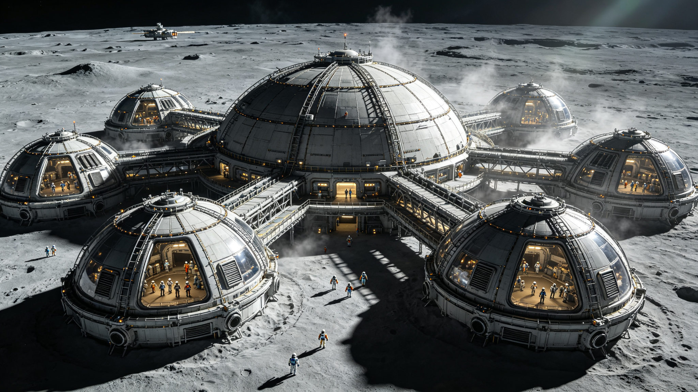

# 月球城市带建城三百周年庆典暨低重力原生公民亚种医学认定公报

**发布机构**：月球城市带联合管理局 / 地外人类生理学研究所
**发布日期**：2373年7月20日
**文件等级**：公开

## 一、建城三百周年

月球城市带前哨基地于2073年7月20日由首批12名常驻人员建立。历经三个世纪，城市带已扩展为包含7座主要穹顶聚居区、3条地下交通干线和12座工业与农业模块的连续人居带，常驻人口普查数为418,672人（2373年第一季度）。

三百周年庆典于7月20日在中央穹顶广场举行，各聚居区通过内部网络同步直播。庆典内容包括历史档案展、低重力运动表演和常驻人员服务年限表彰。累计服务满百年的常驻人员共3,847名，其中最长服务年限为142年。

## 二、低重力原生公民人口统计

截至2373年6月30日，月球城市带中"低重力原生公民"（定义：自受孕至年满18周岁全程在月球表面重力环境（约0.16g）中度过）共计83,415人，占常驻总人口的19.9%。该群体中最年长者出生于2231年，现年142岁。

连续三代及以上均在月球出生并居住的家族共1,206个，涉及人口约34,000人。

## 三、亚种医学认定

地外人类生理学研究所历时十二年完成的"低重力长期居留人类群体生理特征追踪研究"于本月通过同行评审并正式发表。研究基于83,415名低重力原生公民的全生命周期健康数据，得出以下认定结论：

**骨密度与骨架结构**：低重力原生公民平均骨密度为地球标准人群的62%，但骨小梁排列呈现沿受力轴方向的适应性重构，骨折风险在0.16g环境中并未升高。胸廓横径平均增加11%，胸腔容积相应增大。

**心血管系统**：静息心率平均为54次/分（地球标准人群约72次/分），心肌壁厚度减少约18%，但心输出量在低重力环境下足以维持灌注。返回1g环境后出现直立性低血压的比例为100%，需渐进式重力适应训练。

**视觉与神经系统**：眼轴长度平均增加0.8mm，近视患病率为89%（其中高度近视占34%）。前庭系统对线性加速度的敏感度降低，在航天器起降阶段的运动症发病率显著低于地球出生人群。

**生殖与发育**：妊娠期平均为263天（地球标准约280天），新生儿平均体重2.1kg。发育里程碑（坐、立、行）在低重力环境下提前，但精细运动技能发育曲线与地球标准无统计学差异。

**遗传漂变指标**：对连续三代以上月球居留家族的全基因组测序显示，与骨代谢、心血管调节和视网膜发育相关的23个基因位点出现等位基因频率偏移，偏移方向与上述表型适应一致。该结果提示自然选择已在该群体中发生可测量的作用。

基于以上证据，研究所认定：低重力原生公民群体已形成可稳定遗传的生理特征组合，符合《人类亚种分类暂行标准（2360版）》中"环境适应性亚种"的认定条件。建议将该群体正式分类为"智人月居亚种"（*Homo sapiens lunensis*）。

## 四、政策影响

月球城市带联合管理局已设立"亚种认定政策工作组"，将在六个月内就以下事项提出建议：低重力原生公民返回地球的医疗保障标准、跨重力环境婚姻与生育的遗传咨询框架、以及亚种分类在公民身份登记中的法律含义。

本认定不改变任何个人的公民权利与义务，仅作为医学与生物学分类使用。
