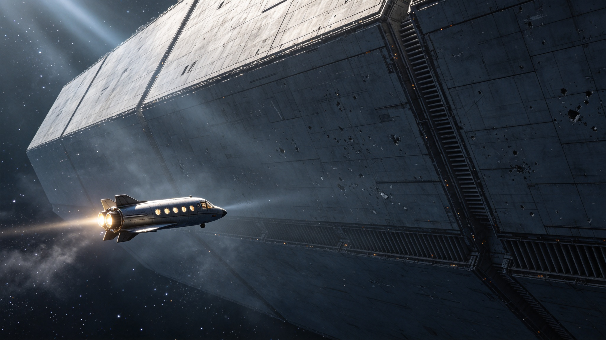

# ARK-01轨道停泊墓场建成暨飞船文物化保护首期工程公报

**发布机构**：深空载具文物保护局（DSVCA）
**发布日期**：2415年5月30日
**文件等级**：公开

## 一、停泊墓场建成

初代跨恒星载人飞船ARK-01于2414年12月完成最后一次自主推进点火，进入预定的环太阳停泊轨道。该轨道位于火星与木星之间的深空区域，半长轴2.7天文单位，倾角0.3度，轨道周期4.4年。飞船在停泊轨道上的姿态已锁定为慢自旋稳定（自转周期4小时），以均衡太阳辐射加热。

"ARK-01轨道停泊墓场"于2415年5月正式通过验收。墓场设施包括：飞船本体（全长3.2公里，最大直径420米）、环绕飞船的三条巡检索道（总长11公里）、以及位于飞船前方5公里处的接驳站（可同时停靠4艘访客穿梭机）。

## 二、飞船历史概况

ARK-01于2150年从地球轨道船坞启航，首批乘员12,000人，设计容量24,000人，目标为比邻星b。飞船采用封闭式循环生命维持系统，设计自持周期为300年。实际航行时间206年，于2356年抵达比邻星b轨道。

在航行期间，飞船经历了以下可记录的重大事件：

- 2143年：三号农业舱真菌污染事件，导致食物储备损失18%，实施配给制14个月。
- 2198年：主推进器轴承磨损超标，全舰减速漂流6年，期间完成轴承更换。
- 2251年：人口达到峰值7,200人，触发空间分配法案修订。
- 2312年：抵达前最后一次中途校正点火。

抵达比邻星b后，ARK-01作为轨道居住平台继续服役58年，至2414年全部人员撤离。飞船上最后一批常驻人员为12名文物登记员，于2414年11月乘最后一班穿梭机离开。

## 三、文物化保护首期工程

首期保护工程（2415-2420）的核心目标为"封存与建档"，具体包括：

1. **船体密封检测与修补**：对全船外壳进行微米级裂纹扫描，已发现微陨石穿透孔1,247处、焊接缝疲劳裂纹389处。全部缺陷已用钛合金补丁完成密封修补，船内气压已恢复至标准大气压的85%（惰性气体填充，非呼吸用气）。

2. **内部舱室封存**：全船共1,847个可独立密封的舱室，已完成1,204个舱室的惰性气体置换和密封。封存前对每个舱室进行了三维激光扫描和全景摄影，数据已存入"飞船数字档案库"。

3. **文物登记**：已登记可移动文物47,230件，包括个人物品、工具、书籍、艺术品和食品包装等。每件文物分配唯一编号，拍摄多角度照片，记录发现位置和保存状态。

4. **防腐处理**：对金属表面进行缓蚀剂喷涂，对有机材料（纸张、织物、木材）进行低温干燥处理。全船温度控制在4°C，相对湿度控制在30%。

## 四、访客规程

接驳站预计于2416年第二季度开放有限访客服务。访客规程要点如下：

- 访客须乘坐经认证的封闭加压穿梭机抵达接驳站，全程不得开启舱门暴露于太空。
- 每批访客不超过8人，须由1名持证讲解员陪同。
- 访客可进入的区域仅限"中央走廊展示段"（长约200米），其余舱室处于封存状态，不得进入。
- 访客须穿戴鞋套和无尘服，不得触摸任何船体表面和文物。
- 禁止携带食品、饮料、墨水笔和任何可能产生碎屑的物品进入展示段。

穿梭机服务由"深空客运公司"运营，票价和班次安排另行公布。

## 五、后续工程规划

第二期工程（2421-2435）计划开放更多舱室作为展示空间，包括一号农业舱（将复原为航行中期的生产场景）和中央广场（将作为纪念空间）。第三期工程（2436-2460）计划在飞船旁建设独立的博物馆建筑，陈列从飞船中移出的脆弱文物。

ARK-01的保护工作是人类首项跨恒星载具文物化项目，所有技术标准和操作规程将作为后续同类项目的参考范本。
