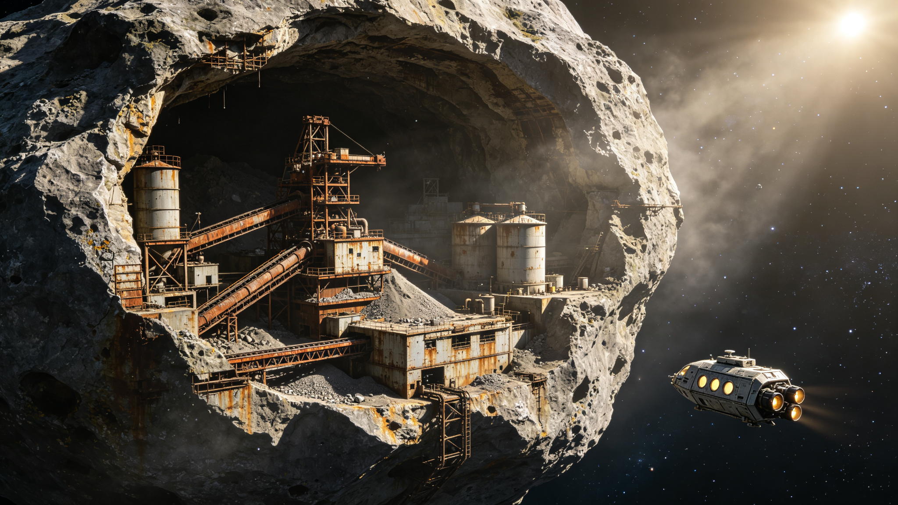

# 主小行星带工业文明遗产保护区设立暨深时考古首期公报

**发布机构**：太阳系遗产保护委员会（SHPC）/ 深时考古研究所
**发布日期**：2570年6月10日
**文件等级**：公开

## 一、保护区设立

太阳系遗产保护委员会于2570年5月正式批准设立"主小行星带工业文明遗产保护区"。保护区范围涵盖主小行星带中已确认的47处废弃工业遗址，分布于谷神星轨道至灶神星轨道之间的多个小行星体上。保护区总面积（含小行星本体和周边50公里缓冲区）约为1,200立方天文单位。

设立保护区的核心动议来自深时考古研究所2565年发布的《主小行星带工业遗址消亡风险评估报告》。报告指出，由于小行星带采矿权在24世纪后期逐步废止，大量早期工业设施处于无人维护状态，面临微陨石撞击、太阳风风化和残余结构应力崩塌等自然消亡威胁。若不采取保护措施，预计至2700年将有超过60%的遗址失去可辨识的结构特征。

## 二、遗址概况

保护区内的47处遗址按功能可分为以下类型：

| 遗址类型 | 数量 | 代表遗址 | 建造年代区间 |
|---------|------|---------|------------|
| 露天采矿场 | 18 | 谷神星北极矿区 | 2150-2280 |
| 地下冶炼厂 | 12 | 灶神星雷亚西尔维亚冶炼综合体 | 2180-2310 |
| 矿石转运站 | 9 | 智神星赤道转运港 | 2200-2350 |
| 居住与服务区 | 5 | 婚神星"深岩镇"居住区 | 2220-2340 |
| 实验与测试设施 | 3 | 灵神星推进剂测试场 | 2250-2320 |

其中规模最大的遗址为灶神星雷亚西尔维亚冶炼综合体，该设施开凿于撞击坑内壁，地下空间总容积约2.8立方公里，高峰时期常驻工人约12,000人。该遗址于2347年停产，此后无人进入。

## 三、深时考古首期调查

深时考古研究所于2568年至2570年开展了保护区首期调查工作。调查团队由42名考古学家、18名结构工程师和12名材料保护专家组成，乘坐"考古者号"封闭加压调查船在小行星带间机动。

首期调查完成了以下工作：

1. **遗址三维测绘**：对全部47处遗址进行了高分辨率激光雷达扫描和摄影测量，建立了厘米级精度的三维模型。扫描数据总量约840TB，已存入"太阳系遗产数字档案库"。

2. **样本采集**：在不破坏遗址结构的前提下，从12处遗址的非关键部位采集了金属腐蚀样本、有机残留物样本和微陨石撞击样本共340件。样本分析正在进行中，初步结果显示部分金属构件的腐蚀速率远低于预期——小行星带的真空环境对工业材料具有天然的保存作用。

3. **"深岩镇"居住区试掘**：对婚神星"深岩镇"居住区的一个完整居住单元（编号DR-0417）进行了系统清理和文物登记。该单元面积约45平方米，最后居住者撤离时间约为2338年。单元内发现物品包括：床铺2张、个人储物柜3个、书籍127本（纸质和电子阅读器）、厨房用具1套、个人信件34封（纸质，已微缩保存）、以及一面贴有照片和便签的墙壁。

DR-0417单元的发现具有重要意义：这是人类首次在地球以外的工业遗址中发现保存完好的"日常生活层"。该单元将作为"时间胶囊"整体封存，未来在博物馆中复原展示。

4. **文字与记录遗存**：在9处遗址中发现了纸质或金属板记录，包括工作日志、安全检查表、排班表和个人笔记。已扫描记录共计约14,000页，正在进行释读和编目。

## 四、保护措施

保护区内的所有遗址已安装"被动监测信标"，信标每72小时发射一次状态信号，报告遗址周边的微陨石通量、温度和结构振动数据。任何异常情况将触发深时考古研究所的应急响应程序。

保护区内严格禁止以下行为：

- 未经授权进入任何遗址内部；
- 在遗址上进行采矿、爆破或任何改变地形的活动；
- 移动、移除或损坏任何遗址结构和文物；
- 在遗址周边50公里范围内进行高能推进器点火。

科研人员进入保护区须申请"遗址准入许可"，每批进入人员不超过6人，须乘坐封闭加压调查船，进入遗址时须穿戴无尘服和鞋套。

## 五、后续计划

第二期调查（2571-2580）计划对灶神星雷亚西尔维亚冶炼综合体进行系统调查，包括地下空间的深入探索和文物登记。第三期（2581-2600）计划在谷神星轨道建设"小行星带工业遗产博物馆"，集中展示从遗址中移出的可移动文物和复原场景。

主小行星带的工业遗址是人类文明"内太阳系工业化时代"的实物见证。这些遗址的保护和研究，对于理解人类文明从单行星向多行星过渡的历史进程具有不可替代的价值。
