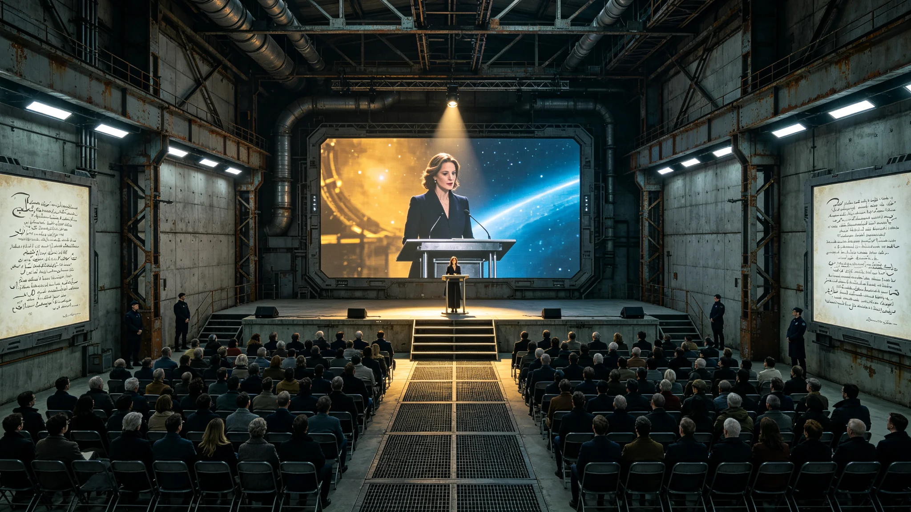

# 跨恒星系"光年诗会"首届举办暨星际文学奖设立公报

**发布机构**：跨恒星系文化交流理事会 / 比邻星b文学艺术界联合会 / 鲸鱼座τ星文化局
**发布日期**：2912年9月1日
**文件等级**：全球公开

## 一、诗会概况

2912年8月15日至8月31日，首届跨恒星系"光年诗会"（Light-Year Poetry Festival）在比邻星b和鲸鱼座τ星同时举办。这是人类文明史上首次跨恒星系同步举办的大型文学活动，标志着人类文明的文化交流进入了"实时跨星系"新时代。

诗会由跨恒星系文化交流理事会主办，比邻星b文学艺术界联合会和鲸鱼座τ星文化局联合承办。诗会主题为"星光下的人类——跨越光年的诗意共鸣"。

诗会主会场设在比邻星b中央广场"文化中心"，分会场设在鲸鱼座τ星新希望地下城"星空大厅"。两个会场通过量子纠缠通信链路实现实时联动，两地的诗人和观众可以实时交流和互动。据统计，诗会期间两地现场参与人数约47万人，通过网络直播观看人数约3.2亿人。

跨恒星系文化交流理事会主席、著名诗人林星河在开幕式上表示："11.9光年的距离，曾经是文化交流不可逾越的鸿沟。一首诗从比邻星b传到鲸鱼座τ星，需要11.9年；收到回音，需要23.8年。今天，量子纠缠通信让这个鸿沟消失了。诗人可以在两个恒星系之间实时对谈，诗歌可以在星光下即时共鸣。这是人类文明史上的文化奇迹。"

## 二、诗会活动内容

首届"光年诗会"内容丰富，包括以下主要活动：

**开幕式暨"星光朗诵会"（8月15日）**：
开幕式在比邻星b和鲸鱼座τ星同时举行。两地的诗人轮流登台朗诵自己的作品，通过量子纠缠通信链路实现实时互动。开幕式上，来自比邻星b的诗人陈宇宙朗诵了他的新作《在两个太阳之间》，来自鲸鱼座τ星的诗人赵拓荒（拓荒者赵拓荒的孙女）朗诵了她的新作《地下城的星空》。两首诗都以"跨恒星系人类的共同命运"为主题，引起了两地观众的强烈共鸣。

开幕式的最后，两地的诗人和观众共同朗诵了一首专门为诗会创作的诗歌《光年之外》。这首诗由12位诗人（比邻星b6位、鲸鱼座τ星6位）联合创作，共6节，每节由一位诗人执笔。诗歌描绘了人类跨越光年、在多个恒星系建立家园的壮丽历程，表达了"无论身在何方，我们都是人类"的共同情感。

**"跨星系诗歌对话"系列活动（8月16日-25日）**：
诗会期间举办了10场"跨星系诗歌对话"活动，每场活动由比邻星b和鲸鱼座τ星的各一位诗人主持，围绕一个特定主题进行对话和朗诵。对话主题包括：
1. 《封闭与开放——穹顶时代与露天时代的诗歌》
2. 《异星的自然——外星风景的诗意表达》
3. 《技术与人文——科技时代的诗歌位置》
4. 《记忆与遗忘——跨恒星系的文化传承》
5. 《孤独与共鸣——深空生活的情感体验》
6. 《语言的边界——多语言环境中的诗歌创作》
7. 《代际的对话——老中青诗人的诗歌传承》
8. 《诗歌与科学——两种认知方式的交汇》
9. 《战争与和平——人类文明的永恒主题》
10. 《未来的诗歌——AI时代的人类创作》

每场对话活动持续约3小时，两地观众可以通过网络实时提问和互动。据统计，10场对话活动的网络观看总人次约1.8亿。

**"诗歌工作坊"和"诗歌进校园"活动（8月16日-28日）**：
诗会期间，两地共举办了47场诗歌工作坊，由著名诗人指导诗歌爱好者进行创作。工作坊内容包括诗歌创作技巧、诗歌朗诵技巧、诗歌翻译等。参与工作坊的诗歌爱好者约8,400人。

同时，诗会还组织了"诗歌进校园"活动，诗人走进两地的127所中小学和大学，为学生们朗诵诗歌、讲解诗歌、指导学生创作。参与活动的学生约24万人。

**"光年诗歌马拉松"（8月20日）**：
8月20日，两地同时举办了"光年诗歌马拉松"活动。活动从上午8时开始，到晚上8时结束，持续12小时。在这12小时内，两地的诗人和诗歌爱好者轮流登台朗诵诗歌，每人朗诵5分钟。活动通过网络全程直播，据统计共有约3,200人登台朗诵，网络观看人次约4,700万。

"光年诗歌马拉松"的高潮出现在下午3时，两地同时进行了"万人共诵"活动——约12万人（比邻星b约8万人、鲸鱼座τ星约4万人）同时朗诵了经典诗歌《仰望星空》（地球时代的著名诗歌）。这是人类文明史上参与人数最多的集体诗歌朗诵活动。

**"星际诗歌翻译工作坊"（8月22日-24日）**：
诗会期间专门举办了"星际诗歌翻译工作坊"，探讨跨语言、跨恒星系的诗歌翻译问题。来自两地的24位翻译家参加了工作坊，共同翻译了12首诗歌（比邻星b诗人的作品6首、鲸鱼座τ星诗人的作品6首），每首诗都翻译成中文、英文和西班牙文三种语言。

翻译家们还讨论了"跨恒星系文化差异对诗歌翻译的影响"等问题。大家一致认为，虽然两地的生活环境和文化背景有所不同，但人类的共同情感（爱、孤独、希望、恐惧等）是相通的，诗歌可以跨越文化和语言的障碍，实现心灵的共鸣。

**闭幕式暨"星际文学奖"颁奖典礼（8月31日）**：
8月31日晚，首届"光年诗会"闭幕式暨"星际文学奖"颁奖典礼在两地同时举行。闭幕式上宣布了"星际文学奖"的获奖名单，并举行了隆重的颁奖典礼。

## 三、星际文学奖设立

在诗会闭幕式上，跨恒星系文化交流理事会正式宣布设立"星际文学奖"（Interstellar Literary Prize）。这是人类文明史上第一个跨恒星系的文学奖项，旨在奖励在跨恒星系文学交流和创作方面做出突出贡献的作家和诗人。

**奖项设置**：
星际文学奖设以下奖项：
1. **星际文学终身成就奖**：奖励在文学创作和跨恒星系文化交流方面做出终身成就的作家。每届评选1名，奖金为100万星元。
2. **星际诗歌奖**：奖励在诗歌创作方面取得突出成就的诗人。每届评选1名，奖金为50万星元。
3. **星际小说奖**：奖励在长篇小说创作方面取得突出成就的作家。每届评选1名，奖金为50万星元。
4. **星际散文奖**：奖励在散文创作方面取得突出成就的作家。每届评选1名，奖金为30万星元。
5. **星际翻译奖**：奖励在跨语言文学翻译方面做出突出贡献的翻译家。每届评选1名，奖金为30万星元。
6. **星际新人奖**：奖励35岁以下有突出潜力的青年作家。每届评选1名，奖金为20万星元。

**评选机制**：
1. 星际文学奖每两年评选一次，首届评选于2912年进行（与首届"光年诗会"同步）。
2. 评选委员会由12名评委组成，其中比邻星b6名、鲸鱼座τ星4名、火星2名。评委由跨恒星系文化交流理事会聘任，任期4年，可连任一次。
3. 评选过程分为初评、复评和终评三个阶段。初评由评委会各奖项小组进行，复评由评委会全体会议进行，终评由评委会主席团进行。
4. 评选标准包括：文学价值、艺术创新、跨文化影响力、人类共同情感表达等。
5. 评选结果在"光年诗会"闭幕式上公布并颁奖。

**首届获奖名单**：
首届星际文学奖的获奖名单如下：
1. 星际文学终身成就奖：陈宇宙（比邻星b，著名诗人，代表作《在两个太阳之间》《穹顶下的歌》等）
2. 星际诗歌奖：赵拓荒（鲸鱼座τ星，女诗人，代表作《地下城的星空》《熔岩管里的春天》等）
3. 星际小说奖：李火星（火星，小说家，代表作《红色星球的孩子》三部曲）
4. 星际散文奖：王比邻（比邻星b，散文家，代表作《造天的日子》《露天时代的随笔》）
5. 星际翻译奖：周文（比邻星b，翻译家，翻译了大量鲸鱼座τ星和火星作家的作品）
6. 星际新人奖：林小星（比邻星b，28岁，青年诗人，代表作《星尘集》）

## 四、诗会成果

首届"光年诗会"取得了丰硕的成果：

**作品成果**：
诗会期间，两地诗人共创作了约1,200首新诗，其中约300首在诗会期间首次朗诵。诗会结束后，组委会精选了200首优秀作品，编辑出版了《光年诗会首届作品集》（中、英、西三种语言版本），该书于2912年10月出版，首印量100万册，上市后迅速成为畅销书。

**文化交流成果**：
诗会期间，两地的诗人、作家、翻译家和文学爱好者进行了深入的交流和互动，建立了广泛的联系和友谊。诗会结束后，有12对诗人（每对比邻星b和鲸鱼座τ星各1人）建立了长期的合作关系，计划联合创作和翻译作品。

**教育成果**：
"诗歌进校园"活动让约24万学生接触了诗歌，激发了他们对文学的兴趣。据组委会的跟踪调查，活动结束后，两地中小学的诗歌社团数量增加了约40%，学生诗歌创作量增加了约60%。

**社会影响**：
诗会在两地社会引起了广泛关注和热烈反响。据民意调查，约87%的受访者知道"光年诗会"，约62%的受访者观看了诗会的部分活动，约34%的受访者表示诗会让他们"更加关注文学和诗歌"。诗会还带动了两地图书市场的繁荣，诗会期间两地的诗歌类图书销量增长了约200%。

## 五、后续计划

跨恒星系文化交流理事会宣布了以下后续计划：

1. **"光年诗会"常态化**：将"光年诗会"定为每两年举办一次，与"星际文学奖"同步。第二届"光年诗会"将于2914年在鲸鱼座τ星（主会场）和比邻星b（分会场）举办。

2. **"星际文学奖"完善**：进一步完善"星际文学奖"的评选机制，扩大奖项的影响力和覆盖面。计划在2914年增加"星际戏剧奖"和"星际儿童文学奖"两个奖项。

3. **跨恒星系文学出版合作**：建立跨恒星系的文学出版合作机制，推动两地作家作品的互相翻译和出版。计划在2913年建立"星际文学出版社"，专门出版跨恒星系的文学作品。

4. **诗人驻留计划**：设立"星际诗人驻留计划"，每年资助10位诗人（比邻星b5位、鲸鱼座τ星5位）到对方恒星系驻留创作3-6个月，促进跨恒星系的文学交流和创作。

5. **诗歌数字化工程**：启动"人类诗歌数字化工程"，将人类文明史上的重要诗歌作品（包括地球时代、各定居点时代的作品）进行数字化整理和保存，建立跨恒星系的诗歌数字图书馆，供全人类免费查阅。

## 六、历史意义

首届跨恒星系"光年诗会"的举办和"星际文学奖"的设立，是人类文明文化发展史上的重要里程碑。

跨恒星系文化交流理事会在公报中写道："在人类文明的历史上，诗歌始终是人类情感最纯粹、最深刻的表达。从地球时代的荷马史诗、唐诗宋词，到穹顶时代的地下歌谣，再到今天跨恒星系的光年诗会，诗歌始终伴随着人类文明的脚步。

11.9光年的距离，没有阻隔人类的诗意共鸣。当比邻星b的诗人和鲸鱼座τ星的诗人通过量子纠缠通信链路实时对谈，当两地的12万人同时朗诵同一首诗，我们看到了人类文明最美好的一面——无论我们身在何方，无论我们的生活环境多么不同，我们的心灵是相通的，我们的情感是共鸣的。

诗歌是人类文明的灵魂。只要还有人在写诗，只要还有人在读诗，人类文明就不会失去灵魂。光年诗会，将年年举办，代代相传。"
