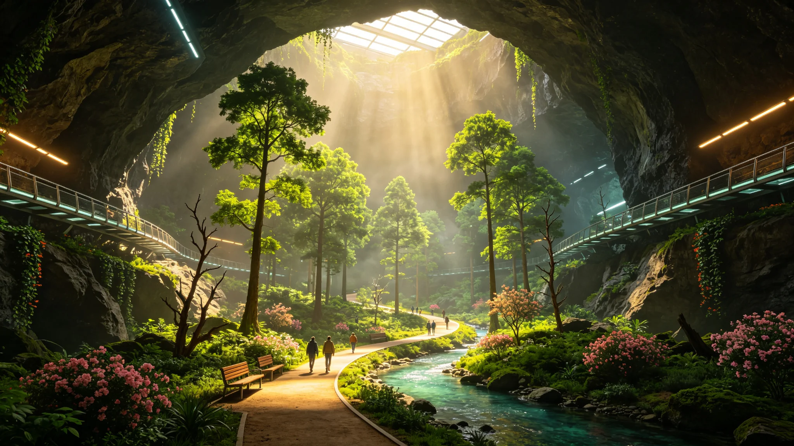

# 鲸鱼座τ星地下城市人工生态系统稳定性十年评估报告

**发布机构**：鲸鱼座τ星定居点政府 / 全球生态环境总局 / 地下城市人工生态系统评估专家组
**发布日期**：2914年7月30日
**文件等级**：全球公开

## 一、评估概述

2914年1月至6月，鲸鱼座τ星定居点政府组织了由27名专家组成的"地下城市人工生态系统评估专家组"，对新希望地下城的人工生态系统进行了为期10年（2904-2913年）的稳定性综合评估。这是新希望地下城自2855年建成以来规模最大、最全面的一次人工生态系统评估。

评估专家组由生态学家、环境工程师、农学家、微生物学家、气象学家、公共卫生专家等多学科专家组成，组长为鲸鱼座τ星大学环境学院院长李自然教授。评估内容包括大气环境、水环境、土壤环境、生物多样性、生态系统功能、生态系统服务、生态风险等7个方面、共48项指标。

评估专家组在报告中得出的总体结论是：新希望地下城人工生态系统总体稳定，各项核心指标均在设计范围内，生态系统服务功能良好，能够满足12万居民的基本生活需求。但同时也存在一些潜在的风险和问题，需要引起重视并采取相应的措施。

## 二、地下城基本情况

**新希望地下城概况**：
- 建成时间：2855年（一期工程），经过4次扩建，目前总面积约48平方公里
- 居住人口：约12万人
- 地下城结构：利用天然熔岩管系统改造而成，主洞道长约12公里，宽约200-500米，高约30-80米，另有支洞道约87条
- 封闭程度：全封闭加压结构，与行星表面环境完全隔离
- 生命保障系统：包括空气循环系统、水循环系统、食物生产系统、能源系统、废物处理系统等

**人工生态系统构成**：
新希望地下城的人工生态系统是一个半人工半自然的复合生态系统，主要包括以下子系统：
1. 大气子系统：包括空气循环、氧气生产、二氧化碳去除、温度湿度调节等
2. 水子系统：包括水循环、水处理、水分配等
3. 土壤子系统：包括人工土壤基质、土壤微生物、土壤养分循环等
4. 植物子系统：包括农作物、蔬菜、水果、观赏植物、绿化植物等
5. 动物子系统：包括养殖畜禽（鸡、猪、牛、鱼等）、宠物、实验动物等
6. 微生物子系统：包括环境微生物、肠道微生物、工业微生物等
7. 人类子系统：12万居民及其活动

## 三、大气环境评估

**主要指标监测结果（2913年均值）**：
- 氧气浓度：20.8%（设计范围20.5-21.0%），合格
- 二氧化碳浓度：0.045%（设计范围≤0.05%），合格
- 氮气浓度：78.9%，合格
- 总悬浮颗粒物（TSP）：0.08毫克/立方米（设计标准≤0.15毫克/立方米），合格
- 可吸入颗粒物（PM2.5）：0.03毫克/立方米（设计标准≤0.05毫克/立方米），合格
- 温度：22.3°C（设计范围20-24°C），合格
- 相对湿度：52%（设计范围45-65%），合格
- 气压：101.2千帕（设计范围100-102千帕），合格
- 挥发性有机物（VOCs）总量：0.12毫克/立方米（设计标准≤0.2毫克/立方米），合格
- 微生物气溶胶浓度：120 CFU/立方米（设计标准≤500 CFU/立方米），合格

**十年变化趋势**：
过去10年，新希望地下城的大气环境质量总体稳定，各项指标均在设计范围内波动。氧气浓度从2904年的20.9%略微下降到2913年的20.8%，主要原因是人口增长导致耗氧量增加。二氧化碳浓度从2904年的0.042%上升到2913年的0.045%，同样与人口增长有关。颗粒物浓度总体呈下降趋势，主要得益于空气过滤系统的升级改造。

**氧气生产能力评估**：
新希望地下城的氧气主要来自两个途径：（1）植物光合作用，约占氧气总产量的65%；（2）电解水制氧，约占35%。目前地下城内的植物种植面积约8.7平方公里（占地下城总面积的18%），其中农作物种植面积约5.2平方公里，绿化植物面积约3.5平方公里。植物光合作用的日产氧量约为84吨，电解水制氧的日产氧量约为45吨，合计日产氧量约129吨。

目前地下城12万居民的日耗氧量约为108吨（人均约0.9公斤/天），氧气生产能力富余约19%。评估专家组认为，目前的氧气生产能力可以满足未来10年人口增长到15万人的需求，但如果人口继续增长，需要扩大植物种植面积或增加电解水制氧能力。

## 四、水环境评估

**主要指标监测结果（2913年均值）**：
- 饮用水水质：全部106项指标均符合《鲸鱼座τ星饮用水水质标准》，合格率100%
- 水循环率：98.7%（设计目标≥98%），合格
- 人均日用水量：185升（设计标准150-200升），合格
- 污水处理率：100%（全部污水经过处理后回用）
- 再生水利用率：92.3%（设计目标≥90%），合格
- 水储存量：约120万立方米（设计储存量100-150万立方米），合格

**十年变化趋势**：
过去10年，新希望地下城的水环境质量总体稳定。水循环率从2904年的97.2%提高到2913年的98.7%，主要得益于水处理技术的升级和管网漏损率的降低。人均日用水量从2904年的172升上升到2913年的185升，主要原因是居民生活水平提高导致用水量增加。

**水资源平衡评估**：
新希望地下城的水资源是一个闭环系统，水的来源主要是初始携带的水（约150万立方米）和从行星表面开采的水（通过水冰开采和提取，每年约补充2万立方米）。水的消耗主要是人类消费（饮用、烹饪、卫生等）和工业用水，绝大部分水经过处理后循环使用，只有少量水通过各种途径损失（如泄漏、蒸发、产品含水等），年损失率约为0.8%。

评估专家组认为，目前的水资源管理系统运行良好，水资源供需基本平衡。但需要关注的是，随着人口增长和经济发展，用水量将持续增加，需要进一步提高水循环率和节水技术。

## 五、土壤环境评估

**主要指标监测结果（2913年均值）**：
- 人工土壤pH值：6.8（设计范围6.0-7.5），合格
- 有机质含量：4.2%（设计范围3-5%），合格
- 全氮含量：0.18%（设计范围0.15-0.25%），合格
- 有效磷含量：25毫克/公斤（设计范围20-40毫克/公斤），合格
- 速效钾含量：120毫克/公斤（设计范围100-200毫克/公斤），合格
- 重金属含量：全部低于安全标准，合格
- 土壤微生物多样性：Shannon指数3.8（设计目标≥3.5），合格
- 土壤酶活性：正常范围，合格

**十年变化趋势**：
过去10年，新希望地下城的人工土壤质量总体稳定并略有改善。有机质含量从2904年的3.5%提高到2913年的4.2%，主要得益于有机肥料的使用和秸秆还田等措施。土壤微生物多样性也有所提高，Shannon指数从2904年的3.4提高到2913年的3.8。

**土壤退化风险评估**：
评估专家组指出，人工土壤在长期使用过程中存在一定的退化风险，主要包括：（1）土壤板结，由于长期耕作和缺乏自然风化过程；（2）养分失衡，由于作物吸收和施肥不当；（3）土壤微生物多样性下降，由于人工环境的选择压力；（4）盐分积累，由于水分蒸发和肥料使用。

目前这些退化风险尚在可控范围内，但需要长期监测和管理。评估专家组建议建立土壤质量长期监测网络，定期进行土壤检测和评估，及时采取措施防止土壤退化。

## 六、生物多样性评估

**植物多样性**：
新希望地下城内目前有记录的植物物种约1,247种，其中：
- 农作物：约120种（包括粮食作物、蔬菜、水果、经济作物等）
- 绿化植物：约380种（包括乔木、灌木、草本、花卉等）
- 观赏植物：约420种
- 药用植物：约180种
- 其他：约147种

与2904年（约1,080种）相比，植物物种数量增加了约15.5%，主要得益于植物引种和培育工作的加强。

**动物多样性**：
新希望地下城内目前有记录的动物物种约327种，其中：
- 养殖畜禽：约15种（鸡、鸭、鹅、猪、牛、羊、兔、鱼、虾等）
- 宠物：约45种（狗、猫、鸟、鱼、爬行动物等）
- 实验动物：约28种
- 野生动物（引入的）：约12种（蝴蝶、蜜蜂、蚯蚓等有益昆虫和土壤动物）
- 其他无脊椎动物：约227种（包括昆虫、蜘蛛、螨虫、软体动物等，其中部分为无意引入的）

与2904年（约280种）相比，动物物种数量增加了约16.8%。

**微生物多样性**：
新希望地下城内的微生物多样性非常丰富，目前已鉴定的微生物物种约8,700种（包括细菌、古菌、真菌、病毒等），其中：
- 土壤微生物：约4,200种
- 水环境微生物：约1,800种
- 空气微生物：约600种
- 人体相关微生物：约1,500种
- 其他：约600种

微生物多样性在过去10年总体稳定，但部分环境（如空气处理系统、水处理系统）中的微生物群落结构发生了一定变化。

**生物多样性评估结论**：
评估专家组认为，新希望地下城的生物多样性总体保持在较高水平，能够满足生态系统功能和人类生活的需求。但与地球自然生态系统相比，地下城的生物多样性仍然较低（地球热带雨林的物种数量可达数百万种），生态系统的抗干扰能力和稳定性相对较弱。需要继续加强生物多样性保护和引种工作，提高生态系统的复杂性和稳定性。

## 七、生态系统功能和服务评估

**初级生产力**：
新希望地下城的植物年净初级生产力（NPP）约为2.4万吨（干重），其中农作物约1.5万吨，绿化和观赏植物约0.9万吨。单位面积NPP约为0.5公斤/平方米/年，低于地球农田的平均水平（约0.8公斤/平方米/年），主要原因是地下城的光照强度和光照时间有限。

**食物生产能力**：
新希望地下城的食物生产能力如下：
- 粮食：年产约8,400吨，人均约70公斤/年（需求约100公斤/年，自给率70%）
- 蔬菜：年产约12,000吨，人均约100公斤/年（需求约120公斤/年，自给率83%）
- 水果：年产约3,600吨，人均约30公斤/年（需求约50公斤/年，自给率60%）
- 肉类：年产约2,400吨，人均约20公斤/年（需求约40公斤/年，自给率50%）
- 水产品：年产约1,200吨，人均约10公斤/年（需求约20公斤/年，自给率50%）
- 蛋类：年产约1,800吨，人均约15公斤/年（需求约20公斤/年，自给率75%）
- 奶类：年产约3,000吨，人均约25公斤/年（需求约40公斤/年，自给率62.5%）

总体食物自给率约为65%，其余35%的食物需要从比邻星b进口。评估专家组认为，目前的食物生产能力基本可以满足居民的基本营养需求，但食物种类和数量仍有提升空间。

**空气净化能力**：
地下城内的植物和空气处理系统共同承担空气净化功能。植物年吸收二氧化碳约3.2万吨，年释放氧气约2.4万吨。空气处理系统年去除颗粒物约87吨，年去除VOCs约12吨。空气净化能力总体满足需求。

**水循环和净化能力**：
水处理系统年处理水量约810万立方米（人均约67.5立方米/年），再生水利用率92.3%。水循环和净化能力总体满足需求。

**废物处理能力**：
地下城年产固体废物约4.8万吨（人均约400公斤/年），其中有机废物约2.1万吨（占44%），可回收废物约1.8万吨（占37%），其他废物约0.9万吨（占19%）。废物处理系统的处理能力约为5万吨/年，能够满足需求。有机废物通过堆肥和厌氧发酵处理，生产有机肥料和沼气；可回收废物进行分类回收和再利用；其他废物进行无害化处理。

**气候调节能力**：
地下城的温度、湿度、气压等气候参数由人工控制系统调节，气候调节能力稳定，能够满足人类舒适生活的需求。

**文化和休闲服务**：
地下城内有公园、花园、广场、图书馆、博物馆、体育场馆等文化休闲设施，人均公共绿地面积约4.2平方米，能够满足居民的文化和休闲需求。

## 八、生态风险评估

评估专家组识别了新希望地下城人工生态系统面临的主要生态风险：

1. **系统崩溃风险**：由于地下城是一个全封闭的人工生态系统，对生命保障系统的依赖程度极高。如果生命保障系统（如空气循环系统、水循环系统、能源系统）发生重大故障且未能及时修复，可能导致生态系统崩溃，威胁居民生命安全。目前系统的冗余度和可靠性较高，但仍需持续关注。

2. **生物入侵风险**：虽然地下城有严格的生物检疫制度，但仍有可能发生有害生物（如害虫、病菌、杂草等）的意外引入和爆发。过去10年共发生了12起小规模的生物入侵事件（如蚜虫爆发、霉菌污染等），均得到了及时控制，未造成重大损失。

3. **遗传多样性丧失风险**：由于地下城的种群规模有限，动植物种群可能发生遗传漂变和近交衰退，导致遗传多样性丧失和种群适应性下降。需要建立遗传资源库和定期引种制度，维持种群的遗传多样性。

4. **生态系统服务退化风险**：随着人口增长和经济发展，对生态系统服务的需求不断增加，如果生态系统的供给能力不能相应提升，可能导致生态系统服务退化。需要持续投入和优化管理，维持生态系统服务的稳定供给。

5. **公共卫生风险**：地下城的高密度居住环境和封闭空间可能增加传染病传播的风险。2911年的供水系统污染事件就是一个警示。需要加强公共卫生体系建设，提高疾病监测和应急响应能力。

## 九、建议和措施

针对评估中发现的问题和风险，评估专家组提出了以下建议和措施：

1. **加强生命保障系统的可靠性和冗余度**：定期对生命保障系统进行维护和升级，增加关键系统的冗余度，建立完善的应急预案和演练制度，确保系统在发生故障时能够快速恢复。

2. **扩大植物种植面积，提高食物自给率**：计划在未来10年内将植物种植面积从目前的8.7平方公里扩大到12平方公里，重点增加粮食、肉类和奶类的生产能力，将总体食物自给率从65%提高到80%以上。

3. **加强生物多样性保护和引种**：建立地下城生物多样性保护战略，定期从地球和其他定居点引进新的动植物物种，丰富生态系统的物种组成，提高生态系统的稳定性和抗干扰能力。

4. **建立遗传资源库**：建立地下城动植物遗传资源库，保存重要物种的种子、精液、胚胎等遗传材料，防止遗传多样性丧失，为未来的育种和引种提供资源。

5. **加强土壤质量管理**：建立土壤质量长期监测网络，定期进行土壤检测和评估，采取轮作、休耕、有机肥料使用、土壤改良等措施，防止土壤退化，维持土壤生产力。

6. **提高水资源利用效率**：进一步推广节水技术和设备，提高居民的节水意识，将水循环率从目前的98.7%提高到99%以上，降低水资源损失。

7. **加强公共卫生体系建设**：完善疾病监测和预警系统，加强饮用水和食品安全监管，提高应急响应能力，防止传染病的发生和传播。

8. **建立生态系统长期监测和评估机制**：建立地下城生态系统长期监测网络，对大气、水、土壤、生物等要素进行持续监测，每5年进行一次全面的生态系统评估，及时发现和解决生态问题。

## 十、历史意义

新希望地下城人工生态系统十年评估的完成，对鲸鱼座τ星定居点的可持续发展具有重要意义，也为人类文明在其他恒星系建立封闭环境定居点提供了宝贵的经验。

评估专家组组长李自然教授在报告发布会上表示："人工生态系统是封闭环境定居点的生命线。新希望地下城已经安全运行了59年，人工生态系统总体稳定，这证明了人类在异星封闭环境中建立可持续生态系统的能力。但我们不能掉以轻心，人工生态系统是脆弱的，需要我们持续的关注和精心的维护。只有与自然和谐相处，我们才能在异星上长久生存。"
