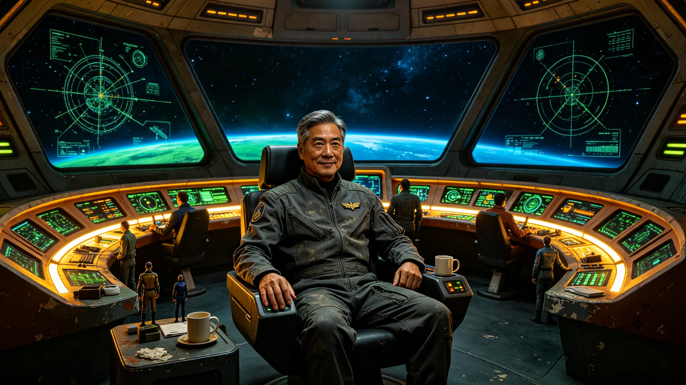

# 星际航行界传奇舰长"深空之狐"林远航生平与航行日志选编

**发布机构**：跨恒星系航行管理局 / 星际航行历史档案馆
**发布日期**：2915年8月8日
**文件等级**：全球公开

## 一、传记出版公告

2915年8月8日，星际航行历史档案馆正式出版《深空之狐——林远航舰长生平与航行日志选编》。这部著作由著名航海史学者陈海教授执笔，历时5年完成，全书共15章、约62万字，收录了林远航舰长的生平传记和精选航行日志（共127篇，时间跨度从2847年至2908年）。

林远航（2825-2908），星际航行界传奇舰长，绰号"深空之狐"（Deep Space Fox），以其精湛的航行技术、冷静的危机处理能力和多次在极端条件下拯救飞船和船员的传奇经历而闻名。他的职业生涯跨越了第三代聚变推进系统到第四代聚变推进系统的技术变革期，累计星际航行时间约87年（飞船时间），航行距离约120光年，是人类文明史上累计航行距离最长的舰长。

2908年8月8日，林远航舰长在最后一次航行（比邻星b—鲸鱼座τ星航线）中，因突发心脏病在舰长室安详去世，享年83岁（飞船时间约67岁，系长期亚光速航行的相对论时间膨胀效应）。按照他的遗愿，他的骨灰被撒在星际航道上——"我一生都在星际航道上，死后也想留在航道上。"

## 二、早年经历（2825-2847）

林远航于2825年8月8日出生于月球"静海城"，是月球本土出生的第三代公民。他的父亲林大海是月球—地球航线的货运飞船驾驶员，母亲陈月是静海城的中学教师。林远航是家中的独子。

**童年与教育**：
林远航的童年在月球静海城度过。由于父亲常年在航线上，他主要由母亲抚养长大。他从小就对太空航行表现出浓厚的兴趣，最喜欢的游戏是"模拟航行"——用父亲带回家的航行模拟器玩具，模拟从月球到火星的航行。他的小学老师回忆说："林远航是我教过的最专注的学生。他对太空航行的知识了解得比很多成年人都多。他的理想从小学一年级开始就没有变过——当一名星际航行舰长。"

2837年，12岁的林远航通过了月球"航天少年班"的选拔考试，进入月球航天学院附属中学学习。在中学期间，他的成绩始终名列前茅，尤其在天体力学、导航学、推进系统工程等方面表现突出。

2841年，16岁的林远航考入月球航天学院，主修星际航行专业。2845年，他以优异成绩毕业，获得工学学士学位，并在毕业航行考核中创造了月球航天学院历史上的最高分纪录（98.7分）。毕业后，他进入星际航行学院攻读硕士学位，研究方向为"星际航道导航与优化"。2847年获得硕士学位。

**早期航行生涯**：
2847年，22岁的林远航加入"星际航运集团"，开始了他的航行生涯。他最初担任"月球—火星"航线货运飞船的三副，负责导航和通信工作。由于表现出色，他在2年内晋升为二副，4年内晋升为大副。

2852年，27岁的林远航通过了舰长资格考试，成为当时星际航运集团最年轻的舰长（27岁），被任命为"月球—小行星带"航线货运飞船"矿工号"的舰长。

## 三、传奇航行经历（2852-2908）

林远航的舰长生涯长达56年，期间他驾驶过7艘不同型号的飞船，航行过月球—火星、月球—小行星带、地球—木星、比邻星b—火星、比邻星b—鲸鱼座τ星等多条航线。他的航行生涯中充满了传奇经历，以下是其中最著名的几次：

**传奇一："矿工号"小行星带风暴脱险（2855年）**：
2855年，30岁的林远航驾驶"矿工号"货运飞船（载有约8万吨铁矿石）从小行星带返回月球。在航行途中，飞船遭遇了罕见的小行星带"引力风暴"——由于多颗小行星的引力叠加，形成了一个不稳定的引力场，飞船的导航系统受到严重干扰，推进系统也出现了故障。

当时船上有船员27人，情况十分危急。林远航冷静地分析了形势，做出了一个大胆的决定：关闭主推进系统，利用小行星的引力进行"引力弹弓"机动，将飞船甩出引力风暴区域。这一机动需要极其精确的轨道计算和 timing，稍有不慎就会撞向小行星。

林远航亲自操舵，连续进行了7次引力弹弓机动，历时约36小时，最终成功将飞船甩出引力风暴区域，安全返回月球。船上27名船员无一伤亡，货物也完好无损。

这次事件让林远扬帆名立万，他被船员们称为"深空之狐"——因为他像狐狸一样狡猾、机智，总能在绝境中找到出路。

**传奇二："探索者号"木星辐射带穿越（2862年）**：
2862年，37岁的林远航被任命为"探索者号"科学考察船的舰长，执行木星系统科学考察任务。在任务中，飞船需要穿越木星的强辐射带，对木星的卫星"木卫二"（Europa）进行近距离观测。

木星辐射带的辐射强度极高，对飞船的电子设备和船员的健康都构成严重威胁。林远航精心设计了穿越航线，利用木星磁场的"安全通道"（辐射强度较低的区域），最大限度地减少了辐射暴露。

在穿越过程中，飞船的辐射屏蔽层出现了局部破损，辐射剂量开始上升。林远航当机立断，改变航线，利用木卫一的引力进行加速，提前冲出辐射带。虽然这次机动导致部分科学观测任务未能完成，但保住了飞船和船员的安全。

这次任务后，林远航获得了"星际航行卓越贡献奖"。

**传奇三："远航者号"比邻星b—鲸鱼座τ星首航（2875年）**：
2875年，50岁的林远航被任命为人类历史上第一艘跨恒星系客运飞船"远航者号"的舰长，执行比邻星b—鲸鱼座τ星的首航任务。这是人类文明史上第一次跨恒星系载人航行，意义重大。

"远航者号"是当时人类最先进的星际飞船，总长2.8公里，采用第三代聚变推进系统，最大巡航速度为0.3倍光速。飞船上载有乘客1,200人（主要是鲸鱼座τ星的移民和工作人员），船员200人。

航行历时约40年（飞船时间约13年）。在航行过程中，林远航展现了卓越的领导才能和技术水平。他建立了严格的飞船管理制度，组织了丰富的文化和教育活动，保持了船员和乘客的身心健康。航行期间共出生了87个孩子（"远航一代"），没有发生重大事故。

航行中最危险的时刻发生在第8年（飞船时间），飞船在穿越一片星际尘埃云时，前部的隔热和防护层受到了严重磨损，多个传感器损坏。林远航组织船员进行了紧急维修，同时调整航线，绕过了尘埃云最密集的区域。经过约3个月的艰苦维修，飞船恢复了正常航行。

2888年（飞船时间；比邻星b时间为2915年——注：由于相对论效应和通信延迟，此处时间线较为复杂），"远航者号"安全抵达鲸鱼座τ星，首航任务圆满完成。林远航因此被授予"星际航行英雄"称号，成为人类文明史上最著名的舰长之一。

**传奇四："开拓者号"发动机故障应急返航（2895年）**：
2895年，70岁的林远航驾驶"开拓者号"货运飞船从比邻星b出发前往鲸鱼座τ星。在航行约2年后（飞船时间），飞船的主聚变发动机出现了严重故障——等离子体约束磁场失稳，发动机面临爆炸的危险。

林远航立即下令关闭主发动机，启动应急程序。当时飞船距离最近的补给站约0.8光年，仅凭辅助推进器（化学推进器）需要约120年才能到达，这显然是不可行的。

在危急关头，林远航提出了一个大胆的方案：利用飞船上的货运舱（载有约50万吨货物）作为"临时反应质量"，通过电磁弹射系统将货物向后抛出，利用反作用力推动飞船前进。这相当于把飞船变成一个巨大的"质量推进器"。

这一方案虽然会损失全部货物，但可以保住飞船和船员。林远航组织船员进行了紧急改装，将货运舱改造成了电磁弹射系统。在接下来的约6个月时间里，船员们不断地将货物向后弹射，飞船逐渐加速，最终达到了约0.05倍光速的速度。

利用这个速度，飞船在约16年后（飞船时间约2年，由于时间膨胀）到达了鲸鱼座τ星。船上200名船员全部安全获救，虽然货物全部损失，但飞船保住了。

这次事件被称为"星际航行史上最伟大的应急操作"，林远航的"深空之狐"声誉达到了顶峰。

**传奇五：最后一次航行（2908年）**：
2908年，83岁的林远航进行了他职业生涯中的最后一次航行——驾驶"新远航者号"客运飞船从比邻星b前往鲸鱼座τ星。这是他第12次航行这条航线，也是他第7次担任跨恒星系航行的舰长。

在航行约6个月后（飞船时间），2908年8月8日（林远航的生日），林远航舰长在舰长室因突发心脏病安详去世，享年83岁。他去世时，飞船正处于航行的平稳阶段，一切正常。

按照林远航的遗愿，船员们为他举行了简短而庄重的海葬仪式——将他的骨灰撒在星际航道上。仪式由大副主持，全体船员和乘客默哀3分钟。大副在仪式上说："舰长一生都在星际航道上，他把航道当成了家。现在，他真正回到了家。"

林远航去世后，大副接任舰长职务，继续完成了航行任务。"新远航者号"于约34年后（飞船时间约11年）安全抵达鲸鱼座τ星。

## 四、航行日志选编

《深空之狐——林远航舰长生平与航行日志选编》一书收录了林远航舰长的127篇精选航行日志。以下是其中几篇的摘录：

**日志一：2855年3月17日，"矿工号"，小行星带引力风暴中**：
"第3天。引力风暴还在继续，导航系统时好时坏。船员们有些紧张，但我不能表现出来。作为舰长，我必须保持冷静。

我已经计算好了第4次引力弹弓的轨道。这次需要在距离小行星'2019-XX7'只有300公里的位置进行点火，误差不能超过5公里。这很危险，但没有别的选择。

刚才在舷窗前看了一眼外面。小行星在星光下缓缓转动，很美，也很致命。我们人类在这浩瀚的宇宙中，就像一粒尘埃。但就是这粒尘埃，有着不屈的意志。

不管怎样，我必须把船员们安全带回家。这是我的责任。"

**日志二：2875年6月1日，"远航者号"，跨恒星系首航第1天**：
"首航第一天。一切顺利。'远航者号'已经离开了比邻星b的轨道，正在加速。

刚才在舷窗前站了很久。比邻星b越来越小，最后变成了一个蓝色的小点。我在这颗行星上生活了50年，现在要离开了。不知道还能不能回来。

船上有1,200名乘客和200名船员。他们中的很多人是第一次进行星际航行，有些紧张，也有些兴奋。我能理解他们的感受。我第一次星际航行时，也是这样的心情。

作为舰长，我不仅要保证飞船的安全，还要照顾好这些人的生活。40年的航行（地球时间），13年的飞船时间，足够一个孩子长大成人了。我们要在这艘飞船上建立一个小社会。

任重而道远。但我有信心。"

**日志三：2883年11月20日，"远航者号"，航行第8年（飞船时间），星际尘埃云中**：
"不好。我们遭遇了一片星际尘埃云，比预想的要密集得多。飞船前部的防护层磨损严重，已经有3个传感器损坏了。

我已经下令减速，并调整航线，试图绕过尘埃云。但这片云比我们预想的大，可能需要绕行约0.3光年，这会增加约1年的航行时间。

船员们正在紧急维修前部的防护层。这是一项危险的工作——需要出舱作业，在尘埃云中进行。我已经要求所有出舱人员必须双人组队，并且严格限制出舱时间。

刚才有个年轻船员问我：'舰长，我们能过去吗？'我说：'能。一定能。'其实我心里也没有百分之百的把握，但我不能让他们看出来。

在深空中，舰长的信心就是船员的信心。我必须保持信心。"

**日志四：2895年9月10日，"开拓者号"，主发动机故障后第3天**：
"主发动机彻底坏了。等离子体约束磁场完全失稳，再启动的话很可能会爆炸。我们现在只能靠辅助推进器，但那点推力根本不够。

距离最近的补给站有0.8光年。按辅助推进器的速度，需要120年。我们等不了那么久。

我有一个想法——把货物当作反应质量，用电磁弹射系统向后抛，利用反作用力推动飞船。这是一个疯狂的想法，但可能是唯一的办法。

我已经和轮机长讨论过了。他说技术上可行，但需要对货运舱进行大规模改装，而且会损失全部货物。我说：'货物没了可以再运，人没了就什么都没了。'

明天开始改装。愿命运眷顾我们。"

**日志五：2908年8月1日，"新远航者号"，最后一次航行第6个月**：
"最近感觉身体不太好。心脏有时候会疼，医生说是老年病，让我多休息。但在航行中，舰长怎么能多休息呢？

我已经83岁了。在舰长中，我算是高龄了。很多人劝我退休，但我舍不得。我的一生都在星际航道上，离开了航道，我不知道自己还能做什么。

这可能是我最后一次航行了。如果能安全到达鲸鱼座τ星，我就退休。到时候，我想在鲸鱼座τ星的地下城买一间小房子，种种花，看看书，写写回忆录。

刚才在舷窗前看星空。星星还是那些星星，和我第一次航行时看到的一样。但我已经不是当年那个22岁的年轻人了。

56年的舰长生涯，7艘飞船，120光年的航行距离。我想，我已经做到了我能做的一切。

不管怎样，站好最后一班岗。"

## 五、历史评价

林远航舰长去世后，跨恒星系航行管理局追授他"星际航行终身成就奖"，并将他的名字刻入"星际航行名人堂"。比邻星b和鲸鱼座τ星的政府都分别发表声明，高度评价林远航的历史功绩。

《深空之狐》的作者陈海教授在书的结语中写道："林远航是人类文明史上最伟大的星际航行舰长之一。他的一生，是与深空搏斗的一生，是与命运抗争的一生。他用56年的时间，120光年的航行距离，向世人证明了人类征服深空的勇气和能力。

他的绰号'深空之狐'，恰如其分地描述了他的特点——像狐狸一样机智、狡猾、坚韧，总能在绝境中找到出路。但他不仅仅是机智，他更有着对船员的深厚责任感和对航行事业的无限热爱。在危急关头，他总是把船员的安全放在第一位，不惜牺牲货物甚至飞船。

林远航已经离开了我们，但他的精神将永远激励着后来的航行者。只要还有人在星际航道上航行，'深空之狐'的故事就不会被遗忘。"

2915年，在林远航舰长逝世7周年之际，跨恒星系航行管理局宣布，将每年的8月8日（林远航的诞辰和逝世纪念日）定为"星际航行者日"，以纪念以林远航为代表的所有星际航行者。
