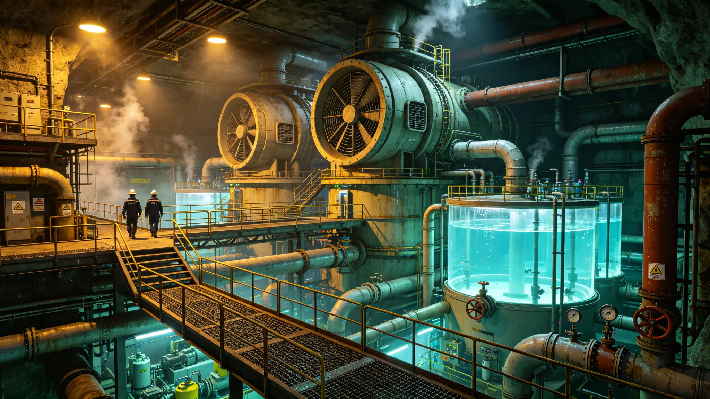

# 鲸鱼座τ星地下城市生命保障系统设计白皮书

**发布机构**：鲸鱼座τ星定居点政府 / 生命保障工程总局 / 地下城市设计研究院
**发布日期**：2917年4月10日
**文件等级**：全球公开（部分核心技术参数保密）

## 一、白皮书概述

本白皮书系统阐述了鲸鱼座τ星地下城市生命保障系统（Life Support System，简称LSS）的设计理念、技术方案、运行参数和发展规划。白皮书的编制历时3年（2914-2917年），由生命保障工程总局组织，来自12所大学和研究机构的87名专家参与编写。

本白皮书是鲸鱼座τ星地下城市生命保障系统的权威性技术文件，既是对现有系统（新希望地下城、新边疆城、新星城）的技术总结，也是未来地下城市生命保障系统设计的指导文件。白皮书的发布，标志着鲸鱼座τ星在地下城市生命保障技术方面已经形成了完整的技术体系和标准规范。

生命保障工程总局总工程师王保生在白皮书发布会上表示："生命保障系统是地下城市的生命线。在异星的恶劣环境中，正是这套系统为我们提供了空气、水、食物和适宜的温度，让我们能够在11.9光年之外生存和发展。本白皮书系统总结了我们60多年来在生命保障技术方面的经验和成果，将为未来的地下城市建设提供技术指导。"

## 二、设计理念和原则

鲸鱼座τ星地下城市生命保障系统的设计基于以下核心理念和原则：

**闭环再生理念**：
生命保障系统的核心设计理念是"闭环再生"——尽可能减少对外部物资补给的依赖，通过系统内部的物质循环和能量流动，实现空气、水、食物等基本生存物资的自给自足。这一理念是由跨恒星系补给的困难性决定的——从比邻星b到鲸鱼座τ星的航行时间约34年（飞船时间约11年），物资补给成本极高，因此必须实现高度的自给自足。

**多级冗余原则**：
生命保障系统的所有关键子系统都采用多级冗余设计，确保在任何单一故障甚至多重故障的情况下，系统仍能维持基本功能，保障居民的生命安全。冗余级别包括：（1）设备级冗余——关键设备配备备用设备；（2）子系统级冗余——关键子系统配备备用子系统；（3）系统级冗余——整个生命保障系统配备应急备用系统。

**模块化设计原则**：
生命保障系统采用模块化设计，由多个功能独立的模块组成，每个模块可以独立运行、维护和升级。这种设计的优点是：（1）便于建设和扩展——可以根据人口增长逐步增加模块；（2）便于维护和维修——故障模块可以隔离和更换，不影响其他模块的运行；（3）便于技术升级——可以逐步替换老旧模块，引入新技术。

**能源效率优先原则**：
在地下城市中，能源是最宝贵的资源之一。生命保障系统的设计始终将能源效率放在首位，通过优化系统设计、采用高效设备、回收废热等方式，最大限度地降低能源消耗。目前新希望地下城生命保障系统的人均能耗约为2.5千瓦，比早期设计（约5千瓦）降低了50%。

**生态友好原则**：
生命保障系统的设计充分考虑生态友好性，通过引入自然生态系统（如植物、微生物等）来实现物质循环和净化，减少对化学处理工艺的依赖。这种"生态化"的生命保障系统不仅效率更高，而且对居民的身心健康也更有益。

**可维护性原则**：
生命保障系统的设计充分考虑可维护性，所有设备都便于检修和更换，关键部件采用标准化设计，减少备件种类。同时，系统配备了完善的状态监测和故障诊断系统，可以提前发现潜在故障，进行预防性维护。

## 三、系统总体架构

鲸鱼座τ星地下城市生命保障系统是一个复杂的巨系统，由以下6个主要子系统组成：

1. **大气管理子系统（Atmosphere Management System，AMS）**：负责空气的循环、净化、氧气生产、二氧化碳去除、温度和湿度调节、压力控制等。
2. **水管理子系统（Water Management System，WMS）**：负责水的收集、净化、储存、分配和废水处理回用。
3. **食物生产子系统（Food Production System，FPS）**：负责粮食、蔬菜、水果、肉类、水产品等食物的生产。
4. **废物处理子系统（Waste Management System，WMS）**：负责固体废物、有机废物、有害废物等的收集、处理和资源化利用。
5. **能源供应子系统（Energy Supply System，ESS）**：负责电力和热能的生产、储存和分配，为整个生命保障系统提供能源。
6. **控制和监测子系统（Control and Monitoring System，CMS）**：负责整个生命保障系统的自动控制、状态监测、故障诊断和应急响应。

这6个子系统相互关联、相互依赖，共同构成了一个完整的生命保障体系。以下分别详细介绍各子系统的设计。

## 四、大气管理子系统（AMS）

**功能和要求**：
大气管理子系统的核心功能是为地下城市居民提供安全、舒适的呼吸空气。具体要求包括：
- 氧气浓度：20.5-21.0%
- 二氧化碳浓度：≤0.05%（500 ppm）
- 一氧化碳浓度：≤0.001%（10 ppm）
- 总悬浮颗粒物（TSP）：≤0.15毫克/立方米
- 可吸入颗粒物（PM2.5）：≤0.05毫克/立方米
- 挥发性有机物（VOCs）总量：≤0.2毫克/立方米
- 微生物气溶胶浓度：≤500 CFU/立方米
- 温度：20-24°C
- 相对湿度：45-65%
- 气压：100-102千帕
- 空气交换率：≥0.5次/小时（人均新风量≥30立方米/小时）

**氧气生产**：
氧气生产采用"植物光合作用+电解水制氧"的组合方案：
1. **植物光合作用**：地下城内的植物种植区（总面积约8.7平方公里）通过光合作用产生氧气，约占氧气总产量的65%。主要产氧植物包括：粮食作物（水稻、小麦等）、蔬菜（生菜、菠菜等）、绿化植物（乔木、灌木等）、藻类（微藻培养罐）。
2. **电解水制氧**：采用固体聚合物电解槽（SPE）进行电解水制氧，约占氧气总产量的35%。电解水制氧的优点是响应速度快、调节灵活，可以根据氧气浓度的变化快速调整产氧量。电解水产生的氢气作为副产品，用于燃料电池发电或作为化工原料。

目前新希望地下城的氧气总生产能力约为129吨/天，居民总耗氧量约为108吨/天，富余约19%。

**二氧化碳去除**：
二氧化碳去除采用"植物吸收+化学吸收"的组合方案：
1. **植物吸收**：植物通过光合作用吸收二氧化碳，约占二氧化碳去除总量的60%。
2. **化学吸收**：采用胺基吸收剂（单乙醇胺MEA）进行二氧化碳化学吸收，约占二氧化碳去除总量的40%。吸收的二氧化碳经过解吸后，一部分用于植物种植区的气肥（提高植物光合作用效率），一部分用于工业生产（如合成塑料、燃料等），剩余部分进行压缩储存。

**空气净化**：
空气净化采用"多级过滤+光催化氧化+活性炭吸附"的组合工艺：
1. **初效过滤**：去除空气中的大颗粒污染物（如灰尘、毛发等），过滤效率≥90%（针对5微米以上颗粒）。
2. **中效过滤**：去除空气中的中等颗粒污染物，过滤效率≥95%（针对1微米以上颗粒）。
3. **高效过滤（HEPA）**：去除空气中的细颗粒物和微生物，过滤效率≥99.97%（针对0.3微米颗粒）。
4. **光催化氧化**：采用二氧化钛（TiO2）光催化剂，在紫外光照射下分解空气中的挥发性有机物（VOCs）和异味分子，去除效率≥90%。
5. **活性炭吸附**：采用改性活性炭吸附空气中的有害气体和异味，吸附效率≥85%。

**温度和湿度调节**：
温度和湿度调节采用"集中空调+末端调节"的方案：
1. **集中空调系统**：采用水冷式冷水机组和热泵机组，对空气进行集中的冷却/加热和加湿/除湿处理。冷水机组的制冷系数（COP）约为4.5，热泵机组的制热系数（COP）约为3.8。
2. **末端调节装置**：在每个房间和区域设置风机盘管和空调箱，根据室内温度和湿度进行独立调节，满足不同区域的个性化需求。
3. **废热回收**：空调系统配备了高效的废热回收装置，回收排风中的热量和冷量，用于预热/预冷新风，废热回收效率约为70%。

**压力控制**：
地下城市采用"微正压"设计，城市内部气压比外部（行星表面）高约0.5千帕，防止外部有害气体通过缝隙进入城市内部。压力控制系统通过调节进风量和排风量来维持稳定的气压，压力控制精度为±0.1千帕。

## 五、水管理子系统（WMS）

**功能和要求**：
水管理子系统的核心功能是为居民提供安全、充足的饮用水和生活用水，同时实现水资源的高效循环利用。具体要求包括：
- 饮用水水质：符合《鲸鱼座τ星饮用水水质标准》（106项指标）
- 人均日用水量：150-200升
- 水循环率：≥98%
- 污水处理率：100%
- 再生水利用率：≥90%

**水源**：
地下城市的水源主要包括：
1. **初始携带水**：建城时从比邻星b携带的水，约150万立方米。
2. **行星表面水冰开采**：从鲸鱼座τ星e行星表面和地下开采水冰，经过融化和净化后使用，年开采量约2万立方米。
3. **燃料电池产水**：燃料电池发电时产生的水，年产量约1.2万立方米。
4. **系统内部循环水**：通过水循环系统回收和净化的水，占总用水量的98%以上。

**水处理工艺**：
饮用水处理采用"多级过滤+反渗透+紫外消毒+矿化"的组合工艺：
1. **预处理**：包括格栅、沉砂、初沉等，去除水中的大颗粒杂质。
2. **生物处理**：采用活性污泥法或生物膜法，去除水中的有机物和氮磷等营养物质。
3. **深度处理**：包括超滤（UF）、反渗透（RO）等，去除水中的溶解盐、微量有机物和微生物。
4. **消毒**：采用紫外线（UV）消毒和臭氧消毒，杀灭水中的细菌和病毒。
5. **矿化**：通过添加矿物质（如钙、镁等）调节水的硬度和口感，使水质更接近天然矿泉水。

**水循环和回用**：
水管理子系统实现了高度的水循环和回用：
1. **生活污水处理回用**：居民的生活污水（包括洗浴、洗涤、厨房等废水）经过处理后，回用于冲厕、绿化、工业冷却等，回用率约为95%。
2. **污水处理回用**：污水处理厂的出水经过深度处理后，达到饮用水标准，回用于饮用水供应，回用率约为90%。
3. **工业废水处理回用**：工业废水经过处理后回用于工业生产，回用率约为85%。
4. **雨水和冷凝水收集**：收集空调系统的冷凝水和植物种植区的"雨水"（人工降雨），经过处理后回用。

目前新希望地下城的水循环率约为98.7%，即每天只有约1.3%的水通过各种途径损失（如泄漏、蒸发、产品含水等），需要通过外部水源补充。

**水储存和分配**：
地下城市建设了多个储水设施，总储水能力约120万立方米，可以满足全城约60天的用水需求。储水设施包括：
1. 主储水罐：位于城市中心，容量约50万立方米。
2. 区域储水罐：分布在各个区域，每个容量约5-10万立方米。
3. 应急储水罐：用于紧急情况，容量约20万立方米。

水分配系统采用"分区供水+变频调速"的方案，根据各区域的用水量动态调节供水压力和流量，供水压力稳定在0.3-0.5兆帕。

## 六、食物生产子系统（FPS）

**功能和要求**：
食物生产子系统的核心功能是为居民提供充足、多样、营养的食物。具体要求包括：
- 食物自给率：≥65%（目前约65%，目标为80%）
- 人均日摄入热量：≥2,200千卡
- 人均日摄入蛋白质：≥70克
- 食物种类：≥120种

**种植区布局**：
新希望地下城的植物种植区总面积约8.7平方公里，占城市总面积的18%，分布如下：
1. **粮食作物区**：面积约2.2平方公里，主要种植水稻、小麦、玉米、土豆等。
2. **蔬菜区**：面积约1.5平方公里，主要种植叶菜类、根茎类、果菜类等蔬菜。
3. **水果区**：面积约0.8平方公里，主要种植苹果、橙子、香蕉、草莓等水果。
4. **经济作物区**：面积约0.7平方公里，主要种植棉花、油料作物、香料作物等。
5. **绿化和观赏植物区**：面积约3.5平方公里，主要种植乔木、灌木、花卉等绿化和观赏植物。

**种植技术**：
食物生产采用了多种先进的种植技术：
1. **水培技术**：大部分蔬菜采用水培技术，植物根系浸泡在营养液中，生长速度比土壤栽培快约30%，用水量减少约90%。
2. **气雾培技术**：部分叶菜类采用气雾培技术，植物根系悬挂在空气中，通过喷雾方式提供营养液，生长速度比水培更快，用水量更少。
3. **垂直农业技术**：采用多层立体种植架，充分利用垂直空间，单位面积产量是传统种植的5-10倍。
4. **LED光谱照明技术**：采用定制光谱的LED灯作为人工光源，根据不同植物的需求优化光谱配方，光能利用效率比传统光源高约50%。
5. **环境精确控制技术**：对种植区的温度、湿度、光照、二氧化碳浓度、营养液成分等进行精确控制，为植物生长提供最优环境。
6. **无土栽培基质技术**：部分作物采用有机基质栽培（如椰糠、泥炭等），兼顾生长效率和产品口感。

**养殖区布局**：
动物养殖区总面积约0.8平方公里，分布如下：
1. **家禽养殖区**：主要养殖鸡、鸭、鹅等，年产蛋约1,800吨、肉约600吨。
2. **家畜养殖区**：主要养殖猪、牛、羊等，年产肉约1,800吨、奶约3,000吨。
3. **水产养殖区**：主要养殖鱼、虾、贝类等，年产水产品约1,200吨。
4. **昆虫养殖区**：主要养殖黄粉虫、蟋蟀等，作为高蛋白饲料和人类食物补充，年产约200吨。

**养殖技术**：
动物养殖采用了环境控制、精准饲喂、废物资源化等先进技术：
1. **环境控制养殖**：养殖区的温度、湿度、光照、通风等参数精确控制，为动物提供适宜的生长环境。
2. **精准饲喂技术**：根据动物的生长阶段和健康状况，精确配制饲料，提高饲料转化效率，减少浪费。
3. **废物资源化利用**：动物粪便经过堆肥和厌氧发酵处理，生产有机肥料和沼气（用于发电），实现废物的资源化利用。
4. **水产养殖水循环技术**：水产养殖采用循环水养殖系统（RAS），水经过处理后循环使用，水循环率约为95%。

**食物加工和储存**：
地下城市建设了完善的食物加工和储存设施：
1. **食物加工厂**：包括面粉厂、碾米厂、肉类加工厂、乳制品厂、罐头厂等，将初级农产品加工成各种食品。
2. **冷藏和冷冻设施**：总冷藏容量约5万立方米，总冷冻容量约3万立方米，可以满足全城约3个月的食物储备需求。
3. **食品质量安全检测**：建立了完善的食品质量安全检测体系，对所有食品进行严格的质量和安全检测，确保食品安全。

## 七、废物处理子系统（WMS）

**废物分类和产量**：
地下城市的废物按照性质分为以下几类：
1. **有机废物**：包括厨余垃圾、植物残体、动物粪便等，约占废物总量的44%，年产量约2.1万吨。
2. **可回收废物**：包括纸张、塑料、金属、玻璃等，约占废物总量的37%，年产量约1.8万吨。
3. **有害废物**：包括废电池、废灯管、废药品、废化学品等，约占废物总量的3%，年产量约0.15万吨。
4. **其他废物**：包括建筑垃圾、卫生废物等，约占废物总量的16%，年产量约0.75万吨。

**有机废物处理**：
有机废物采用"堆肥+厌氧发酵"的组合处理工艺：
1. **好氧堆肥**：将有机废物（主要是植物残体和厨余垃圾）进行好氧堆肥，经过约30天的发酵，生产出优质有机肥料，用于植物种植。堆肥过程中产生的热量用于供暖。
2. **厌氧发酵**：将部分有机废物（主要是动物粪便和高浓度有机废水）进行厌氧发酵，生产沼气（主要成分是甲烷，约60%）和沼渣。沼气用于发电（年产约800万千瓦时），沼渣用作有机肥料。

**可回收废物处理**：
可回收废物经过分类、清洗、破碎、熔化等处理后，作为再生原料回用于工业生产：
1. **纸张回收**：废纸经过脱墨、打浆、抄纸等工艺，生产再生纸，回收利用率约为85%。
2. **塑料回收**：废塑料经过分类、清洗、破碎、造粒等工艺，生产再生塑料颗粒，回收利用率约为80%。
3. **金属回收**：废金属经过分类、熔化、精炼等工艺，生产再生金属，回收利用率约为95%。
4. **玻璃回收**：废玻璃经过分类、清洗、破碎、熔化等工艺，生产再生玻璃，回收利用率约为90%。

**有害废物处理**：
有害废物经过专门的处理设施进行无害化处理：
1. **废电池**：经过拆解、浸出、电解等工艺，回收其中的有价金属，剩余废物进行固化填埋。
2. **废灯管**：经过破碎、汞回收、玻璃回收等工艺，实现资源回收和无害化处理。
3. **废药品**：经过高温焚烧处理，焚烧温度≥1200°C，确保药物成分完全分解。
4. **废化学品**：根据化学品的性质，采用中和、氧化、还原、焚烧等不同的处理工艺，进行无害化处理。

**其他废物处理**：
其他废物主要采用卫生填埋和焚烧处理：
1. **卫生填埋**：经过预处理的废物进入卫生填埋场，填埋场配备了防渗层、渗滤液收集处理系统、沼气收集系统等，防止二次污染。
2. **焚烧处理**：部分可燃废物进入焚烧厂进行焚烧处理，焚烧产生的热量用于发电和供暖，焚烧残渣进行填埋处理。

## 八、能源供应子系统（ESS）

**能源结构**：
地下城市的能源供应采用"聚变能为主、太阳能为辅、其他能源为补充"的多元能源结构：
1. **聚变能**：3座聚变反应堆，总装机容量约2.4吉瓦，约占总能源供应的85%。聚变反应堆采用氘-氚聚变方案，燃料来自海水提取的氘和锂增殖产生的氚。
2. **太阳能**：在行星表面部署了总面积约12平方公里的太阳能电池板，总装机容量约0.3吉瓦，约占总能源供应的10%。由于鲸鱼座τ星的光照强度约为地球的0.4倍，太阳能的发电效率较低，但作为辅助能源仍有价值。
3. **其他能源**：包括燃料电池（利用厌氧发酵产生的沼气）、余热回收、化学储能等，约占总能源供应的5%。

**电力系统**：
电力系统采用"集中发电+分布式发电+智能电网"的方案：
1. **集中发电**：聚变反应堆和大型太阳能电站作为集中电源，通过高压输电线路向城市供电。
2. **分布式发电**：在各个区域和建筑中部署了小型燃料电池、太阳能电池等分布式电源，提高供电可靠性。
3. **智能电网**：采用先进的智能电网技术，实现电力的高效调度和管理，包括实时监测、动态定价、需求响应、故障自动隔离和恢复等功能。
4. **储能系统**：配备了大型锂离子电池储能系统，总容量约500兆瓦时，用于调峰填谷和应急供电。

**热力系统**：
热力系统采用"集中供热+分布式供热+废热回收"的方案：
1. **集中供热**：聚变反应堆和焚烧厂产生的余热通过集中供热管网向城市供热，用于供暖、热水供应和工业用热。
2. **分布式供热**：在各个区域和建筑中部署了热泵、电锅炉等分布式供热设备，满足个性化的供热需求。
3. **废热回收**：对各种工业过程和设备产生的废热进行回收利用，提高能源利用效率。目前城市的综合能源利用效率约为75%。

**能源管理**：
建立了完善的能源管理体系，包括：
1. **能源监测**：对城市的能源生产、传输、消费进行实时监测，建立能源大数据平台。
2. **能源审计**：定期对重点用能单位进行能源审计，发现节能潜力，提出节能措施。
3. **节能激励**：通过价格机制、财政补贴、表彰奖励等方式，鼓励居民和企业节约能源。
4. **需求侧管理**：通过需求响应、分时电价等方式，引导用户合理用电，降低电网峰值负荷。

目前新希望地下城的人均年用电量约为8,700千瓦时，人均年用热量约为12,000千瓦时，综合人均能耗约为20,700千瓦时/年。

## 九、控制和监测子系统（CMS）

**系统架构**：
控制和监测子系统采用"集中监控+分散控制"的分层架构：
1. **中央监控中心**：位于城市管理中心，负责整个生命保障系统的集中监控和调度，配备了大屏幕显示系统、超级计算机、人工智能决策支持系统等。
2. **区域控制中心**：分布在各个区域，负责本区域生命保障系统的监控和控制，与中央监控中心实时通信。
3. **现场控制器**：分布在各个设备和子系统中，负责具体设备的自动控制，采用可编程逻辑控制器（PLC）和分布式控制系统（DCS）。
4. **传感器网络**：遍布整个城市的传感器网络，实时监测各种环境参数（温度、湿度、气压、气体浓度、水质等）和设备状态参数。

**关键技术**：
控制和监测子系统采用了多种先进技术：
1. **物联网技术**：所有设备和传感器都接入物联网，实现互联互通和数据共享。
2. **人工智能技术**：采用机器学习和深度学习算法，对系统进行优化控制、故障预测和异常检测。
3. **数字孪生技术**：建立了生命保障系统的数字孪生模型，可以进行仿真分析、优化设计和应急演练。
4. **大数据分析技术**：对系统产生的海量数据进行分析，挖掘有价值的信息，支持决策。
5. **网络安全技术**：采用防火墙、入侵检测、数据加密等多种网络安全技术，保障控制系统的安全。

**应急响应**：
控制和监测子系统具备完善的应急响应功能：
1. **故障自动检测和报警**：系统可以自动检测设备故障和参数异常，并立即发出报警。
2. **自动应急处置**：对于常见的故障和异常，系统可以自动进行应急处置（如启动备用设备、调整运行参数等）。
3. **应急预案管理**：系统内置了各种应急预案，在发生紧急情况时，可以自动调用相应的应急预案，指导应急处置。
4. **应急通信**：配备了独立的应急通信系统，在主通信系统故障时仍能保障通信畅通。

## 十、系统可靠性和安全性

**可靠性指标**：
新希望地下城生命保障系统的关键可靠性指标如下：
- 系统可用率：≥99.99%（年停机时间≤52分钟）
- 平均无故障时间（MTBF）：≥8,760小时（1年）
- 平均修复时间（MTTR）：≤4小时
- 关键设备冗余度：N+1或2N
- 应急备用系统续航时间：≥72小时

**安全性设计**：
生命保障系统的安全性设计包括：
1. **纵深防御**：采用多层防御策略，即使一层防御失效，仍有其他层保障安全。
2. **故障安全**：所有设备和系统在发生故障时都能自动进入安全状态，不会对居民造成危害。
3. **物理隔离**：关键系统和设备进行物理隔离，防止故障扩散和恶意破坏。
4. **访问控制**：对关键设备和区域实行严格的访问控制，只有授权人员才能进入和操作。
5. **安全培训**：所有运维人员都经过严格的安全培训和考核，持证上岗。

**应急演练**：
定期进行各种应急演练，包括：
1. 设备故障应急演练（每月1次）
2. 停电应急演练（每季度1次）
3. 水污染应急演练（每半年1次）
4. 空气污染应急演练（每半年1次）
5. 综合应急演练（每年1次）

通过定期的应急演练，提高运维人员的应急处置能力，检验应急预案的有效性。

## 十一、未来发展规划

生命保障工程总局制定了生命保障系统的未来发展规划（2917-2950年）：

**短期规划（2917-2925年）**：
1. 对新希望地下城的生命保障系统进行升级改造，提高系统效率和可靠性。
2. 完成新边疆城和新星城生命保障系统的建设和优化。
3. 提高食物自给率，从目前的65%提高到75%。
4. 提高水循环率，从目前的98.7%提高到99%。
5. 降低人均能耗，从目前的2.5千瓦降低到2.0千瓦。

**中期规划（2926-2940年）**：
1. 建设第四座地下城市"新家园城"，采用新一代生命保障系统技术。
2. 引入更先进的生物再生生命保障技术（如封闭生态系统），进一步提高自给率。
3. 发展人工合成食品技术（如细胞培养肉、微生物蛋白等），丰富食物种类，提高食物生产效率。
4. 发展聚变能小型化技术，为每个区域配备独立的小型聚变反应堆，提高能源供应的可靠性和灵活性。
5. 发展人工智能和机器人技术，实现生命保障系统的全自动运行和维护，减少对人工的依赖。

**长期规划（2941-2950年）**：
1. 实现生命保障系统的完全闭环再生，空气、水、食物的自给率达到100%。
2. 实现生命保障系统的高度智能化和自主化，系统可以自我监测、自我诊断、自我修复、自我优化。
3. 建立跨城市的生命保障系统网络，实现资源共享和互为备份，提高整个定居点的安全性和可靠性。
4. 探索开放环境生命保障技术，为未来在行星表面建立开放环境定居点做技术储备。

## 十二、结语

生命保障系统是地下城市的核心和灵魂，是人类在异星生存和发展的基础。60多年来，鲸鱼座τ星的工程师和科学家们在生命保障技术方面进行了不懈的探索和创新，建立了一套完整、可靠、高效的生命保障技术体系，为12万居民提供了安全、舒适的生活环境。

本白皮书系统总结了我们在生命保障技术方面的经验和成果，也规划了未来的发展方向。我们相信，随着技术的不断进步，生命保障系统将变得更加高效、可靠、智能，为人类在异星的生存和发展提供更坚实的保障。

生命保障工程总局在白皮书的最后写道："在11.9光年之外的地下城市中，我们用双手制造了空气、水和食物，用智慧构建了生命保障系统。这不仅仅是一项工程成就，更是人类文明不屈精神的体现——无论身处宇宙的哪个角落，人类都能凭借智慧和勤劳，创造出适宜生存的家园。愿这套生命保障系统永远守护鲸鱼座τ星的居民，愿人类文明在宇宙中永续发展。"
