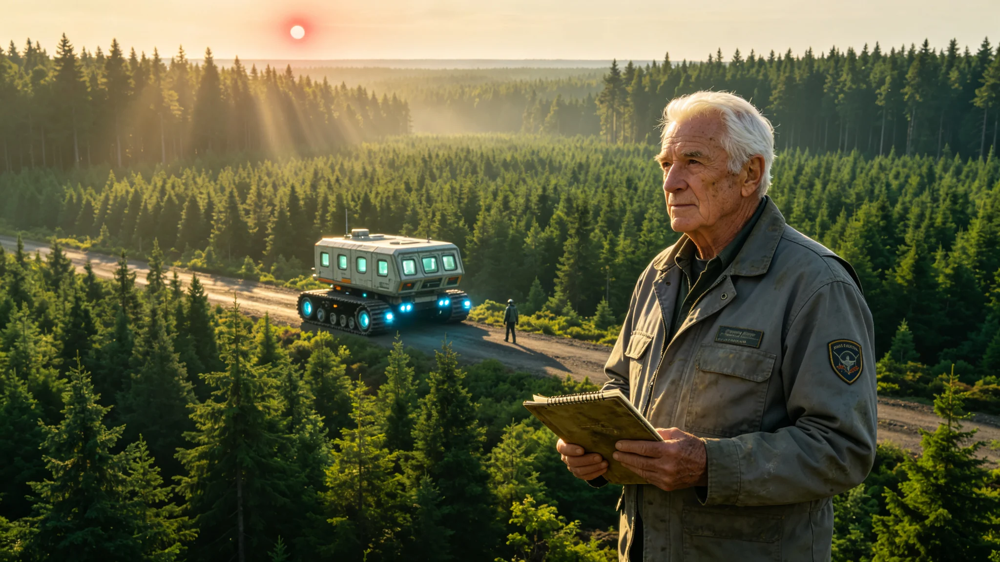

# 比邻星b生态工程总设计师晚年回忆录与设计思想汇编

**发布机构**：比邻星b生态工程总局 / 行星科学院传记文献馆
**发布日期**：2922年11月8日
**文件等级**：全球公开

## 一、传主生平概述

陈青松，2837年出生于比邻星b"新长安"穹顶城市，比邻星b生态工程总设计师，全球大气改造工程生态引入阶段的核心领导者。2922年10月30日于新长安市逝世，享年85岁。

陈青松的职业生涯跨越了比邻星b生态工程从起步到成熟的全过程。2862年，25岁的他以生态工程学博士学位毕业于比邻星b第一理工学院，加入全球大气改造工程总局生态工程处。2875年，38岁的他被任命为生态引入工程副总设计师，主持第三阶段（2701-2820）后期的陆地生态系统引入工作。2890年，53岁的他正式就任比邻星b生态工程总设计师，全面负责第四阶段（2821-2900）的生态系统稳定与优化工作，直至2905年退休。

退休后，陈青松致力于回忆录写作和生态工程思想整理，历时17年完成了这部约42万字的回忆录与设计思想汇编。本书由行星科学院传记文献馆整理出版，是研究比邻星b生态工程史的第一手文献。

## 二、童年与早期教育：穹顶下的绿色梦想

陈青松在回忆录的开篇写道："我出生在一个没有天空的城市里。新长安穹顶的内壁是我们唯一的'天空'，上面投射着模拟的地球蓝天白云。但我从小就知道，那不是真的。真正的天空在穹顶外面，是一片无法呼吸的冰冷虚空。"

他回忆了童年时代在穹顶城市农业区的经历："我父亲是农业区的一名技术员，负责维护水培系统。放学后我常去他的工作间，看那些在LED灯光下生长的蔬菜。那时候我就想，什么时候这些植物能长在真正的土地上，晒到真正的阳光？"

2855年，18岁的陈青松考入比邻星b第一理工学院生态工程系。他在大学期间的毕业论文题目是《低气压环境下陆生植物光合效率的适应性改良》，这篇论文后来成为生态引入工程早期植物品种选育的重要参考。

## 三、核心设计思想："渐进式生态嵌套"理论

陈青松对比邻星b生态工程最核心的贡献，是提出并实践了"渐进式生态嵌套"理论。他在书中详细阐述了这一理论的核心原则：

**第一原则：从微生物到宏观生物的层级引入**。"我们不能一开始就把森林搬到比邻星b上。生态系统是一个层层嵌套的结构，必须先建立微生物群落，然后是低等植物，再到高等植物，最后才能引入动物。每一层的引入都必须以下一层的稳定为前提。"陈青松主持制定了"七级引入序列"：第一级耐极端微生物，第二级地衣和苔藓，第三级草本植物，第四级灌木，第五级乔木，第六级无脊椎动物，第七级脊椎动物。每一级之间的间隔不少于15年，以确保前一级生态系统充分稳定。

**第二原则：本土适应性优先于物种多样性**。"在生态引入的早期，我们面临一个选择：是尽可能多地引入地球物种，还是集中资源培育少数适应性最强的物种？我选择了后者。一个只有10个物种但每个都能稳定繁衍的生态系统，远比一个有100个物种但大部分无法生存的生态系统更有价值。"在这一原则指导下，陈青松的团队从地球种子库的12,000个植物品种中筛选出380个"先锋品种"，集中进行适应性培育和基因改良。

**第三原则：人工干预与自然演替的动态平衡**。"生态工程不是造一个花园然后永远维护它。我们的目标是建立一个能够自我维持、自我演替的自然生态系统。在早期，人工干预是必要的——我们需要浇水、施肥、控制温度。但随着生态系统的成熟，我们必须逐步退出，让自然规律接管。最难的不是什么时候介入，而是知道什么时候该放手。"陈青松提出了"干预强度递减曲线"，将人工干预强度从生态引入初期的100%逐步降至大气改造完成时的15%以下。

## 四、关键工程决策回顾

回忆录中详细记录了陈青松职业生涯中几个关键决策：

**2878年"大旱"决策**：2878年，比邻星b赤道大陆遭遇了大气改造期间最严重的一次干旱，刚引入的第三级草本植物大面积枯萎，死亡率达到62%。工程团队内部出现激烈争论：一派主张暂停引入计划，等待气候条件改善；另一派主张加大灌溉力度，不惜成本保住已有植被。陈青松做出了第三个选择——"选择性保苗"：放弃80%的边缘区域植被，集中水资源保护20%的核心区域（主要是河谷和地下水丰富的地带），同时在核心区域内加大第四级灌木的引入力度。这一决策虽然在短期内导致植被覆盖率下降，但保住了生态系统的核心种子库，为后续的恢复和扩张奠定了基础。

**2885年"昆虫引入"争议**：2885年，生态工程团队计划引入第六级无脊椎动物，首批选择了蜜蜂和蚯蚓。这一计划引发了公众担忧——有人担心蜜蜂会在封闭穹顶城市中筑巢扰民，有人担心蚯蚓会破坏地下管线。陈青松亲自在行星管理委员会听证会上作证，用详细的生态位分析和风险评估数据说服了委员们。最终，蜜蜂被限制在露天农业区释放，蚯蚓被引入经过隔离处理的森林土壤区。事后证明，这两个物种的引入极大地促进了植物授粉和土壤改良，是生态系统走向成熟的关键一步。

**2898年"退出宣言"**：2898年，在大气改造即将完成的前夕，陈青松发表了著名的"生态工程退出宣言"，宣布生态工程总局将在大气改造完成后将85%的自然生态区域交由自然演替管理，仅保留15%的重点区域进行人工监测和必要干预。这一宣言在当时引发了不小的争议，有人担心"放任不管"会导致生态系统退化。但陈青松坚持认为："一个永远需要人工维护的生态系统，不是真正的生态系统，只是一个大型温室。我们的使命是创造自然，而不是替代自然。"

## 五、晚年反思与遗训

在回忆录的最后一章，85岁的陈青松对自己的职业生涯进行了反思：

"我这一生做了一件事：把绿色带到了一颗没有生命的行星上。现在，当我走在新长安郊外的森林里，听着鸟鸣，看着阳光穿过树叶，我有时候会恍惚——这真的是我们造出来的吗？

但我也知道，我们的工作还远未完成。比邻星b的生态系统还很年轻，只有20多年的自然演替历史。它还很脆弱，可能会因为一场疾病、一次气候异常而遭受重创。未来的世代需要继续观察、学习、保护它。

我留给后来者的忠告是：第一，永远敬畏自然。我们可以改造行星，但我们不能征服自然。自然规律比任何工程设计都更强大、更复杂。第二，要有耐心。生态系统的建设是以世纪为单位的事业，不要因为短期的挫折而放弃。第三，要学会放手。当生态系统足够强大时，给它自由，让它自己生长。

我看不到比邻星b生态系统完全成熟的那一天了。但我相信，那一天一定会到来。到那时，人们会忘记这些森林曾经是人造的，他们会把这当作理所当然的自然。那将是对我们这一代生态工程师最高的赞誉。"

2922年11月5日，比邻星b行星管理委员会决定，将赤道大陆最大的一片原生森林命名为"青松林"，以纪念这位为比邻星b生态事业奉献一生的工程师。
