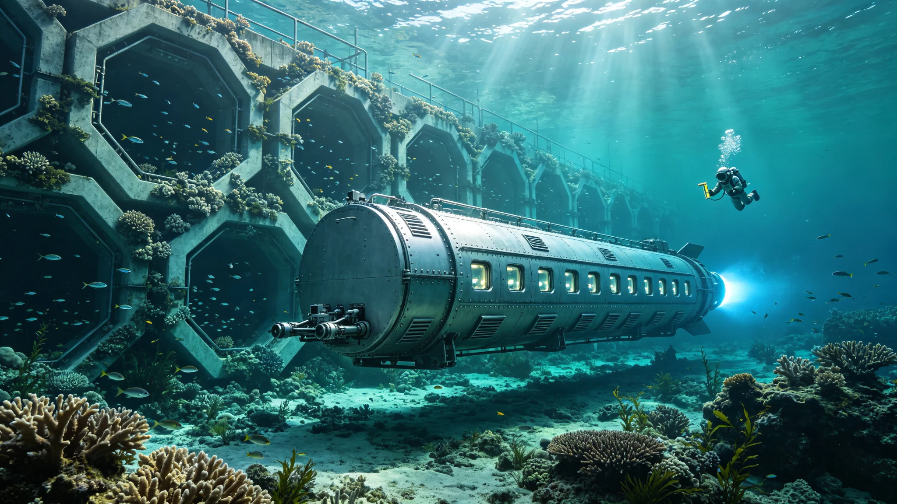

# 比邻星b海洋人工造礁与渔业资源恢复工程公报

**发布机构**：比邻星b行星管理委员会海洋工程总局 / 渔业资源管理局
**发布日期**：2924年3月5日
**文件等级**：全球公开

## 一、工程背景

比邻星b全球海洋面积约为2.8亿平方公里，占行星表面积的68%。然而，由于比邻星b海洋是在大气改造过程中通过极冠水冰释放和彗星撞击补水形成的"年轻海洋"，其自然海底地形相对单一，缺乏地球海洋中常见的珊瑚礁、岩礁和海山等复杂生境。海洋生态监测总局的调查显示，截至2923年底，比邻星b海洋中适合底栖生物栖息的复杂地形海域仅占海洋总面积的3.2%，远低于地球海洋的约15%。

复杂海底地形是海洋生物多样性的基础。岩礁和珊瑚礁为鱼类、贝类、甲壳类和海洋哺乳动物提供了栖息、觅食、繁殖和躲避天敌的场所。缺乏复杂地形导致比邻星b海洋渔业资源的自然承载力偏低。渔业资源管理局的评估数据显示，2923年比邻星b海洋野生鱼类可捕量约为每年820万吨，仅为地球海洋可捕量（按面积比例折算）的28%。

为提升海洋生境复杂度、恢复渔业资源，比邻星b行星管理委员会于2918年批准了"海洋人工造礁与渔业资源恢复工程"，计划在15年内（2919-2934）在全球海洋部署12,000个人工鱼礁单元，总面积达到4,800平方公里，预计可使海洋野生鱼类可捕量提升至每年1,800万吨以上。

## 二、人工鱼礁设计与部署

海洋工程总局组织了由海洋生物学家、材料工程师和海洋建筑师组成的联合设计团队，开发了三种适用于比邻星b海洋环境的人工鱼礁类型：

**A型——模块化混凝土礁体**：采用高孔隙率的海洋工程混凝土预制，每个单元为3米×3米×2米的六面体框架结构，内部包含12个不同大小的栖息空腔。混凝土中添加了20%的贝壳粉和矿渣微粉，表面粗糙度Ra值达到120微米，有利于海洋生物附着。A型礁体主要部署在水深10-50米的近岸海域，为近岸经济鱼类（如引入的真鲷、黑鲷、花鲈）提供栖息场所。每个A型礁体单元的制造成本约为1.2万信用点，设计使用寿命为100年以上。

**B型——钢结构复合礁体**：采用耐海水腐蚀的双相不锈钢桁架结构，高度8-15米，底部跨度6米×6米，顶部设有多层平台和悬挂式栖息网。钢结构表面喷涂了防海洋生物污损的铜基涂层（铜含量8%，在安全范围内），同时在关键节点设置了人工珊瑚附着基。B型礁体主要部署在水深50-200米的大陆架海域，为中上层洄游鱼类（如引入的鲐鱼、沙丁鱼、竹荚鱼）和头足类提供栖息场所。每个B型礁体单元的制造成本约为8.5万信用点。

**C型——废弃工程设施改造礁体**：将退役的海洋工程设施（如旧浮标、废弃管道、退役科考船船体）经过无害化处理后沉放为人工鱼礁。这类礁体具有形态复杂、成本低廉的优势，但需要严格的环境评估和无害化处理（清除燃油、重金属、塑料等污染物）。C型礁体主要部署在水深200米以上的深海海域，为深海鱼类和底栖生物提供栖息场所。截至2923年底，已有47艘退役工程船被改造为C型礁体。

部署方式方面，海洋工程总局开发了专用的"礁体部署船"——"造礁者号"，该船排水量12,000吨，配备300吨级起重机和高精度动力定位系统，可在海况6级以下的条件下进行礁体精确投放，定位误差不超过5米。截至2923年底，"造礁者号"已完成87次部署任务，累计投放人工鱼礁单元3,240个，总面积约1,296平方公里，完成工程总目标的27%。

## 三、渔业资源恢复效果评估

海洋工程总局联合渔业资源管理局，对已部署的人工鱼礁区域进行了为期3年（2921-2923）的跟踪监测。监测结果显示，人工鱼礁的渔业资源恢复效果显著：

**生物量增长**：在部署满2年的人工鱼礁区域，单位面积鱼类生物量从部署前的每平方公里0.8吨增长至每平方公里6.4吨，增幅达700%。其中，岩礁性鱼类（真鲷、黑鲷、石斑鱼）的生物量增长最为显著，达到每平方公里3.2吨，占总生物量的50%。

**物种多样性提升**：人工鱼礁区域的鱼类物种数从部署前的平均12种增加至部署后的平均38种。新增物种中包括14种在比邻星b海洋中此前较为罕见的岩礁性鱼类和6种头足类。海洋生物学家还在人工鱼礁上发现了5种此前未在比邻星b海洋中记录到的附着生物（包括2种海绵和3种苔藓虫），这些物种可能是随人工鱼礁的混凝土表面引入的。

**产卵场功能**：监测发现，人工鱼礁区域已成为重要的鱼类产卵场。2923年繁殖季节，在A型礁体区域记录到真鲷产卵群47个，黑鲷产卵群32个，花鲈产卵群19个。鱼卵和仔鱼的密度在人工鱼礁周边5公里海域内达到每立方米水体128个，是对照海域的8.3倍。

**渔业产量提升**：在人工鱼礁区域周边10公里范围内的作业渔场，2923年的渔获量比2920年（工程启动前）增长了145%。其中，真鲷渔获量增长了280%，黑鲷增长了220%，章鱼增长了190%。渔业资源管理局估计，已部署的3,240个人工鱼礁单元每年可增加渔获量约120万吨，产值约36亿信用点。

## 四、生态风险与管理措施

人工鱼礁工程在带来渔业资源恢复的同时，也存在一些潜在的生态风险，海洋工程总局和渔业资源管理局制定了相应的管理措施：

**外来物种入侵风险**：人工鱼礁表面可能携带地球海洋的附着生物，存在外来物种入侵的风险。管理措施：所有人工鱼礁在部署前必须经过72小时的淡水浸泡和紫外线消毒处理，杀灭表面附着的生物；建立人工鱼礁区域的生物监测网络，每季度进行一次物种调查，发现入侵物种及时处置。

**地质灾害风险**：大量人工鱼礁的集中部署可能改变海底地形和水流模式，引发局部海域的淤积或侵蚀。管理措施：每个人工鱼礁部署区的面积不超过50平方公里，礁体密度不超过每平方公里3个；部署前进行详细的海底地质勘察和水动力模拟，确保礁体部署不会引发地质灾害；每年对部署区进行一次海底地形测量，监测地形变化。

**过度捕捞风险**：人工鱼礁区域渔业资源丰富，可能成为过度捕捞的热点区域。管理措施：在人工鱼礁核心区（礁体周边1公里范围内）设立禁渔区，禁止任何捕捞作业；在人工鱼礁缓冲区（礁体周边1-5公里范围内）实行限额捕捞，每个作业渔船的日渔获量不超过200公斤；建立人工鱼礁区域的电子监控系统，通过渔船AIS定位和水下声呐监测，打击非法捕捞。

## 五、工程展望

海洋工程总局局长赵海峰在公报发布会上表示："人工鱼礁工程是比邻星b海洋生态建设的重要组成部分。我们不仅是在海底投放混凝土和钢铁，更是在为这颗年轻的海洋创造生命的家园。每一个人工鱼礁都是一个海洋生物的'公寓楼'，它们将在未来的数十年里逐渐被生物覆盖，成为真正的'海底森林'。"

根据工程规划，到2934年工程完成时，12,000个人工鱼礁单元将分布在比邻星b全球海洋的48个重点海域，形成覆盖近岸、大陆架和深海的人工鱼礁网络。预计到2940年，人工鱼礁区域的鱼类生物量将达到每平方公里15吨以上，海洋野生鱼类可捕量将提升至每年2,000万吨，为比邻星b全球8.6亿人口提供约15%的动物蛋白供应。

公报最后写道："24年前，比邻星b的海洋里只有浮游生物和少量引入的鱼类。今天，我们的海底有了人工鱼礁，有了繁荣的鱼类群落。这是人类用工程手段为自然创造生机的又一个范例。在未来，这些人工鱼礁将逐渐与自然融为一体，成为比邻星b海洋生态系统不可分割的一部分。"
