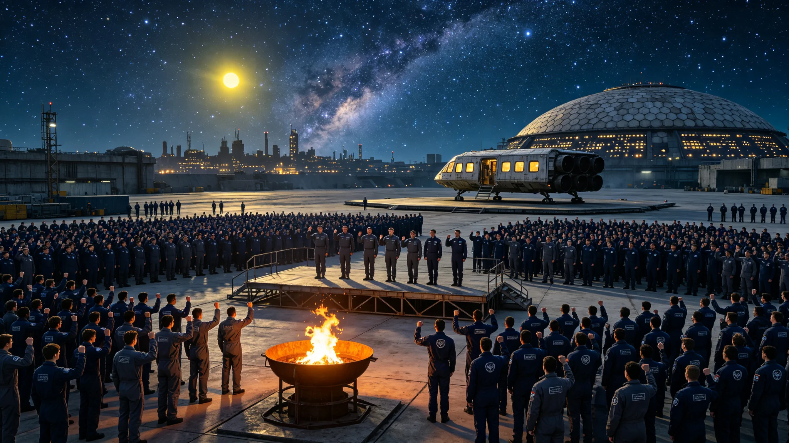

# 比邻星b成人礼制度改革：露天星空下的宣誓公报

**发布机构**：比邻星b行星管理委员会文化与教育部 / 全球青年事务委员会
**发布日期**：2926年6月15日
**文件等级**：全球公开

## 一、改革背景

比邻星b的成人礼制度始于2789年，当时大气改造工程尚处于第三阶段（生态引入期），人类仍生活在全封闭加压穹顶城市中。最初的成人礼仪式在穹顶城市的中央广场举行，年满18岁的青年在模拟日光灯下宣誓成人，仪式内容包括家长致辞、颁发成人证书、集体合唱行星之歌等。这一制度延续了137年，虽然在形式上有所调整（如2850年增加了"成人责任清单"环节，2880年引入了"代际对话"环节），但核心框架始终是在封闭穹顶内举行的室内仪式。

2900年大气改造完成后，比邻星b进入露天自由呼吸时代，社会生活的方方面面都发生了深刻变化。然而，成人礼制度的改革却相对滞后。直到2925年，仍有约70%的城市在穹顶内或半封闭场馆中举行成人礼，仅有30%的城市尝试了露天成人礼。文化与教育部的调查显示，68%的青年认为现行成人礼"缺乏仪式感和震撼力"，54%的青年希望成人礼能够"在真正的天空下举行"，47%的青年认为成人礼的内容"过于形式化，缺乏实质意义"。

2925年10月，全球青年事务委员会向行星管理委员会提交了《关于改革比邻星b成人礼制度的建议报告》，提出了以"露天星空下的宣誓"为核心的成人礼改革方案。经过6个月的公众咨询和立法审议，行星管理委员会于2926年6月15日正式批准了成人礼制度改革方案，决定从2927年起在全球推行新的成人礼制度。

## 二、新成人礼制度的核心内容

新的成人礼制度以"露天、星空、宣誓、责任"为核心理念，主要内容包括：

**仪式场所**：成人礼必须在露天场所举行，优先选择具有自然或人文意义的地点，如山顶、海滨、森林边缘、历史纪念地、行星地标等。每个城市需指定至少3个官方成人礼仪式场地，并建设必要的基础设施（如观礼台、音响系统、照明设施、应急医疗点）。对于因天气原因无法在露天举行的情况（如暴雨、大风），可启用备用的半露天场地（如有顶棚但四周开放的场地），但不得在完全封闭的室内场馆举行。

**仪式时间**：成人礼统一在每年6月的第三个星期六举行（比邻星b的"成人节"），仪式开始时间为日落后1小时（约20:30-21:00，因纬度而异），确保仪式在星空下进行。仪式持续约2小时，包括日落时分的开场、星空下的宣誓和午夜前的结束。选择夜间举行的原因是：比邻星b的夜空清澈（大气改造完成后，全球光污染得到了有效控制），星空璀璨，能够为青年提供震撼的视觉体验和哲学思考空间。

**核心仪式流程**：
1. **日落开场**（约30分钟）：全体参与者面向西方，观看日落。主持人介绍比邻星b的日落特点（由于比邻星是红矮星，日落呈现独特的橙红色，且由于比邻星b潮汐锁定，赤道区域的日落过程持续约45分钟，比地球长）。
2. **星空点亮**（约15分钟）：日落后，随着天空逐渐变暗，星星逐一出现。主持人引导参与者仰望星空，介绍夜空中的主要星座和天体，特别是地球所在的太阳系方向（在比邻星b的夜空中，太阳是一颗明亮的黄色恒星，视星等约为0.4等，是夜空中最亮的恒星之一）。
3. **成人宣誓**（约30分钟）：全体年满18岁的青年在星空下面向"地球方向"（即太阳所在的方位）举起右手，宣读《比邻星b公民成人誓言》。誓言内容包括："我志愿成为比邻星b的成年公民，承担公民的权利和义务；我尊重这颗行星的生态环境，守护我们的家园；我铭记人类文明的起源和历史，传承文明的火种；我追求真理和知识，为社会的进步贡献力量；我关爱他人和社会，践行公正和善良。"宣誓后，每位青年在"成人誓言墙"（一块刻有历年成人青年姓名的金属板）上刻下自己的名字。
4. **代际传承**（约20分钟）：每位青年从一位长辈（父母、祖父母或社区长者）手中接过一件"成人信物"。信物可以是家族传承的物品（如祖辈从地球带来的小物件、家族徽章），也可以是社区统一准备的纪念品（如一枚刻有成人年份和个人姓名的金属徽章、一本《比邻星b公民手册》）。长辈向青年说一句寄语，青年向长辈鞠躬致谢。
5. **篝火与歌舞**（约25分钟）：仪式场地中央点燃篝火（使用环保燃料，无烟无味），全体参与者围绕篝火合唱行星之歌和传统歌曲，跳集体舞。这一环节象征着人类文明的火种在新一代手中传承。

**成人责任清单**：新制度要求每位青年在成人礼前完成一份"成人责任清单"，包括以下内容：
- 完成至少40小时的社区志愿服务（在过去12个月内）
- 掌握一项基本生活技能（如烹饪、维修、急救、种植等，需通过社区考核）
- 阅读《比邻星b文明史纲要》并撰写一篇不少于2,000字的读后感
- 参与一次"行星认知之旅"（参观至少3个行星级地标或历史纪念地）
- 制定一份个人未来5年发展规划

未完成责任清单的青年可参加成人礼仪式，但需在仪式后6个月内补全，否则将暂缓颁发成人证书和相关公民权利（如选举权、独立信贷权等）。

## 三、首批试点与社会反响

2926年6月20日（改革方案批准后的第一个周六），新成人礼制度在12个试点城市先行先试，共有约84,000名青年参加了试点仪式。试点城市包括新长安市（首都）、东海市（沿海城市）、青松岭市（山区城市）、北辰市（高纬度城市）等不同类型的城市。

试点仪式的社会反响热烈。文化与教育部的事后调查显示：
- 92%的参与青年表示新成人礼"非常有仪式感"或"比较有仪式感"
- 87%的青年认为"星空下宣誓"是最令人难忘的环节
- 78%的青年表示成人礼后"更加意识到自己的公民责任"
- 85%的家长表示新成人礼"比旧制度更有意义"
- 91%的现场观众表示被仪式"感动"或"深受震撼"

新长安市的试点仪式在"中央广场"（原首批评审着陆点，全球最大的公共广场）举行，约12,000名青年参加。仪式当晚天气晴朗，星空璀璨，当全体青年在星空下面向地球方向宣誓时，现场许多观众流下了眼泪。新长安市市长在仪式后表示："这是我见过的最震撼的成人礼。当一万多名年轻人在星空下齐声宣誓时，你能感受到文明的力量在传承。"

然而，试点过程中也发现了一些问题：部分山区城市的夜间气温较低（6月夜间最低温度约8°C），需要为参与者提供保暖措施；部分城市的光污染控制不够严格，影响了星空的可见度；个别场地的音响系统在户外环境中效果不佳，需要升级。文化与教育部表示将在全面推行前解决这些问题。

## 四、制度意义与文化影响

文化与教育部部长林晓梅在公报发布会上阐述了成人礼制度改革的深层意义："成人礼不仅仅是一个仪式，它是一个社会对新一代人的期望和嘱托，也是年轻人对自己公民身份的确认和承诺。在封闭穹顶中生活了几百年后，我们终于可以在真正的天空下、在璀璨的星空下举行成人礼。这不仅仅是场所的改变，更是精神的解放。当年轻人仰望星空时，他们会思考：我是谁？我从哪里来？我要到哪里去？这些问题的答案，就藏在那片星空里——我们的祖先从地球来，我们生活在比邻星b，我们的未来在星辰大海。"

社会学家指出，新成人礼制度将对比邻星b的文化认同和社会凝聚力产生深远影响：
- **强化行星认同**：在星空下面向地球方向宣誓，既铭记了人类文明的起源，又确认了比邻星b作为新家园的身份，有助于形成"地球是故乡，比邻星是家园"的双重文化认同。
- **增强代际联系**：代际传承环节通过实物信物和口头寄语，强化了长辈与晚辈之间的情感联系和文化传承。
- **培养公民责任**：成人责任清单将抽象的公民责任转化为具体的、可操作的行动，有助于培养年轻人的社会责任感和公民意识。
- **丰富文化生活**：成人节将成为比邻星b重要的文化节日，每年6月的第三个周六将成为全球青年的共同节日，带动相关的文化活动和商业活动。

## 五、实施计划

新成人礼制度将于2927年6月19日（6月第三个周六）在全球正式推行。文化与教育部制定了详细的实施计划：

- 2926年7月-12月：完成全球所有城市的成人礼场地选定和基础设施建设；编制《成人礼操作手册》和《成人责任清单实施指南》；对全球各城市的成人礼组织者进行培训。
- 2927年1月-5月：各城市组织年满18岁的青年完成成人责任清单；进行成人礼仪式的彩排和预演；开展成人礼制度的宣传推广活动。
- 2927年6月19日：全球首次统一举行新制度下的成人礼，预计将有约1,200万名青年参加（比邻星b每年年满18岁的青年约1,200万人）。

公报最后写道："26年前，我们第一次在这颗行星的天空下自由呼吸。今天，我们决定让我们的年轻人在这颗行星的星空下宣誓成人。从穹顶下的日光灯到露天的星空，这不仅仅是仪式场所的改变，更是一个文明从封闭走向开放、从生存走向生活的象征。愿每一个在比邻星b星空下宣誓的年轻人，都能记住那一刻的震撼和感动，带着对家园的热爱、对文明的敬畏、对未来的信心，走上成人的道路。"
