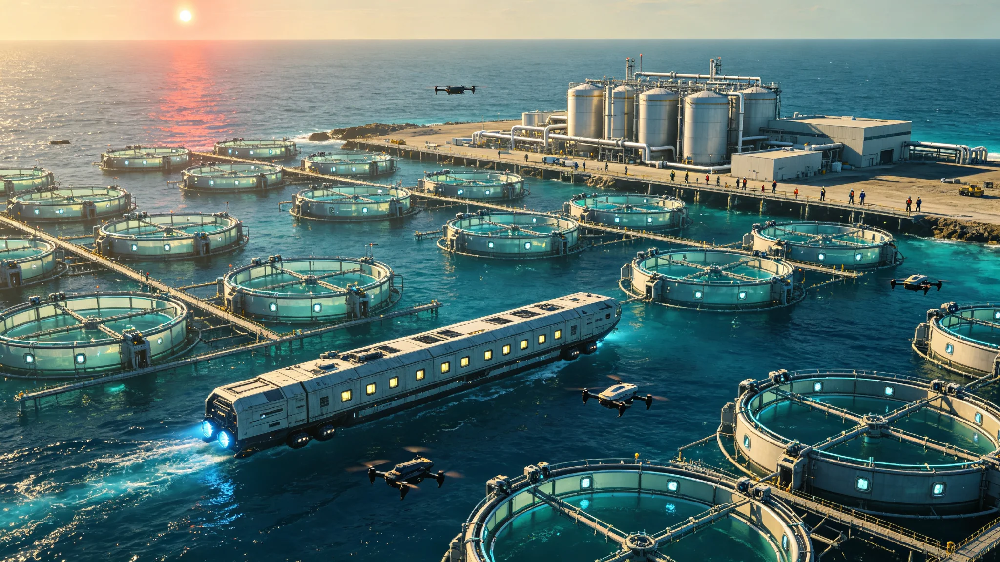

# 比邻星b海洋经济开发区设立暨海水淡化与深海养殖产业公报

**发布机构**：比邻星b行星管理委员会经济发展总局 / 海洋资源开发管理局
**发布日期**：2927年9月10日
**文件等级**：全球公开

## 一、设立背景

比邻星b全球海洋面积2.8亿平方公里，蕴藏着丰富的水资源、生物资源、矿产资源和能源资源。然而，在大气改造完成后的前27年（2900-2927），比邻星b的经济活动主要集中在陆地，海洋经济的发展相对滞后。经济发展总局的统计数据显示，2926年比邻星b海洋经济总产值约为1,280亿信用点，仅占全球GDP的4.2%，远低于地球海洋经济占比（约15%）。

制约比邻星b海洋经济发展的主要因素包括：海洋基础设施薄弱（港口、码头、海上平台等数量不足）、海洋开发技术相对落后、海洋产业人才短缺、海洋管理法规不完善等。此外，比邻星b海洋是"年轻海洋"，海洋生态系统尚处于发育阶段，渔业资源的自然承载力有限，也制约了传统海洋渔业的发展。

为推动海洋经济发展，将海洋资源优势转化为经济优势，比邻星b行星管理委员会于2927年9月10日正式批准设立"全球海洋经济开发区"。开发区规划总面积为120万平方公里（占海洋总面积的0.43%），分布在全球六个大陆的近岸海域，重点发展海水淡化、深海养殖、海洋生物医药、海洋矿产资源开发、海洋可再生能源和海洋旅游六大产业。开发区实行特殊的经济政策和管理体制，旨在打造比邻星b海洋经济的先行区和示范区。

## 二、海水淡化产业

海水淡化是海洋经济开发区的重点发展产业之一。比邻星b虽然拥有广阔的海洋，但陆地淡水资源分布不均，部分内陆地区和岛屿存在淡水资源短缺的问题。同时，随着人口增长和经济发展，全球淡水需求量持续增加。海水淡化作为稳定的淡水供应来源，具有广阔的市场前景。

开发区内规划建设12座大型海水淡化厂，总设计产能为每日淡水800万吨（年产淡水约29.2亿吨）。海水淡化技术以反渗透法为主（占总产能的75%），辅以低温多效蒸馏法（占总产能的25%，主要利用邻近发电厂的余热）。

**核心技术参数**：
- 反渗透膜采用新一代耐污染高通量复合膜，水通量达到每平方米每小时45升，脱盐率99.8%，膜使用寿命5年。
- 反渗透法的能耗为每立方米淡水2.8千瓦时（含预处理和后处理），比2900年的技术水平降低了35%。
- 低温多效蒸馏法的造水比为12（即1吨蒸汽可生产12吨淡水），利用余热时的净能耗仅为每立方米淡水0.5千瓦时。
- 浓盐水排放采用扩散稀释方式，通过长达2公里的多孔扩散管将浓盐水排入深海，确保排放口周边海域的盐度升高不超过0.5个百分点，避免对海洋生态造成影响。

**经济效益**：12座海水淡化厂总投资约320亿信用点，建设周期4年（2928-2931）。建成后，年产淡水29.2亿吨，按照每吨淡水1.2信用点的出厂价计算，年产值约35亿信用点，投资回收期约12年。海水淡化厂的建设和运营将创造约12,000个就业岗位。

此外，海水淡化厂产生的浓盐水将作为盐化工产业的原料，用于提取食盐、镁、溴、钾等化工产品。开发区内规划建设4座盐化工厂，年处理浓盐水约15亿吨，年产食盐800万吨、金属镁15万吨、溴素3万吨、钾肥50万吨，年产值约48亿信用点。

## 三、深海养殖产业

深海养殖是开发区的另一重点产业。比邻星b陆地农业用地有限（可耕地面积约占陆地面积的25%），而海洋空间广阔，发展深海养殖可以有效缓解土地资源压力，为全球人口提供优质的动物蛋白。

开发区内规划建设8个深海养殖区，总面积约8,000平方公里，主要发展以下养殖品种：

**鱼类养殖**：养殖品种包括真鲷、黑鲷、花鲈、大黄鱼、石斑鱼等引入的优质海水鱼类。养殖方式采用大型深水网箱（每个网箱周长80米，深度30米，养殖水体约1.5万立方米）和养殖工船（排水量3万吨，可容纳10个大型网箱，具备自主航行和远程投喂能力）。规划部署深水网箱480个、养殖工船12艘，年产商品鱼约120万吨。

**贝类养殖**：养殖品种包括牡蛎、扇贝、贻贝、鲍鱼等。养殖方式采用浮筏养殖和垂下式养殖。规划养殖面积约1,200平方公里，年产贝类约80万吨（带壳重）。

**藻类养殖**：养殖品种包括海带、紫菜、裙带菜、石花菜等。藻类养殖不仅可以提供食品和工业原料，还可以吸收海水中的营养盐，净化水质，同时具有碳汇功能。规划养殖面积约2,000平方公里，年产藻类约150万吨（鲜重）。

**甲壳类养殖**：养殖品种包括对虾、龙虾、梭子蟹等。养殖方式采用池塘养殖和网箱养殖相结合。规划养殖面积约400平方公里，年产甲壳类约15万吨。

**核心技术**：
- 自动投喂系统：基于水下摄像头和AI图像识别技术，实时监测鱼类的摄食行为和生长状态，自动调整投喂量和投喂频率，饲料转化率比传统人工投喂提高了25%。
- 水下机器人巡检：使用自主水下航行器（AUV）定期巡检网箱和养殖设施，检查网衣破损、鱼类健康状况和水下环境，巡检效率比人工潜水检查提高了10倍。
- 循环水养殖系统（RAS）：在养殖工船上配备闭环循环水系统，通过物理过滤、生物过滤、紫外线消毒和氧气增氧等环节，实现养殖水体的循环利用，水交换率仅为每天5%，大幅减少了对周边海域的环境影响。
- 水产品冷链物流：开发区内建设4座大型水产品冷链物流中心，配备快速冷冻设备（冷冻温度-60°C，可在30分钟内将水产品中心温度降至-18°C以下）和低温仓储设施，确保水产品的品质和新鲜度。

**经济效益**：深海养殖产业总投资约280亿信用点，建设周期5年（2928-2932）。建成后，年产水产品约365万吨（含鱼类120万吨、贝类80万吨、藻类150万吨、甲壳类15万吨），按照平均每吨1,200信用点的出厂价计算，年产值约438亿信用点，投资回收期约8年。深海养殖产业将创造约45,000个就业岗位。

## 四、其他重点产业

除海水淡化和深海养殖外，开发区还重点发展以下四大产业：

**海洋生物医药**：利用比邻星b海洋生物资源（包括引入的地球海洋生物和可能发现的本土海洋生物），开发海洋药物、生物材料和功能性食品。开发区内建设2个海洋生物医药产业园，吸引50家以上的生物医药企业入驻，预计到2935年年产值达到200亿信用点。

**海洋矿产资源开发**：开发海底多金属结核、富钴结壳和热液硫化物等矿产资源。开发区内规划建设2个深海采矿示范区，使用自主采矿机器人进行海底矿产资源的勘探和开采。预计到2940年年产多金属结核100万吨（干重），可提取镍1.2万吨、铜0.8万吨、钴0.3万吨、锰25万吨，年产值约35亿信用点。

**海洋可再生能源**：开发海上风能、潮汐能、波浪能和海洋温差能。开发区内规划建设3个海上风电场（总装机容量240万千瓦）、2个潮汐能发电站（总装机容量30万千瓦）和1个海洋温差能发电试验站（装机容量10万千瓦）。预计到2935年海洋可再生能源年发电量达到120亿千瓦时，年产值约36亿信用点。

**海洋旅游**：利用比邻星b独特的海洋景观（如清澈的海水、丰富的海洋生物、独特的海岸地貌），发展滨海度假、潜水观光、海钓运动、邮轮旅游等海洋旅游产业。开发区内规划建设6个海洋旅游度假区，预计到2935年年接待游客达到2,000万人次，旅游收入达到80亿信用点。

## 五、管理体制与政策支持

海洋经济开发区实行"管委会+公司"的管理体制。设立"全球海洋经济开发区管理委员会"，作为行星管理委员会的派出机构，负责开发区的规划、管理和协调。同时成立"海洋经济开发投资集团公司"，作为开发区的开发运营主体，负责基础设施建设、产业投资和招商引资。

开发区实行以下特殊政策：
- **税收优惠**：开发区内的企业前5年免征企业所得税，第6-10年减半征收企业所得税；进口设备和原材料免征关税。
- **用地用海优惠**：开发区内的海域使用权出让金按照标准价格的50%收取，使用期限最长可达50年。
- **金融支持**：设立"海洋经济发展基金"，初始规模200亿信用点，为开发区内的企业提供低息贷款和股权投资支持；鼓励金融机构开发适合海洋产业特点的金融产品（如海域使用权抵押贷款、养殖保险、航运保险等）。
- **人才政策**：对引进的海洋产业高端人才给予住房补贴、子女教育优惠和个人所得税减免等政策；在开发区内设立2所海洋职业技术学院，培养海洋产业技能人才。

## 六、环境保护与可持续发展

海洋经济开发区的发展坚持"生态优先、绿色发展"的原则，严格控制开发活动对海洋生态环境的影响。开发区管理委员会制定了严格的环境保护标准：

- 所有养殖区必须设置在远离自然保护区和重要渔业水域的区域，养殖密度控制在环境承载力的70%以内。
- 所有工业企业必须配备完善的污水处理设施，废水排放达到比邻星b最严格的海洋排放标准（COD≤30mg/L，氨氮≤2mg/L，总磷≤0.3mg/L）。
- 建立开发区海洋生态环境监测网络，部署200个海洋环境监测浮标，实时监测海水水质、沉积物质量和海洋生物状况，监测数据向社会公开。
- 实行"海洋生态补偿制度"，开发区内的企业按照产值的0.5%缴纳海洋生态补偿费，专项用于海洋生态保护和修复。
- 定期开展开发区海洋生态环境影响评估，每5年进行一次全面评估，根据评估结果调整开发规划和产业布局。

经济发展总局局长王建国在公报发布会上表示："海洋是比邻星b最大的未开发空间，也是我们未来经济增长的重要引擎。设立海洋经济开发区，不是要掠夺海洋资源，而是要在保护海洋生态的前提下，科学、有序、可持续地开发利用海洋资源。我们希望通过开发区的先行先试，探索出一条适合比邻星b的海洋经济发展道路，让蓝色海洋成为我们文明的新粮仓、新矿场、新电厂和新乐园。"

公报最后写道："27年前，我们第一次在这颗行星的海洋边自由呼吸。今天，我们开始向这片广阔的蓝色海洋要资源、要空间、要未来。海洋经济开发区的设立，标志着比邻星b从'陆地文明'向'陆海统筹文明'的转型。在保护中开发，在开发中保护，让海洋经济的繁荣与海洋生态的健康并行不悖，这是我们对这颗行星、对未来世代的承诺。"
