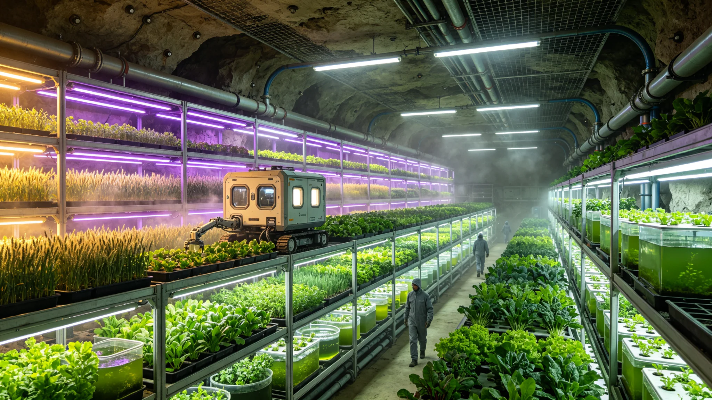

# 火星地下温室第三批作物品种选育与产量突破报告

**发布机构**：火星殖民地管理委员会农业总局 / 火星农业科学研究院
**发布日期**：2928年2月28日
**文件等级**：内太阳系公开

## 一、项目背景

火星地下温室农业是火星殖民地粮食安全的核心保障。由于火星地表环境极端恶劣（平均温度-63°C、大气压力仅为地球的0.6%、太阳辐照度仅为地球的43%、宇宙辐射强烈），火星农业全部在地下温室中进行。截至2927年底，火星已建成地下温室总面积约128平方公里，分布在"奥林匹斯"、"水手谷"、"乌托邦"三大地下城市群中，年产粮食约840万吨，可满足火星殖民地3,200万人口约85%的粮食需求。

火星地下温室农业的发展经历了两个阶段：
- **第一阶段（2450-2700）——生存型农业**：以种植高产、耐逆的基础作物（土豆、红薯、大豆、小麦）为主，目标是解决温饱问题。作物品种直接从地球引进，未经过火星环境适应性改良，产量较低（平均每平方米每年产粮约8公斤）。
- **第二阶段（2701-2900）——改良型农业**：开始进行作物品种的适应性选育和基因改良，通过辐射诱变、杂交育种和基因编辑等手段，培育适合火星地下温室环境的作物品种。第一批（2720年发布）和第二批（2810年发布）选育品种共涉及12种作物，使平均产量提升至每平方米每年约15公斤。

2900年以后，火星殖民地人口持续增长（从2900年的2,100万增长至2927年的3,200万），粮食需求不断增加。同时，火星殖民地提出了"2950年粮食自给率达到95%"的目标。为实现这一目标，火星农业科学研究院于2905年启动了第三批作物品种选育计划，历时23年，于2928年完成。

## 二、第三批选育品种概况

第三批作物品种选育计划共涉及18种作物，包括粮食作物6种（小麦、水稻、玉米、大豆、土豆、红薯）、蔬菜作物8种（番茄、黄瓜、辣椒、生菜、白菜、胡萝卜、洋葱、菠菜）、经济作物3种（棉花、油菜、烟草）和饲料作物1种（苜蓿）。

选育工作由火星农业科学研究院统一组织，全院12个研究所、340名科研人员参与，同时与地球农业科学院、比邻星b农业大学开展跨星系合作。选育过程累计种植试验材料约120万株，记录农艺性状数据约2,800万条，进行基因测序约45,000份。

第三批选育品种的核心技术路线包括：
- **火星环境适应性定向选育**：在火星地下温室的真实环境中（低重力0.38g、人工光照、封闭循环空气、火星土壤改良基质），对引进的地球作物品种和突变体进行多代定向选育，每代选择适应性最强、产量最高的个体留种。经过平均18代的选育，获得了稳定的适应性品系。
- **基因编辑精准改良**：利用CRISPR-Cas9和更先进的先导编辑（Prime Editing）技术，对控制关键农艺性状的基因进行精准编辑。重点改良的性状包括：低重力下的根系发育、人工光照下的光合效率、封闭环境下的抗病性、营养成分含量等。
- **种间杂交与远缘杂交**：利用火星低重力环境对植物生殖发育的特殊影响，进行了在地球环境中难以成功的远缘杂交实验。例如，将普通小麦与火星适应性强的偃麦草进行远缘杂交，获得了兼具高产和强抗性的新品种。
- **辐射诱变与空间诱变**：利用火星地表宇宙辐射强烈的特点，将作物种子放置在地表辐射暴露站进行辐射诱变（暴露时间6-12个月，接受的辐射剂量约为地球背景辐射的200倍），获得了大量有益突变体。

## 三、重点品种介绍与产量数据

第三批选育品种中，以下几个品种表现最为突出：

**"火星麦3号"小麦**：这是第三批选育中最具代表性的品种。"火星麦3号"是通过将地球矮秆小麦与火星适应性偃麦草进行远缘杂交，再经过15代定向选育和基因编辑改良获得的。其主要特点包括：
- 株高仅45厘米（地球小麦平均80厘米），茎秆粗壮，抗倒伏能力强，适合密植。
- 叶片短而宽，叶色深绿，在人工LED光照下的光合效率比地球小麦高35%。
- 生育期仅90天（地球小麦平均120天），一年可种植4茬（火星温室全年恒温恒湿，无季节限制）。
- 穗粒数平均42粒，千粒重48克，籽粒蛋白质含量14.5%。
- 产量：在最优栽培条件下，每茬每平方米产量达到2.8公斤，年总产量（4茬）达到每平方米每年11.2公斤。考虑到小麦的出粉率约85%，每平方米每年可产面粉约9.5公斤。

**"火稻1号"水稻**：这是首个在火星地下温室中成功实现高产栽培的水稻品种。水稻此前在火星温室中栽培困难，主要原因是低重力环境下水稻根系发育不良，且水稻需要大量水（水田栽培）。"火稻1号"通过基因编辑改良了根系发育相关基因，使水稻在0.38g低重力下根系仍能正常发育；同时采用了气雾栽培技术（根系悬挂在雾化营养液中，无需水田），大幅减少了用水量。"火稻1号"的生育期为100天，一年可种植3.5茬，每茬每平方米产量达到3.2公斤，年总产量达到每平方米每年11.2公斤。

**"火豆2号"大豆**：蛋白质含量高达42%（地球大豆平均38%），含油量21%。生育期85天，一年可种植4茬，每茬每平方米产量1.8公斤，年总产量每平方米每年7.2公斤。"火豆2号"的固氮能力经过基因编辑增强，在火星温室的封闭环境中可以高效固定空气中的氮气，减少了化肥使用量。

**"火薯4号"土豆**：这是火星殖民地的传统主粮作物，经过第三批选育后产量大幅提升。"火薯4号"的块茎大小均匀（单薯重约150克），淀粉含量18%，维生素C含量比地球土豆高40%。生育期75天，一年可种植4.5茬，每茬每平方米产量达到6.5公斤，年总产量每平方米每年29.3公斤（鲜重），折干重约每平方米每年7.3公斤。

**"火茄3号"番茄**：采用无限生长型品种，在温室中可连续结果12个月以上。单果重约120克，可溶性固形物含量6.5%（比地球番茄高15%），维生素C含量丰富。采用气雾栽培和自动授粉系统，年产量达到每平方米每年45公斤（鲜重）。

## 四、产量突破与粮食安全影响

第三批选育品种的推广应用，使火星地下温室农业的整体产量水平实现了重大突破：

- **粮食作物平均产量**：从第二批品种的每平方米每年约15公斤（折干重）提升至第三批的每平方米每年约22公斤（折干重），增幅达47%。
- **温室产能利用率**：由于新品种的生育期缩短、密植程度提高，温室的年产能利用率从约70%提升至约90%。
- **单位面积粮食产出**：按照第三批品种的平均产量计算，每平方公里温室每年可产粮约2.2万吨（折干重）。火星现有128平方公里温室，年粮食产能可达约282万吨（折干重），加上蔬菜和薯类（折干重），总食物产能约为每年1,120万吨（折干重），可满足约4,200万人口的粮食需求（按每人每年265公斤口粮计算）。

火星殖民地管理委员会农业总局局长张禾在报告发布会上表示："第三批作物品种选育的成功，是火星农业史上的里程碑。它意味着我们不仅能在火星上活下去，还能活得好、吃得好。按照第三批品种的产量水平，我们有信心在2945年提前实现'粮食自给率95%'的目标，甚至在2950年实现粮食完全自给并开始向其他殖民地出口粮食。"

报告还指出，第三批品种的成功不仅提升了产量，还改善了农产品的品质和多样性。此前火星殖民地的食品结构相对单一（以土豆、大豆、小麦为主），第三批品种中包括了8种蔬菜和3种经济作物，将显著丰富火星居民的餐桌，改善营养结构。同时，棉花和油菜品种的选育成功，将使火星殖民地实现纺织品和食用油的自给，减少对地球和比邻星b的进口依赖。

## 五、技术创新与未来展望

第三批选育工作中，火星农业科学研究院取得了多项技术创新：

**低重力植物生长模型**：通过对18种作物在0.38g低重力环境下23代生长数据的系统分析，建立了世界上首个"低重力植物生长发育数学模型"。该模型可以预测不同作物品种在低重力环境下的生长表现，为品种选育提供了理论指导，将选育周期从平均20年缩短至约10年。

**人工光照最优光谱配方**：通过对不同作物品种在不同LED光谱配方下的光合效率和产量的系统测试，开发了"作物专属光谱配方"技术。每种作物都有最优化的LED光谱配方（如小麦适合红蓝光比例3:1，番茄适合红蓝光比例4:1并添加少量远红光），可使光合效率比通用白光提升20-30%。

**封闭环境垂直农业技术**：第三批品种的选育与垂直农业技术的发展同步推进。新品种普遍适合多层立体栽培（株高较矮、耐弱光），配合自动输送系统和LED光照，可实现每平方米地面面积对应5-8平方米栽培面积的垂直种植，进一步提升了温室的空间利用率。

未来展望方面，火星农业科学研究院已启动第四批作物品种选育计划（2928-2950），重点方向包括：
- 培育适合火星地表露天栽培的作物品种（随着火星大气改造工程的推进，未来火星地表可能实现"面罩可呼吸"的半露天环境）。
- 开发"功能性作物"，如富含特定营养成分的"医疗食品"作物、可生产工业原料的"生物工厂"作物。
- 利用合成生物学技术，设计全新的作物品种，如能够在火星土壤中原位固氮的"自肥作物"、能够高效吸收火星土壤中重金属的"修复作物"。

报告最后写道："在火星的地下深处，在人工灯光的照耀下，我们的农学家用23年的时间，培育出了18个适合这颗红色星球的作物品种。每一粒种子都承载着人类在异星生存和繁荣的希望。从'能活下去'到'活得好'，从'吃得上'到'吃得好'，火星农业的每一次进步，都是人类文明在跨星球生存能力上的一次飞跃。未来，当我们的后代在火星的露天田野里收割庄稼时，他们会记得，这一切始于地下温室里那一束人工的光。"
