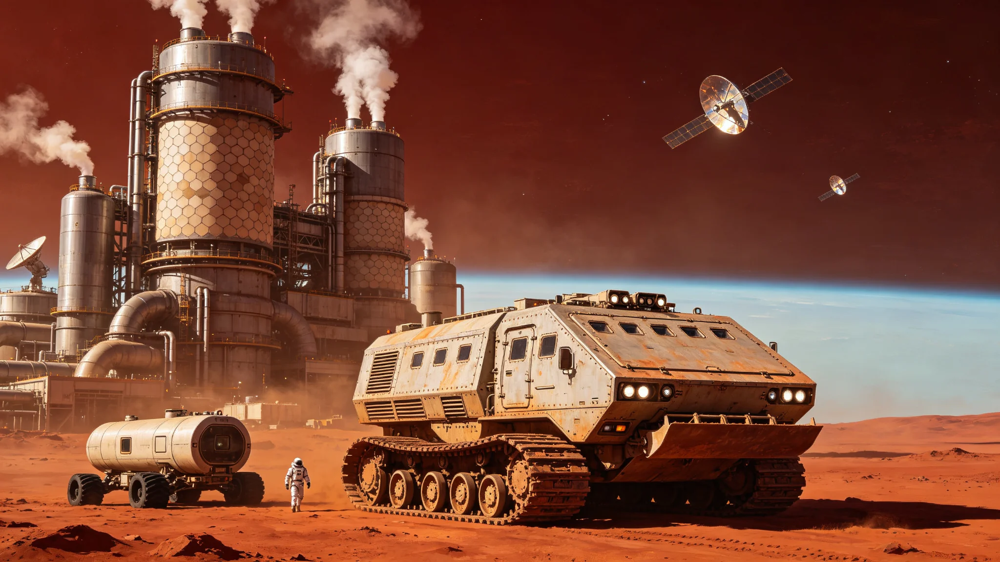

# 火星大气改造工程第三任总指挥任职传记与工程决策录

**发布机构**：火星殖民地管理委员会 / 火星大气改造工程总局
**发布日期**：2930年5月20日
**文件等级**：内太阳系公开

## 一、传主生平概述

赵钢，2855年出生于火星"奥林匹斯"地下城市，火星大气改造工程第三任总指挥，火星地球化进程的核心领导者之一。2930年5月，75岁的赵钢在任职18年后正式卸任，火星殖民地管理委员会为其举办了隆重的卸任仪式，并发布了这部任职传记与工程决策录，以记录他在火星大气改造工程中做出的贡献。

赵钢的职业生涯与火星大气改造工程紧密相连。2878年，23岁的他以大气物理学博士学位毕业于火星第一理工学院，加入火星大气改造工程总局，担任初级工程师。2895年，40岁的他被任命为火星大气改造工程副总设计师，协助第二任总指挥主持"极冠挥发物释放计划"的实施。2912年，57岁的他正式就任火星大气改造工程第三任总指挥，全面负责火星大气改造工程的实施，直至2930年卸任。

在赵钢任职的18年间（2912-2930），火星大气改造工程取得了重大进展：全球平均地表气压从0.8千帕升至2.4千帕，平均地表温度从-55°C升至-32°C，液态水开始在赤道区域的低洼地带季节性稳定存在，大气改造工程从"基础建设期"进入了"加速增压期"。

## 二、成长经历：火星地下城市的"气压男孩"

赵钢在传记的开篇回忆了自己的童年："我出生在火星的地下城市里，从小就知道'外面'是一个无法呼吸的地方。我的父亲是大气改造工程的一名管道工程师，他经常带我去工程现场，看那些巨大的气体处理机组。他对我说：'儿子，这些机器正在为火星制造空气。也许有一天，你能在外面自由呼吸。'那时候我觉得，那是一个遥不可及的梦想。"

赵钢从小就对"空气"有着特殊的敏感。他回忆道："在地下城市里，空气是经过循环处理的，有一种特殊的味道——臭氧的味道、金属的味道、还有一点点植物的味道。我小时候最喜欢做的事情，就是站在气闸舱旁边，听外面的风声（通过传感器传进来的模拟声），想象外面的世界是什么样子。"

2873年，18岁的赵钢考入火星第一理工学院大气物理系。他的博士论文题目是《火星极冠二氧化碳水合物的热力学稳定性与释放机制研究》，这篇论文后来成为"极冠挥发物释放计划"的重要理论基础。

## 三、关键工程决策录

赵钢任职18年间，做出了多项影响火星大气改造进程的关键决策。传记详细记录了其中最重要的五项决策：

**决策一（2913年）："轨道镜阵列"扩建工程**

赵钢上任后的第一个重大决策，是批准扩建"轨道镜阵列"。轨道镜阵列是火星大气改造的核心设施之一，通过在火星轨道上部署大型反射镜，将太阳光反射到火星极冠，加速极冠二氧化碳和水冰的挥发。原有的轨道镜阵列总面积为200平方公里，可将火星极冠区域的入射太阳辐射增强约15%。

赵钢上任后，经过详细的技术经济论证，决定将轨道镜阵列的面积从200平方公里扩建至800平方公里，总投资约600亿信用点。这一决策在当时引发了争议——有人认为投资过大，不如将资金用于地面气体处理机组的建设；有人担心大面积轨道镜可能对火星气候产生不可预测的影响。

赵钢在决策备忘录中写道："火星大气改造的核心瓶颈是能量。我们需要足够的能量来释放极冠的挥发物、驱动气体处理机组、维持生态系统。轨道镜阵列是目前最高效的能量输入方式——每平方公里轨道镜每年可反射约1.5×10^14焦耳的能量到火星表面，相当于4万吨标准煤的能量，且建设成本仅为同等能量输出的核聚变反应堆的三分之一。扩建轨道镜阵列不是可选项，而是必选项。"

扩建工程于2913年启动，2920年完成。扩建后的轨道镜阵列使火星极冠区域的入射太阳辐射增强了约60%，极冠挥发物的释放速率提升了约2.5倍，直接推动了火星气压的加速上升。事后评估认为，这一决策使火星大气改造的整体进度提前了约15年。

**决策二（2916年）："温室气体注入计划"调整**

2916年，赵钢做出了第二项重大决策：调整"温室气体注入计划"的气体配方。原计划主要向火星大气中注入四氟化碳（CF4）和六氟化硫（SF6）等强效温室气体，这些气体的温室效应是二氧化碳的数千倍，但生产成本较高，且在大气中的寿命极长（CF4的寿命约50,000年），可能导致未来火星温度过高。

赵钢决定将温室气体配方调整为：以二氧化碳为主（占总注入量的70%），辅以适量的四氟化碳（占20%）和水蒸气（占10%）。这一调整的理由是：二氧化碳不仅是温室气体，还是未来植物光合作用的原料，注入二氧化碳可以同时实现增温和为未来生态系统准备碳源的双重目标；而减少四氟化碳的注入量，可以避免未来大气改造完成后温室气体难以清除的问题。

这一决策的短期效果是温室效应减弱（二氧化碳的温室效应远低于四氟化碳），火星温度上升速度比原计划慢了约30%。但赵钢坚持认为："我们改造火星大气，不是为了制造一个永远需要人工维护的温室，而是为了创造一个能够自我维持的宜居环境。短期的速度让位于长期的可持续性，这是正确的选择。"

事后证明，这一决策是正确的。随着火星气压的上升和轨道镜阵列的扩建，火星温度在2920年后开始加速上升，并未因温室气体配方的调整而严重滞后。同时，大气中较高的二氧化碳浓度（目前约为5%）为未来引入陆生植物创造了有利条件。

**决策三（2919年）："赤道液态水湖区"保护工程**

2919年，火星赤道区域的"乌托邦平原"低洼地带首次出现了季节性液态水湖（面积约200平方公里，水深约1米，存在时间约为火星年的1/4，即约165个地球日）。这是火星大气改造的重要里程碑——液态水的出现意味着火星环境开始向宜居方向转变。

然而，液态水湖的出现也带来了问题：由于火星大气仍然稀薄（当时气压约1.5千帕），液态水会快速蒸发，蒸发的水蒸气进入大气后可能在高空形成云层，反射太阳光，导致地表温度下降（"反温室效应"）。同时，液态水湖的存在可能导致周边区域的地下冰层融化，引发地面塌陷和泥石流。

工程团队内部出现了两种意见：一种意见认为应该"顺其自然"，让液态水自然演化，不进行人工干预；另一种意见认为应该采取措施控制液态水的蒸发和扩散，避免对气候产生负面影响。

赵钢做出了第三种决策：实施"赤道液态水湖区保护工程"，在液态水湖周边建设防蒸发设施（如浮动覆盖膜、防风林带）和水坝，控制湖水的蒸发速率和水域范围，同时建立监测网络，密切跟踪液态水湖对周边气候和地质的影响。赵钢说："液态水是火星最宝贵的资源，我们不能浪费它，也不能害怕它。我们要做的，是学会管理它、利用它。"

保护工程于2919年启动，投资约80亿信用点。工程实施后，液态水湖的蒸发速率降低了约60%，水域面积稳定在约300平方公里，未出现明显的"反温室效应"。同时，液态水湖成为了火星上第一个"露天水体"，为后续引入水生生物和发展水上经济奠定了基础。

**决策四（2923年）："微生物先行"生态引入策略**

2923年，火星大气改造工程进入"加速增压期"，气压达到2.0千帕，温度达到-35°C。此时，工程团队开始讨论何时引入地球生态系统。一种意见认为应该等到气压达到10千帕以上（"面罩可呼吸"标准）后再引入生态系统，以确保引入的生物能够存活；另一种意见认为应该尽早引入耐极端环境的微生物，利用微生物的生命活动加速大气改造进程。

赵钢批准了"微生物先行"生态引入策略，决定从2924年开始，在火星赤道区域的液态水湖和潮湿土壤中引入耐极端环境的微生物群落，包括嗜冷菌、嗜盐菌、固氮菌和光合细菌等。这些微生物可以在低温、低气压、高辐射的环境下存活，通过光合作用和固氮作用，逐步改善火星的土壤和大气环境。

赵钢在决策说明中写道："生态系统的建立需要时间，微生物是生态系统的基石。我们不能等到一切条件都完美了才开始引入生命，那样会浪费几十年的时间。引入微生物不是赌博，而是经过严格科学论证的决策——我们选择的微生物物种都经过了实验室的火星环境模拟测试，存活率在90%以上。它们不会对火星环境造成危害，只会让这颗红色星球慢慢变绿。"

微生物引入工程于2924年启动，首批在12个试验点释放了约200吨微生物菌剂。到2930年，微生物的分布范围已扩展至约5,000平方公里，试验区域的土壤有机质含量从0.1%提升至0.8%，固氮量达到每年每平方米约5克。虽然这些数字看起来很小，但赵钢指出："这是火星上第一次有了自然的生命活动。从0到1的突破，比从1到100更重要。"

**决策五（2927年）："火星大气改造路线图"修订**

2927年，赵钢主持修订了"火星大气改造路线图"。原路线图（2850年制定）计划在3000年使火星气压达到10千帕（面罩可呼吸标准），在3100年达到50千帕（露天可呼吸标准的一半），在3200年达到100千帕（完全可呼吸标准）。

赵钢根据工程进展的实际情况和新技术的发展，对路线图进行了修订：将达到10千帕的时间从3000年提前至2980年（提前20年），将达到50千帕的时间从3100年提前至3060年（提前40年），将达到100千帕的时间从3200年提前至3120年（提前80年）。

修订的主要依据是：轨道镜阵列扩建的效果超出预期；微生物引入工程进展顺利；新一代气体处理机组的效率比原设计提高了40%；核聚变能源的成本大幅下降，为大气改造提供了更充足的能源保障。

赵钢在路线图修订发布会上说："18年前我上任时，火星的气压是0.8千帕。今天，火星的气压是2.4千帕。18年增长了2倍。按照这个速度，我们完全有信心在2980年达到10千帕。那时候，火星居民将可以戴着简易面罩在露天行走，火星将从'地下文明'进入'半露天文明'。这不是梦想，而是正在发生的现实。"

## 四、卸任演说与遗训

2930年5月20日，赵钢在火星大气改造工程总局的卸任仪式上发表了告别演说：

"18年前，我接过总指挥的职务时，火星的气压是0.8千帕，温度是-55°C，液态水只存在于实验室里。今天，火星的气压是2.4千帕，温度是-32°C，赤道区域有了季节性的液态水湖，土壤里有了微生物的生命活动。

这些数字的背后，是无数工程师、科学家和工人的辛勤付出。我只是他们中的一员，一个有幸在这个伟大时代领导这项伟大工程的人。

火星大气改造是一项需要数百年时间的工程。我这一代人能做的，只是打好基础、加速进程。真正的收获，要留给我们的子孙后代。但我相信，那一天一定会到来——火星的天空会变成蓝色，火星的大地上会有森林和河流，火星的居民会在露天自由呼吸。

我留给后来者的忠告是：第一，尊重科学。大气改造是科学工程，不是政治工程，所有决策都必须基于科学数据和论证。第二，保持耐心。数百年的工程不能急于求成，每一步都要稳扎稳打。第三，保护生态。我们改造火星不是为了征服它，而是为了让它成为人类的新家园。在改造的过程中，要尊重火星的自然环境，避免不可逆转的破坏。

我看不到火星完全地球化的那一天了。但我知道，我的孙子的孙子会看到。到那时，他们会站在火星的蓝天下，呼吸着自由的空气，回想起我们这些在地下城市里为火星制造空气的人。那将是对我们这一代人最高的奖赏。"

卸任后，赵钢将担任火星大气改造工程总局的"荣誉顾问"，继续为火星大气改造事业贡献智慧。火星殖民地管理委员会决定，将火星赤道区域最大的液态水湖命名为"赵钢湖"，以纪念这位为火星大气改造事业奉献一生的工程师。

传记最后写道："从地下城市的'气压男孩'到火星大气改造的总指挥，赵钢用一生的时间，践行了童年时的梦想——为火星制造空气。他的名字将与火星的蓝天一起，永远铭刻在人类文明跨星球发展的史册上。"
