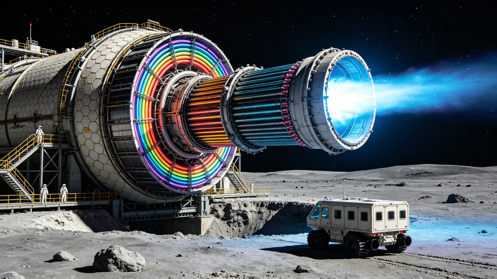

# 第四代聚变推进系统地面试车与深空适航鉴定公报

**发布机构**：跨恒星系航行管理总局 / 深空推进技术研究院 / 星际船舶适航认证中心
**发布日期**：2932年10月8日
**文件等级**：跨星系公开

## 一、项目背景

聚变推进系统是人类跨恒星系航行的核心技术。自23世纪第一代聚变推进系统（氘-氚反应，推力500千牛，比冲3,000秒）投入使用以来，聚变推进技术经历了三代发展：
- **第一代（2300-2450）**：氘-氚（D-T）聚变，托卡马克构型，推力500千牛，比冲3,000秒，系统质量比（推进系统质量/飞船总质量）0.35。
- **第二代（2450-2650）**：氘-氦3（D-He3）聚变，反场箍缩构型，推力2,000千牛，比冲8,000秒，系统质量比0.25。
- **第三代（2650-2900）**：质子-硼11（p-B11）聚变，场反位形构型，推力5,000千牛，比冲20,000秒，系统质量比0.18。

第三代聚变推进系统支撑了人类向比邻星b和鲸鱼座τ星的大规模移民，使跨恒星系航行时间从最初的200年（世代飞船）缩短至约40年（比邻星b航线）和80年（鲸鱼座τ星航线）。然而，随着跨恒星系贸易和人员往来的日益频繁，第三代推进系统的性能已不能满足需求：40-80年的航行时间仍然过长，限制了跨星系人员流动的频率；推进系统的可靠性和维护成本也有待改善。

为突破第三代聚变推进系统的性能瓶颈，深空推进技术研究院于2880年启动了第四代聚变推进系统的研发工作。经过52年的基础研究、技术攻关和工程验证，第四代聚变推进系统于2932年完成了地面试车和深空适航鉴定，即将投入批量生产和实际应用。

## 二、第四代聚变推进系统技术原理

第四代聚变推进系统采用了多项革命性技术，其核心是"氘-氦3/质子-硼11混合反应模式"和"直接能量转换推进"技术。

**混合反应模式**：第四代系统采用双反应室设计，可在两种聚变反应模式之间切换：
- **高推力模式（D-He3反应）**：使用氘和氦3作为燃料，反应温度约5亿度，反应产物为氦4和质子，能量以带电粒子动能的形式释放。高推力模式下，系统推力达到15,000千牛（15兆牛），比冲12,000秒，适用于飞船的加速和减速阶段。
- **高比冲模式（p-B11反应）**：使用质子和硼11作为燃料，反应温度约30亿度，反应产物为3个氦4原子核（α粒子），几乎不产生中子（中子产额<0.1%）。高比冲模式下，系统推力为3,000千牛，比冲达到50,000秒，适用于飞船的巡航阶段。

双模式设计使飞船可以在航行的不同阶段选择最优的推进模式：起飞和着陆时使用高推力模式快速加速/减速，巡航时使用高比冲模式以最高效率飞行。这种设计使飞船的整体航行效率比第三代系统提升了约60%。

**直接能量转换推进**：第四代系统的另一项核心技术是"直接能量转换推进"（Direct Energy Conversion Propulsion, DECP）。传统聚变推进系统需要将聚变产生的能量先转化为热能，再通过工质加热和喷管膨胀产生推力，能量转换效率约为40%。而DECP技术利用带电粒子在磁场中的偏转，直接将聚变反应产物的动能转化为定向喷射的推力，省去了热能转换环节，能量转换效率达到85%以上。

DECP技术的关键是"磁喷管"（Magnetic Nozzle）——一种由超导线圈产生的强磁场构型，可以将聚变反应产生的带电粒子（α粒子和质子）约束并加速，然后以接近光速的5%（约15,000公里/秒）的速度定向喷出，产生推力。磁喷管没有物理喷管的烧蚀问题，使用寿命比传统喷管提高了10倍以上。

**超导磁体系统**：第四代系统采用了室温超导材料（临界温度高于300K，即27°C）制作磁体线圈，无需液氦冷却系统，大幅减轻了系统质量。超导磁体的最高磁场强度达到80特斯拉（第三代系统为20特斯拉），为聚变反应的约束和磁喷管的工作提供了更强的磁场。

**燃料储存与供给**：第四代系统的燃料包括氘（从海水中提取）、氦3（从月球和气态巨行星大气中提取）、质子（从水中提取）和硼11（从硼矿中提取）。燃料以低温液态或固态形式储存，燃料质量比（燃料质量/飞船总质量）约为0.35。燃料供给系统采用磁流体动力泵，无运动部件，可靠性高。

## 三、系统性能参数

第四代聚变推进系统的主要性能参数如下：

| 参数 | 第四代系统 | 第三代系统 | 提升幅度 |
|---|---|---|---|
| 最大推力 | 15,000千牛（高推力模式） | 5,000千牛 | +200% |
| 最大比冲 | 50,000秒（高比冲模式） | 20,000秒 | +150% |
| 系统质量比 | 0.12 | 0.18 | -33% |
| 能量转换效率 | 85% | 40% | +112.5% |
| 连续工作时间 | 50,000小时 | 20,000小时 | +150% |
| 大修间隔 | 10,000小时 | 3,000小时 | +233% |
| 中子辐射水平 | <0.1%（p-B11模式） | 约5% | -98% |
| 推进剂消耗率（高推力模式） | 125公斤/秒 | 250公斤/秒 | -50% |
| 推进剂消耗率（高比冲模式） | 6公斤/秒 | 25公斤/秒 | -76% |

基于上述性能参数，装备第四代聚变推进系统的星际飞船（总质量约50万吨，有效载荷约15万吨）的航行性能如下：
- 地球-比邻星b航线（4.24光年）：航行时间约18年（第三代系统约40年），缩短55%。
- 地球-鲸鱼座τ星航线（11.9光年）：航行时间约35年（第三代系统约80年），缩短56%。
- 最大巡航速度：约0.23倍光速（第三代系统约0.12倍光速）。
- 加速阶段：以0.01g加速度持续加速约2年，达到巡航速度。
- 减速阶段：在到达目的地前约2年开始减速，以0.01g减速度持续减速。

## 四、地面试车过程与结果

第四代聚变推进系统的地面试车在"深空推进技术研究院地面试验中心"进行。该试验中心位于月球背面的"静海"地下，拥有3个大型聚变推进试验台，每个试验台配备推力测量系统、辐射监测系统、高速摄像系统和数据采集系统，可承受最大20,000千牛的推力和5亿度的等离子体温度。

地面试车分为三个阶段：

**第一阶段（2930年3月-2931年6月）：单体试验**
- 对聚变反应室、磁喷管、超导磁体、燃料供给系统等关键子系统进行单独测试。
- 聚变反应室成功实现了D-He3反应的持续运行（最长持续时间72小时，平均功率500兆瓦）和p-B11反应的持续运行（最长持续时间24小时，平均功率200兆瓦）。
- 磁喷管成功实现了带电粒子的定向加速和喷射，喷射速度达到14,200公里/秒（设计值15,000公里/秒，达到设计值的95%）。
- 超导磁体在80特斯拉磁场强度下稳定运行，未出现失超现象。

**第二阶段（2931年7月-2932年3月）：系统集成试验**
- 将所有子系统集成为完整的推进系统，进行联合调试。
- 高推力模式试车：成功实现15,000千牛推力的持续输出（最长持续时间4小时），比冲11,800秒（设计值12,000秒，达到98%）。
- 高比冲模式试车：成功实现3,000千牛推力的持续输出（最长持续时间12小时），比冲49,200秒（设计值50,000秒，达到98%）。
- 模式切换试验：成功实现高推力模式与高比冲模式之间的快速切换（切换时间<30秒），切换过程中推力平滑过渡，未出现推力中断或异常波动。
- 系统总效率测试：高推力模式下能量转换效率为83%，高比冲模式下为86%，均达到设计目标（85%±2%）。

**第三阶段（2932年4月-2932年9月）：耐久性与可靠性试验**
- 累计运行时间试验：推进系统累计运行时间达到1,200小时（其中高推力模式400小时，高比冲模式800小时），超过适航鉴定要求的1,000小时。
- 启动/停止循环试验：完成500次启动-运行-停止循环，每次循环包括冷启动（从完全停止状态启动，启动时间<10分钟）、稳定运行（至少1小时）和正常停止。500次循环中未出现一次启动失败或异常停止。
- 故障模拟试验：人为模拟了12种典型故障（如燃料供给中断、磁体局部失超、控制系统故障等），验证了系统的故障检测、隔离和恢复能力。所有故障均在30秒内被检测到，在5分钟内完成隔离和恢复，未导致系统严重损坏。
- 辐射安全测试：p-B11模式下的中子辐射水平为0.08%（设计要求<0.1%），D-He3模式下为1.2%，均在安全范围内。推进系统外部的辐射剂量率低于0.1毫西弗/小时，满足载人飞船的辐射安全要求。

地面试车的总体结论：第四代聚变推进系统的所有关键性能指标均达到或超过设计要求，系统可靠性和安全性满足载人星际航行的适航标准。

## 五、深空适航鉴定

地面试车完成后，星际船舶适航认证中心组织了由推进技术、船舶工程、辐射安全、可靠性工程等领域的24名专家组成的适航鉴定委员会，对第四代聚变推进系统进行了为期30天的深空适航鉴定。

鉴定内容包括：
- **设计文件审查**：审查了系统的设计图纸、计算报告、材料规格、制造工艺等全部设计文件，确认设计符合星际船舶适航标准的要求。
- **地面试车数据审核**：审核了全部地面试车数据（约12TB），确认试车过程规范、数据真实可靠、性能指标达标。
- **制造质量审查**：审查了首台工程样机的制造过程记录和质量检验报告，确认制造质量符合设计要求。
- **安全性评估**：对系统的辐射安全、结构安全、运行安全进行了全面评估，确认系统在正常和故障工况下均不会对船员和飞船构成不可接受的安全风险。
- **维护性评估**：评估了系统的可维护性，确认系统的模块化设计使关键部件的更换可在飞船上由船员完成，无需返回船坞。

2932年10月8日，适航鉴定委员会一致通过了第四代聚变推进系统的深空适航鉴定，颁发了"第四代聚变推进系统深空适航证书"（证书编号：DECP-4G-001）。证书有效期为10年，期间需每年进行一次适航持续检查。

深空推进技术研究院院长刘大伟在证书颁发仪式上表示："第四代聚变推进系统的适航鉴定通过，是人类推进技术史上的里程碑。52年的研发、1,200小时的地面试车、24位专家的严格审查，最终换来这一张证书。它意味着人类的星际航行将进入一个新时代——更快、更远、更安全。"

## 六、应用前景与后续计划

第四代聚变推进系统的批量生产将于2933年启动，首艘装备第四代推进系统的星际客运飞船"新远航者号"计划于2935年下水，2936年首航地球-比邻星b航线。

应用前景包括：
- **客运飞船**：装备第四代推进系统的客运飞船（载客量约2,000人）可将地球-比邻星b航行时间缩短至18年，使跨星系移民和旅行的频率大幅提升。预计到2950年，跨星系年客运量将从目前的约5万人增长至约20万人。
- **货运飞船**：装备第四代推进系统的货运飞船（载货量约30万吨）可将跨星系货运周期缩短约50%，大幅降低跨星系贸易的物流成本。预计到2950年，跨星系年货运量将从目前的约800万吨增长至约3,000万吨。
- **深空探测**：第四代推进系统使人类探测器的速度和航程大幅提升，可在20年内到达距离地球20光年以内的恒星系，为人类探索更多恒星系提供了技术基础。
- **军事应用**：第四代推进系统可装备跨星系联合防御舰队的新型战舰，提升舰队的机动能力和快速响应能力。

后续研发计划方面，深空推进技术研究院已启动第五代聚变推进系统的预研工作，目标是实现比冲100,000秒、推力30,000千牛、系统质量比0.08的性能指标，使地球-比邻星b航行时间进一步缩短至10年以内。第五代系统的关键技术包括"反物质催化聚变"和"光子推进"等前沿技术，预计需要40-50年的研发周期。

公报最后写道："从化学推进到核裂变推进，从核裂变到核聚变，从第一代聚变到第四代聚变，人类的推进技术在过去900年里实现了一次又一次的飞跃。每一次推进技术的进步，都拓展了人类文明的活动边界。第四代聚变推进系统的诞生，将使人类的星际航行从'数十年的漫长旅程'变为'十数年的可达航程'。星辰大海，不再遥远。"
