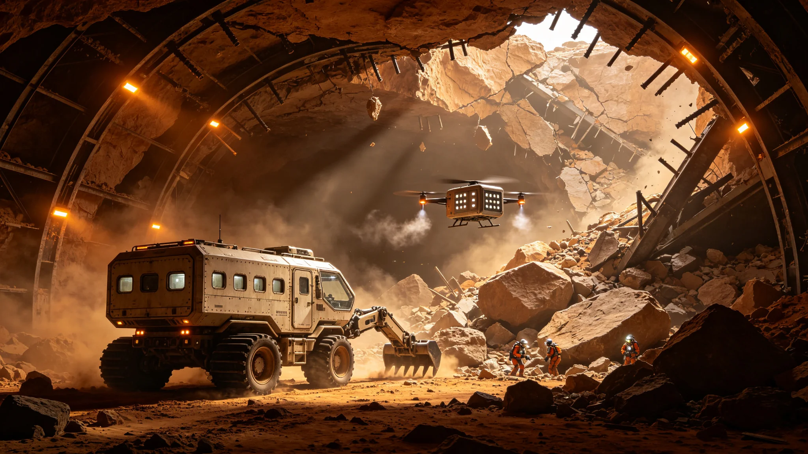

# 火星地下城市顶板坍塌事故调查与结构加固工程公报

**发布机构**：火星殖民地管理委员会应急管理总局 / 地下城市工程安全监察局
**发布日期**：2933年4月12日
**文件等级**：内太阳系公开

## 一、事故概况

2933年1月17日凌晨3时42分（火星标准时），火星"水手谷"地下城市C区第17号生活舱发生顶板坍塌事故。坍塌区域面积约2,400平方米，顶板岩石厚度约35米，坍塌岩石总体积约8.4万立方米，重量约21万吨。

事故发生时，该生活舱内共有居民1,247人（该舱设计居住人数为1,500人）。由于事故发生在凌晨，大部分居民正在睡眠中。坍塌区域直接覆盖了生活舱的中央走廊和周边12个居住单元，造成：
- 死亡：47人（其中32人在坍塌瞬间被埋压致死，15人在救援过程中因伤势过重死亡）
- 重伤：89人（骨折、挤压伤、颅脑损伤等）
- 轻伤：234人（擦伤、扭伤、轻微砸伤等）
- 直接经济损失：约32亿信用点（包括建筑损毁、设备损坏、居民财产损失、应急救援费用等）
- 间接经济损失：约15亿信用点（包括C区部分区域封闭期间的居民安置、商业中断、交通改道等）

这是火星地下城市建设史上最严重的一次结构安全事故，也是火星殖民地历史上死亡人数最多的一次非自然灾害事故。事故发生后，火星殖民地管理委员会立即启动了一级应急响应，成立了由应急管理总局局长亲自担任组长的事故调查委员会，对事故原因进行全面调查，并启动了全球地下城市结构安全大检查和加固工程。

## 二、事故经过与应急救援

**事故发生（1月17日3:42）**：C区第17号生活舱的结构健康监测系统（SHM）首先发出顶板位移异常警报——顶板中央区域的位移速率从正常的0.01毫米/天突然飙升至12毫米/小时。值班工程师在收到警报后90秒内启动了该舱的紧急疏散程序，通过广播系统通知居民撤离。然而，由于位移速率极快，顶板在警报发出后仅4分30秒就发生了坍塌，大部分居民未能及时撤离。

**应急响应（1月17日3:47-8:00）**：坍塌发生后，C区的自动消防系统立即启动，喷洒阻燃剂防止火灾（坍塌可能导致电线短路引发火灾）。同时，C区的气密隔离门自动关闭，将坍塌区域与其他区域隔离，防止气压泄漏（火星地下城市维持约0.8个大气压的内部气压，外部火星大气压力仅为0.006个大气压，一旦气压泄漏将导致严重后果）。

应急救援队伍在坍塌发生后15分钟内抵达现场。首批救援力量包括C区本地的应急救援队（120人）和邻近区域的增援队伍（300人）。救援工作面临的主要困难包括：
- 坍塌区域的结构不稳定，存在二次坍塌的风险，救援人员需要在支护结构的保护下作业。
- 坍塌区域的照明、通风和通信系统受损，救援人员需要携带便携式照明、通风和通信设备。
- 被埋压人员的位置难以确定，需要使用生命探测雷达和声学探测仪进行搜索。
- 坍塌岩石体积巨大，需要使用大型切割和破碎设备进行清理。

**救援过程（1月17日-1月25日）**：救援工作持续了8天。救援人员采用"由外向内、由上向下、分层推进"的策略，先清理坍塌区域外围的岩石，建立安全通道，然后逐步向内部推进。在救援过程中，共使用了12台大型岩石切割机、8台液压破碎锤、24台小型掘进机器人和48套生命探测设备。

1月19日（救援第3天），救援人员在坍塌区域边缘发现了首批幸存者——一个3口之家躲在一个坚固的储物间内，依靠储存的食物和水存活了48小时。1月21日（救援第5天），救援人员在中央走廊的一个支撑三角区内发现了12名幸存者，他们利用坍塌形成的空隙存活了约90小时。1月25日（救援第8天），最后一名幸存者被救出——一名62岁的女性，她在一个卫生间的浴缸下方存活了192小时（8天），依靠滴漏的水管水和卫生间内的清洁用品维持生命。

救援结束后，应急管理总局对救援工作进行了评估：在坍塌区域内的1,247人中，成功救出1,200人（其中死亡47人，存活1,153人），生存率为92.5%。应急管理总局局长在新闻发布会上表示："这是一次惨烈的事故，但救援人员的英勇努力挽救了尽可能多的生命。92.5%的生存率，在如此大规模的坍塌事故中是一个了不起的成绩。"

## 三、事故原因调查

事故调查委员会由15名专家组成，包括结构工程师5人、地质工程师3人、材料工程师2人、安全工程师2人、法律专家1人和公众代表2人。调查工作历时68天，查阅了超过50万份技术文档，对坍塌区域的岩石样本进行了1,200余项实验室测试，对相关人员进行了87次问询。2933年3月25日，调查委员会发布了最终调查报告。

**直接原因**：顶板岩层中的一条隐伏断层（地质勘察时未发现）在长期地应力作用下发生错动，导致顶板岩石的整体性被破坏，承载能力急剧下降，最终在重力作用下发生坍塌。

调查报告指出，这条隐伏断层位于顶板上方约15米处，长度约80米，断层面倾角约60度。在地下城市建设时的地质勘察中，由于断层的断距较小（约0.5米）且被风化产物充填，常规的地质钻探和物探方法未能发现。在地下城市投入使用后的187年间（该舱建于2746年），断层在火星地应力（约为地球的0.38倍，但由于地下城市的开挖改变了原有的应力场，实际应力集中系数达到2.5）的持续作用下逐渐错动，断层面的摩擦阻力逐渐降低，最终在2933年1月发生突然错动，触发了顶板坍塌。

**间接原因**：
1. **地质勘察不足**：建设时的地质勘察精度不够，未能发现隐伏断层。当时的勘察标准要求钻孔间距为50米，而断层的宽度仅约0.5米，正好位于两个钻孔之间，成为"漏网之鱼"。
2. **结构健康监测系统的预警阈值设置不合理**：SHM系统的顶板位移报警阈值设置为1毫米/天，而正常的顶板位移速率约为0.01毫米/天。事故发生前30天，顶板位移速率已经从0.01毫米/天逐渐上升至0.08毫米/天（仍低于报警阈值），但这一异常趋势未引起监测人员的足够重视。如果设置更灵敏的"趋势预警"（位移速率变化率超过正常值的200%即报警），可以提前约20天发现异常，有充足的时间进行人员疏散和结构加固。
3. **定期结构检查执行不到位**：按照规定，地下城市的顶板结构每10年应进行一次详细检查（包括钻孔检测、地质雷达扫描和应力测量）。该舱的上一次详细检查是在2918年（15年前），由于经费不足和检查人员短缺，2928年的例行检查被推迟至2934年。如果2928年的检查按时进行，很可能会发现顶板的异常位移和断层活动迹象。
4. **建筑设计的安全裕度不足**：该舱建于2746年，当时的设计标准要求顶板的安全系数为2.0（即承载能力为实际荷载的2倍）。而现行的设计标准（2850年修订）要求安全系数为3.0。该舱的顶板安全系数在建设时约为2.1，经过187年的岩石蠕变和应力重分布，实际安全系数已降至约1.3，远低于现行标准。

**责任认定**：调查报告认定，事故的主要责任在于：
- 水手谷地下城市管理局：未按规定执行2928年的结构检查，对SHM系统的异常数据未及时响应，对事故负有主要管理责任。
- 火星地下城市工程安全监察局：对地下城市的结构安全监管不力，未及时督促管理局进行结构检查和加固，对事故负有监管责任。
- 原建设单位（已解散）：建设时的地质勘察精度不足，设计安全裕度偏低，对事故负有历史责任（但由于单位已解散，无法追究具体责任）。

调查报告建议对水手谷地下城市管理局局长和工程安全监察局局长给予撤职处分，对相关责任人员给予党纪政纪处分，涉嫌犯罪的移送司法机关处理。

## 四、全球地下城市结构安全大检查

事故发生后，火星殖民地管理委员会立即启动了全球地下城市结构安全大检查，对火星所有地下城市（共3座大型地下城市、12个中型地下定居点、47个小型地下工作站）的顶板结构进行全面检查。

大检查工作由应急管理总局统一组织，从地球和比邻星b调派了120名结构工程和地质工程专家，与火星本地的280名工程师组成了联合检查团队。检查内容包括：
- 地质雷达扫描：对所有地下城市的顶板进行高密度地质雷达扫描（扫描线间距1米），探测隐伏断层、溶洞和软弱夹层。
- 钻孔检测：对疑似异常区域进行钻孔取芯，检测岩石的完整性和强度。
- 应力测量：在关键部位安装应力计，测量地应力的大小和方向。
- SHM系统升级：对所有地下城市的结构健康监测系统进行升级，增加"趋势预警"功能，提高监测灵敏度。
- 安全系数评估：对所有地下城市的顶板结构进行重新计算，评估实际安全系数。

大检查历时68天（2933年1月25日-3月31日），共检查了地下城市总长度约1,200公里的巷道和2,400个舱室。检查结果显示：
- 结构安全（安全系数≥2.5）：约占总长度的72%
- 结构基本安全（安全系数1.5-2.5，需要加强监测）：约占21%
- 结构不安全（安全系数<1.5，需要立即加固）：约占7%（总长度约84公里，涉及3个城市的12个区域）

对于结构不安全的7%区域，管理委员会立即采取了封闭措施，将相关区域的居民和设施迁移至安全区域，并启动了紧急加固工程。

## 五、结构加固工程

基于大检查结果，火星殖民地管理委员会批准了为期5年的"全球地下城市结构加固工程"（2933-2938），总投资约2,800亿信用点。加固工程的主要技术手段包括：

**顶板锚索加固**：对安全系数在1.5-2.5之间的区域，采用预应力锚索加固。锚索直径32毫米，长度15-25米，穿透顶板岩层锚固在上方的稳定岩层中，每根锚索的预应力为500千牛。锚索间距为3米×3米，每平方米顶板约0.11根锚索。加固后，顶板的安全系数可提升至3.0以上。

**钢拱架支护**：对安全系数低于1.5的区域，采用钢拱架+喷射混凝土的联合支护。钢拱架采用H型钢（高度200毫米），间距0.5米，拱架之间用钢筋连接。拱架安装后，在顶板表面喷射200毫米厚的钢纤维混凝土（钢纤维掺量40公斤/立方米），形成整体承载结构。加固后，顶板的安全系数可提升至4.0以上。

**断层注浆加固**：对发现隐伏断层的区域，采用化学注浆加固。通过钻孔向断层带注入高强度环氧树脂（抗压强度80兆帕），填充断层空隙，胶结断层两侧的岩石，恢复岩层的整体性。注浆孔间距2米，深度10-15米，注浆压力5-10兆帕。

**顶板削载**：对顶板上方岩石厚度过大（>50米）且存在软弱夹层的区域，采用顶板削载技术——从地表向下钻孔，用爆破或机械方法移除顶板上方的部分岩石，减轻顶板的荷载。削载后，顶板的荷载可降低30-50%。

**SHM系统全面升级**：对所有地下城市的结构健康监测系统进行全面升级，新增以下功能：
- 位移速率趋势预警：当位移速率的7天移动平均值超过正常值的200%时，自动发出黄色预警；超过500%时，发出红色预警并自动启动疏散程序。
- 声发射监测：在顶板中安装声发射传感器，监测岩石内部的微破裂活动。微破裂事件的频率和能量是岩石失稳的重要前兆。
- 光纤应变监测：在顶板表面铺设分布式光纤应变传感器，实现每米一个测点的连续应变监测，监测精度达到1微应变。
- AI预测系统：利用机器学习算法，综合分析位移、应力、声发射、应变等多源监测数据，预测顶板失稳的概率和时间，提前发出预警。

加固工程的实施计划：
- 2933年：完成7%结构不安全区域的紧急加固（钢拱架支护+断层注浆）
- 2934年：完成21%结构基本安全区域的锚索加固
- 2935年：完成SHM系统全面升级
- 2936-2937年：对所有区域进行加固效果复检和补强
- 2938年：工程竣工验收，建立地下城市结构安全长效管理机制

## 六、制度改进与长效机制

事故调查委员会在报告的最后提出了12项制度改进建议，管理委员会全部采纳并开始实施：
1. 修订《火星地下城市建设安全标准》，将顶板安全系数从2.0提升至3.5，地质勘察钻孔间距从50米缩小至20米。
2. 建立地下城市结构安全"终身负责制"，设计、施工、监理单位对地下城市的结构安全终身负责。
3. 将地下城市结构详细检查的周期从10年缩短至5年，检查结果向社会公开。
4. 设立"地下城市结构安全专项基金"，每年投入约200亿信用点，用于结构检查、加固和技术研发。
5. 建立地下城市结构安全"黑名单"制度，对结构安全管理不力的单位和个人进行公示和处罚。
6. 加强地下城市居民的应急疏散演练，每季度进行一次局部疏散演练，每年进行一次全面疏散演练。
7. 在所有地下城市的居住舱内设置"安全屋"——采用高强度钢结构和独立生命保障系统的避难空间，可在坍塌等极端情况下为居民提供至少72小时的生存保障。
8. 建立火星地下城市结构安全数据库，汇集所有地下城市的地质勘察、设计、施工、监测、检查和加固数据，实现数据共享和智能分析。
9. 加强与地球和比邻星b的技术合作，引进先进的地下工程安全技术和管理经验。
10. 设立"火星地下工程安全研究院"，专门从事地下城市结构安全的基础研究和技术开发。
11. 建立地下城市结构安全"吹哨人"制度，鼓励工程师和居民举报结构安全隐患，对有效举报给予奖励。
12. 每年4月12日（事故调查报告发布日）定为"火星地下城市安全日"，举行纪念活动和安全宣传，提醒全社会重视地下城市结构安全。

应急管理总局局长在公报发布会上表示："47条生命的代价是沉重的。我们必须从这次事故中吸取最深刻的教训，绝不能让类似的悲剧再次发生。结构安全是地下城市的生命线，任何时候都不能有丝毫松懈。我们将用5年时间、2,800亿信用点，为火星所有地下城市打造坚不可摧的安全屏障。"

公报最后写道："在火星的地下深处，人类建造了宏伟的城市，创造了繁荣的文明。但我们必须永远记住，我们生活在岩石之下，头顶是数十米厚的岩层。结构安全不是一次性的工程，而是需要代代相传的责任。愿47位遇难者的安息，换来所有火星居民的安全。"
