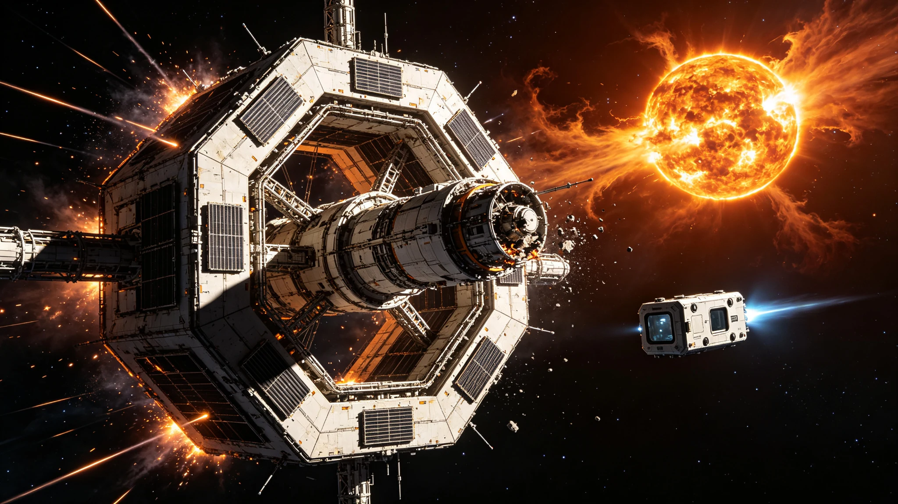

# 星际航行中太阳风暴导致通信中断72小时事件复盘公报

**发布机构**：跨恒星系航行安全管理局 / 空间天气监测预警中心
**发布日期**：2948年5月18日
**文件等级**：全球公开

## 一、事件概述

2948年3月12日04时17分（地球协调时），太阳爆发了一次X9.2级超级耀斑，伴随日冕物质抛射（CME），产生的高能粒子云和强烈电磁辐射于3月14日16时32分抵达地球附近，并在随后的72小时内对星际航行通信系统造成了严重干扰。

受影响的航行通信链路包括：
- 地球-比邻星b量子纠缠通信中继链路：完全中断48小时，部分恢复后信号质量下降72小时。
- 地球-鲸鱼座τ星激光通信链路：完全中断72小时。
- 内太阳系深空通信网络：37%的通信节点出现信号中断或严重降质。
- 正在星际航道上航行的12艘飞船（包括3艘客运飞船和9艘货运飞船）：全部出现与地球的通信中断，其中2艘飞船的内部通信系统也受到电磁干扰影响。

这是自2877年太阳超级风暴以来，对星际航行通信系统影响最严重的一次太阳风暴事件。

## 二、事件时间线

**3月12日04时17分**：太阳活动区AR-12947爆发X9.2级超级耀斑，空间天气监测预警中心在耀斑发生后3分钟内发布最高级别红色预警。

**3月12日05时00分**：跨恒星系航行安全管理局启动一级应急响应，通知所有在航飞船采取防护措施。

**3月12日08时30分**：首批高能光子（X射线和紫外线）抵达地球，地球向阳面的短波通信全部中断。

**3月14日16时32分**：日冕物质抛射产生的高能粒子云抵达地球轨道，地球磁层被强烈压缩，磁层顶从正常的10个地球半径被压缩至6.2个地球半径。

**3月14日18时00分**：地球-比邻星b量子通信中继链路完全中断。中继站的量子纠缠光子探测器受到高能粒子轰击，产生大量误码，纠错机制无法维持有效通信。

**3月14日21时15分**：地球-鲸鱼座τ星激光通信链路完全中断。激光通信终端的精密光学跟踪系统受到电磁干扰，无法维持对远端接收站的精确瞄准。

**3月15日02时40分**：在航客运飞船"远航者-7号"报告内部通信系统出现故障，飞船与地球的通信完全中断。飞船启动了自主航行模式。

**3月16日10时00分**：太阳风暴强度开始减弱，地球磁层逐渐恢复。

**3月16日18时32分**：地球-比邻星b量子通信链路部分恢复，但信号质量仅为正常水平的28%。

**3月17日16时32分**：所有受影响的通信链路基本恢复正常。通信中断总时长为72小时（从3月14日16时32分至3月17日16时32分）。

## 三、影响评估

**对在航飞船的影响：**
- 12艘在航飞船全部经历了与地球的通信中断，其中3艘客运飞船载有乘客2,847人（含船生代乘员2,103人）。
- 2艘飞船的内部通信系统受到电磁干扰，导致飞船内部各舱段之间的通信暂时中断，船员通过备用有线通信系统维持联络。
- 1艘货运飞船的导航系统受到干扰，飞船偏离预定航线0.003度，在通信恢复后已修正。
- 所有飞船均未发生人员伤亡或设备严重损坏。飞船的辐射防护系统有效保护了船员和乘客，舱内辐射剂量虽有上升但仍在安全限值以内。

**对通信基础设施的影响：**
- 3颗地球同步轨道通信卫星因高能粒子轰击出现临时故障，其中1颗卫星的主计算机需要重启，2颗卫星的太阳能电池板输出功率永久性下降了3%-5%。
- 地球-比邻星b量子通信中继站的2个光子探测器模块受损，需要更换，维修费用约1,200万星元。
- 地球-鲸鱼座τ星激光通信终端的1个精密转向镜出现微小位移，需要重新校准。

**对经济和社会的影响：**
- 跨恒星系金融交易中断72小时，据估算造成的直接经济损失约87亿星元，间接损失难以估量。
- 大量跨星系商业合同的执行受到影响，特别是依赖实时通信的服务贸易。
- 在航乘客的家属经历了72小时的信息真空，引发了一定程度的社会恐慌。航行安全管理局在通信中断期间通过内太阳系通信网络发布了定期公告，缓解了公众焦虑。

## 四、应急响应复盘

本次事件的应急响应工作总体有效，但也暴露出一些问题：

**做得好的方面：**
1. 预警及时：空间天气监测预警中心在耀斑发生后3分钟内即发布了红色预警，比2877年事件的预警时间（12分钟）大幅缩短。
2. 飞船防护到位：所有在航飞船在收到预警后及时采取了防护措施（包括关闭非必要电子设备、增加辐射屏蔽、船员进入强化屏蔽舱等），有效减少了损失。
3. 公众沟通有效：航行安全管理局在通信中断期间通过各种渠道发布了12次公告，及时向公众通报情况，避免了大规模恐慌。

**存在的问题：**
1. 中继站防护不足：量子通信中继站的光子探测器缺乏足够的辐射屏蔽，在高能粒子轰击下直接受损。设计时对极端太阳风暴的辐射强度估计不足。
2. 备用通信手段缺失：在主通信链路中断后，缺乏有效的备用通信手段。虽然所有飞船都配备了无线电通信备用系统，但在星际距离上无线电通信的带宽极低（仅数比特/秒），无法满足基本通信需求。
3. 跨星系协调机制不完善：在通信中断期间，地球、比邻星b和鲸鱼座τ星三个定居点之间无法协调应急响应，各自为战，影响了整体响应效率。
4. 部分飞船船员的应急训练不足：调查发现，2艘内部通信受影响的飞船中，有1艘的船员对备用有线通信系统的操作不够熟练，花费了45分钟才恢复内部通信，而标准操作时间应为10分钟。

## 五、改进措施

基于本次事件的复盘，跨恒星系航行安全管理局制定了以下改进措施：

1. **通信基础设施加固**：对所有量子通信中继站和激光通信终端进行辐射屏蔽升级，确保在X10级以上超级耀斑的辐射环境下仍能维持基本通信功能。预计投入28亿星元，2950年前完成。
2. **备用通信系统建设**：开发中微子通信备用链路（参见GS-2997-01规划），作为极端空间天气事件下的保底通信手段。中微子通信不受太阳风暴影响，但带宽较低，可用于传输关键指令和安全状态信息。
3. **跨星系应急协调机制**：建立"通信中断应急预案"，在跨星系通信完全中断的情况下，各定居点按照预设的程序自主开展应急响应，并在通信恢复后进行信息同步和协调。
4. **船员应急训练强化**：将太阳风暴应急响应纳入所有星际航行船员的 mandatory 训练科目，每6个月进行一次模拟演练。重点加强备用通信系统操作、自主航行决策和乘客心理安抚等方面的训练。
5. **空间天气预警能力提升**：在太阳-地球L1拉格朗日点部署新一代空间天气监测卫星，将太阳风暴的预警时间从目前的3天提前至5-7天。同时建立AI驱动的太阳风暴预测模型，提高预测准确率。

航行安全管理局局长孙志刚在公报结语中写道："太阳是我们文明的母亲，但她也有发怒的时候。72小时的通信中断提醒我们，在跨越恒星的航行中，我们必须对宇宙的力量保持敬畏，并做好最充分的准备。"
